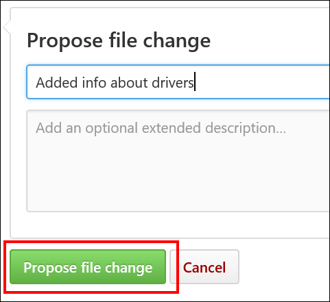

# Editing Windows IT professional documentation

Thank you for your interest in the Windows IT professional documentation! We appreciate your feedback, edits, and additions to our docs.
This page covers the basic steps for editing our technical documentation.
For a more up-to-date and general contribution guide, see the main [Microsoft Docs contributor guide overview](https://docs.microsoft.com/contribute/).

## Sign a CLA

All contributors who are ***not*** a Microsoft employee must [sign a Microsoft Contribution Licensing Agreement (CLA)](https://cla.microsoft.com/) before editing any Microsoft repositories.
If you've already edited within Microsoft repositories in the past, congratulations!
You've already completed this step.

## Editing topics

We've tried to make editing an existing, public file as simple as possible.

>**Note** 
>At this time, only the English (en-us) content is available for editing.

### To edit a topic

1. Go to the page on [docs.microsoft.com](https://docs.microsoft.com/) that you want to update, and then select **Edit** (pencil icon).

    

    If the Edit button isn't present, it may mean the content isn't open to public contributions. Some pages are generated (for example, from inline documentation in code) and must be edited in the project they belong to.

2. On GitHub, Select the **Pencil** icon to edit the article. If the pencil icon is grayed out, you need to either log in to your GitHub account or create a new account.

    

3. Using Markdown language, make your changes to the topic. For info about how to edit content using Markdown, see:
    - **If you're linked to the Microsoft organization in GitHub:** [Windows authoring guide](https://aka.ms/WindowsAuthoring)

    - **If you're external to Microsoft:** [Microsoft Docs Markdown reference](https://docs.microsoft.com/contribute/markdown-reference), [Mastering Markdown](https://guides.github.com/features/mastering-markdown/)

4. Make your suggested change, and then select **Preview changes** to make sure it looks correct.

    

5. When you’re done editing, scroll to the bottom of the page, and then select **Propose changes** to create a fork in your personal GitHub account.

    

    The **Comparing changes** screen appears to see what the changes are between your fork and the original content.

6. On the **Comparing changes** screen, you’ll see if there are any problems with the file you’re checking.

    If there are no problems, you’ll see the message, **Able to merge**.

    

7. Select **Create pull request**.

8. Enter a title and description to give the approver the appropriate context about what’s in the request.

9. Scroll to the bottom of the page, making sure that only your changed files are in this pull request. Otherwise, you could overwrite changes from other people.

10. Click **Create pull request** again to actually submit the pull request.

    The pull request is sent to the writer of the topic and your edits are reviewed. If your request is accepted, updates are published to one of the following places:

    - [Windows 10](https://docs.microsoft.com/windows/windows-10)

    - [Microsoft Edge](https://docs.microsoft.com/microsoft-edge/deploy)

    - [Surface](https://docs.microsoft.com/surface)

    - [Surface Hub](https://docs.microsoft.com/surface-hub)

    - [HoloLens](https://docs.microsoft.com/hololens)

    - [Microsoft Store](https://docs.microsoft.com/microsoft-store)

    - [Windows 10 for Education](https://docs.microsoft.com/education/windows)

    - [Windows 10 for SMB](https://docs.microsoft.com/windows/smb)

    - [Internet Explorer 11](https://docs.microsoft.com/internet-explorer)

    - [Microsoft Desktop Optimization Pack](https://docs.microsoft.com/microsoft-desktop-optimization-pack)

## Making more substantial changes

To make substantial changes to an existing article, add or change images, or contribute a new article, you will need to create a local clone of the content.
For info about creating a fork or clone, see the GitHub help topic, [Fork a Repo](https://help.github.com/articles/fork-a-repo/).

Fork the official repo into your personal GitHub account, and then clone the fork down to your local device.  Work locally, then push your changes back into your fork.  Then open a pull request back to the master branch of the official repo.

## Using issues to provide feedback on documentation

If you just want to provide feedback rather than directly modifying actual documentation pages, you can create an issue in the repository.

At the top of a topic page you'll see an **Issues** tab. Click the tab and then click the **New issue** button.

Be sure to include the topic title and the URL for the page you're submitting the issue for, if that page is different from the page you launched the **New issue** dialog from.  

## Resources

You can use your favorite text editor to edit Markdown.  We recommend [Visual Studio Code](https://code.visualstudio.com/), a free lightweight open source editor from Microsoft.

You can learn the basics of Markdown in just a few minutes.  To get started, check out [Mastering Markdown](https://guides.github.com/features/mastering-markdown/).

Microsoft Docs uses several custom Markdown extensions. To learn more, see the [Microsoft Docs Markdown reference](https://docs.microsoft.com/contribute/markdown-reference).
