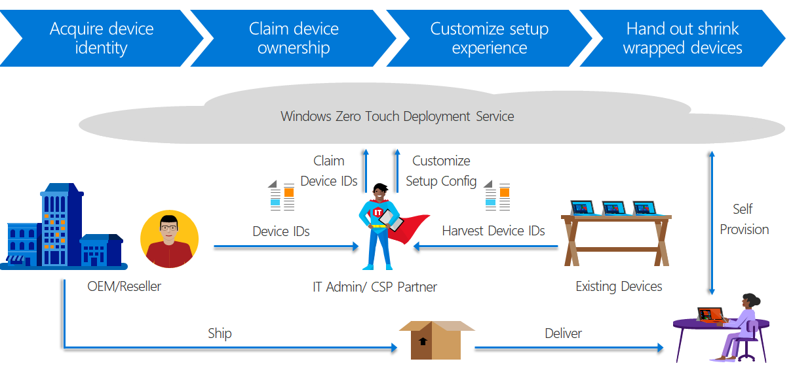

--- 
title: Set up Windows 10 devices with Windows AutoPilot 
description: Learn how to use Windows AutoPilot from the Partner Center to create and automatically assign devices to configuration groups based on the device's profile, automatically join devices to Azure AD, auto-enroll devices into Microsoft Intune, and customize Windows OOBE. 
author: CelesteDG 
ms.author: celested 
ms.topic: get-started article 
ms.prod: microsoft-365-business
Audience: microsoft-business 
keywords: Microsoft 365 Business, SMB, setup and configuration, deployment, Windows 10, Windows AutoPilot
---

# Set up Windows 10 devices with Windows AutoPilot

Windows AutoPilot is the new, modern way of deploying Windows 10 across organizations of all types and sizes. Windows AutoPilot enables IT to deploy Windows 10 devices without having to “touch” the device before handing it out to employees. IT can set the profile, hand out shrink-wrapped brand new devices to employees, who then go through a customized Windows 10 setup experience (also known as OOBE).

You can use Windows AutoPilot to:
- **Disable local administrator permissions** for the end users setting up devices
- **Show an organization's login page**. The organization can predefine a logon page that adds the device as a work device, and joins the device with Azure Active Directory.
- **Streamline the out-of-box experience (OOBE)** to use just the steps and decisions required, using a zero-touch deployment (ZTD) profile.
- **Enroll the device into MDM with Microsoft Intune** after OOBE is complete.

For more information, see [Overview of Windows AutoPilot](https://docs.microsoft.com/en-us/windows/deployment/windows-10-auto-pilot).

## Requirements

- Devices must be pre-installed with Windows 10 Pro Creators Update (version 1703 or later).
- Device identifier known as a hardware hash (128 HWH or 4k HWH), which is typically provided by an OEM. You'll use identifiers to assign organization profiles in Partner Center.
- Devices must have access to the internet. When the device can’t connect, it shows the default Windows OOBE screens.
- Enrolling the device into an MDM, such as Microsoft Intune, requires Azure Active Directory Premium.

## Windows AutoPilot deployment process

## Add devices and apply a profile

In Partner Center, you can create a ZTD profile and apply it to a list of the devices. Examples of settings in a ZTD profile include:
- Skip Privacy Settings in setup
- Disable local admin account in setup
- Automatically skip pages in setup
    - Automatically select setup for work or school
    - Skip Cortana, OneDrive, and OEM registration setup pages

To configure devices, upload a list of the devices into Partner Center, create a profile that applies to the devices, and apply it.

**To add devices and apply a profile**

1.  Add the list of devices into Partner Center.

    > [!NOTE]
    > Sales agents and admin agents have access to add the list of devices into Partner Center.

    1. Ask your OEM for a .csv file that lists the new devices.

        This file contains the serial number, product ID, and the device identifier generated from the OEM Activation 3.0 tool.

    2. From the Partner Center dashboard, select **Customers** > search for or select the customer who’s receiving the devices > select **Devices** > **Add devices**.
    3. In the **Add new devices** page, name the batch of devices.
        1.  In the **Select or enter a name for this batch of devices**, select **Add a new batch name**.
        2.  In the **New batch name** field, add a new batch name, for example, “Contoso Sales Department PCs – June 2017 order.”

    4. Click **Browse** > select the device info file (.csv file) >  **Validate** > **Save**.

        > [!NOTE]
        > If the .csv file is not in the correct format, or there is an upload error to to an incorrect hardware hash, you will get an error message. You must   fix the errors and then re-upload the entire file. Only then will Continue become enabled.

2. Create a profile that you can apply to the devices.

    > [!NOTE]
    > Only admin agents have access to create and apply profiles in Partner Center.

    1. From **Devices**, click **Add new profile**.
    2. Name the profile, for example, “Contoso Desktop Profile – Skip All OOBE”.
    3. Optionally add a description.
    4. Configure the OOBE settings. For example, check **Skip Express Settings in setup**.
    5. Click **Submit**.

3. Apply the profile.
    1. From the **Devices** page, in the **Assign and delete devices** pane, select the devices that you want to configure.

        To select an entire batch, click the checkbox next to the batch name (for example, “Contoso Sales Department PCs – June 2017 order”).

    2. Click **Apply profile** and select the profile from the list of profiles you’ve created. For example, “Contoso Desktop Profile – Skip All OOBE”). The   devices will show the profile in the Profile column.
    3. Confirm your assignment. The devices will now have the selected profile assigned.

4. Optional: Verify that your profile works.
    1. Connect a device to the network, and turn it on.
    2. Verify that the appropriate OOBE screens, if any, appear.
    3. To prepare the device for a new user, complete the OOBE experience, then reset the device to its factory default settings.

## Self-provision devices

Once the new device is distributed to the user, the user can set up the device
with a simplified experienced customized by the partner or IT admin.

**To self-provision a device**

1. Turn on the device and complete the OOBE experience. Make sure the device is connected to the internet so Windows can check for updates.
2. In your organization’s sign-in page, enter your work account details. Type your Azure Active Directory account name and password.
3. Finish device setup. Depending on your organization’s policies, you may be asked to set up a PIN for Windows Hello.
4. Confirm that your device is Azure AD joined by going to **Settings > Accounts > Access work or school >** confirm that it says **Connected to <organization>’s Azure AD**.

The Windows device 10 is ready for use with the organization’s configuration, settings, and apps.

## Add organization login pages to OOBE

You can add organization-specific pages during OOBE by adding your custom pages to your organization’s Azure Active Directory. For more info on how to do this, see [Add company branding to your sign-in page in the Azure Active Directory](https://docs.microsoft.com/azure/active-directory/active-directory-branding-custom-signon-azure-portal).

## Update or delete a profile

Once you’ve assigned a profile to a device, you can update it, even if you’ve already given the device to your customer. When the device connects to the internet, it downloads the latest version of your profile during the OOBE process. If your customer restores their device to its factory default settings, the device will again download the latest updates to your profile.

**To remove a profile from a device**

1. Select the device (or batch of devices) you want to remove the profile from.
2. In **Assign and delete devices** pane, select **Remove profile**.
3. Go to the profile you want to remove and delete it. The profile will be deleted from all devices.
4. From **Devices**, select the profile. From here, you can modify the existing settings.
