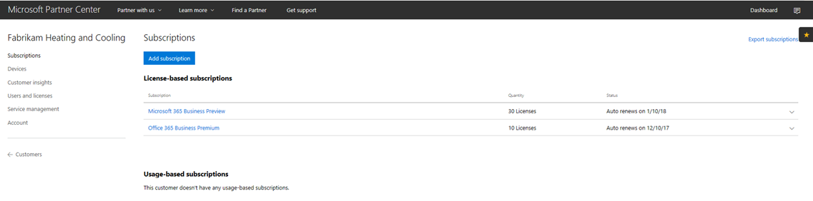
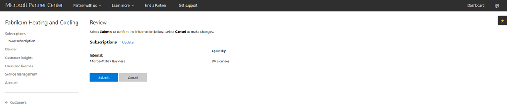
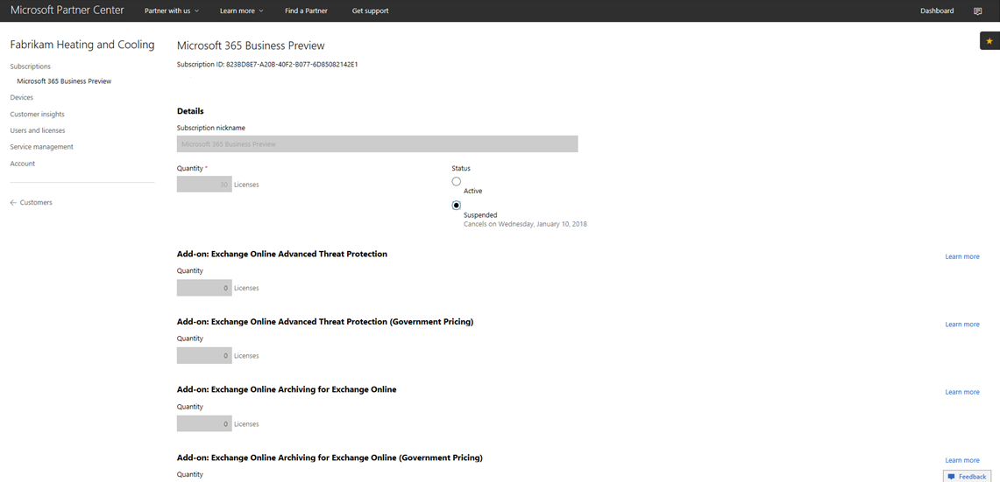
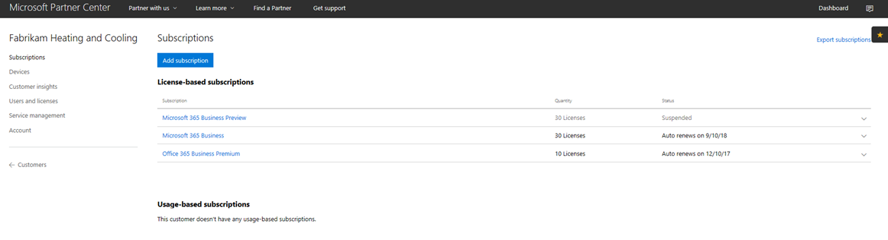

# Transition a Microsoft 365 Business CSP subscription

If you have a Microsoft 365 Business Preview CSP subscription, follow this guide to find out how you can transition your existing preview subscription to Microsoft 365 Business GA (general availability).

**How to transition a preview subscription to GA**

1. Log in to <a href="https://partnercenter.microsoft.com" target="_blank">Partner Center</a>.
2. From the dashboard, select **Customers**, and then find and select the company name.

    The subscriptions for the company will be listed.

    
    
3. In the company's **Subscriptions** page, select **Add subscription**.
4. In the **New subscription** page, select **Small business** and then select **Microsoft 365 Business** from the list.
5. Add the number of licenses and then select **Next: Review** to review the subscription and then select **Submit**.

    

    The **License-based subscriptions** will show **Microsoft 365 Business Preview** and **Microsoft 365 Business**. You'll need to suspend the Preview subscription next.

6. Select **Microsoft 365 Business Preview**.
7. In the **Microsoft 365 Business Preview** page, select **Suspended** to suspend the Preview subscription.

    

8. Select **Submit** to confirm.

    In the **Subscriptions** page, confirm that the **Microsoft 365 Business Preview** status shows **Suspended**.

    

9. Optionally, you can also validate the license agreement. To do this, follow these steps:
    1. Select **Users and licenses** from the company's **Subscriptions** page.
    2. From the **Users and licenses** page, select a user.
    3. In the user's page, check the **Assign licenses** section and confirm that it shows **Microsoft 365 Business**.

        

## Impact to customers and users during and after transition

There is no impact to customers and users during transition and post transition.

## Impact to customers who don't transition

The following table summarizes the impact to customers who don't transition from a Microsoft 365 Business Preview subscription to a Microsoft 365 Business subscription.

|       | T-0 to T+30     | T+30 to T+60 | T+60 to T+120 | Beyond T+120  |
|-------|-----------------|--------------|---------------|---------------|
| **State** | In grace period | Expired      | Disabled      | Deprovisioned |
| **Service impacts**                                                        |
| **Microsoft 365 Business admin portal** | No impact to functionality | No impact to functionality | Can add/delete users, purchase subscriptions.  Cannot assign/revoke licenses. | Customer's subscription and all data is deleted. Admin can manage other paid subscriptions. |
| **Office apps**                         | No end user impact | No end user impact | Office enters reduced functionality mode.  Users can view files only. | Office enters reduced functionality mode.  Users can view files only. |
| **Cloud services (SharePoint Online, Exchange Online, Skype, Teams, and more)** | No end user impact | No end user impact | End users and admins have no access to data in the cloud. | Customer's subscription and all data are deleted. |
| **EM+S components** | No admin impact  No end user impact | No admin impact  No end user impact | Capability will cease to be enforced.  See [Mobile device impacts upon subscription expiration](#mobile-device-impacts-upon-subscription-expiration) and [Windows 10 PC impacts upon subscription expiration](#windows-10-pc-impacts-upon-subscription-expiration) for more info. | Capability will cease to be enforced.  See [Mobile device impacts upon subscription expiration](#mobile-device-impacts-upon-subscription-expiration) and [Windows 10 PC impacts upon subscription expiration](#windows-10-pc-impacts-upon-subscription-expiration) for more info. |
| **Windows 10 Business** | No admin impact  No end user impact | No admin impact  No end user impact | Capability will cease to be enforced.  See [Mobile device impacts upon subscription expiration](#mobile-device-impacts-upon-subscription-expiration) and [Windows 10 PC impacts upon subscription expiration](#windows-10-pc-impacts-upon-subscription-expiration) for more info. | Capability will cease to be enforced.  See [Mobile device impacts upon subscription expiration](#mobile-device-impacts-upon-subscription-expiration) and [Windows 10 PC impacts upon subscription expiration](#windows-10-pc-impacts-upon-subscription-expiration) for more info. |
| **Azure AD login to a Windows 10 PC** | No admin impact  No end user impact | No admin impact  No end user impact | No admin impact  No end user impact | Once the tenant is deleted, a user can log in with local credentials only. Re-image the device if there are no local credentials. |

## Mobile device impacts upon subscription expiration

The followint table summarizes the impact to the app management policies on mobile devices.

|                            | Fully licensed experience                      | T+60 days post expiration          |
|----------------------------|------------------------------------------------|------------------------------------|
| **Delete work files from an inactive device** | Work files are removed after selected days | Work files remain on the user's personal devices |
| **Force users to save all work files to OneDrive for Business** | Work files can only be saved to OneDrive for Business | Work files can be saved anywhere |
| **Encrypt work files** | Work files are encrypted | Work files are no longer encrypted.  Security policies are removed and Office data on apps is removed. |
| **Require PIN or fingerprint to access Office apps** | Restricted access to apps | No app-level access restriction |
| **Reset PIN when login fails** | Restricted access to apps | No app-level access restriction |
| **Require users to sign in again after Office apps have been idle** | Sign-in required | No sign-in required to access apps |
| **Deny access to work files on jailbroken or rooted devices** | Work files cannot be accessed on jailbroken/rooted devices | Work files can be accessed on jailbroken/rooted devices |
| **Allow users to copy content from Office apps to Personal apps** | Copy/paste restricted to apps available as part of Microsoft 365 Business subscription | Copy/paste available to all apps |

## Windows 10 PC impacts upon subscription expiration

The following table summarizes the impact to the Windows 10 device configuration policies.

|                            | Fully licensed experience                      | T+60 days post expiration          |
|----------------------------|------------------------------------------------|------------------------------------|
| **Help protect PCs from threats using Windows Defender** | Turn on/off is outside of user control | User may turn on/off Windows Defender on the Windows 10 PC |
| **Help protect PCs from web-based threats in Microsoft Edge** | PC protection in Microsoft Edge | User may turn on/off PC protection in Microsoft Edge |
| **Turn off device screen when idle** | Admin defines screen timeout interval policy | Screen timeout can be configured by end user |
| **Allow users to download apps from Microsoft Store** | Admin defines if a user can download apps from Microsoft Store | User can download apps from Microsoft Store anytime |
| **Allow users to access Cortana** | Admin defines policy on user access to Cortana | User devices to turn on/off Cortana |
| **Allow users to receive tips and advertisements from Microsoft** | Admin defines policy on user receive tips and advertisements from Microsoft | User may turn on/off tips and advertisements from Microsoft |
| **Allow users to copy content from Office apps into personal apps** | Admin defines policy to keep Windows 10 devices up-to-date | Users can decide when to update Windows |

