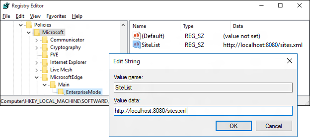
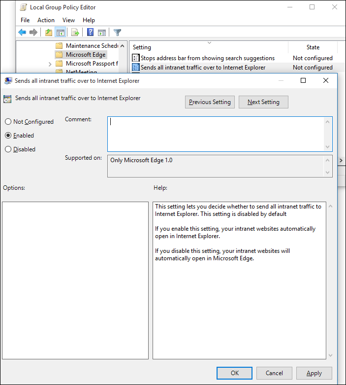

# Use Enterprise Mode to improve compatibility

**Last updated**

-   November 12, 2015

**Applies to:**

-   Windows 10
-   Windows 10 Mobile

If you have specific web sites and apps that you know have compatibility problems with Microsoft Edge, you can use the Enterprise Mode site list so that the web sites will automatically open using Internet Explorer 11. Additionally, if you know that your intranet sites aren't going to work properly with Microsoft Edge, you can set all intranet sites to automatically open using IE11.

Using Enterprise Mode means that you can continue to use Microsoft Edge as your default browser, while also ensuring that your apps continue working on IE11.

**Note** If you want to use Group Policy to set Internet Explorer as your default browser, you can find the info here, [Set the default browser using Group Policy]( http://go.microsoft.com/fwlink/p/?LinkId=620714).

## Fix specific websites

Microsoft Edge doesn't support ActiveX controls, Browser Helper Objects, VBScript, or other legacy technology. If you have websites or web apps that still use this technology and need IE11, you can add them to the Enterprise Mode site list, using the Enterprise Mode Site List Manager.

**To add sites to your list**

1.  In the Enterprise Mode Site List Manager tool, click **Add**.
If you already have an existing site list, you can import it into the tool. After it's in the tool, the xml updates the list, checking **Open in IE** for each site. For info about importing the site list, see [Import your Enterprise Mode site list to the Enterprise Mode Site List Manager](http://go.microsoft.com/fwlink/p/?LinkId=618322).

2.  Type or paste the URL for the website that’s experiencing compatibility problems, like *&lt;domain&gt;*.com or *&lt;domain&gt;*.com/*&lt;path&gt;* into the **URL** box. 
You don’t need to include the `http://` or `https://` designation. The tool will automatically try both versions during validation.

3.  Type any comments about the website into the **Notes about URL** box.
Administrators can only see comments while they’re in this tool.

4.  Click **Open in IE** next to the URL that should automatically open in IE11.
The path within a domain can require a different compatibility mode from the domain itself. For example, the domain might look fine in the default IE11 browser, but the path might have problems and require the use of Enterprise Mode. If you added the domain previously, your original compatibility choice is still selected. However, if the domain is new, Enterprise Mode is automatically selected.

5.  Click **Save** to validate your website and to add it to the site list for your enterprise.
If your site passes validation, it’s added to the global compatibility list. If the site doesn’t pass validation, you’ll get an error message explaining the problem. You’ll then be able to either cancel the site or ignore the validation problem and add it to your list anyway.

6.  On the **File** menu, go to where you want to save the file, and then click **Save to XML**.
You can save the file locally or to a network share. However, you must make sure you deploy it to the location specified in your Group Policy setting. For more info, see [Turn on Enterprise Mode and use a site list](http://go.microsoft.com/fwlink/p/?LinkId=618952).

### Set up Microsoft Edge to use the Enterprise Mode site list

You must turn on the **Use Enterprise Mode Site List** Group Policy setting before Microsoft Edge can use the Enterprise Mode site list. This Group Policy applies to both Microsoft Edge and IE11, letting Microsoft Edge switch to IE11 as needed, based on the Enterprise Mode site list. For more info about IE11 and Enterprise Mode, see [Enterprise Mode for Internet Explorer 11 (IE11)](http://go.microsoft.com/fwlink/p/?linkid=618377).

**To turn on Enterprise Mode using Group Policy**

1.  Open your Group Policy editor and go to the **Administrative Templates\\Windows Components\\Microsoft Edge\\Allows you to configure the Enterprise Mode Site list** setting.
Turning this setting on also requires you to create and store a site list.

2.  Click **Enabled**, and then in the **Options** area, type the location to your site list.

3.  Refresh your policy in your organization and then view the affected sites in Microsoft Edge.
The site shows a message in Microsoft Edge, saying that the page needs IE. At the same time, the page opens in IE11; in a new frame if it's not yet running, or in a new tab if it is.

**To turn on Enterprise Mode using the registry**

1.  **To turn on Enterprise Mode for all users on the PC:** Open a registry editor, like regedit.exe and go to `HKEY_LOCAL_MACHINE\Software\Policies\Microsoft\MicrosoftEdge\Main\EnterpriseMode`.

2.  Edit the `SiteList` registry key to point to where you want to keep your Enterprise Mode site list file. For example:

    -   **HTTP location**: *“SiteList”=”http://localhost:8080/sites.xml”*

    -   **Local network**: *"SiteList"="\\\\network\\shares\\sites.xml"*

    -   **Local file**: *"SiteList"="file:///c:\\\\Users\\\\&lt;user&gt;\\\\Documents\\\\testList.xml"*

        All of your managed devices must have access to this location if you want them to be able to access and use Enterprise Mode and your site list.

3.  Refresh your policy in your organization and then view the affected sites in Microsoft Edge.
The site shows a message in Microsoft Edge, saying that the page needs IE. At the same time, the page opens in IE11; in a new frame if it's not yet running, or in a new tab if it is.

## Fix your intranet sites

You can add the **Send all intranet traffic over to Internet Explorer** Group Policy setting for Windows 10 so that all of your intranet sites open in IE11. This means that even if your employees are using Microsoft Edge, they will automatically switch to IE11 while viewing the intranet.

**Note** If you want to use Group Policy to set IE as the default browser for Internet sites, you can find the info here, [Set the default browser using Group Policy]( http://go.microsoft.com/fwlink/p/?LinkId=620714).

**To turn on Sends all intranet traffic over to Internet Explorer using Group Policy**

1.  Open your Group Policy editor and go to the `Administrative Templates\Windows Components\Microsoft Edge\Sends all intranet traffic over to Internet Explorer` setting.

2.  Click **Enabled**.

3.  Refresh your policy in your organization and then view the affected sites in Microsoft Edge.
The site shows a message in Microsoft Edge, saying that the page needs IE. At the same time, the page opens in IE11; in a new frame if it's not yet running, or in a new tab if it is.

## Related topics
* [Blog: How Microsoft Edge and Internet Explorer 11 on Windows 10 work better together in the Enterprise](http://go.microsoft.com/fwlink/p/?LinkID=624035)
* [Enterprise Mode Site List Manager download](http://go.microsoft.com/fwlink/p/?LinkId=394378)
* [Enterprise Mode for Internet Explorer 11 (IE11)](http://go.microsoft.com/fwlink/p/?linkid=618377)
* [Set the default browser using Group Policy]( http://go.microsoft.com/fwlink/p/?LinkId=620714)
 

 

