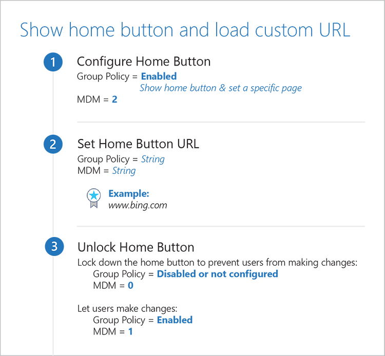
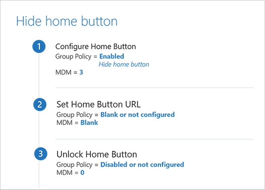

# Home button 

Microsoft Edge shows the home button, by default, and by clicking it the Start page loads. With the relevant Home button policies, you can configure the Home button to load the New tab page or a specific page. You can also configure Microsoft Edge to hide the home button. 

## Relevant group policies

- [Configure Home Button](#configure-home-button)
- [Set Home Button URL](#set-home-button-url)
- [Unlock Home Button](#unlock-home-button)

You can find the Microsoft Edge Group Policy settings in the following location of the Group Policy Editor unless otherwise noted in the policy:

&nbsp;&nbsp;&nbsp;&nbsp;&nbsp;&nbsp;**Computer Configuration\\Administrative Templates\\Windows Components\\Microsoft Edge\\**

## Configuration options

## Configure Home Button
[!INCLUDE [configure-home-button-include.md](../includes/configure-home-button-include.md)]

## Set Home Button URL
[!INCLUDE [set-home-button-url-include](../includes/set-home-button-url-include.md)]

## Unlock Home Button
[!INCLUDE [unlock-home-button-include.md](../includes/unlock-home-button-include.md)]

