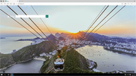

|   |   |
|---|---|
| **Single-app**

**Digital/interactive signage**
Displays a specific site in full-screen mode, running Microsoft Edge InPrivate protecting user data.<ul><li>**Digital signage** does not require user interaction.
_**Example.**_ Use digital signage for things like a rotating advertisement or menu.
</li><li>**Interactive signage**, on the other hand, requires user interaction within the page but doesn’t allow for any other uses, such as browsing the internet.
_**Example.**_ Use interactive signage for things like a building business directory or restaurant order/pay station.</li></ul>
**Policy setting** = Not configured (0 default)
 | 
&nbsp;
 
**Public browsing**
Runs a limited multi-tab version of Microsoft Edge, protecting user data. Microsoft Edge is the only app users can use on the device, preventing them from customizing Microsoft Edge.  Users can only browse publically or end their browsing session.
The single-app public browsing mode is the only kiosk mode that has an **End session** button. Microsoft Edge also resets the session after a specified time of user inactivity. Both restart Microsoft Edge and clear the user’s session.
_**Example.**_ A public library or hotel concierge desk are two examples of public browsing that provides access to Microsoft Edge and other apps. 
**Policy setting** = Enabled (1) |
| **Multi-app**

**Normal browsing**
Runs a full-version of Microsoft Edge with all browsing features and preserves the user data and state between sessions.
Some features may not work depending on what other apps you have configured in assigned access. For example, installing extensions or books from the Microsoft store are not allowed if the store is not available. Also, if Internet Explorer 11 is set up in assigned access, you can enable [EnterpriseModeSiteList](https://docs.microsoft.com/windows/client-management/mdm/policy-csp-browser#browser-enterprisemodesitelist) to automatically switch users to Internet Explorer 11 for sites that need backward compatibility support.
**Policy setting** = Not configured (0 default)  | 
&nbsp;

**Public browsing**
Runs a multi-tab version of Microsoft Edge InPrivate with a tailored experience for kiosks that runs in full-screen mode. Users can open and close Microsoft Edge and launch other apps if allowed by assigned access. Instead of an End session button to clear their browsing session, the user closes Microsoft Edge normally.
In this configuration, Microsoft Edge can interact with other applications. For example, if Internet Explorer 11 is set up in multi-app assigned access, you can enable [EnterpriseModeSiteList](https://docs.microsoft.com/windows/client-management/mdm/policy-csp-browser#browser-enterprisemodesitelist) to automatically switch users to Internet Explorer 11 for sites that need backward compatibility support. 
_**Example.**_ A public library or hotel concierge desk are two examples of public browsing that provides access to Microsoft Edge and other apps.
**Policy setting** = Enabled (1)  |
---
