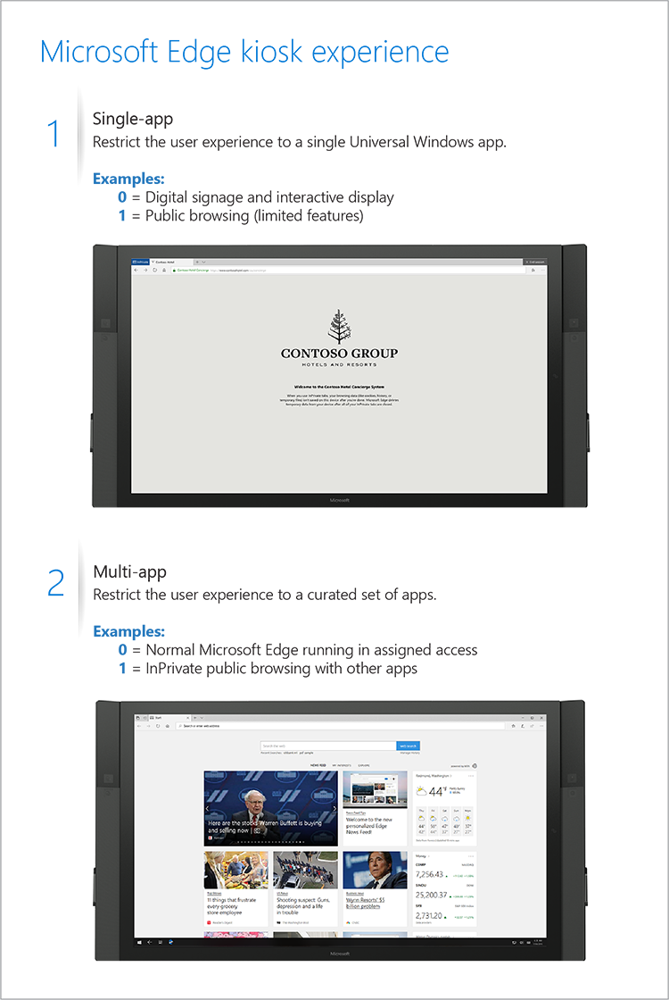

<!-- ## Configure kiosk mode --> 
>*Supported versions: Microsoft Edge on Windows 10, version 1809* 
>*Default setting:  Not configured*

[!INCLUDE [configure-kiosk-mode-shortdesc](../shortdesc/configure-kiosk-mode-shortdesc.md)]

For this policy to work, you must configure Microsoft Edge in assigned access; otherwise, Microsoft Edge ignores the settings in this policy. To learn more about assigned access and kiosk configuration, see [Configure kiosk and shared devices running Windows desktop editions](https://aka.ms/E489vw).

### Supported values

| | |
|---|---|
|(0) Default or not configured |<ul><li>If it’s a single app, Microsoft Edge runs InPrivate full screen for digital signage or interactive displays.</li><li>If it’s one of many apps, Microsoft Edge runs as normal.</li></ul> |
|(1) Enabled |<ul><li>If it’s a single app, it runs InPrivate with a tailored experience for kiosks and is the only app available for public browsing. Users can’t minimize, close, or open windows or customize Microsoft Edge, but can clear browsing data and downloads and restart by clicking “End session.” You can configure Microsoft Edge to restart after a period of inactivity by using the “Configure kiosk reset after idle timeout” policy.
**_For single-app public browsing_**: If you do not configure the Configure kiosk reset after idle timeout policy and you enable this policy, Microsoft Edge kiosk resets after 5 minutes of idle time.</li><li>If it’s one of many apps, it runs InPrivate with  multi-tabs for public browsing with other apps. Users can minimize, close, and open multiple InPrivate windows, but they can’t customize Microsoft Edge.</li></ul> |
---

### ADMX info and settings
#### ADMX info
- **GP English name:** Configure kiosk mode
- **GP name:** ConfigureKioskMode
- **GP element:** ConfigureKioskMode_TextBox
- **GP path:** Windows Components/Microsoft Edge
- **GP ADMX file name:** MicrosoftEdge.admx

#### MDM settings
- **MDM name:** Browser/[ConfigureKioskMode](https://docs.microsoft.com/en-us/windows/client-management/mdm/policy-csp-browser#browser-configurekioskmode)
- **Supported devices:** Desktop
- **URI full path:** ./Vendor/MSFT/Policy/Config/Browser/ConfigureKioskMode 
- **Data type:** Integer

#### Registry settings
- **Path:** HKLM\Software\Policies\Microsoft\MicrosoftEdge\KioskMode
- **Value name:** ConfigureKioskMode
- **Value type:** REG_SZ

### Related policies
[Configure kiosk reset after idle timeout](../available-policies.md#configure-kiosk-reset-after-idle-timeout): [!INCLUDE [configure-kiosk-reset-after-idle-timeout-shortdesc](../shortdesc/configure-kiosk-reset-after-idle-timeout-shortdesc.md)] 

### Related topics
[Deploy Microsoft Edge kiosk mode](../microsoft-edge-kiosk-mode-deploy.md): Microsoft Edge kiosk mode works with assigned access to allow IT administrators, to create a tailored browsing experience designed for kiosk devices. In this deployment guidance, you learn about the different Microsoft Edge kiosk mode types to help you determine what configuration is best suited for your kiosk device.  You also learn about the other group policies to help you enhance the how to setup your Microsoft Edge kiosk mode experience.

