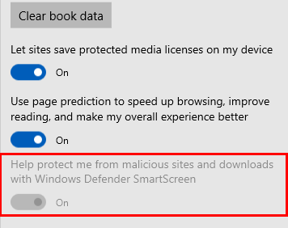

<!-- ## Configure Windows Defender SmartScreen -->
>*Supported versions: Microsoft Edge on Windows 10* 
>*Default setting:  Enabled (Turned on)*

[!INCLUDE [configure-windows-defender-smartscreen-shortdesc](../shortdesc/configure-windows-defender-smartscreen-shortdesc.md)]

### Supported values

|  Group Policy  |  MDM  | Registry |                                          Description                                          |                 Most restricted                  |
|----------------|:-----:|:--------:|-----------------------------------------------------------------------------------------------|:------------------------------------------------:|
| Not configured | Blank |  Blank   |                     Users can choose to use Windows Defender SmartScreen.                     |                                                  |
|    Disabled    |   0   |    0     | Turned off. Do not protect users from potential threats and prevent users from turning it on. |                                                  |
|    Enabled     |   1   |    1     |    Turned on. Protect users from potential threats and prevent users from turning it off.     |  |

---

To verify Windows Defender SmartScreen is turned off (disabled): 
1. Click or tap **More** (…) and select **Settings** > **View Advanced settings**.
2.  Verify the setting **Help protect me from malicious sites and download with SmartScreen Filter** is disabled.

### ADMX info and settings
#### ADMX info
- **GP English name:** Configure Windows Defender SmartScreen
- **GP name:** AllowSmartScreen
- **GP path:** Windows Components/Microsoft Edge
- **GP ADMX file name:** MicrosoftEdge.admx

#### MDM settings
- **MDM name:** Browser/[AllowSmartScreen](https://docs.microsoft.com/windows/client-management/mdm/policy-csp-browser#browser-allowsmartscreen)
- **Supported devices:** Desktop and Mobile
- **URI full path:** ./Vendor/MSFT/Policy/Config/Browser/AllowSmartScreen  
- **Data type:** Integer

#### Registry settings
- **Path:** HKLM\SOFTWARE\Policies\Microsoft\MicrosoftEdge\PhishingFilter
- **Value name:** EnabledV9
- **Value type:** REG_DWORD

