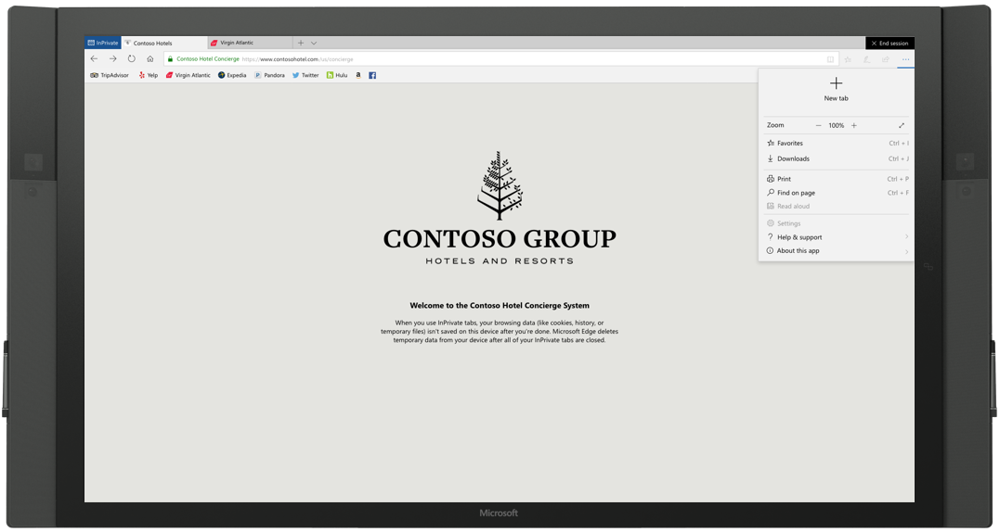
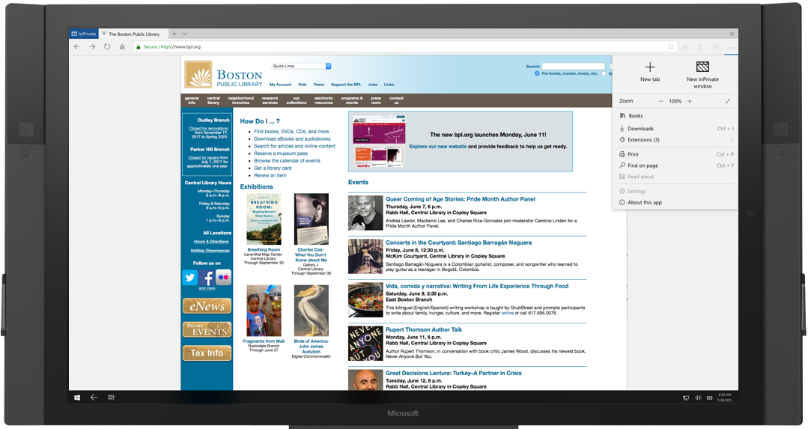
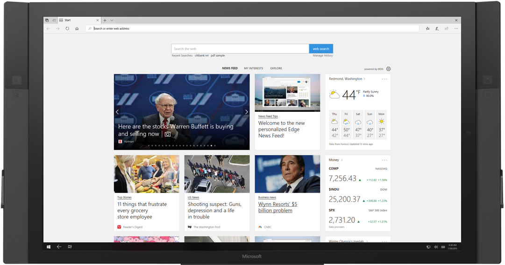

# Deploy Microsoft Edge kiosk mode (Preview Build 17718)

>Applies to: Microsoft Edge on Windows 10

Microsoft Edge kiosk mode works with assigned access to restrict the browsing
experience for kiosk devices. The kiosk browsing experience includes a full
screen digital/interactive signage mode and a multi-tab browsing mode. To use
Microsoft Edge kiosk mode, you must configure Microsoft Edge with assigned
access.

When you configure Microsoft Edge kiosk mode in assigned access, you can set it
up to show only a single URL in full-screen, in the case of digital or
interactive signage on a single-app kiosk device. You can also restrict
Microsoft Edge for public browsing (single and multi-app kiosk devices) that run
a multi-tab version of InPrivate limiting the functionality. You can also
configure a multi-app kiosk device to run a full version of Microsoft Edge.

Digital/Interactive signage, public browsing (single-app) and public browsing
(multi-app) protect user’s browsing data by running Microsoft Edge InPrivate.
Single-app public browsing provides an idle timer and an 'End session' button.
The idle timer resets the browsing session after a specified timeout, and the
'End Session' button resets the session immediately.

## Microsoft Edge kiosk types

Windows 10 offers two different kiosk type experiences in assigned access for
public and specialized use: single-app kiosk and multi-app kiosk. Microsoft Edge
kiosk mode supports **four** types, depending on how a Microsoft Edge kiosk is
set up in assigned access.

### Single-app kiosk

When you set up Microsoft Edge kiosk mode in single-app assigned access,
Microsoft Edge runs InPrivate either in full-screen or a limited multi-tab
version.

The single-app Microsoft Edge kiosk mode types include:

1.  **Digital / Interactive signage** devices display a specific site in
    full-screen mode where Microsoft Edge runs InPrivate mode. Examples of
    Digital signage are, a rotating advertisement or menu. Examples of
    Interactive signage are an interactive museum display or restaurant
    order/pay station.

2.  **Public browsing** devices run a limited multi-tab version of InPrivate and
    are the only app available. Users can’t minimize, close, or open new
    Microsoft Edge windows or customize Microsoft Edge. Users can clear browsing
    data, downloads and restart Microsoft Edge by clicking “End session.” You
    can configure Microsoft Edge to restart after a period of inactivity by
    using the “Configure kiosk reset after idle timeout” policy. For example, an
    information kiosk at a public library.

    

### Multi-app kiosk

When you set up Microsoft Edge kiosk mode in multi-app assigned access,
Microsoft Edge runs a limited multi-tab version of InPrivate or a normal
browsing version. For more details about running a multi-app kiosk, or
fixed-purpose device, see Set up a multi-app kiosk. Here you learn how to create
kiosks that run more than one app and the benefits of a multi-app kiosk, or
fixed-purpose device.

The multi-app Microsoft Edge kiosk mode types include:

3.  **Public browsing** (shared browsing) supports browsing the internet and
    runs InPrivate with minimal features available. In this configuration,
    Microsoft Edge can be one of many apps available. Users can minimize, close,
    and open multiple InPrivate windows. On a multi-app kiosk device, Microsoft
    Edge can interact with other applications. For example, users can install
    extensions from Microsoft Store if Microsoft Store is set up in assigned
    access. If you also have Internet Explorer 11 set up in assigned access; you
    can use the Enterprise Mode site list to allow users to open sites in
    Internet Explorer 11.

    

4.  **Normal mode** runs a full version of Microsoft Edge, but some features may
    not work depending on what other apps you configured in assigned access. For
    example, if the Microsoft Store is not set up, users cannot install
    extensions. If the user logs in with an MSA, their browsing data will roam
    with them. If you also have Internet Explorer 11 set up in assigned access;
    you can use the Enterprise Mode site list to open sites in Internet Explorer
    11 automatically.

    

## Let’s get started!

Before you can configure Microsoft Edge kiosk mode, you must set up Microsoft
Edge in assigned access. You can set up Microsoft Edge kiosk mode in assigned
access using:

-   **Windows Settings.** Best for physically setting up a single device as a
    kiosk. With this method, you set up assigned access and configure the kiosk
    or digital sign device using Settings. You can configure Microsoft Edge in
    single-app (kiosk type – Full-screen or public browsing) and define a single
    URL for the Home Button, Start Page and New Tab page. You can also set the
    reset after idle timeout. an ,

-   **Microsoft Intune or other MDM service.** Best for setting up multiple
    devices as a kiosk. With this method, you configure Microsoft Edge in
    assigned access and configure how Microsoft Edge behaves when it’s running
    in kiosk mode with assigned access.

    >[!NOTE]
    >For other MDM service, check with your provider for instructions.

-   **Windows PowerShell.** Best for setting up multiple devices as a kiosk.
    With this method, you set up assigned access using the
    [Set-AssignedAccess](https://docs.microsoft.com/en-us/powershell/module/assignedaccess/Set-AssignedAccess?view=win10-ps)
    cmdlet to restrict a local standard user account on a single-function
    device. The user cannot exit the app, sign out, or access any system
    settings. To configure how Microsoft Edge behaves when it’s running in kiosk
    mode, use Intune or other MDM service, the Group Policy Editor, or registry.

-   **Windows Configuration Designer.** Best for setting up multiple devices as
    a kiosk. Download and install both the latest version of the [Windows
    Assessment and Deployment Kit
    (ADK)](https://developer.microsoft.com/windows/hardware/windows-assessment-deployment-kit)
    and [Windows Configuration
    Manager](https://docs.microsoft.com/en-us/windows/configuration/provisioning-packages/provisioning-install-icd#install-windows-configuration-designer-1).

### Prerequisites

-   Microsoft Edge on Windows 10, version 1809 (Professional, Enterprise, and
    Education).

-   Configuration and deployment service, such as Windows PowerShell, Microsoft
    Intune or other MDM service, or Windows Configuration Designer. With these
    methods, you must have the
    [AppUserModelID](https://docs.microsoft.com/windows-hardware/customize/enterprise/find-the-application-user-model-id-of-an-installed-app);
    this does not apply to the Windows Settings method.

### Use Windows Settings 

Windows Settings is the simplest and easiest way to set up one or a couple of
devices because you must perform these steps on each device. This method is
ideal for mom and pop shops or small businesses.

1.  In Windows Settings, select **Accounts** \> **Other people**.

2.  Under **Set up a kiosk**, select **Assigned access**.

3.  Select **Get started**.

4.  Create a standard user account or choose an existing account for your kiosk.

5.  Select **Next**.

6.  On the **Choose the app for the kiosk** page, select **Microsoft Edge.**

7.  Select **Next**.

8.  Select how Microsoft Edge displays when running in kiosk mode:

-   **As a digital sign or interactive display,** the default URL shows in full
    screen, without browser controls.

-   **As a public browser,** the default URL shows in a browser view with
    limited browser controls.

1.  Select **Next**.

2.  Enter the URL that you want to load when the kiosk launches.

    >[!NOTE]
    >The URL sets the Home Button, Start page, and New Tab page.

1.  Microsoft Edge in kiosk mode has a built-in timer to help keep data safe in
    public browsing sessions. When the idle time (no user activity) meets the
    time limit, a confirmation message prompts the user to continue; if
    **Continue** is not selected, Microsoft Edge resets to the default URL.
    Accept the default value of **5 minutes,** or you can choose your own idle
    timer value.

2.  Select **Next**, and then select **Close**.

3.  Close **Settings** to save your choices automatically and apply them the
    next time the user accounts logs on.

4.  Configure the policies for Microsoft Edge kiosk mode. For details on the
    valid kiosk policy settings, see Related policies on page 17.

5.  Validate the Microsoft Edge kiosk mode by restarting the device and signing
    in with the local kiosk account.

*Congratulations!* You’ve finished setting up Microsoft Edge in assigned access
and a kiosk or digital sign, and configured browser policies for Microsoft Edge
kiosk mode.

*Next steps.* 
- Use your new kiosk. Sign in to the device using the user account
that you selected to run the kiosk app.
- If you want to make changes to your kiosk, you can quickly change the display
option and default URL for Microsoft Edge.

    1.  Go to **Start** \> **Settings** \> **Accounts** \> **Other people**.
    
    2.  Under **Set up a kiosk**, select **Assigned access**.
    
    3.  Make your changes to **Choose a kiosk mode** and **Set up Microsoft Edge**.

### Use Microsoft Intune or other MDM service

With this method, you can use Microsoft Intune or other MDM services to
configure Microsoft Edge in assigned access and how it behaves when it’s running
in assigned access.

1.  In Microsoft Intune or other MDM service, configure AssignedAccess to
    prevent users from accessing the file system, running executables, or other
    apps.

2.  Configure the following MDM settings to control a web browser app on the
    kiosk device.

    |   |   |
    |---|---|
    | **ConfigureKioskMode**
 | Configure the display mode for Microsoft Edge as a kiosk app.
**URI full path:** ./Vendor/MSFT/Policy/Config/Browser/ConfigureKioskMode
**Data type:**  Integer
**Allowed values:**<ul><li>**Single-app kiosk experience**<ul><li>**0** - Digital signage and interactive display</li><li>**1** - InPrivate Public browsing</li></ul></li><li>**Multi-app kiosk experience**<ul><li>**0** - Normal Microsoft Edge running in assigned access</li><li>**1** - InPrivate public browsing with other apps</li></ul></li></ul> |
    | **ConfigureKioskResetAfterIdleTimeout**
 | Change the time in minutes from the last user activity before Microsoft Edge kiosk mode resets to the default kiosk configuration.
**URI full path:** ./Vendor/MSFT/Policy/Config/Browser/ConfigureKioskResetAfterIdleTimeout
**Data type:** Integer
**Allowed values:**<ul><li>**0** - No idle timer</li><li>**1-1440 (5 minutes is the default)** - Set reset on idle timer</li></ul>  |
    | **HomePages**
  | Set one or more start pages, URLs, to load when Microsoft Edge launches.
**URI full path:** ./Vendor/MSFT/Policy/Config/Browser/HomePages
**Data type:** String
**Allowed values:**
Enter one or more URL, for example, &nbsp;&nbsp;&nbsp;\<https://www.msn.com\>\<https:/www.bing.com\>  |
    | **ConfigureHomeButton**
  | Configure how the Home Button behaves.
**URI full path:** ./Vendor/MSFT/Policy/Config/Browser/ConfigureHomeButton
**Data type:** Integer
 **Allowed values:**<ul><li>**0 (default)** - Not configured. Show home button, and load the default Start page.</li><li>**1** - Enabled. Show home button and load New tab page</li><li>**2** - Enabled. Show home button & set a specific page.</li><li>**3** - Enabled. Hide the home button.</li></ul>   |
    | **SetNewTabPageURL**
   | Set a custom URL for the New tab page.
 **URI full path:** ./Vendor/MSFT/Policy/Config/Browser/ 
**Data type:** String
**Allowed values:** Enter a URL, for example, https://www.msn.com      |
    | **SetHomeButtonURL**
    | If you set ConfigureHomeButton to 2, configure the home button URL.
**URI full path:** ./Vendor/MSFT/Policy/Config/Browser/ 
**Data type:** String
**Allowed values:** Enter a URL, for example, https://www.bing.com    |
    ---

3.  Restart the device and sign in using the kiosk app user account.

*Congratulations!* You’ve finished setting up a kiosk or digital signage and
configuring policies for Microsoft Edge kiosk mode using Microsoft Intune or
other MDM service.

*Next steps.* Use your new kiosk. Sign in to the device using the user account
that you selected to run the kiosk app.

### Use a provisioning package 

With this method, you can use a provisioning package to configure Microsoft Edge
in assigned access. After you set up the provisioning package for configuring
Microsoft Edge in assigned access, you configure how Microsoft Edge behaves when
it’s running in kiosk mode with assigned access.

1.  Open Windows Configuration Designer to create a provisioning package and
    configure Microsoft Edge in assigned access.

2.  After creating the provisioning package and configuring assigned access, and
    before you build the package, switch to the advanced editor.

3.  Navigate to **Runtime settings \> Policies \> Browser** and set the
    following policies:

    |   |   |
    |---|---|
    | **ConfigureKioskMode**
 | Configure the display mode for Microsoft Edge as a kiosk app.
**URI full path:** ./Vendor/MSFT/Policy/Config/Browser/ConfigureKioskMode
**Data type:**  Integer
**Allowed values:**<ul><li>**Single-app kiosk experience**<ul><li>**0** - Digital signage and interactive display</li><li>**1** - InPrivate Public browsing</li></ul></li><li>**Multi-app kiosk experience**<ul><li>**0** - Normal Microsoft Edge running in assigned access</li><li>**1** - InPrivate public browsing with other apps</li></ul></li></ul> |
    | **ConfigureKioskResetAfterIdleTimeout**
 | Change the time in minutes from the last user activity before Microsoft Edge kiosk mode resets to the default kiosk configuration.
**URI full path:** ./Vendor/MSFT/Policy/Config/Browser/ConfigureKioskResetAfterIdleTimeout
**Data type:** Integer
**Allowed values:**<ul><li>**0** - No idle timer</li><li>**1-1440 (5 minutes is the default)** - Set reset on idle timer</li></ul>  |
    | **HomePages**
  | Set one or more start pages, URLs, to load when Microsoft Edge launches.
**URI full path:** ./Vendor/MSFT/Policy/Config/Browser/HomePages
**Data type:** String
**Allowed values:**
Enter one or more URL, for example, &nbsp;&nbsp;&nbsp;\<https://www.msn.com\>\<https:/www.bing.com\>  |
    | **ConfigureHomeButton**
  | Configure how the Home Button behaves.
**URI full path:** ./Vendor/MSFT/Policy/Config/Browser/ConfigureHomeButton
**Data type:** Integer
 **Allowed values:**<ul><li>**0 (default)** - Not configured. Show home button, and load the default Start page.</li><li>**1** - Enabled. Show home button and load New tab page</li><li>**2** - Enabled. Show home button & set a specific page.</li><li>**3** - Enabled. Hide the home button.</li></ul>   |
    | **SetNewTabPageURL**
   | Set a custom URL for the New tab page.
 **URI full path:** ./Vendor/MSFT/Policy/Config/Browser/ 
**Data type:** String
**Allowed values:** Enter a URL, for example, https://www.msn.com      |
    | **SetHomeButtonURL**
    | If you set ConfigureHomeButton to 2, configure the home button URL.
**URI full path:** ./Vendor/MSFT/Policy/Config/Browser/ 
**Data type:** String
**Allowed values:** Enter a URL, for example, https://www.bing.com    |
    ---

4.  After you’ve configured the Microsoft Edge kiosk mode policies, including
    any of the related policies, it’s time to build the package.

5.  Click **Finish**. The wizard closes taking you back to the Customizations
    page.

6.  Apply the provisioning package to the device, which you can do during the
    first-run experience (out-of-box experience or OOBE) and after (runtime).
    For more details, see Apply a provisioning package.

*Congratulations!* You’ve finished creating your provisioning package for
Microsoft Edge kiosk mode.

*Next steps.* Use your new kiosk. Sign in to the device using the user account
that you selected to run the kiosk app.

# Feature comparison of kiosk mode and kiosk browser app

In the following table, we show you the features available in both Microsoft
Edge kiosk mode and Kiosk Browser app available in Microsoft Store. Both kiosk
mode and kiosk browser app work in assigned access.

| **Feature**   | **Microsoft Edge kiosk mode**  | **Kiosk Browser**    |
|---------------|--------------------------------|-----------------------|
| Print support   | [Supported](images/148767.png)    | [Not supported](images/148766.png)   |
| Multi-tab support    | [Supported](images/148767.png)   | [Not supported](images/148766.png)   |
| Allow URL support    | [Supported](images/148767.png) 
*\*For Microsoft Edge kiosk mode use* [Windows Defender Firewall](#_*Windows_Defender_Firewall)*. Microsoft kiosk browser has custom policy support.* | [Supported](images/148767.png)  |
| Block URL support    | [Supported](images/148767.png)
*\*For Microsoft Edge kiosk mode use* [Windows Defender Firewall](#_*Windows_Defender_Firewall)*. Microsoft kiosk browser has custom policy support.* | [Supported](images/148767.png)     |
| Configure Home button   | [Supported](images/148767.png)   | [Supported](images/148767.png)      |
| Set Start page(s) URL    | [Supported](images/148767.png)      | [Supported](images/148767.png) 
*Same as Home button URL*     |
| Set New Tab page URL  | [Supported](images/148767.png)    | [Not supported](images/148766.png)   |
| Favorites management     | [Supported](images/148767.png)     | [Not supported](images/148766.png) |
| End session button    | [Supported](images/148767.png)   | [Supported](images/148767.png)
*In Intune, must create custom URI to enable. Dedicated UI configuration targeted for 1808.* |
| Reset on inactivity  | [Supported](images/148767.png) | [Supported](images/148767.png)   |
| Internet Explorer integration (Enterprise Mode site list) | [Supported](images/148767.png)
*Multi-app mode only*  | [Not supported](images/148766.png)     |
---

## \*Windows Defender Firewall
To prevent unwanted websites, use Windows Defender Firewall to configure a list of allowed websites or blocked websites or both. For more details, see [Windows Defender Firewall with Advanced Security Deployment](https://docs.microsoft.com/en-us/windows/security/identity-protection/windows-firewall/windows-firewall-with-advanced-security-deployment-guide).

# Related policies

| **MDM Setting**  | **Digital / Interactive signage** | **Public browsing single-app** | **Public browsing multi-app**   | **Normal**   |
|------------------|--------------------------|----------------------|------------------------|--------------------------|
| AllowAddressBarDropdown    | [Not supported](images/148766.png)   | [Not supported](images/148766.png)   | [Not supported](images/148766.png)    | [Supported](images/148767.png)   |
| AllowAutofill                                                          | [Not supported](images/148766.png)   | [Not supported](images/148766.png)   | [Not supported](images/148766.png)    | [Supported](images/148767.png)   |
| AllowBrowser                                                           | [Not supported](images/148766.png)   | [Not supported](images/148766.png)   | [Not supported](images/148766.png)    | [Not supported](images/148766.png) |
| AllowConfigurationUpdateForBooksLibrary                                | [Not supported](images/148766.png)   | [Not supported](images/148766.png)   | [Not supported](images/148766.png)    | [Supported](images/148767.png)   |
| AllowCookies                                                           | [Supported](images/148767.png)     | [Supported](images/148767.png)     | [Supported](images/148767.png)      | [Supported](images/148767.png)   |
| AllowDeveloperTools                                                    | [Not supported](images/148766.png)   | [Not supported](images/148766.png)   | [Not supported](images/148766.png)    | [Supported](images/148767.png)   |
| AllowDoNotTrack                                                        | [Supported](images/148767.png) ? | [Supported](images/148767.png) ? | [Supported](images/148767.png) ?  | [Supported](images/148767.png)   |
| AllowExtensions                                                        | [Not supported](images/148766.png)   | [Not supported](images/148766.png)   | [Not supported](images/148766.png)    | [Supported](images/148767.png)   |
| AllowFlash                                                             | [Supported](images/148767.png)     | [Supported](images/148767.png)     | [Supported](images/148767.png)      | [Supported](images/148767.png)   |
| AllowFlashClickToRun                                                   | [Supported](images/148767.png)     | [Supported](images/148767.png)     | [Supported](images/148767.png)      | [Supported](images/148767.png)   |
| AllowFullscreen\*                                                      | [Not supported](images/148766.png)   | [Supported](images/148767.png)     | [Supported](images/148767.png)      | [Supported](images/148767.png)   |
| AllowInPrivate                                                         | [Not supported](images/148766.png)   | [Not supported](images/148766.png)   | [Not supported](images/148766.png)    | [Supported](images/148767.png)   |
| AllowMicrosoftCompatibilityList                                        | [Not supported](images/148766.png)   | [Not supported](images/148766.png)   | [Supported](images/148767.png) \* | [Supported](images/148767.png)   |
| AllowPasswordManager                                                   | [Not supported](images/148766.png)   | [Not supported](images/148766.png)   | [Not supported](images/148766.png)    | [Supported](images/148767.png)   |
| AllowPopups                                                            | [Not supported](images/148766.png) ? | [Supported](images/148767.png)     | [Supported](images/148767.png)      | [Supported](images/148767.png)   |
| AllowPrelaunch\*                                                       | [Not supported](images/148766.png)   | [Not supported](images/148766.png)   | [Not supported](images/148766.png)    | [Supported](images/148767.png)   |
| AllowPrinting\*                                                        | [Supported](images/148767.png)     | [Supported](images/148767.png)     | [Supported](images/148767.png)      | [Supported](images/148767.png)   |
| AllowSavingHistory\*                                                   | [Not supported](images/148766.png)   | [Not supported](images/148766.png)   | [Not supported](images/148766.png)    | [Supported](images/148767.png)   |
| AllowSearchEngineCustomization                                         | [Not supported](images/148766.png)   | [Not supported](images/148766.png)   | [Not supported](images/148766.png)    | [Supported](images/148767.png)   |
| AllowSearchSuggestionsinAddressBar                                     | [Not supported](images/148766.png)   | [Supported](images/148767.png)     | [Supported](images/148767.png)      | [Supported](images/148767.png)   |
| AllowSideloadingOfExtensions\*                                         | [Not supported](images/148766.png)   | [Not supported](images/148766.png)   | [Not supported](images/148766.png)    | [Supported](images/148767.png)   |
| AllowSmartScreen                                                       | [Supported](images/148767.png)     | [Supported](images/148767.png)     | [Supported](images/148767.png)      | [Supported](images/148767.png)   |
| AllowSyncMySettings                                                    | [Not supported](images/148766.png)   | [Not supported](images/148766.png)   | [./media/image12.png](./media/image12.png) ?  | [Supported](images/148767.png)   |
| AllowTabPreloading\*                                                   | [Not supported](images/148766.png)   | [Not supported](images/148766.png)   | [Not supported](images/148766.png)    | [Supported](images/148767.png)   |
| AllowWebContentOnNewTabPage\*                                          | [Not supported](images/148766.png)   | [Not supported](images/148766.png)   | [Not supported](images/148766.png)    | [Supported](images/148767.png)   |
| AlwaysEnabledBooksLibrary                                              | [Not supported](images/148766.png)   | [Not supported](images/148766.png)   | [Not supported](images/148766.png)    | [Supported](images/148767.png)   |
| ClearBrowsingDataOnExit                                                | [Not supported](images/148766.png)   | [Not supported](images/148766.png)   | [Not supported](images/148766.png)    | [Supported](images/148767.png)   |
| ConfigureAdditionalSearchEngines                                       | [Not supported](images/148766.png)   | [Supported](images/148767.png)     | [Supported](images/148767.png)      | [Supported](images/148767.png)   |
| ConfigureFavoritesBar\*                                                | [Not supported](images/148766.png)   | [Supported](images/148767.png)     | [Supported](images/148767.png)      | [Supported](images/148767.png)   |
| ConfigureHomeButton\*                                                  | [Supported](images/148767.png)     | [Supported](images/148767.png)     | [Supported](images/148767.png)      | [Supported](images/148767.png)   |
|  ConfigureKioskMode\*                                                  | [Supported](images/148767.png)     | [Supported](images/148767.png)     | [Supported](images/148767.png)      | [Supported](images/148767.png)   |
|  ConfigureKioskResetAfterIdleTimeout\*                                 | [Not supported](images/148766.png)   | [Supported](images/148767.png)     | [Not supported](images/148766.png)    | [Not supported](images/148766.png) |
| ConfigureOpenMicrosoftEdgeWith\*                                       | [Supported](images/148767.png)     | [Supported](images/148767.png)     | [Supported](images/148767.png)      | [Supported](images/148767.png)   |
| ConfigureTelemetryForMicrosoft365Analytics\*                           | [Supported](images/148767.png)     | [Supported](images/148767.png)     | [Supported](images/148767.png)      | [Supported](images/148767.png)   |
| DisableLockdownOfStartPages                                            | [Not supported](images/148766.png)   | [Not supported](images/148766.png)   | [Not supported](images/148766.png)    | [Supported](images/148767.png)   |
| DoNotSyncBrowserSettings\* & PreventUsersFromTurningOnBrowserSyncing\* | [Not supported](images/148766.png)   | [Not supported](images/148766.png)   | [Not supported](images/148766.png) ?  | [Supported](images/148767.png)   |
| EnableExtendedBooksTelemetry                                           | [Not supported](images/148766.png)   | [Not supported](images/148766.png)   | [Not supported](images/148766.png)    | [Supported](images/148767.png)   |
| EnterpriseModeSiteList                                                 | [Not supported](images/148766.png)   | [Not supported](images/148766.png)   | [Supported](images/148767.png) \* | [Supported](images/148767.png)   |
| FirstRunURL                                                            | [Not supported](images/148766.png)   | [Not supported](images/148766.png)   | [Not supported](images/148766.png)    | [Not supported](images/148766.png) |
| HomePages                                                              | [Supported](images/148767.png)     | [Supported](images/148767.png)     | [Supported](images/148767.png)      | [Supported](images/148767.png)   |
| LockdownFavorites                                                      | [Not supported](images/148766.png)   | [Supported](images/148767.png)     | [Supported](images/148767.png)      | [Supported](images/148767.png)   |
| PreventAccessToAboutFlagsInMicrosoftEdge                               | [Not supported](images/148766.png)   | [Supported](images/148767.png)     | [Supported](images/148767.png)      | [Supported](images/148767.png)   |
| PreventCertErrorOverrides\*                                            | [Supported](images/148767.png)     | [Supported](images/148767.png)     | [Supported](images/148767.png)      | [Supported](images/148767.png)   |
| PreventFirstRunPage                                                    | [Supported](images/148767.png) ? | [Supported](images/148767.png) ? | [Supported](images/148767.png) ?  | [Supported](images/148767.png)   |
| PreventLiveTileDataCollection                                          | [Not supported](images/148766.png)   | [Not supported](images/148766.png)   | [Not supported](images/148766.png)    | [Supported](images/148767.png)   |
| PreventSmartScreenPromptOverride                                       | [Supported](images/148767.png)     | [Supported](images/148767.png)     | [Supported](images/148767.png)      | [Supported](images/148767.png)   |
| PreventSmartScreenPromptOverrideForFiles                               | [Supported](images/148767.png)     | [Supported](images/148767.png)     | [Supported](images/148767.png)      | [Supported](images/148767.png)   |
| PreventTurningOffRequiredExtensions\*                                  | [Supported](images/148767.png)     | [Supported](images/148767.png)     | [Supported](images/148767.png)      | [Supported](images/148767.png)   |
| PreventUsingLocalHostIPAddressForWebRTC                                | ?                                            | ?                                            | ?                                             | [Supported](images/148767.png)   |
| ProvisionFavorites                                                     | [Not supported](images/148766.png)   | [Supported](images/148767.png)     | [Supported](images/148767.png)      | [Supported](images/148767.png)   |
| SendIntranetTraffictoInternetExplorer                                  | [Not supported](images/148766.png)   | [Not supported](images/148766.png)   | ?\*                                           | [Supported](images/148767.png)   |
| SetDefaultSearchEngine                                                 | [Not supported](images/148766.png)   | [Supported](images/148767.png)     | [Supported](images/148767.png)      | [Supported](images/148767.png)   |
| SetHomeButtonURL\*                                                     | [Not supported](images/148766.png)   | [Supported](images/148767.png)     | [Supported](images/148767.png)      | [Supported](images/148767.png)   |
| SetNewTabPageURL\*                                                     | [Not supported](images/148766.png)   | [Supported](images/148767.png)     | [Supported](images/148767.png)      | [Supported](images/148767.png)   |
| ShowMessageWhenOpeningInteretExplorerSites                             | [Not supported](images/148766.png)   | [Supported](images/148767.png)     | [Supported](images/148767.png) \* | [Supported](images/148767.png)   |
| SyncFavoritesBetweenIEAndMicrosoftEdge                                 | [Not supported](images/148766.png)   | [Not supported](images/148766.png)   | [Supported](images/148767.png) ?  | [Supported](images/148767.png)   |
| UnlockHomeButton\*                                                     | [Not supported](images/148766.png)   | [Not supported](images/148766.png)   | [Not supported](images/148766.png)    | [Supported](images/148767.png)   |
| UseSharedFolderForBooks                                                | [Not supported](images/148766.png)   | [Not supported](images/148766.png)   | [Not supported](images/148766.png)    | [Supported](images/148767.png)   |
---

*\* New policy coming in the next release of Windows 10.*

# Related topics

-   **Create a Kiosk Experience:** Learn how to set up single-function kiosk
    devices, such as restaurant menus, and optional features for a welcome
    screen or power button availability. Also, learn how to create a multi-app
    kiosk, or fixed-purpose device, to provide an easy-to-understand experience
    giving users the things they need to use.

-   **Configure a Windows 10 kiosk that runs multiple apps:** Learn how to
    create kiosks that run more than one app and the benefits of a multi-app
    kiosk, or fixed-purpose device.

-   **Kiosk apps for assigned access: Best practices:** In Windows 10, you can
    use assigned access to create a kiosk device, which enables users to
    interact with just a single Universal Windows app. Learn about the best
    practices for implementing a kiosk app.

-   **Guidelines for choosing an app for assigned access (kiosk mode):**
    Assigned access restricts a local standard user account on the device so
    that it only has access to a single-function device, like a kiosk. Learn
    about the guidelines for choosing a Windows app, web browsers, and securing
    your information. Also, learn about additional configurations required for
    some apps before it can work properly in assigned access.

-   **Other settings to lock down:** Learn how to configure a more secure kiosk
    experience. In addition to the settings, learn how to set up **automatic
    logon** for your kiosk device. For example, when the kiosk device restarts,
    you can log back into the device manually or by setting up automatic logon.

-   **Add apps to Microsoft Intune:** Learn about and understand a few app
    fundamentals and requirements before adding them to Intune and making them
    available to your users.

-   **AssignedAccess configuration service provider (CSP):** The AssignedAccess
    configuration service provider (CSP) sets the device to run in kiosk mode.
    Once the CSP has executed, then the next user login associated with the
    kiosk mode puts the device into the kiosk mode running the application
    specified in the CSP configuration.

-   **Create a provisioning page for Windows 10**. Learn to use Windows
    Configuration Designer (WCD) to create a provisioning package (.ppkg) for
    configuring devices running Windows 10. The WCD wizard options provide a
    simple interface to configure desktop, mobile, and kiosk device settings.

# Provide feedback or get support

To provide feedback on Microsoft Edge kiosk mode in Feedback Hub, select **Microsoft Edge** as the  **Category**, and **All other issues** as the
subcategory. 

*For multi-app kiosk only.* If you have set up the Feedback Hub in assigned access, you can you submit the feedback from the device running Microsoft Edge in kiosk mode in which you can include diagnostic logs. In the Feedback Hub, select **Microsoft Edge** as the **Category**, and **All other issues** as the
subcategory.

---