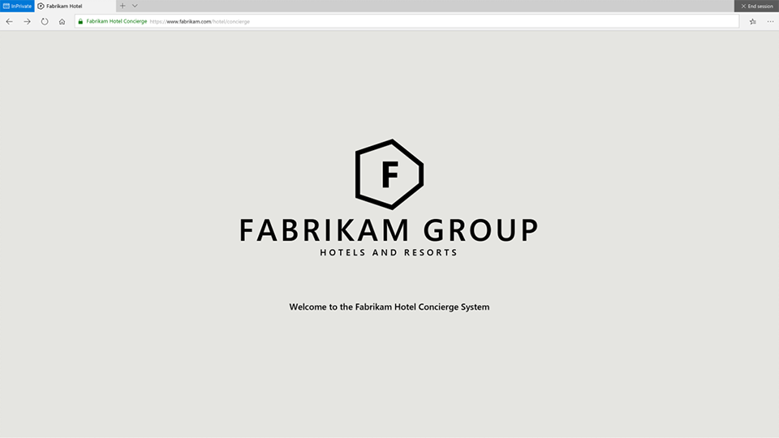
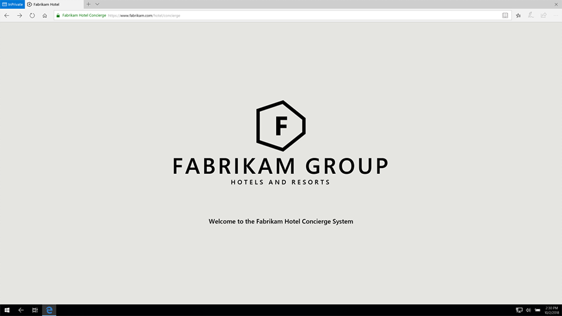
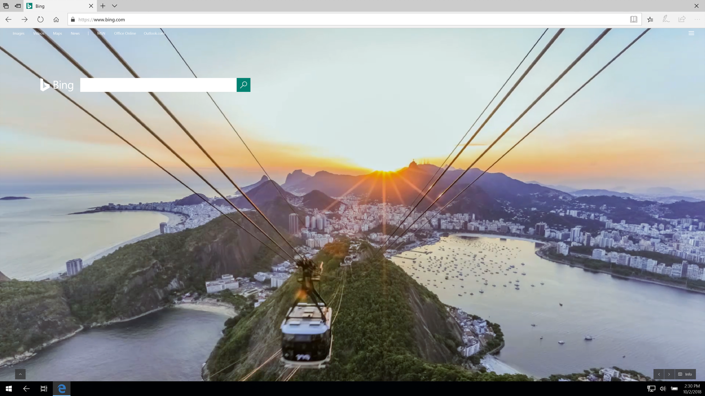

# Deploy Microsoft Edge kiosk mode

>Applies to: Microsoft Edge on Windows 10, version 1809

In the Windows 10 October 2018 Update, we added the capability to use Microsoft Edge as a kiosk using [assigned access](https://docs.microsoft.com/en-us/windows-hardware/customize/enterprise/assigned-access) and also added new policies to enhance the kiosk experience. With assigned access, IT admins can create a tailored browsing experience locking down a Windows 10 device to only run as a single-app or multi-app kiosk.  It also prevents users from accessing the file system and running executables or other apps from Microsoft Edge.

>[!IMPORTANT]
>For kiosk mode to work, you must configure Microsoft Edge in assigned access; otherwise, Microsoft Edge ignores the settings in this policy. To learn more about assigned access and kiosk configuration, see [Configure kiosk and shared devices running Windows desktop editions](https://aka.ms/E489vw).

In this topic, you learn about the different kiosk mode configuration types to help you determine what configuration is best suited for your kiosk device or scenario. You also learn how to set up your kiosk device using either Windows Setting or Microsoft Intune or other MDM service. At the end of this topic, we provide you with a list of supported policies for kiosk mode, related topics, and feature comparison of kiosk mode and kiosk browser app.  We also provide you instructions on how to provide us feedback. 

## Microsoft Edge kiosk types

Microsoft Edge kiosk mode supports four configurations types that depend on how Microsoft Edge is set up with assigned access.  For example, when you set up Microsoft Edge kiosk mode in single-app assigned access, Microsoft Edge runs InPrivate either in full-screen or a multi-tab version designed for public browsing. For more details about setting up a single-app kiosk, see [Set up a kiosk or digital signage on Windows 10 Pro, Enterprise, or Education](https://docs.microsoft.com/en-us/windows/configuration/setup-kiosk-digital-signage).  Also, when you set up Microsoft Edge kiosk mode in multi-app assigned access, Microsoft Edge runs more than one app with the benefits of a multi-app kiosk, or fixed-purpose device for public or normal browsing.

The four kiosk mode configuration types supported are:

1. [Single-app: Digital/interactive signage](#single-app-digitalinteractive-signage)
2. [Single-app: Public browsing](#single-app-public-browsing)
3. [Multi-app: Normal browsing](#multi-app-normal-browsing)
4. [Multi-app: Public browsing](#multi-app-public-browsing)


### Single-app: Digital/interactive signage

A single-app kiosk device for digital/interactive signage displays a specific site in full-screen mode running Microsoft Edge InPrivate, protecting user data. 

- **Digital signage** does not require user interaction. Use digital signage for things like a rotating advertisement or menu. 

- **Interactive signage**, on the other hand, requires user interaction within the page but doesn’t allow for any other uses, such as browsing the internet. Use interactive signage for things like a building business directory or restaurant order/pay station.

**Policy setting** = Disabled or not configured (0)


### Single-app: Public browsing

A single-app kiosk device for public browsing is publicly accessible and supports browsing the internet. Public browsing runs a limited multi-tab version of Microsoft Edge InPrivate, protecting user data. Microsoft Edge is the only app users can use on the device, preventing them from customizing Microsoft Edge.  

The single-app public browsing mode is the only kiosk mode that has an ‘End session’ button. Microsoft Edge also resets the session after a specified time of user inactivity. The reset after the idle timer is set to 5 minutes by default, but you can choose a value of your own in assigned access or the [ConfigureKioskResetAfterIdleTimeout policy](#configure-kiosk-reset-idle-timeout). Both restart Microsoft Edge and clear the user’s session.

**Policy setting** = Enabled (1)

>[!TIP]
>A public library or hotel concierge desk are two examples of public browsing that provides access to Microsoft Edge and other apps.




### Multi-app: Normal browsing

A multi-app device for normal browsing runs a full-featured version of Microsoft Edge with all browsing features and preserves the user data and state between sessions.

Some features may not work depending on what other apps you have configured in assigned access. For example, installing extensions or books from the Microsoft store are not allowed if the store is not available. Also, if Internet Explorer 11 is set up in assigned access, you can enable Enterprise Mode to  automatically switch users to Internet Explorer 11 for sites that need backward compatibility support.  

**Policy setting** = Disabled or not configured (0)




### Multi-app: Public browsing

A multi-app kiosk device for public browsing is publicly accessible and supports browsing the internet.  Public browsing runs a multi-tab version of Microsoft Edge InPrivate with limited functionality that runs in full-screen mode.  Users can open and close Microsoft Edge and launch other apps if allowed by assigned access. Instead of an **End session** button to clear their browsing session, the user closes Microsoft Edge normally.

For more details about running a multi-app kiosk, or fixed-purpose device, see [Create a Windows 10 kiosk that runs multiple apps](https://docs.microsoft.com/en-us/windows/configuration/lock-down-windows-10-to-specific-apps).

In this configuration, Microsoft Edge can interact with other applications. For example, if Internet Explorer 11 is set up in multi-app assigned access, you can enable Enterprise Mode to automatically switch users to Internet Explorer 11 for sites that need backward compatibility support. 


**Policy setting** = Enabled (1)

>[!TIP]
>A public library or hotel concierge desk are two examples of public browsing that provides access to Microsoft Edge and other apps.





## Let’s set up Microsoft Edge kiosk mode!

Before you can configure Microsoft Edge kiosk mode, you must set up Microsoft Edge in assigned access. With assigned access, you restrict a local standard user account so that it only has access to one or more Windows app, such as Microsoft Edge in kiosk mode. You can set up Microsoft Edge kiosk mode in assigned access using:

-   **Windows Settings.** Use to set up a couple of single-app kiosk devices. If you hit the Windows key and type “kiosk” you can set up Microsoft Edge kiosk mode for a single-app (Digital / Interactive signage or Public browsing) experience and define a single URL for the Home button, Start page, and New Tab page. You can also set the reset after an idle timeout.

    >[!IMPORTANT]
    >Do not use the Windows 10 Settings to configure multi-app kiosks.

-   **Microsoft Intune or other MDM service.** Use to set up several single-app and multi-app kiosk devices. Microsoft Intune and other MDM service providers offer more options for customizing the Microsoft Edge kiosk mode experience by using the [supported or available] Microsoft Edge policies. For a list of supported policies see [Supported policies for kiosk mode](#supported-policies-for-kiosk-mode).

    >[!NOTE]
    >For other MDM service, check with your provider for instructions.


### Prerequisites

-   Microsoft Edge on Windows 10, version 1809 (Professional, Enterprise, and Education).

-   Configuration and deployment service, such as Microsoft Intune or other MDM service. With these methods, you must have the AppUserModelID (AUMID) to set up Microsoft Edge:
 
    ```
    Microsoft.MicrosoftEdge_8wekyb3d8bbwe!MicrosoftEdge
    ```


### Use Windows Settings

Windows Settings is the simplest and easiest way to set up one or a couple of devices because you perform these steps physically on each device. This method is ideal for small businesses.

>[!IMPORTANT]
>Windows Settings is only for setting up a single-app kiosk device.  For a multi-app kiosk device, use Microsoft Intune or Windows PowerShell. You can also use Intune or PowerShell to configure a single-app device.

When you set up a single-app kiosk device using Windows Settings, you must first set up assigned access before configuring the device. With assigned access, you restrict a local standard user account so that it only has access to one Windows app, such as Microsoft Edge in kiosk mode.

1.  Open Windows Settings, type **kiosk** in the search field and select **Set up a kiosk (assigned access)**.

2.  On the **Set up a kiosk** page, click **Get started**.

3.  Type a name to create a new kiosk account, or choose an existing account from the populated list and click **Next**.

4.  On the **Choose a kiosk app** page, select **Microsoft Edge** and then click **Next**.

5.  Select how Microsoft Edge displays when running in kiosk mode:

    -   **As a digital sign or interactive display**, the default URL shows in full screen, without browser controls.  Use digital signage for things like a rotating advertisement or menu, or use interactive signage for a building business directory or restaurant order/pay station. 

    -   **As a public browser**, the default URL shows in a browser view with limited browser controls. Microsoft Edge is the only app available for public browsing.  Users cannot minimize, close, or open windows or customize Microsoft Edge, but can click the **End session** button to clear their browsing data and restart with a new session. 

6.  Select **Next**.

7.  Type the URL to load when the kiosk launches.

    >[!NOTE]
	>The URL that you provide sets the Home button, Start page, and New Tab page.

8.  Accept the default value of **5 minutes** for the idle time or provide a value of your own.

    >[!TIP]
	>Microsoft Edge kiosk mode has a built-in timer to help keep data safe in public browsing sessions. When the idle time (no user activity) meets the time limit, a confirmation message prompts the user to continue. If the user does not **Continue**, Microsoft Edge resets to the default URL.

9.  Click **Next**.

10. Close the **Settings** window to save and apply your choices.

11. Restart the kiosk device and sign in with the local kiosk account to validate the configuration.

**_Congratulations!_** <p>You’ve just finished setting up a single-app kiosk device. 

**_What's next?_** 

|If you want to... |Then... |
|---|---|
|Use your new kiosk |Sign into the device with the kiosk account that you selected to run Microsoft Edge kiosk mode. |
|Make changes to your kiosks such as change the display option or the URL that loads |<ol><li>In Windows Settings, type **kiosk** in the search field and select **Set up a kiosk (assigned access)**.</li><li>On the **Set up a kiosk** page, make your changes to **Choose a kiosk mode** and **Set up Microsoft Edge**.</li></ol> |
---

### Use Microsoft Intune or other MDM service

With this method, you can use Microsoft Intune or other MDM services to configure Microsoft Edge kiosk mode in assigned access and how it behaves on a kiosk device.

>[!IMPORTANT]
>If you are using a local account as a kiosk account in Microsoft Intune, make sure to sign into this account and then sign out before configuring the assigned access single-app kiosk.

1. In Microsoft Intune or other MDM service, configure [AssignedAccess](https://docs.microsoft.com/windows/client-management/mdm/assignedaccess-csp) to prevent users from accessing the file system, running executables, or other apps.

2. Configure the following MDM settings to setup Microsoft Edge kiosk mode on the kiosk device and then restart the device.

   |   |   |
   |---|---|
   | **[ConfigureKioskMode](https://docs.microsoft.com/en-us/windows/client-management/mdm/policy-csp-browser#browser-configurekioskmode)**<p> | Configure the display mode for Microsoft Edge as a kiosk app.<p><p>**URI full path:** ./Vendor/MSFT/Policy/Config/Browser/ConfigureKioskMode<p>**Data type:**  Integer<p>**Allowed values:**<ul><li>**Single-app kiosk experience**<ul><li>**0** - Digital signage and interactive display</li><li>**1** - InPrivate Public browsing</li></ul></li><li>**Multi-app kiosk experience**<ul><li>**0** - Normal Microsoft Edge running in assigned access</li><li>**1** - InPrivate public browsing with other apps</li></ul></li></ul> |
   | **[ConfigureKioskResetAfterIdleTimeout](https://docs.microsoft.com/en-us/windows/client-management/mdm/policy-csp-browser#browser-configurekioskresetafteridletimeout)**<p> | Change the time in minutes from the last user activity before Microsoft Edge kiosk mode resets to the default kiosk configuration.<p><p>**URI full path:** ./Vendor/MSFT/Policy/Config/Browser/ConfigureKioskResetAfterIdleTimeout<p>**Data type:** Integer<p>**Allowed values:**<ul><li>**0** - No idle timer</li><li>**1-1440 (5 minutes is the default)** - Set reset on idle timer</li></ul>  |
   | **[HomePages](https://docs.microsoft.com/en-us/windows/client-management/mdm/policy-csp-browser#browser-homepages)**<p>  | Set one or more start pages, URLs, to load when Microsoft Edge launches.<p><p>**URI full path:** ./Vendor/MSFT/Policy/Config/Browser/HomePages<p>**Data type:** String<p>**Allowed values:**<p>Enter one or more URLs, for example,<br>&nbsp;&nbsp;&nbsp;\<https://www.msn.com\>\<https:/www.bing.com\>  |
   | **[ConfigureHomeButton](https://docs.microsoft.com/en-us/windows/client-management/mdm/policy-csp-browser#browser-configurehomebutton)**<p>  | Configure how the Home Button behaves.<p><p>**URI full path:** ./Vendor/MSFT/Policy/Config/Browser/ConfigureHomeButton<p>**Data type:** Integer<p> **Allowed values:**<ul><li>**0 (default)** - Not configured. Show home button, and load the default Start page.</li><li>**1** - Enabled. Show home button and load New Tab page</li><li>**2** - Enabled. Show home button & set a specific page.</li><li>**3** - Enabled. Hide the home button.</li></ul>   |
   | **[SetHomeButtonURL](https://docs.microsoft.com/en-us/windows/client-management/mdm/policy-csp-browser#browser-sethomebuttonurl)**<p>   | If you set ConfigureHomeButton to 2, configure the home button URL.<p><p>**URI full path:** ./Vendor/MSFT/Policy/Config/Browser/SetHomeButtonURL <p>**Data type:** String<p>**Allowed values:** Enter a URL, for example, https://www.bing.com   |
   | **[SetNewTabPageURL](https://docs.microsoft.com/en-us/windows/client-management/mdm/policy-csp-browser#browser-setnewtabpageurl)**<p>   | Set a custom URL for the New Tab page.<p><p>**URI full path:** ./Vendor/MSFT/Policy/Config/Browser/SetNewTabPageURL <p>**Data type:** String<p>**Allowed values:** Enter a URL, for example, https://www.msn.com    |
    ---


**_Congratulations!_** <p>You’ve just finished setting up a kiosk or digital signage and configuring group policies for Microsoft Edge kiosk mode using Microsoft Intune or other MDM service.

**_What's next?_** <p>Use your new kiosk. Sign in to the device using the user account that you selected to run the kiosk app.

---


## Supported policies for kiosk mode

Use any of the Microsoft Edge policies listed below to enhance the kiosk experience depending on the Microsoft Edge kiosk mode type you configure. To learn more about these policies, see [Policy CSP - Browser](https://docs.microsoft.com/en-us/windows/client-management/mdm/policy-csp-browser).

| **MDM Setting**  | **Digital /<br>Interactive signage** | **Public browsing<br>single-app** | **Public browsing<br>multi-app**   | **Normal<br>mode**   |
|------------------|:---------:|:---------:|:---------:|:---------:|
| [AllowAddressBarDropdown](https://docs.microsoft.com/en-us/windows/client-management/mdm/policy-csp-browser#browser-allowaddressbardropdown)   |    |    |    |    |
| [AllowAutofill](https://docs.microsoft.com/en-us/windows/client-management/mdm/policy-csp-browser#browser-allowautofill)                                                       |    |    |    |    |
| [AllowBrowser](https://docs.microsoft.com/en-us/windows/client-management/mdm/policy-csp-browser#browser-allowbrowser)                                                        |    |    |    |  |
| [AllowConfigurationUpdateForBooksLibrary](https://docs.microsoft.com/en-us/windows/client-management/mdm/policy-csp-browser#browser-allowconfigurationupdateforbookslibrary)                             |    |    |    |    |
| [AllowCookies](https://docs.microsoft.com/en-us/windows/client-management/mdm/policy-csp-browser#browser-allowcookies)                                                         |    |    |     |    |
| [AllowDeveloperTools](https://docs.microsoft.com/en-us/windows/client-management/mdm/policy-csp-browser#browser-allowdevelopertools)                                                  |    |    |    |    |
| [AllowDoNotTrack](https://docs.microsoft.com/en-us/windows/client-management/mdm/policy-csp-browser#browser-allowdonottrack)                                                      |  |  |   |    |
| [AllowExtensions](https://docs.microsoft.com/en-us/windows/client-management/mdm/policy-csp-browser#browser-allowextensions)                                                      |    |    |    |    |
| [AllowFlash](https://docs.microsoft.com/en-us/windows/client-management/mdm/policy-csp-browser#browser-allowflash)                                                           |    |    |     |    |
| [AllowFlashClickToRun](https://docs.microsoft.com/en-us/windows/client-management/mdm/policy-csp-browser#browser-allowflashclicktorun)                                                 | <sup>2</sup>   |    |     |    |
| [AllowFullscreen](https://docs.microsoft.com/en-us/windows/client-management/mdm/policy-csp-browser#browser-allowfullscreenmode)\*                                                 |    |    |     |    |
| [AllowInPrivate](https://docs.microsoft.com/en-us/windows/client-management/mdm/policy-csp-browser#browser-allowinprivate)                                                       |    |    |    |    |
| [AllowMicrosoftCompatibilityList](https://docs.microsoft.com/en-us/windows/client-management/mdm/policy-csp-browser#browser-allowmicrosoftcompatibilitylist)                                      |    |    | <sup>1</sup> |    |
| [AllowPasswordManager](https://docs.microsoft.com/en-us/windows/client-management/mdm/policy-csp-browser#browser-allowpasswordmanager)                                                 |    |    |    |    |
| [AllowPopups](https://docs.microsoft.com/en-us/windows/client-management/mdm/policy-csp-browser#browser-allowpopups)                                                          |  |    |     |    |
| [AllowPrelaunch](https://docs.microsoft.com/en-us/windows/client-management/mdm/policy-csp-browser#browser-allowprelaunch)\*                                                    |    |    |    |    |
| [AllowPrinting](https://docs.microsoft.com/en-us/windows/client-management/mdm/policy-csp-browser#browser-allowprinting)\*                                                      |    |    |     |    |
| [AllowSavingHistory](https://docs.microsoft.com/en-us/windows/client-management/mdm/policy-csp-browser#browser-allowsavinghistory)\*                                                 |    |    |    |    |
| [AllowSearchEngineCustomization](https://docs.microsoft.com/en-us/windows/client-management/mdm/policy-csp-browser#browser-allowsearchenginecustomization)                                       |    |    |    |    |
| [AllowSearchSuggestionsinAddressBar](https://docs.microsoft.com/en-us/windows/client-management/mdm/policy-csp-browser#browser-allowsearchenginecustomization)                                   |    |    |     |    |
| [AllowSideloadingExtensions](https://docs.microsoft.com/en-us/windows/client-management/mdm/policy-csp-browser#browser-allowsideloadingofextensions)\*                                       |    |    |    |    |
| [AllowSmartScreen](https://docs.microsoft.com/en-us/windows/client-management/mdm/policy-csp-browser#browser-allowsmartscreen)                                                     |    |    |     |    |
| [AllowSyncMySettings](https://docs.microsoft.com/en-us/windows/client-management/mdm/policy-csp-experience#experience-allowsyncmysettings)                                                  |    |    |    |    |
| [AllowTabPreloading](https://docs.microsoft.com/en-us/windows/client-management/mdm/policy-csp-browser#browser-allowtabpreloading)\*                                                 |    |    |    |    |
| [AllowWebContentOnNewTabPage](https://docs.microsoft.com/en-us/windows/client-management/mdm/policy-csp-browser#browser-allowwebcontentonnewtabpage)\*                                        |    |    |    |    |
| [AlwaysEnabledBooksLibrary](https://docs.microsoft.com/en-us/windows/client-management/mdm/policy-csp-browser#browser-alwaysenablebookslibrary)                                            |    |    |    |    |
| [ClearBrowsingDataOnExit](https://docs.microsoft.com/en-us/windows/client-management/mdm/policy-csp-browser#browser-clearbrowsingdataonexit)                                              |    |    |    |    |
| [ConfigureAdditionalSearchEngines](https://docs.microsoft.com/en-us/windows/client-management/mdm/policy-csp-browser#browser-configureadditionalsearchengines)                                     |    |    |     |    |
| [ConfigureFavoritesBar](https://docs.microsoft.com/en-us/windows/client-management/mdm/policy-csp-browser#browser-configurefavoritesbar)\*                                              |    |    |     |    |
| [ConfigureHomeButton](https://docs.microsoft.com/en-us/windows/client-management/mdm/policy-csp-browser#browser-configurehomebutton)\*                                                |    |    |     |    |
|  [ConfigureKioskMode](https://docs.microsoft.com/en-us/windows/client-management/mdm/policy-csp-browser#browser-configurekioskmode)\*                                                |    |    |     |    |
|  [ConfigureKioskResetAfterIdleTimeout](https://docs.microsoft.com/en-us/windows/client-management/mdm/policy-csp-browser#browser-configurekioskresetafteridletimeout)\*                               |    |    |    |  |
| [ConfigureOpenEdgeWith](https://docs.microsoft.com/en-us/windows/client-management/mdm/policy-csp-browser#browser-configureopenmicrosoftedgewith)\*                                     |    |    |     |    |
| [ConfigureTelemetryForMicrosoft365Analytics](https://docs.microsoft.com/en-us/windows/client-management/mdm/policy-csp-browser#browser-configuretelemetryformicrosoft365analytics)\*                         |    |    |     |    |
| [DisableLockdownOfStartPages](https://docs.microsoft.com/en-us/windows/client-management/mdm/policy-csp-browser#browser-disablelockdownofstartpages)                                          |    |    |    |    |
| [Experience/DoNotSyncBrowserSettings](https://docs.microsoft.com/en-us/windows/client-management/mdm/policy-csp-experience#experience-donotsyncbrowsersetting)\* and [Experience/PreventTurningOffRequiredExtensions](https://docs.microsoft.com/en-us/windows/client-management/mdm/policy-csp-browser#browser-preventturningoffrequiredextensions)\* |    |    |    |    |
| [EnableExtendedBooksTelemetry](https://docs.microsoft.com/en-us/windows/client-management/mdm/policy-csp-browser#browser-enableextendedbookstelemetry)                                         |    |    |    |    |
| [EnterpriseModeSiteList](https://docs.microsoft.com/en-us/windows/client-management/mdm/policy-csp-browser#browser-enterprisemodesitelist)                                               |    |    | <sup>1</sup> |    |
| [FirstRunURL](https://docs.microsoft.com/en-us/windows/client-management/mdm/policy-csp-browser#browser-firstrunurl)                                                          |    |    |    |  |
| [HomePages](https://docs.microsoft.com/en-us/windows/client-management/mdm/policy-csp-browser#browser-homepages)                                                            |    |    |     |    |
| [LockdownFavorites](https://docs.microsoft.com/en-us/windows/client-management/mdm/policy-csp-browser#browser-lockdownfavorites)                                                    |    |    |     |    |
| [PreventAccessToAboutFlagsInMicrosoftEdge](https://docs.microsoft.com/en-us/windows/client-management/mdm/policy-csp-browser#browser-preventaccesstoaboutflagsinmicrosoftedge)                             |    |    |     |    |
| [PreventCertErrorOverrides](https://docs.microsoft.com/en-us/windows/client-management/mdm/policy-csp-browser#browser-preventcerterroroverrides)\*                                          |    |    |     |    |
| [PreventFirstRunPage](https://docs.microsoft.com/en-us/windows/client-management/mdm/policy-csp-browser#browser-preventfirstrunpage)                                                  |  | |   |    |
| [PreventLiveTileDataCollection](https://docs.microsoft.com/en-us/windows/client-management/mdm/policy-csp-browser#browser-preventlivetiledatacollection)                                        |    |    |    |    |
| [PreventSmartScreenPromptOverride](https://docs.microsoft.com/en-us/windows/client-management/mdm/policy-csp-browser#browser-preventsmartscreenpromptoverride)                                     |    |    |     |    |
| [PreventSmartScreenPromptOverrideForFiles](https://docs.microsoft.com/en-us/windows/client-management/mdm/policy-csp-browser#browser-preventsmartscreenpromptoverrideforfiles)                             |    |    |     |    |
| [PreventTurningOffRequiredExtensions](https://docs.microsoft.com/en-us/windows/client-management/mdm/policy-csp-browser#browser-preventturningoffrequiredextensions)\*                                |    |    |     |    |
| [PreventUsingLocalHostIPAddressForWebRTC](https://docs.microsoft.com/en-us/windows/client-management/mdm/policy-csp-browser#browser-preventusinglocalhostipaddressforwebrtc)                             |                                           |                                           |                                            |    |
| [ProvisionFavorites](https://docs.microsoft.com/en-us/windows/client-management/mdm/policy-csp-browser#browser-provisionfavorites)                                                   |    |    |     |    |
| [SendIntranetTraffictoInternetExplorer](https://docs.microsoft.com/en-us/windows/client-management/mdm/policy-csp-browser#browser-sendintranettraffictointernetexplorer)                                |    |    | <sup>1</sup>       |    |
| [SetDefaultSearchEngine](https://docs.microsoft.com/en-us/windows/client-management/mdm/policy-csp-browser#browser-setdefaultsearchengine)                                               |    |    |     |    |
| [SetHomeButtonURL](https://docs.microsoft.com/en-us/windows/client-management/mdm/policy-csp-browser#browser-sethomebuttonurl)\*                                                   |    |    |     |    |
| [SetNewTabPageURL](https://docs.microsoft.com/en-us/windows/client-management/mdm/policy-csp-browser#browser-setnewtabpageurl)\*                                                   |    |    |     |    |
| [ShowMessageWhenOpeningInteretExplorerSites](https://docs.microsoft.com/en-us/windows/client-management/mdm/policy-csp-browser#browser-showmessagewhenopeningsitesininternetexplorer)                           |    |    | <sup>1</sup> |    |
| [SyncFavoritesBetweenIEAndMicrosoftEdge](https://docs.microsoft.com/en-us/windows/client-management/mdm/policy-csp-browser#browser-syncfavoritesbetweenieandmicrosoftedge)                               |    |    | <sup>1</sup>  |    |
| [UnlockHomeButton](https://docs.microsoft.com/en-us/windows/client-management/mdm/policy-csp-browser#browser-unlockhomebutton)\*                                                   |    |    |    |    |
| [UseSharedFolderForBooks](https://docs.microsoft.com/en-us/windows/client-management/mdm/policy-csp-browser#browser-usesharedfolderforbooks)                                             |    |    |    |    |
---

*\* New policy as of Windows 10, version 1809.*<p>
*1) For multi-app assigned access, you must configure Internet Explorer 11.*<br>
*2) For digital/interactive signage to enable Flash, set [AllowFlashClickToRun](https://docs.microsoft.com/en-us/windows/client-management/mdm/policy-csp-browser#browser-allowflashclicktorun) to 0.*

**Legend:**<p>
&nbsp;&nbsp;&nbsp;&nbsp;&nbsp;&nbsp;  = Not applicable or not supported <br>
&nbsp;&nbsp;&nbsp;&nbsp;&nbsp;&nbsp;  = Supported

---

## Related topics

-  **[Set up a kiosk or digital signage on Windows 10 Pro, Enterprise, or Education](https://docs.microsoft.com/en-us/windows/configuration/setup-kiosk-digital-signage)**: Learn about the different methods to configuring your kiosks and digitals signs.  Also, learn about the settings you can use to lock down the kiosk for a more secure kiosk experience.

-   **[Create a Kiosk Experience](https://docs.microsoft.com/en-us/windows-hardware/customize/enterprise/create-a-kiosk-image):** Learn how to set up single-function kiosk devices, such as restaurant menus, and optional features for a welcome screen or power button availability. Also, learn how to create a multi-app kiosk, or fixed-purpose device, to provide an easy-to-understand experience giving users the things they need to use.

-   **[Configure a Windows 10 kiosk that runs multiple apps](https://aka.ms/Ckmq4n):** Learn how to create kiosks that run more than one app and the benefits of a multi-app kiosk, or fixed-purpose device.

-   **[Kiosk apps for assigned access best practices](https://aka.ms/H1s8y4):** In Windows 10, you can use assigned access to create a kiosk device, which enables users to interact with just a single Universal Windows app. Learn about the best practices for implementing a kiosk app.

-   **[Guidelines for choosing an app for assigned access (kiosk mode)](https://aka.ms/Ul7dw3):** Assigned access restricts a local standard user account on the device so that it only has access to a single-function device, like a kiosk. Learn about the guidelines for choosing a Windows app, web browsers, and securing your information. Also, learn about additional configurations required for some apps before it can work properly in assigned access.

-   **[Other settings to lock down](https://docs.microsoft.com/en-us/windows/configuration/setup-kiosk-digital-signage#other-settings-to-lock-down):** Learn how to configure a more secure kiosk experience. In addition to the settings, learn how to set up **automatic logon** for your kiosk device. For example, when the kiosk device restarts, you can log back into the device manually or by setting up automatic logon.

-   **[Add apps to Microsoft Intune](https://docs.microsoft.com/en-us/intune/apps-add):** Learn about and understand a few app fundamentals and requirements before adding them to Intune and making them available to your users.

-   **[AssignedAccess configuration service provider (CSP)](https://docs.microsoft.com/en-us/windows/client-management/mdm/assignedaccess-csp):** The AssignedAccess configuration service provider (CSP) sets the device to run in kiosk mode. Once the CSP has executed, then the next user login associated with the kiosk mode puts the device into the kiosk mode running the application specified in the CSP configuration.


---

## Provide feedback or get support

To provide feedback on Microsoft Edge kiosk mode in Feedback Hub, select **Microsoft Edge** as the  **Category**, and **All other issues** as the subcategory. 

**_For multi-app kiosk only._** If you have set up the Feedback Hub in assigned access, you can you submit the feedback from the device running Microsoft Edge in kiosk mode in which you can include diagnostic logs. In the Feedback Hub, select **Microsoft Edge** as the **Category**, and **All other issues** as the subcategory.

---

## Feature comparison of kiosk mode and kiosk browser app
In the following table, we show you the features available in both Microsoft Edge kiosk mode and Kiosk Browser app available in Microsoft Store. Both kiosk mode and kiosk browser app work in assigned access.

| **Feature**   | **Microsoft Edge kiosk mode**  | **Microsoft Kiosk browser app**   |
|---------------|:----------------:|:---------------:|
| Print support   |    |    |
| Multi-tab support   |    |    |
| Allow/Block URL support   |  <p>*\*For Microsoft Edge kiosk mode use* [Windows Defender Firewall](#_*Windows_Defender_Firewall)*. Microsoft kiosk browser has custom policy support.* |   |
| Configure Home Button   |    |     |
| Set Start page(s) URL   |     |  <p>*Same as Home button URL*   |
| Set New Tab page URL  |    |    |
| Favorites management   |    |  |
| End session button   |    | <p>*In Microsoft Intune, you must create a custom URI to enable. Dedicated UI configuration targeted for 1808.* |
| Reset on inactivity  |  |    |
| Internet Explorer integration (Enterprise Mode site list) | <p>*Multi-app mode only*  |    |
| Available in Microsoft Store |   |  |
|SKU availability | Windows 10 October 2018 Update<br>Professional, Enterprise, and Education  | Windows 10 April 2018 Update<br>Professional, Enterprise, and Education |
---

**\*Windows Defender Firewall**<p>
To prevent access to unwanted websites on your kiosk device, use Windows Defender Firewall to configure a list of allowed websites, blocked websites or both.  For more details, see [Windows Defender Firewall with Advanced Security Deployment](https://docs.microsoft.com/en-us/windows/security/identity-protection/windows-firewall/windows-firewall-with-advanced-security-deployment-guide).

---