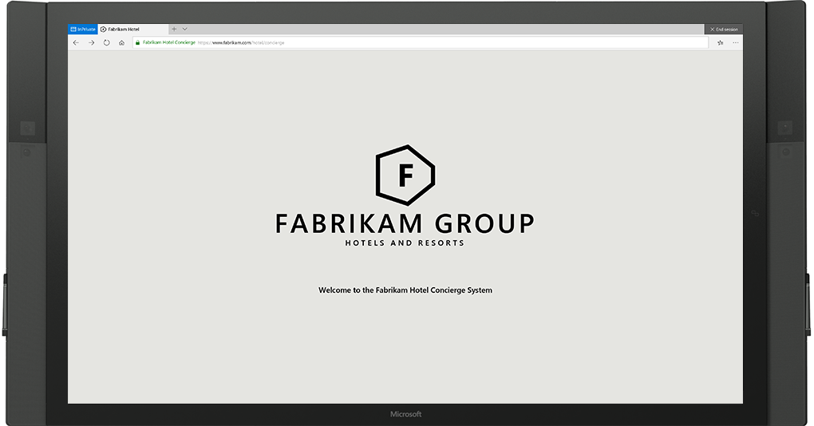
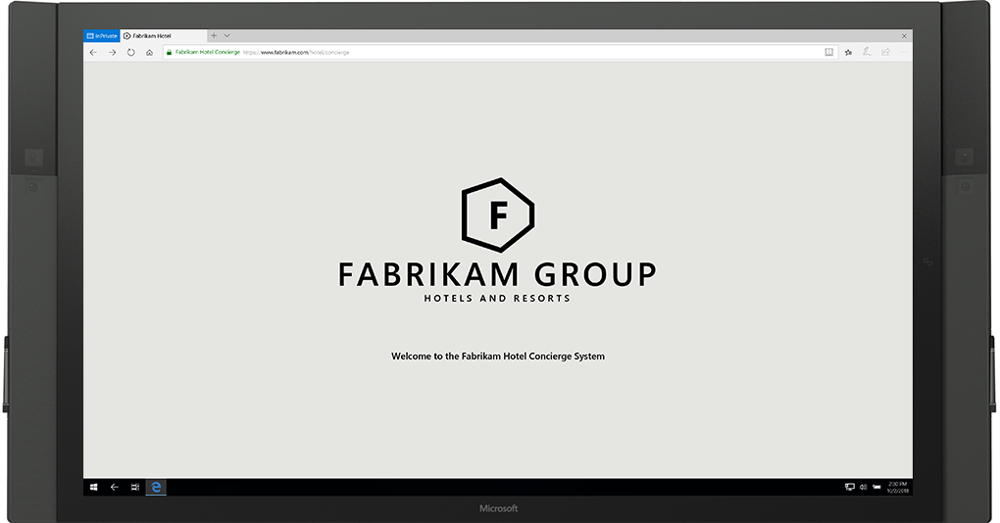
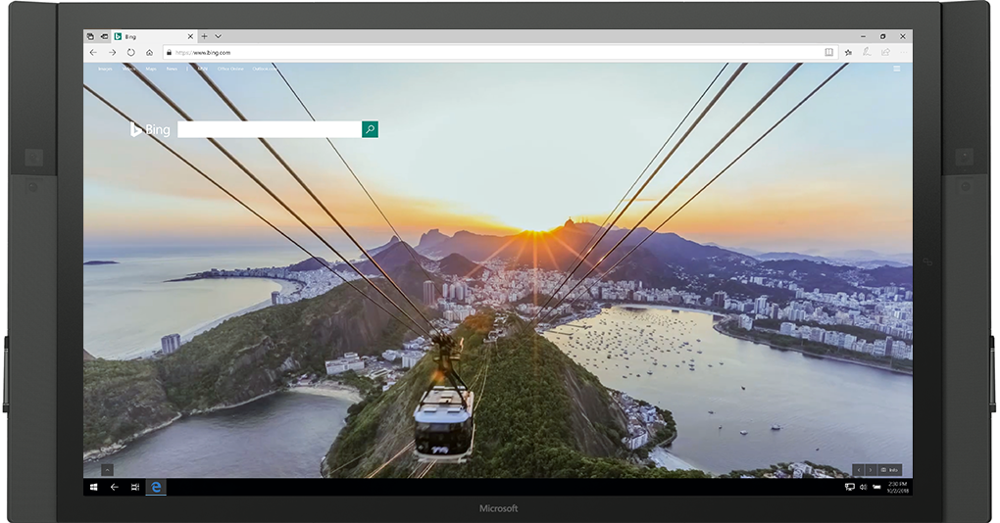

# Deploy Microsoft Edge kiosk mode

>Applies to: Microsoft Edge on Windows 10, version 1809

In the Windows 10 October 2018 Update, we added the capability to use Microsoft Edge as a kiosk (referred to as Microsoft Edge kiosk mode).  We added and updated Microsoft Edge group policies to enhance the kiosk experience depending on the Microsoft Edge kiosk mode type you configure. 

Microsoft Edge kiosk mode works with assigned access, which lets IT administrators create a tailored browsing experience designed for kiosk devices.  Assigned access prevents users from accessing the file system and running other apps from Microsoft Edge, such as the address bar or downloads. For example, you can configure Microsoft Edge to load only a single URL in full-screen mode when you configure digital/interactive signage on a single-app kiosk device. 

In addition to digital/interactive signage, you can configure Microsoft Edge for public browsing either on a single and multi-app kiosk device. Public browsing runs a multi-tab version of InPrivate browsing mode with limited functionality to run in full-screen mode or a normal version of Microsoft Edge. 

Both digital/interactive signage and public browsing help protect the user’s data by running Microsoft Edge with InPrivate browsing. In single-app public browsing, there is both an ‘End Session’ button that users click to end the browsing session or that resets the session after a specified time of user inactivity.  The idle timer is set to 5 minutes by default, but you can choose your own value.

In this topic, you learn about the different Microsoft Edge kiosk mode types to help you determine what configuration is best suited for your kiosk device. You also learn how to setup your Microsoft Edge kiosk mode experience. Learn more about [Configuring kiosk and shared devices running Windows desktop editions](https://docs.microsoft.com/en-us/windows/configuration/kiosk-shared-pc).

## Microsoft Edge kiosk types
Microsoft Edge kiosk mode supports **four** types, depending on how Microsoft Edge is set up in assigned access; single-app or multi-app kiosk. Learn more about [assigned access](https://docs.microsoft.com/en-us/windows-hardware/customize/enterprise/assigned-access).

### Single-app kiosk

When you set up Microsoft Edge kiosk mode in single-app assigned access, Microsoft Edge runs InPrivate either in full-screen or a limited multi-tab version for public browsing. For more details about setting up a single-app kiosk, see [Set up a kiosk or digital signage on Windows 10 Pro, Enterprise, or Education](https://docs.microsoft.com/en-us/windows/configuration/setup-kiosk-digital-signage).  

The single-app Microsoft Edge kiosk mode types include:

1. **Digital / Interactive signage** devices display a specific site in full-screen mode that runs InPrivate browsing mode. 

   - **Digital signage** does not require user interaction and best used for a rotating advertisement or menu.

   - **Interactive signage**, on the other hand, requires user interaction within the page but doesn’t allow for any other uses, such as browsing the internet. Use interactive signage for things like a building business directory or restaurant order/pay station.

2. **Public browsing** devices are publicly accessible and run a limited multi-tab version of InPrivate browsing in Microsoft Edge, which is the only app available on the device. Users can’t minimize, close, or open new Microsoft Edge windows or customize Microsoft Edge.
The single-app public browsing mode is the only kiosk mode that has an ‘End Session’ button that users click to end the browsing session and an idle timer that resets the session after a specified time of user inactivity.  Use the “Configure kiosk reset after idle timeout” policy to set the idle timer, which is set to 5 minutes by default, but you can provide your own value.
A public library or hotel concierge desk are two examples of public browsing that restricts access to only Microsoft Edge. 

    

### Multi-app kiosk
When you set up Microsoft Edge kiosk mode in multi-app assigned access, Microsoft Edge runs a limited multi-tab version of InPrivate or a normal browsing version.  For more details about running a multi-app kiosk, or fixed-purpose device, see [Create a Windows 10 kiosk that runs multiple apps](https://docs.microsoft.com/en-us/windows/configuration/lock-down-windows-10-to-specific-apps). Here you learn how to create kiosks that run more than one app and the benefits of a multi-app kiosk, or fixed-purpose device.

The multi-app Microsoft Edge kiosk mode types include:

3. **Public browsing** devices are publicly accessible and supports browsing the internet. Public browsing runs a multi-tab version of InPrivate browsing mode with limited functionality that runs in full-screen mode.
In this configuration, Microsoft Edge can interact with other applications. For example, if Internet Explorer 11 is set up in multi-app assigned access, you can enable Enterprise Mode to automatically switch users to Internet Explorer 11 for sites that need backward compatibility support.
A public library or hotel concierge desk are two examples of public browsing that provides access to Microsoft Edge and other apps.  

    

4. **Normal mode** devices run a full-featured version of Microsoft Edge (referred to as normal browsing).
Some features may not work depending on what other apps you have configured in assigned access. For example, if Internet Explorer 11 is set up in assigned access, you can enable Enterprise Mode to automatically switch users to Internet Explorer 11 for sites that need backward compatibility support.  

    

## Let’s get started!
Before you can configure Microsoft Edge kiosk mode, you must set up Microsoft Edge in assigned access. With assigned access, you restrict a local standard user account so that it only has access to one Windows app, such as Microsoft Edge in kiosk mode. You can set up Microsoft Edge kiosk mode in assigned access using:

-   **Windows Settings.** Best for physically setting up a single device as a kiosk.  You can configure Microsoft Edge in single-app (kiosk type – full-screen or public browsing) and define a single URL for the Home button, Start page, and New Tab page. You can also set the reset after an idle timeout. 

-   **Microsoft Intune or other MDM service.** Best for setting up multiple devices as a kiosk. With this method, you configure Microsoft Edge in assigned access and configure how Microsoft Edge behaves when it’s running in kiosk mode with assigned access.

    >[!NOTE]
    >For other MDM service, check with your provider for instructions.

-   **Windows PowerShell.** Best for setting up multiple devices as a kiosk. With this method, you can set up single-app or multi-app assigned access using a PowerShell script. For details, see For details, see [Set up a kiosk or digital sign using Windows PowerShell](https://docs.microsoft.com/en-us/windows/configuration/setup-kiosk-digital-signage#set-up-a-kiosk-or-digital-sign-using-windows-powershell). 

-   **Windows Configuration Designer.** Best for setting up multiple kiosk devices. Download and install both the latest version of the [Windows Assessment and Deployment Kit (ADK)](https://developer.microsoft.com/windows/hardware/windows-assessment-deployment-kit) and [Windows Configuration Manager](https://docs.microsoft.com/en-us/windows/configuration/provisioning-packages/provisioning-install-icd#install-windows-configuration-designer-1).

### Prerequisites

-  Microsoft Edge on Windows 10, version 1809 (Professional, Enterprise, and Education).

-  Configuration and deployment service, such as Windows PowerShell, Microsoft Intune or other MDM service, or Windows Configuration Designer.  With these methods, you must have the  [AppUserModelID](https://docs.microsoft.com/windows-hardware/customize/enterprise/find-the-application-user-model-id-of-an-installed-app); this does not apply to the Windows Settings method.

   >[!IMPORTANT]
   >If you are using a local account as a kiosk account in Intune or provisioning package, make sure to sign into this account and then sign out before configuring the assigned access single-app kiosk.

### Use Windows Settings 

Windows Settings is the simplest and easiest way to set up one or a couple of devices because you must perform these steps physically on each device. This method is ideal for small businesses.

1. In Windows Settings, type **kiosk** in the search field and select **Set up a kiosk (assigned access)**.

2. On the **Set up a kiosk** page, click **Get started**.

3. Type a name to create a new account or you can choose an existing account and click **Next**.

4. On the **Choose a kiosk app** page, select **Microsoft Edge** and then click **Next**.

5. Select how Microsoft Edge displays when running in kiosk mode:

    - **As a digital sign or interactive display**, the default URL shows in full screen, without browser controls.

    - **As a public browser**, the default URL shows in a browser view with limited browser controls.

6. Select **Next**.

7. Type the URL to load when the kiosk launches.

   >[!NOTE]
   >The URL sets the Home button, Start page, and New Tab page.

8. Accept the default value of **5 minutes** for the idle time or you can provide your own value.
Microsoft Edge in kiosk mode has a built-in timer to help keep data safe in public browsing sessions. When the idle time (no user activity) meets the time limit, a confirmation message prompts the user to continue. If **Continue** is not selected, Microsoft Edge resets to the default URL. 

9. Click **Next**.

10. Close the **Settings** window to save and apply your choices.

11. Now that you have configured assigned access, selected how Microsoft Edge displays the kiosk, and set the idle timer, you can configure the group policies for Microsoft Edge kiosk mode.

    >You can find the Microsoft Edge Group Policy settings in the following location of the Group Policy Editor:
    >
    >&nbsp;&nbsp;&nbsp;&nbsp;&nbsp;&nbsp;Computer Configuration\Administrative Templates\Windows Components\Microsoft Edge\
    >
    >- **[Configure kiosk mode](#configure-kiosk-mode):** Configure the display mode for Microsoft Edge as a kiosk app. You can control whether Microsoft Edge runs InPrivate full screen, InPrivate multi-tab with limited functionality, or normal Microsoft Edge. For this policy to work, you must configure assigned access; otherwise, Microsoft Edge ignores the settings in this policy.
    >- **[Configure kiosk reset after idle timeout](#configure-kiosk-reset-idle-timeout):** Change the time, in minutes, from the last user activity before Microsoft Edge kiosk mode resets to the default kiosk configuration. For this policy to work, you must enable the Configure kiosk mode policy (InPrivate public browsing) and configure Microsoft Edge as a single-app in assigned access; otherwise, Microsoft Edge ignores this setting. 
    >- **[Additional policies for kiosk mode](#additional-policies-for-kiosk-mode):** We have other new and existing policies that work with Microsoft Edge kiosk mode, such as Allow cookies, Allow printing, Configure Home button, and Configure telemetry for Microsoft 365 analytics.  At this time, only a few features work in all kiosk types, for example, Unlock Home button works only in normal browsing. 

12. Once configuring the group policies, restart the kiosk device and sign in with the local kiosk account to validate the Microsoft Edge kiosk mode configuration. 

**_Congratulations!_** You’ve just finished setting up Microsoft Edge in assigned access, and a kiosk or digital sign, and configured the group policies for Microsoft Edge kiosk mode.

**_Next steps._** 

|If you want to... |Then... |
|---|---|
|Use your new kiosk |Sign into the device with the kiosk account that you selected to run Microsoft Edge kiosk mode. |
|Make changes to your kiosk such as change the display option or the URL that loads |<ol><li>In Windows Settings, type **kiosk** in the search field and select **Set up a kiosk (assigned access)**.</li><li>On the **Set up a kiosk** page, make your changes to **Choose a kiosk mode** and **Set up Microsoft Edge**.</li></ol> |
---

### Use Microsoft Intune or other MDM service

With this method, you can use Microsoft Intune or other MDM services to configure Microsoft Edge kiosk mode in assigned access and how it behaves on a kiosk device.  

>[!IMPORTANT]
>If you are using a local account as a kiosk account in Intune or provisioning package, make sure to sign into this account and then sign out before configuring the assigned access single-app kiosk.

1.  In Microsoft Intune or other MDM service, configure [AssignedAccess](https://docs.microsoft.com/windows/client-management/mdm/assignedaccess-csp) to prevent users from accessing the file system, running executables, or other apps.

2.  Configure the following MDM settings to control a web browser app on the kiosk device and then restart the device.

    |   |   |
    |---|---|
    | **[ConfigureKioskMode](https://docs.microsoft.com/en-us/windows/client-management/mdm/policy-csp-browser#browser-configurekioskmode)**
 | Configure the display mode for Microsoft Edge as a kiosk app.

**URI full path:** ./Vendor/MSFT/Policy/Config/Browser/ConfigureKioskMode
**Data type:**  Integer
**Allowed values:**<ul><li>**Single-app kiosk experience**<ul><li>**0** - Digital signage and interactive display</li><li>**1** - InPrivate Public browsing</li></ul></li><li>**Multi-app kiosk experience**<ul><li>**0** - Normal Microsoft Edge running in assigned access</li><li>**1** - InPrivate public browsing with other apps</li></ul></li></ul> |
    | **[ConfigureKioskResetAfterIdleTimeout](https://docs.microsoft.com/en-us/windows/client-management/mdm/policy-csp-browser#browser-configurekioskresetafteridletimeout)**
 | Change the time in minutes from the last user activity before Microsoft Edge kiosk mode resets to the default kiosk configuration.

**URI full path:** ./Vendor/MSFT/Policy/Config/Browser/ConfigureKioskResetAfterIdleTimeout
**Data type:** Integer
**Allowed values:**<ul><li>**0** - No idle timer</li><li>**1-1440 (5 minutes is the default)** - Set reset on idle timer</li></ul>  |
    | **[HomePages](https://docs.microsoft.com/en-us/windows/client-management/mdm/policy-csp-browser#browser-homepages)**
  | Set one or more start pages, URLs, to load when Microsoft Edge launches.

**URI full path:** ./Vendor/MSFT/Policy/Config/Browser/HomePages
**Data type:** String
**Allowed values:**
Enter one or more URLs, for example, &nbsp;&nbsp;&nbsp;\<https://www.msn.com\>\<https:/www.bing.com\>  |
    | **[ConfigureHomeButton](https://docs.microsoft.com/en-us/windows/client-management/mdm/policy-csp-browser#browser-configurehomebutton)**
  | Configure how the Home Button behaves.

**URI full path:** ./Vendor/MSFT/Policy/Config/Browser/ConfigureHomeButton
**Data type:** Integer
 **Allowed values:**<ul><li>**0 (default)** - Not configured. Show home button, and load the default Start page.</li><li>**1** - Enabled. Show home button and load New Tab page</li><li>**2** - Enabled. Show home button & set a specific page.</li><li>**3** - Enabled. Hide the home button.</li></ul>   |
    | **[SetHomeButtonURL](https://docs.microsoft.com/en-us/windows/client-management/mdm/policy-csp-browser#browser-sethomebuttonurl)**
    | If you set ConfigureHomeButton to 2, configure the home button URL.

**URI full path:** ./Vendor/MSFT/Policy/Config/Browser/SetHomeButtonURL 
**Data type:** String
**Allowed values:** Enter a URL, for example, https://www.bing.com    |
    | **[SetNewTabPageURL](https://docs.microsoft.com/en-us/windows/client-management/mdm/policy-csp-browser#browser-setnewtabpageurl)**
   | Set a custom URL for the New Tab page.

**URI full path:** ./Vendor/MSFT/Policy/Config/Browser/SetNewTabPageURL 
**Data type:** String
**Allowed values:** Enter a URL, for example, https://www.msn.com      |
    ---
 

**_Congratulations!_** You’ve just finished setting up a kiosk or digital signage and configuring group policies for Microsoft Edge kiosk mode using Microsoft Intune or other MDM service.

**_Next steps._** Use your new kiosk. Sign in to the device using the user account that you selected to run the kiosk app.

### Use a provisioning package 

With this method, you can use a provisioning package to configure Microsoft Edge kiosk mode in assigned access. After you set up the provisioning package for configuring Microsoft Edge in assigned access, you configure how Microsoft Edge behaves on a kiosk device. 

>[!IMPORTANT]
>If you are using a local account as a kiosk account in Intune or provisioning package, make sure to sign into this account and then sign out before configuring the assigned access single-app kiosk.

1. Open Windows Configuration Designer to create a provisioning package and configure Microsoft Edge in assigned access. 

2. After creating the provisioning package and configuring assigned access, and before you build the package, switch to the advanced editor.

3. Navigate to **Runtime settings \> Policies \> Browser** and set the following policies:

    |   |   |
    |---|---|
    | **[ConfigureKioskMode](https://docs.microsoft.com/en-us/windows/client-management/mdm/policy-csp-browser#browser-configurekioskmode)**
 | Configure the display mode for Microsoft Edge as a kiosk app.

**URI full path:** ./Vendor/MSFT/Policy/Config/Browser/ConfigureKioskMode
**Data type:**  Integer
**Allowed values:**<ul><li>**Single-app kiosk experience**<ul><li>**0** - Digital signage and interactive display</li><li>**1** - InPrivate Public browsing</li></ul></li><li>**Multi-app kiosk experience**<ul><li>**0** - Normal Microsoft Edge running in assigned access</li><li>**1** - InPrivate public browsing with other apps</li></ul></li></ul> |
    | **[ConfigureKioskResetAfterIdleTimeout](https://docs.microsoft.com/en-us/windows/client-management/mdm/policy-csp-browser#browser-configurekioskresetafteridletimeout)**
 | Change the time in minutes from the last user activity before Microsoft Edge kiosk mode resets to the default kiosk configuration.

**URI full path:** ./Vendor/MSFT/Policy/Config/Browser/ConfigureKioskResetAfterIdleTimeout
**Data type:** Integer
**Allowed values:**<ul><li>**0** - No idle timer</li><li>**1-1440 (5 minutes is the default)** - Set reset on idle timer</li></ul>  |
    | **[HomePages](https://docs.microsoft.com/en-us/windows/client-management/mdm/policy-csp-browser#browser-homepages)**
  | Set one or more start pages, URLs, to load when Microsoft Edge launches.

**URI full path:** ./Vendor/MSFT/Policy/Config/Browser/HomePages
**Data type:** String
**Allowed values:**
Enter one or more URLs, for example, &nbsp;&nbsp;&nbsp;\<https://www.msn.com\>\<https:/www.bing.com\>  |
    | **[ConfigureHomeButton](https://docs.microsoft.com/en-us/windows/client-management/mdm/policy-csp-browser#browser-configurehomebutton)**
  | Configure how the Home Button behaves.

**URI full path:** ./Vendor/MSFT/Policy/Config/Browser/ConfigureHomeButton
**Data type:** Integer
 **Allowed values:**<ul><li>**0 (default)** - Not configured. Show home button, and load the default Start page.</li><li>**1** - Enabled. Show home button and load New Tab page</li><li>**2** - Enabled. Show home button & set a specific page.</li><li>**3** - Enabled. Hide the home button.</li></ul>   |
    | **[SetHomeButtonURL](https://docs.microsoft.com/en-us/windows/client-management/mdm/policy-csp-browser#browser-sethomebuttonurl)**
    | If you set ConfigureHomeButton to 2, configure the home button URL.

**URI full path:** ./Vendor/MSFT/Policy/Config/Browser/SetHomeButtonURL 
**Data type:** String
**Allowed values:** Enter a URL, for example, https://www.bing.com    |
    | **[SetNewTabPageURL](https://docs.microsoft.com/en-us/windows/client-management/mdm/policy-csp-browser#browser-setnewtabpageurl)**
   | Set a custom URL for the New Tab page.

**URI full path:** ./Vendor/MSFT/Policy/Config/Browser/SetNewTabPageURL 
**Data type:** String
**Allowed values:** Enter a URL, for example, https://www.msn.com      |
    ---

4. After you’ve configured the Microsoft Edge kiosk mode policies, including any of the related policies, it’s time to build the package.

5. Click **Finish**.
The wizard closes and takes you back to the Customizations page.

6. Apply the provisioning package to the device, which you can do during the first-run experience (out-of-box experience or OOBE) and after (runtime). For more details, see [Apply a provisioning package](https://docs.microsoft.com/en-us/windows/configuration/provisioning-packages/provisioning-apply-package).

**_Congratulations!_** You’ve finished creating your provisioning package for Microsoft Edge kiosk mode.

**_Next steps._** Use your new kiosk. Sign in to the device using the user account that you selected to run the kiosk app.

---

## Relevant policies
We added and updated Microsoft Edge group policies to enhance the kiosk experience depending on the Microsoft Edge kiosk mode type you configure.

### Configure kiosk mode
[!INCLUDE [configure-microsoft-edge-kiosk-mode-include](includes/configure-microsoft-edge-kiosk-mode-include.md)]

### Configure kiosk reset idle timeout
[!INCLUDE [configure-edge-kiosk-reset-idle-timeout-include](includes/configure-edge-kiosk-reset-idle-timeout-include.md)]

### Additional policies for kiosk mode

Use any of the Microsoft Edge policies listed below to enhance the kiosk experience depending on the Microsoft Edge kiosk mode type you configure. To learn more about these policies, see [Policy CSP - Browser](https://docs.microsoft.com/en-us/windows/client-management/mdm/policy-csp-browser).

| **MDM Setting**  | **Digital / Interactive signage** | **Public browsing single-app** | **Public browsing multi-app**   | **Normal mode**   |
|------------------|:---------:|:---------:|:---------:|:---------:|
| [AllowAddressBarDropdown](https://docs.microsoft.com/en-us/windows/client-management/mdm/policy-csp-browser#browser-allowaddressbardropdown)    |    |    |     |    |
| [AllowAutofill](https://docs.microsoft.com/en-us/windows/client-management/mdm/policy-csp-browser#browser-allowautofill)                                                          |    |    |     |    |
| [AllowBrowser](https://docs.microsoft.com/en-us/windows/client-management/mdm/policy-csp-browser#browser-allowbrowser)                                                           |    |    |     |  |
| [AllowConfigurationUpdateForBooksLibrary](https://docs.microsoft.com/en-us/windows/client-management/mdm/policy-csp-browser#browser-allowconfigurationupdateforbookslibrary)                                |    |    |     |    |
| [AllowCookies](https://docs.microsoft.com/en-us/windows/client-management/mdm/policy-csp-browser#browser-allowcookies)                                                           |      |      |       |    |
| [AllowDeveloperTools](https://docs.microsoft.com/en-us/windows/client-management/mdm/policy-csp-browser#browser-allowdevelopertools)                                                    |    |    |     |    |
| [AllowDoNotTrack](https://docs.microsoft.com/en-us/windows/client-management/mdm/policy-csp-browser#browser-allowdonottrack)                                                        |  |  |   |    |
| [AllowExtensions](https://docs.microsoft.com/en-us/windows/client-management/mdm/policy-csp-browser#browser-allowextensions)                                                        |    |    |     |    |
| [AllowFlash](https://docs.microsoft.com/en-us/windows/client-management/mdm/policy-csp-browser#browser-allowflash)                                                             |      |      |       |    |
| [AllowFlashClickToRun](https://docs.microsoft.com/en-us/windows/client-management/mdm/policy-csp-browser#browser-allowflashclicktorun)                                                   | 2    |      |       |    |
| [AllowFullscreen](https://docs.microsoft.com/en-us/windows/client-management/mdm/policy-csp-browser#browser-allowfullscreenmode)\*                                                   |    |      |       |    |
| [AllowInPrivate](https://docs.microsoft.com/en-us/windows/client-management/mdm/policy-csp-browser#browser-allowinprivate)                                                         |    |    |     |    |
| [AllowMicrosoftCompatibilityList](https://docs.microsoft.com/en-us/windows/client-management/mdm/policy-csp-browser#browser-allowmicrosoftcompatibilitylist)                                        |    |    | 1 |    |
| [AllowPasswordManager](https://docs.microsoft.com/en-us/windows/client-management/mdm/policy-csp-browser#browser-allowpasswordmanager)                                                   |    |    |     |    |
| [AllowPopups](https://docs.microsoft.com/en-us/windows/client-management/mdm/policy-csp-browser#browser-allowpopups)                                                            |  |      |       |    |
| [AllowPrelaunch](https://docs.microsoft.com/en-us/windows/client-management/mdm/policy-csp-browser#browser-allowprelaunch)\*                                                      |    |    |     |    |
| [AllowPrinting](https://docs.microsoft.com/en-us/windows/client-management/mdm/policy-csp-browser#browser-allowprinting)\*                                                        |      |      |       |    |
| [AllowSavingHistory](https://docs.microsoft.com/en-us/windows/client-management/mdm/policy-csp-browser#browser-allowsavinghistory)\*                                                   |    |    |     |    |
| [AllowSearchEngineCustomization](https://docs.microsoft.com/en-us/windows/client-management/mdm/policy-csp-browser#browser-allowsearchenginecustomization)                                         |    |    |     |    |
| [AllowSearchSuggestionsinAddressBar](https://docs.microsoft.com/en-us/windows/client-management/mdm/policy-csp-browser#browser-allowsearchenginecustomization)                                     |    |      |       |    |
| [AllowSideloadingExtensions](https://docs.microsoft.com/en-us/windows/client-management/mdm/policy-csp-browser#browser-allowsideloadingofextensions)\*                                         |    |    |     |    |
| [AllowSmartScreen](https://docs.microsoft.com/en-us/windows/client-management/mdm/policy-csp-browser#browser-allowsmartscreen)                                                       |      |      |       |    |
| [AllowSyncMySettings](https://docs.microsoft.com/en-us/windows/client-management/mdm/policy-csp-experience#experience-allowsyncmysettings)                                                    |    |    |    |    |
| [AllowTabPreloading](https://docs.microsoft.com/en-us/windows/client-management/mdm/policy-csp-browser#browser-allowtabpreloading)\*                                                   |    |    |     |    |
| [AllowWebContentOnNewTabPage](https://docs.microsoft.com/en-us/windows/client-management/mdm/policy-csp-browser#browser-allowwebcontentonnewtabpage)\*                                          |    |    |     |    |
| [AlwaysEnabledBooksLibrary](https://docs.microsoft.com/en-us/windows/client-management/mdm/policy-csp-browser#browser-alwaysenablebookslibrary)                                              |    |    |     |    |
| [ClearBrowsingDataOnExit](https://docs.microsoft.com/en-us/windows/client-management/mdm/policy-csp-browser#browser-clearbrowsingdataonexit)                                                |    |    |     |    |
| [ConfigureAdditionalSearchEngines](https://docs.microsoft.com/en-us/windows/client-management/mdm/policy-csp-browser#browser-configureadditionalsearchengines)                                       |    |      |       |    |
| [ConfigureFavoritesBar](https://docs.microsoft.com/en-us/windows/client-management/mdm/policy-csp-browser#browser-configurefavoritesbar)\*                                                |    |      |       |    |
| [ConfigureHomeButton](https://docs.microsoft.com/en-us/windows/client-management/mdm/policy-csp-browser#browser-configurehomebutton)\*                                                  |      |      |       |    |
|  [ConfigureKioskMode](https://docs.microsoft.com/en-us/windows/client-management/mdm/policy-csp-browser#browser-configurekioskmode)\*                                                  |      |      |       |    |
|  [ConfigureKioskResetAfterIdleTimeout](https://docs.microsoft.com/en-us/windows/client-management/mdm/policy-csp-browser#browser-configurekioskresetafteridletimeout)\*                                 |    |      |     |  |
| [ConfigureOpenEdgeWith](https://docs.microsoft.com/en-us/windows/client-management/mdm/policy-csp-browser#browser-configureopenmicrosoftedgewith)\*                                       |      |      |       |    |
| [ConfigureTelemetryForMicrosoft365Analytics](https://docs.microsoft.com/en-us/windows/client-management/mdm/policy-csp-browser#browser-configuretelemetryformicrosoft365analytics)\*                           |      |      |       |    |
| [DisableLockdownOfStartPages](https://docs.microsoft.com/en-us/windows/client-management/mdm/policy-csp-browser#browser-disablelockdownofstartpages)                                            |    |    |     |    |
| [Experience/DoNotSyncBrowserSettings](https://docs.microsoft.com/en-us/windows/client-management/mdm/policy-csp-experience#experience-donotsyncbrowsersetting)\* and [Experience/PreventTurningOffRequiredExtensions](https://docs.microsoft.com/en-us/windows/client-management/mdm/policy-csp-browser#browser-preventturningoffrequiredextensions)\* |    |    |    |    |
| [EnableExtendedBooksTelemetry](https://docs.microsoft.com/en-us/windows/client-management/mdm/policy-csp-browser#browser-enableextendedbookstelemetry)                                           |    |    |     |    |
| [EnterpriseModeSiteList](https://docs.microsoft.com/en-us/windows/client-management/mdm/policy-csp-browser#browser-enterprisemodesitelist)                                                 |    |    | 1 |    |
| [FirstRunURL](https://docs.microsoft.com/en-us/windows/client-management/mdm/policy-csp-browser#browser-firstrunurl)                                                            |    |    |     |  |
| [HomePages](https://docs.microsoft.com/en-us/windows/client-management/mdm/policy-csp-browser#browser-homepages)                                                              |      |      |       |    |
| [LockdownFavorites](https://docs.microsoft.com/en-us/windows/client-management/mdm/policy-csp-browser#browser-lockdownfavorites)                                                      |    |      |       |    |
| [PreventAccessToAboutFlagsInMicrosoftEdge](https://docs.microsoft.com/en-us/windows/client-management/mdm/policy-csp-browser#browser-preventaccesstoaboutflagsinmicrosoftedge)                               |    |      |       |    |
| [PreventCertErrorOverrides](https://docs.microsoft.com/en-us/windows/client-management/mdm/policy-csp-browser#browser-preventcerterroroverrides)\*                                            |      |      |       |    |
| [PreventFirstRunPage](https://docs.microsoft.com/en-us/windows/client-management/mdm/policy-csp-browser#browser-preventfirstrunpage)                                                    |  | |   |    |
| [PreventLiveTileDataCollection](https://docs.microsoft.com/en-us/windows/client-management/mdm/policy-csp-browser#browser-preventlivetiledatacollection)                                          |    |    |     |    |
| [PreventSmartScreenPromptOverride](https://docs.microsoft.com/en-us/windows/client-management/mdm/policy-csp-browser#browser-preventsmartscreenpromptoverride)                                       |      |      |       |    |
| [PreventSmartScreenPromptOverrideForFiles](https://docs.microsoft.com/en-us/windows/client-management/mdm/policy-csp-browser#browser-preventsmartscreenpromptoverrideforfiles)                               |      |      |       |    |
| [PreventTurningOffRequiredExtensions](https://docs.microsoft.com/en-us/windows/client-management/mdm/policy-csp-browser#browser-preventturningoffrequiredextensions)\*                                  |      |      |       |    |
| [PreventUsingLocalHostIPAddressForWebRTC](https://docs.microsoft.com/en-us/windows/client-management/mdm/policy-csp-browser#browser-preventusinglocalhostipaddressforwebrtc)                               |                                             |                                             |                                              |    |
| [ProvisionFavorites](https://docs.microsoft.com/en-us/windows/client-management/mdm/policy-csp-browser#browser-provisionfavorites)                                                     |    |      |       |    |
| [SendIntranetTraffictoInternetExplorer](https://docs.microsoft.com/en-us/windows/client-management/mdm/policy-csp-browser#browser-sendintranettraffictointernetexplorer)                                  |    |    | 1         |    |
| [SetDefaultSearchEngine](https://docs.microsoft.com/en-us/windows/client-management/mdm/policy-csp-browser#browser-setdefaultsearchengine)                                                 |    |      |       |    |
| [SetHomeButtonURL](https://docs.microsoft.com/en-us/windows/client-management/mdm/policy-csp-browser#browser-sethomebuttonurl)\*                                                     |    |      |       |    |
| [SetNewTabPageURL](https://docs.microsoft.com/en-us/windows/client-management/mdm/policy-csp-browser#browser-setnewtabpageurl)\*                                                     |    |      |       |    |
| [ShowMessageWhenOpeningInteretExplorerSites](https://docs.microsoft.com/en-us/windows/client-management/mdm/policy-csp-browser#browser-showmessagewhenopeningsitesininternetexplorer)                             |    |      | 1 |    |
| [SyncFavoritesBetweenIEAndMicrosoftEdge](https://docs.microsoft.com/en-us/windows/client-management/mdm/policy-csp-browser#browser-syncfavoritesbetweenieandmicrosoftedge)                                 |    |    | 1  |    |
| [UnlockHomeButton](https://docs.microsoft.com/en-us/windows/client-management/mdm/policy-csp-browser#browser-unlockhomebutton)\*                                                     |    |    |     |    |
| [UseSharedFolderForBooks](https://docs.microsoft.com/en-us/windows/client-management/mdm/policy-csp-browser#browser-usesharedfolderforbooks)                                               |    |    |     |    |
---

*\* New policy as of Windows 10, version 1809.*

*1) For multi-app assigned access, you must configure Internet Explorer 11.* 
*2) For digital/interactive signage to enable Flash, set [AllowFlashClickToRun].(https://docs.microsoft.com/en-us/windows/client-management/mdm/policy-csp-browser#browser-allowflashclicktorun) to 0.*

**Legend:**

&nbsp;&nbsp;&nbsp;&nbsp;&nbsp;&nbsp;  = Not applicable or not supported  
&nbsp;&nbsp;&nbsp;&nbsp;&nbsp;&nbsp;  = Supported

---

## Related topics

-  **[Set up a kiosk or digital signage on Windows 10 Pro, Enterprise, or Education](https://docs.microsoft.com/en-us/windows/configuration/setup-kiosk-digital-signage)**: Learn about the different methods to configuring your kiosks and digitals signs.  Also, learn about the settings you can use to lock down the kiosk for a more secure kiosk experience.

-   **[Create a Kiosk Experience](https://docs.microsoft.com/en-us/windows-hardware/customize/enterprise/create-a-kiosk-image):** Learn how to set up single-function kiosk devices, such as restaurant menus, and optional features for a welcome screen or power button availability. Also, learn how to create a multi-app kiosk, or fixed-purpose device, to provide an easy-to-understand experience giving users the things they need to use.

-   **[Configure a Windows 10 kiosk that runs multiple apps](https://aka.ms/Ckmq4n):** Learn how to create kiosks that run more than one app and the benefits of a multi-app kiosk, or fixed-purpose device.

-   **[Kiosk apps for assigned access best practices](https://aka.ms/H1s8y4):** In Windows 10, you can use assigned access to create a kiosk device, which enables users to interact with just a single Universal Windows app. Learn about the best practices for implementing a kiosk app.

-   **[Guidelines for choosing an app for assigned access (kiosk mode)](https://aka.ms/Ul7dw3):** Assigned access restricts a local standard user account on the device so that it only has access to a single-function device, like a kiosk. Learn about the guidelines for choosing a Windows app, web browsers, and securing your information. Also, learn about additional configurations required for some apps before it can work properly in assigned access.

-   **[Other settings to lock down](https://docs.microsoft.com/en-us/windows/configuration/setup-kiosk-digital-signage#other-settings-to-lock-down):** Learn how to configure a more secure kiosk experience. In addition to the settings, learn how to set up **automatic logon** for your kiosk device. For example, when the kiosk device restarts, you can log back into the device manually or by setting up automatic logon.

-   **[Add apps to Microsoft Intune](https://docs.microsoft.com/en-us/intune/apps-add):** Learn about and understand a few app fundamentals and requirements before adding them to Intune and making them available to your users.

-   **[AssignedAccess configuration service provider (CSP)](https://docs.microsoft.com/en-us/windows/client-management/mdm/assignedaccess-csp):** The AssignedAccess configuration service provider (CSP) sets the device to run in kiosk mode. Once the CSP has executed, then the next user login associated with the kiosk mode puts the device into the kiosk mode running the application specified in the CSP configuration.

-   **[Create a provisioning page for Windows 10](https://docs.microsoft.com/en-us/windows/configuration/provisioning-packages/provisioning-create-package):** Learn to use Windows Configuration Designer (WCD) to create a provisioning package (.ppkg) for configuring devices running Windows 10. The WCD wizard options provide a simple interface to configure desktop, mobile, and kiosk device settings.

---

## Provide feedback or get support

To provide feedback on Microsoft Edge kiosk mode in Feedback Hub, select **Microsoft Edge** as the  **Category**, and **All other issues** as the subcategory. 

**_For multi-app kiosk only._** If you have set up the Feedback Hub in assigned access, you can you submit the feedback from the device running Microsoft Edge in kiosk mode in which you can include diagnostic logs. In the Feedback Hub, select **Microsoft Edge** as the **Category**, and **All other issues** as the subcategory.

---

## Feature comparison of kiosk mode and kiosk browser app
In the following table, we show you the features available in both Microsoft Edge kiosk mode and Kiosk Browser app available in Microsoft Store. Both kiosk mode and kiosk browser app work in assigned access.

| **Feature**   | **Microsoft Edge kiosk mode**  | **Kiosk Browser**    |
|---------------|:----------------:|:---------------:|
| Print support   |    |    |
| Multi-tab support    |    |    |
| Allow URL support    |  
*\*For Microsoft Edge kiosk mode use* [Windows Defender Firewall](#_*Windows_Defender_Firewall)*. Microsoft kiosk browser has custom policy support.* |   |
| Block URL support    | 
*\*For Microsoft Edge kiosk mode use* [Windows Defender Firewall](#_*Windows_Defender_Firewall)*. Microsoft kiosk browser has custom policy support.* |      |
| Configure Home Button   |    |       |
| Set Start page(s) URL    |       |  
*Same as Home button URL*     |
| Set New Tab page URL  |     |    |
| Favorites management     |      |  |
| End session button    |    | 
*In Intune, must create custom URI to enable. Dedicated UI configuration targeted for 1808.* |
| Reset on inactivity  |  |    |
| Internet Explorer integration (Enterprise Mode site list) | 
*Multi-app mode only*  |      |
---

**\*Windows Defender Firewall**

To prevent access to unwanted websites on your kiosk device, use Windows Defender Firewall to configure a list of allowed websites, blocked websites or both.  For more details, see [Windows Defender Firewall with Advanced Security Deployment](https://docs.microsoft.com/en-us/windows/security/identity-protection/windows-firewall/windows-firewall-with-advanced-security-deployment-guide).

---