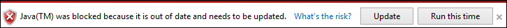
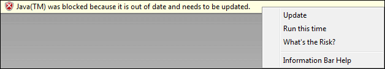
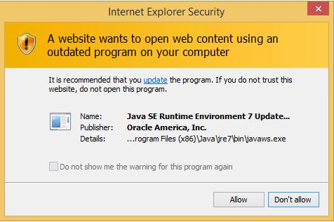

# Out-of-date ActiveX control blocking

**Last updated**

-   November 12, 2015

**Applies to:**

-   Windows 10
-   Windows 8.1
-   Windows 7
-   Windows Server 2012 R2
-   Windows Server 2008 R2 with Service Pack 1 (SP1)
-   Windows Vista SP2

ActiveX controls are small apps that let websites provide content, like videos, games, and let you interact with content like toolbars. Unfortunately, because many ActiveX controls aren’t automatically updated, they can become outdated as new versions are released. It’s very important that you keep your ActiveX controls up-to-date because malicious software (or malware) can target security flaws in outdated controls, damaging your computer by collecting info from it, installing unwanted software, or by letting someone else control it remotely. To help avoid this situation, Internet Explorer includes a new security feature, called *out-of-date ActiveX control blocking*.

Out-of-date ActiveX control blocking lets you:

-   Know when IE prevents a webpage from loading common, but outdated ActiveX controls.

-   Interact with other parts of the webpage that aren’t affected by the outdated control.

-   Update the outdated control, so that it’s up-to-date and safer to use.

The out-of-date ActiveX control blocking feature works with all [Security Zones](http://go.microsoft.com/fwlink/?LinkId=403863), except the Local Intranet Zone and the Trusted Sites Zone.

It also works with these operating system and IE combinations:

<table>
<colgroup>
<col width="50%" />
<col width="50%" />
</colgroup>
<thead>
<tr class="header">
<th align="left">Windows operating system</th>
<th align="left">IE version</th>
</tr>
</thead>
<tbody>
<tr class="odd">
<td align="left">
Windows 10
</td>
<td align="left">
All supported versions of IE.

Microsoft Edge doesn't support ActiveX controls.
</td>
</tr>
<tr class="even">
<td align="left">
Windows 8.1 and Windows 8.1 Update
</td>
<td align="left">
All supported versions of IE.
</td>
</tr>
<tr class="odd">
<td align="left">
Windows 7 SP1
</td>
<td align="left">
All supported versions of IE.
</td>
</tr>
<tr class="even">
<td align="left">
Windows Server 2012
</td>
<td align="left">
All supported versions of IE.
</td>
</tr>
<tr class="odd">
<td align="left">
Windows Server 2008 R2 SP1
</td>
<td align="left">
All supported versions of IE.
</td>
</tr>
<tr class="even">
<td align="left">
Windows Server 2008 SP2
</td>
<td align="left">
Windows Internet Explorer 9 only
</td>
</tr>
<tr class="even">
<td align="left">
Windows Vista SP2
</td>
<td align="left">
Windows Internet Explorer 9 only
</td>
</tr>
</tbody>
</table>

 

For more info about this new feature, see [Internet Explorer begins blocking out-of-date ActiveX controls](http://go.microsoft.com/fwlink/?LinkId=507691) blog. To see the complete list of out-of-date Active controls blocked by this feature, go [here](http://go.microsoft.com/fwlink/?LinkId=517023).

## What does the out-of-date ActiveX control blocking notification look like?

When IE blocks an outdated ActiveX control, you’ll see a notification bar similar to this, depending on your version of IE:

**Internet Explorer 9 through Internet Explorer 11**

**Windows Internet Explorer 8**

Out-of-date ActiveX control blocking also gives you a security warning that tells you if a webpage tries to launch specific outdated apps, outside of IE:

## How do I fix an outdated ActiveX control or app?

From the notification about the outdated ActiveX control, you can go to the control’s website to download its latest version.

**To get the updated ActiveX control**

1.  From the notification bar, tap or click **Update**.

    IE opens the ActiveX control’s website.

2.  Download the latest version of the control.

**Security Note:  **

If you don’t fully trust a site, you shouldn’t allow it to load an outdated ActiveX control. However, although we don’t recommend it, you can view the missing webpage content by tapping or clicking **Run this time**. This option runs the ActiveX control without updating or fixing the problem. The next time you visit a webpage running the same outdated ActiveX control, you’ll get the notification again.

**To get the updated app**

1.  From the security warning, tap or click **Update** link.

    IE opens the app’s website.

2.  Download the latest version of the app.

**Security Note:  **

If you don’t fully trust a site, you shouldn’t allow it to launch an outdated app. However, although we don’t recommend it, you can let the webpage launch the app by tapping or clicking **Allow**. This option opens the app without updating or fixing the problem. The next time you visit a webpage running the same outdated app, you’ll get the notification again.

## How does IE decide which ActiveX controls to block?

IE uses Microsoft’s versionlist.xml file to determine whether an ActiveX control should be stopped from loading. This file is updated with newly-discovered out-of-date ActiveX controls, which IE automatically downloads to your local copy of the file.

You can see your copy of the versionlist.xml file here `%LOCALAPPDATA%\Microsoft\Internet Explorer\VersionManager\versionlist.xml`, or you can view Microsoft’s version at [Internet Explorer version list](http://go.microsoft.com/fwlink/?LinkId=403864).

**Security Note:  **

Although we strongly recommend against it, if you don’t want your computer to automatically download the updated version list from Microsoft, run the following command from a command prompt:

`reg add "HKCU\Software\Microsoft\Internet Explorer\VersionManager" /v DownloadVersionList /t REG_DWORD /d 0 /f`

Turning off this automatic download breaks the out-of-date ActiveX control blocking feature by not letting the version list update with newly outdated controls, potentially compromising the security of your computer. Use this configuration option at your own risk.

## Out-of-date ActiveX control blocking on managed devices

Out-of-date ActiveX control blocking includes 4 new Group Policy settings that you can use to manage your web browser configuration, based on your domain controller. You can download the administrative templates, including the new settings, from the [Administrative Templates for Internet Explorer](http://go.microsoft.com/fwlink/?LinkId=444484) page.

### Group Policy settings

Here’s a list of the new Group Policy info, including the settings, location, requirements, and Help text strings. All of these settings can be set in either the Computer Configuration or User Configuration scope, but Computer Configuration takes precedence over User Configuration.

**Important**  
Out-of-date ActiveX control blocking is turned off in the Local Intranet Zone; therefore, intranet websites and line-of-business apps will continue to use out-of-date ActiveX controls without disruption.

 

<table>
<colgroup>
<col width="25%" />
<col width="25%" />
<col width="25%" />
<col width="25%" />
</colgroup>
<thead>
<tr class="header">
<th align="left">Setting</th>
<th align="left">Category path</th>
<th align="left">Supported on</th>
<th align="left">Help text</th>
</tr>
</thead>
<tbody>
<tr class="odd">
<td align="left">
Turn on ActiveX control logging in IE
</td>
<td align="left">
Administrative Templates\Windows Components\Internet Explorer\Security Features\Add-on Management
</td>
<td align="left">
Internet Explorer 8 through IE11
</td>
<td align="left">
This setting determines whether IE saves log information for ActiveX controls.

If you enable this setting, IE logs ActiveX control information (including the source URI that loaded the control and whether it was blocked) to a local file.

If you disable or don't configure this setting, IE won't log ActiveX control information.

Note that you can turn this setting on or off regardless of the <strong>Turn off blocking of outdated ActiveX controls for IE</strong> or <strong>Turn off blocking of outdated ActiveX controls for IE on specific domains</strong> settings.
</td>
</tr>
<tr class="even">
<td align="left">
Remove the <strong>Run this time</strong> button for outdated ActiveX controls in IE
</td>
<td align="left">
Administrative Templates\Windows Components\Internet Explorer\Security Features\Add-on Management
</td>
<td align="left">
Internet Explorer 8 through IE11
</td>
<td align="left">
This setting allows you stop users from seeing the <strong>Run this time</strong> button and from running specific outdated ActiveX controls in IE.

If you enable this setting, users won't see the <strong>Run this time</strong> button on the warning message that appears when IE blocks an outdated ActiveX control.

If you disable or don't configure this setting, users will see the <strong>Run this time</strong> button on the warning message that appears when IE blocks an outdated ActiveX control. Clicking this button lets the user run the outdated ActiveX control once.
</td>
</tr>
<tr class="odd">
<td align="left">
Turn off blocking of outdated ActiveX controls for IE on specific domains
</td>
<td align="left">
Administrative Templates\Windows Components\Internet Explorer\Security Features\Add-on Management
</td>
<td align="left">
Internet Explorer 8 through IE11
</td>
<td align="left">
This setting allows you to manage a list of domains on which IE will stop blocking outdated ActiveX controls. Outdated ActiveX controls are never blocked in the Intranet Zone.

If you enable this setting, you can enter a custom list of domains for which outdated ActiveX controls won't be blocked in IE. Each domain entry must be formatted like one of the following:

<ul>
<li>
<strong>&quot;domainname.TLD&quot;.</strong> For example, if you want to include *.contoso.com/*, use &quot;contoso.com&quot;.
</li>
<li>
<strong>&quot;hostname&quot;.</strong> For example, if you want to include http://example, use &quot;example&quot;.
</li>
<li>
<strong>&quot;file:///path/filename.htm&quot;.</strong> For example, use file:///C:/Users/contoso/Desktop/index.htm.
</li>
</ul>

If you disable or don't configure this setting, the list is deleted and IE continues to block specific outdated ActiveX controls on all domains in the Internet Zone.
</td>
</tr>
<tr class="even">
<td align="left">
Turn off blocking of outdated ActiveX controls for IE
</td>
<td align="left">
Administrative Templates\Windows Components\Internet Explorer\Security Features\Add-on Management
</td>
<td align="left">
Internet Explorer 8 through IE11
</td>
<td align="left">
This setting determines whether IE blocks specific outdated ActiveX controls. Outdated ActiveX controls are never blocked in the Intranet Zone.

If you enable this setting, IE stops blocking outdated ActiveX controls.

If you disable or don't configure this setting, IE continues to block specific outdated ActiveX controls.
</td>
</tr>
<tr class="odd">
<td align="left">
Remove the <strong>Update</strong> button in the out-of-date ActiveX control blocking notification for IE
</td>
<td align="left">
This functionality is only available through the registry
</td>
<td align="left">
Internet Explorer 8 through IE11
</td>
<td align="left">
This setting determines whether the out-of-date ActiveX control blocking notification shows the <strong>Update</strong> button. This button points users to update specific out-of-date ActiveX controls in IE.
</td>
</tr>
</tbody>
</table>

 

If you don't want to use Group Policy, you can also turn these settings on or off using the registry. You can update the registry manually or you can use an elevated command prompt and these commands to automatically turn on the settings.

<table>
<colgroup>
<col width="50%" />
<col width="50%" />
</colgroup>
<thead>
<tr class="header">
<th align="left">Setting</th>
<th align="left">Registry setting</th>
</tr>
</thead>
<tbody>
<tr class="odd">
<td align="left">
Turn on ActiveX control logging in IE
</td>
<td align="left">
<code>reg add &quot;HKCU\Software\Microsoft\Windows\CurrentVersion\Policies\Ext&quot; /v AuditModeEnabled /t REG_DWORD /d 1 /f</code>

Where:

<ul>
<li>
<strong>0 or not configured</strong> = Logs ActiveX control information (including the source URI that loaded the control and whether it was blocked) to a local file.
</li>
<li>
<strong>1</strong> = Logs ActiveX control information.
</li>
</ul></td>
</tr>
<tr class="even">
<td align="left">
Remove <strong>Run this time</strong> button for outdated ActiveX controls in IE
</td>
<td align="left">
<code>reg add &quot;HKCU\Software\Microsoft\Windows\CurrentVersion\Policies\Ext&quot; /v RunThisTimeEnabled /t REG_DWORD /d 0 /f</code>

Where:

<ul>
<li>
<strong>0</strong> = Removes the <strong>Run this time</strong> button.
</li>
<li>
<strong>1 or not configured</strong> = Leaves the <strong>Run this time</strong> button.
</li>
</ul></td>
</tr>
<tr class="odd">
<td align="left">
Turn off blocking of outdated ActiveX controls for IE on specific domains
</td>
<td align="left">
<code>reg add &quot;HKCU\Software\Microsoft\Windows\CurrentVersion\Policies\Ext\Domain&quot; /v contoso.com /t REG_SZ /f</code>

Where:

<ul>
<li>
<strong>contoso.com</strong> = A single domain on which outdated ActiveX controls won't be blocked in IE. Use a new <code>reg add</code> command for each domain you wish to add to the Allow list.
</li>
</ul></td>
</tr>
<tr class="even">
<td align="left">
Turn off blocking of outdated ActiveX controls for IE
</td>
<td align="left">
<code>reg add &quot;HKCU\Software\Microsoft\Windows\CurrentVersion\Policies\Ext&quot; /v VersionCheckEnabled /t REG_DWORD /d 0 /f</code>

Where:

<ul>
<li>
<strong>0</strong> = Stops blocking outdated ActiveX controls.
</li>
<li>
<strong>1 or not configured</strong> = Continues to block specific outdated ActiveX controls.
</li>
</ul></td>
</tr>
<tr class="odd">
<td align="left">
Remove the <strong>Update</strong> button in the out-of-date ActiveX control blocking notification for IE
</td>
<td align="left">
<code>reg add &quot;HKCU\Software\Microsoft\Internet Explorer\VersionManager&quot; /v UpdateEnabled /t REG_DWORD /d 0 /f</code>

<ul>
<li>
<strong>0</strong> = Removes the <strong>Update</strong> button.
</li>
<li>
<strong>1 or not configured</strong> = Leaves the <strong>Update</strong> button.
</li>
</ul></td>
</tr>
</tbody>
</table>

 

## Inventory your ActiveX controls

You can inventory the ActiveX controls being used in your company, by turning on the **Turn on ActiveX control logging in IE** setting:

-   **Windows 10:** Through a comma-separated values (.csv) file or through a local Windows Management Instrumentation (WMI) class.

-   **All other versions of Microsoft Windows:** Through a .csv file only.

### Inventory your ActiveX controls by using a .CSV file

If you decide to inventory the ActiveX controls being used in your company by turning on the **Turn on ActiveX control logging in IE** setting, IE logs the ActiveX control information to the ` %LOCALAPPDATA%\Microsoft\Internet Explorer\AuditMode\VersionAuditLog.csv` file.

Here’s a detailed example and description of what’s included in the VersionAuditLog.csv file.

<table style="width:100%;">
<colgroup>
<col width="14%" />
<col width="14%" />
<col width="14%" />
<col width="14%" />
<col width="14%" />
<col width="14%" />
<col width="14%" />
</colgroup>
<thead>
<tr class="header">
<th align="left">Source URI</th>
<th align="left">File path</th>
<th align="left">Product version</th>
<th align="left">File version</th>
<th align="left">Allowed/Blocked</th>
<th align="left">Reason</th>
<th align="left">EPM-compatible</th>
</tr>
</thead>
<tbody>
<tr class="odd">
<td align="left">
http://contoso.com/test1.html
</td>
<td align="left">
C:\Windows\System32\Macromed\Flash\Flash.ocx
</td>
<td align="left">
14.0.0.125
</td>
<td align="left">
14.0.0.125
</td>
<td align="left">
Allowed
</td>
<td align="left">
Not in blocklist
</td>
<td align="left">
EPM compatible
</td>
</tr>
<tr class="even">
<td align="left">
http://contoso.com/test2.html
</td>
<td align="left">
C:\Program Files\Java\jre6\bin\jp2iexp.dll
</td>
<td align="left">
6.0.410.2
</td>
<td align="left">
6.0.410.2
</td>
<td align="left">
Blocked
</td>
<td align="left">
Out of date
</td>
<td align="left">
Not EPM compatible
</td>
</tr>
</tbody>
</table>

 

-   **Source URI.** The URL of the page that loaded the ActiveX control.

-   **File path.** The location of the binary that implements the ActiveX control.

-   **Product version.** The product version of the binary that implements the ActiveX control.

-   **File version.** The file version of the binary that implements the ActiveX control.

-   **Allowed/Blocked** Whether IE blocked the ActiveX control.

-   **Reason.** The ActiveX control can be blocked or allowed for any of these reasons:

    <table>
    <colgroup>
    <col width="33%" />
    <col width="33%" />
    <col width="33%" />
    </colgroup>
    <thead>
    <tr class="header">
    <th align="left">Reason</th>
    <th align="left">Corresponds to</th>
    <th align="left">Description</th>
    </tr>
    </thead>
    <tbody>
    <tr class="odd">
    <td align="left">
Version not in blocklist
</td>
    <td align="left">
Allowed
</td>
    <td align="left">
The version of the loaded ActiveX control is explicitly allowed by the IE version list.
</td>
    </tr>
    <tr class="even">
    <td align="left">
Trusted domain
</td>
    <td align="left">
Allowed
</td>
    <td align="left">
The ActiveX control was loaded on a domain listed in the <strong>Turn off blocking of outdated ActiveX controls for IE on specific domains</strong> setting.
</td>
    </tr>
    <tr class="odd">
    <td align="left">
File doesn’t exist
</td>
    <td align="left">
Allowed
</td>
    <td align="left">
The loaded ActiveX control is missing required binaries to run correctly.
</td>
    </tr>
    <tr class="even">
    <td align="left">
Out-of-date
</td>
    <td align="left">
Blocked
</td>
    <td align="left">
The loaded ActiveX control is explicitly blocked by the IE version list because it is out-of-date.
</td>
    </tr>
    <tr class="odd">
    <td align="left">
Not in blocklist
</td>
    <td align="left">
Allowed
</td>
    <td align="left">
The loaded ActiveX control isn’t in the IE version list.
</td>
    </tr>
    <tr class="even">
    <td align="left">
Managed by policy
</td>
    <td align="left">
Allowed
</td>
    <td align="left">
The loaded ActiveX control is managed by a Group Policy setting that isn’t listed here, and will be managed in accordance with that Group Policy setting.
</td>
    </tr>
    <tr class="odd">
    <td align="left">
Trusted Site Zone or intranet
</td>
    <td align="left">
Allowed
</td>
    <td align="left">
The ActiveX control was loaded in the Trusted Sites Zone or the Local Intranet Zone.
</td>
    </tr>
    <tr class="even">
    <td align="left">
Hardblocked
</td>
    <td align="left">
Blocked
</td>
    <td align="left">
The loaded ActiveX control is blocked in IE because it contains known security vulnerabilities.
</td>
    </tr>
    <tr class="odd">
    <td align="left">
Unknown
</td>
    <td align="left">
Allowed or blocked
</td>
    <td align="left">
None of the above apply.
</td>
    </tr>
    </tbody>
    </table>

     

-   **Enhanced Protected Mode (EPM)-compatible.** Whether the loaded ActiveX control is compatible with [Enhanced Protected Mode](http://go.microsoft.com/fwlink/?LinkId=403865).

    **Note**  
    Enhanced Protected Mode isn’t supported on Internet Explorer 9 or earlier versions of IE. Therefore, if you’re using Internet Explorer 8 or Internet Explorer 9, all ActiveX controls will always be marked as not EPM-compatible.

     

### Inventory your ActiveX controls by using a local WMI class

For Windows 10 you also have the option to log your inventory info to a local WMI class. Info logged to this class includes all of info you get from the .csv file, plus the CLSID of the loaded ActiveX control or the name of any apps started from an ActiveX control.

### Before you begin

Before you can use WMI to inventory your ActiveX controls, you need to [download the configuration package (.zip file)](http://go.microsoft.com/fwlink/?LinkId=616971), which includes:

-   **ConfigureWMILogging.ps1**. A Windows PowerShell script.

-   **ActiveXWMILogging.mof**. A managed object file.

Before running the PowerShell script, you must copy both the .ps1 and .mof file to the same directory location, on the client computer.

**To configure IE to use WMI logging**

1.  Open your Group Policy editor and turn on the **Administrative Templates\\Windows Components\\Internet Explorer\\Turn on ActiveX control logging in IE** setting.

2.  On the client device, start PowerShell in elevated mode (using admin privileges) and run ConfigureWMILogging.ps1 by by-passing the PowerShell execution policy, using this command: `powershell –ExecutionPolicy Bypass .\ConfigureWMILogging.ps1`. For more info, see [about\_Execution\_Policies](http://go.microsoft.com/fwlink/p/?linkid=517460).

3.  **Optional:** Set up your domain firewall for WMI data. For more info, see [Collect data using Enterprise Site Discovery](collect-data-using-enterprise-site-discovery.md).

The inventory info appears in the WMI class, `IEAXControlBlockingAuditInfo`, located in the WMI namespace, *root\\cimv2\\IETelemetry*. To collect the inventory info from your client computers, we recommend using System Center 2012 R2 Configuration Manager or any agent that can access the WMI data. For more info, see [Collect data using Enterprise Site Discovery](collect-data-using-enterprise-site-discovery.md).

 

 

