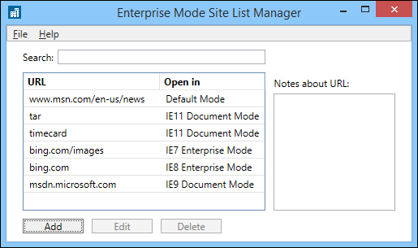

# Fix web compatibility issues using document modes and the Enterprise Mode site list
The Internet Explorer 11 Enterprise Mode site list lets you specify document modes for specific websites, helping you fix compatibility issues without changing a single line of code on the site. This addition to the site list is a continuation of our commitment to help you upgrade and stay up-to-date on the latest version of Internet Explorer, while still preserving your investments in existing apps.

## What does this mean for me?
Enterprises can have critical apps that are coded explicitly for a specific browser version and that might not be in their direct control, making it very difficult and expensive to update to modern standards or newer browser versions. Because you can decide which URLs should open using specific document modes, this update helps ensure better compatibility, faster upgrades, and reduced testing and fixing costs.

## How does this fix work?
You can continue to use your legacy and orphaned web apps, by specifying a document mode in the centralized Enterprise Mode site list. Then, when IE11 goes to a site on your list, the browser loads the page in the specified document mode just as it would if it were specified through an X-UA-Compatible meta tag on the site. For more information about document modes and X-UA-compatible headers, see [Defining document compatibility](https://go.microsoft.com/fwlink/p/?LinkId=518412).

**Important**<br>
Enterprise Mode takes precedence over document modes, so sites that are already included in the Enterprise Mode site list won’t be affected by this update and will continue to load in Enterprise Mode, as usual.

### When do I use document modes versus Enterprise Mode?
While the `<emie>` functionality provides great compatibility for you on Windows Internet Explorer 8 or Windows Internet Explorer 7, the new `<docMode>` capabilities can help you stay up-to-date regardless of which versions of IE are running in your environment. Because of this, we recommend starting your testing process like this:

-   If your enterprise primarily uses Internet Explorer 8 or Internet Explorer 7 start testing using Enterprise Mode.

-   If your enterprise primarily uses Windows Internet Explorer 9 or Internet Explorer 10, start testing using the various document modes.

Because you might have multiple versions of IE deployed, you might need to use both Enterprise Mode and document modes to effectively move to IE11.

### Test your sites for document mode compatibility
To see if this fix might help you, run through this process one step at a time, for each of your problematic sites:

1.  Go to a site having compatibility problems, press **F12** to open the **F12 Developer Tools**, and go to the **Emulation** tool.

    

2.  Starting with the **11 (Default)** option, test your broken scenario.<br>
If that doesn’t work, continue down to the next lowest document mode, stopping as soon as you find a document mode that fixes your problems. For more information about the Emulation tool, see [Emulate browsers, screen sizes, and GPS locations](https://go.microsoft.com/fwlink/p/?LinkId=518417).

3.  If none of the document modes fix your issue, change the **Browser Profile** to **Enterprise**, pick the mode you want to test with starting with **8** (IE8 Enterprise Mode), and then test your broken scenario.

### Add your site to the Enterprise Mode site list
After you’ve figured out the document mode that fixes your compatibility problems, you can add the site to your Enterprise Mode site list.

**Note**<br>
There are two versions of the Enterprise Mode site list schema and the Enterprise Mode Site List Manager, based on your operating system. For more info about the schemas, see [Enterprise Mode schema v.2 guidance](enterprise-mode-schema-version-2-guidance.md) or [Enterprise Mode schema v.1 guidance](enterprise-mode-schema-version-1-guidance.md). For more info about the different site list management tools, see [Use the Enterprise Mode Site List Manager](use-the-enterprise-mode-site-list-manager.md).

 **To add your site to the site list**

1.  Open the Enterprise Mode Site List Manager, and click **Add**.

    

2.  Add the **URL** and pick the document mode from the **Launch in** box. This should be the same document mode you found fixed your problems while testing the site.<br>
Similar to Enterprise Mode, you can specify a document mode for a particular web path—such as contoso.com/ERP—or at a domain level. In the above, the entire contoso.com domain loads in Enterprise Mode, while microsoft.com is forced to load into IE8 Document Mode and bing.com loads in IE11.

**Note**<br>
For more information about Enterprise Mode, see [What is Enterprise Mode?](what-is-enterprise-mode.md) For more information about the Enterprise Mode Site List Manager and how to add sites to your site list, see [Enterprise Mode Site List Manager](use-the-enterprise-mode-site-list-manager.md).


### Review your Enterprise Mode site list
Take a look at your Enterprise Mode site list and make sure everything is the way you want it. The next step will be to turn the list on and start to use it in your company. The Enterprise Mode Site List Manager will look something like:



And the underlying XML code will look something like:

``` xml
<rules version="1">
  <emie>
       <domain exclude="false">bing.com<path exclude="false" forceCompatView="true">/images</path></domain>
       <domain exclude="true">www.msn.com<path exclude="true">/news</path></domain>
  </emie>
  <docmode />
  <docMode>
       <domain docMode="edge">timecard</domain>
       <domain docMode="edge">tar</domain>
       <domain docMode="9">msdn.microsoft.com</domain>
  </docMode>
</rules>
```

### Turn on Enterprise Mode and using your site list
If you haven’t already turned on Enterprise Mode for your company, you’ll need to do that. You can turn on Enterprise Mode using Group Policy or your registry. For specific instructions and details, see [Turn on Enterprise Mode and use a site list](turn-on-enterprise-mode-and-use-a-site-list.md).

## Turn off default Compatibility View for your intranet sites
By default, IE11 uses the **Display intranet sites in Compatibility View** setting. However, we’ve heard your feedback and know that you might want to turn this functionality off so you can continue to upgrade your web apps to more modern standards.

To help you move forward, you can now use the Enterprise Mode site list to specify sites or web paths to use the IE7 document mode, which goes down to IE5 “Quirks” mode if the page doesn’t have an explicit `DOCTYPE` tag. Using this document mode effectively helps you provide the Compatibility View functionality for single sites or a group of sites, which after thorough testing, can help you turn off Compatibility View as the default setting for your intranet sites.

## Related topics
- [Download the Enterprise Mode Site List Manager (schema v.2)](https://go.microsoft.com/fwlink/p/?LinkId=716853)
- [Download the Enterprise Mode Site List Manager (schema v.1)](https://go.microsoft.com/fwlink/p/?LinkID=394378)
- [Enterprise Mode Site List Manager](use-the-enterprise-mode-site-list-manager.md)
 

 


