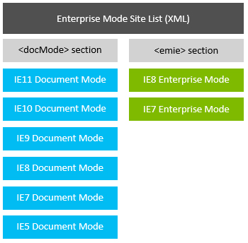
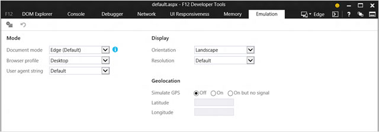

# Tips and tricks to manage Internet Explorer compatibility

Find out how to achieve better backward compatibility for your legacy web applications with the Enterprise Mode Site List.

Jump to:
- [Tips for IT professionals](#tips-for-it-professionals)
- [Tips for web developers](#tips-for-web-developers)

[Enterprise Mode for Internet Explorer 11](enterprise-mode-overview-for-ie11.md) can be very effective in providing backward compatibility for older web apps. The Enterprise Mode Site List includes the ability to put any web app in any document mode, include IE8 and IE7 Enterprise Modes, without changing a single line of code on the website.

Sites in the \<docMode\> section can be rendered in any document mode, as shown in blue above. Some sites designed for older versions of Internet Explorer may require better backward compatibility, and these can leverage the \<emie\> section of the Enterprise Mode Site List. IE8 Enterprise Mode provides higher-fidelity emulation for Internet Explorer 8 by using, among other improvements, the original Internet Explorer 8 user agent string. IE7 Enterprise Mode further improves emulation by adding Compatibility View.  
  
Compatibility View, first introduced with Internet Explorer 8, is basically a switch. If a webpage has no DOCTYPE, that page will be rendered in Internet Explorer 5 mode. If there is a DOCTYPE, the page will be rendered in Internet Explorer 7 mode. You can effectively get Compatibility View by specifying Internet Explorer 7 in the \<docMode\> section, as this falls back to Internet Explorer 5 automatically if there's no DOCTYPE, or you can use IE7 Enterprise Mode for even better emulation.

## Tips for IT professionals

### Inventory your sites

Upgrading to a new browser can be a time-consuming and potentially costly venture. To help reduce these costs, you can download the [Enterprise Site Discovery Toolkit](https://www.microsoft.com/download/details.aspx?id=44570), which can help you prioritize which sites you should be testing based on their usage in your enterprise. For example, if the data shows that no one is visiting a particular legacy web app, you may not need to test or fix it. The toolkit is supported on Internet Explorer 8, Internet Explorer 9, Internet Explorer 10, and Internet Explorer 11. The toolkit also gives you information about which document mode a page runs in your current browser so you can better understand how to fix that site if it breaks in a newer version of the browser.  
  
Once you know which sites to test and fix, the following remediation methods may help fix your compatibility issues in Internet Explorer 11 and Windows 10.

### If you're on Internet Explorer 8 and upgrading to Internet Explorer 11:

Use the Enterprise Mode Site List to add sites to the Internet Explorer 5, Internet Explorer 7, and Internet Explorer 8 documents modes, as well as IE8 Enterprise Mode and IE7 Enterprise Mode.

-   Sites with the *x-ua-compatible* meta tag or HTTP header set to "IE=edge" may break in Internet Explorer 11 and need to be set to Internet Explorer 8 mode. This is because "edge" in Internet Explorer 8 meant Internet Explorer 8 mode, but "edge" in Internet Explorer 11 means Internet Explorer 11 mode.

-   Sites without a DOCTYPE in zones other than Intranet will default to QME (or "interoperable quirks") rather than Internet Explorer 5 Quirks and may need to be set to Internet Explorer 5 mode.

-   Some sites may need to be added to both Enterprise Mode and Compatibility View to work. You can do this by adding the site to IE7 Enterprise Mode.

### If you're on Internet Explorer 9 and upgrading to Internet Explorer 11:

Use the Enterprise Mode Site List to add sites to the Internet Explorer 5, Internet Explorer 7, and Internet Explorer 9 document modes.

-   Sites with the *x-ua-compatible* meta tag or HTTP header set to "IE=edge" may break in Internet Explorer 11 and need to be set to Internet Explorer 9 mode. This is because "edge" in Internet Explorer 9 meant Internet Explorer 9 mode, but "edge" in Internet Explorer 11 means Internet Explorer 11 mode.

-   Sites without a DOCTYPE in zones other than Intranet will default to Interoperable Quirks rather than Internet Explorer 5 Quirks and may need to be set to Internet Explorer 5 mode.

-   If your sites worked in Internet Explorer 9, you won't need IE8 Enterprise Mode or IE7 Enterprise Mode.

### If you're on Internet Explorer 10 and upgrading to Internet Explorer 11:

Use the Enterprise Mode Site List to add sites to the Internet Explorer 5, Internet Explorer 7, and Internet Explorer 10 modes.

-   Sites with the *x-ua-compatible* meta tag or HTTP header set to "IE=edge" may break in Internet Explorer 11 and need to be set to Internet Explorer 10 mode. This is because "edge" in Internet Explorer 10 meant Internet Explorer 10 mode, but "edge" in Internet Explorer 11 means Internet Explorer 11 mode.

-   If your sites worked in Internet Explorer 10, you won't need IE8 Enterprise Mode or IE7 Enterprise Mode.

### If you're on Internet Explorer 11 and upgrading to Windows 10:

You're all set! You shouldn’t need to make any changes.

## Tips for web developers

If your website worked in an older version of Internet Explorer, but no longer works in Internet Explorer 11, you may need to update the site. Here are the set of steps you should take to find the appropriate remediation strategy.

### Try document modes

To see if the site works in the Internet Explorer 5, Internet Explorer 7, Internet Explorer 8, Internet Explorer 9, Internet Explorer 10, or Internet Explorer 11 document modes:

-   Open the site in Internet Explorer 11, load the F12 tools by pressing the **F12** key or by selecting **F12 Developer Tools** from the **Tools** menu, and select the **Emulation** tab.  

    

-   Run the site in each document mode until you find the mode in which the site works.
 
    >[!NOTE]
    >You will need to make sure the User agent string dropdown matches the same browser version as the Document mode dropdown. For example, if you were testing to see if the site works in Internet Explorer 10, you should update the Document mode dropdown to 10 and the User agent string dropdown to Internet Explorer 10.

-   If you find a mode in which your site works, you will need to add the site  domain, sub-domain, or URL to the Enterprise Mode Site List for the document mode in which the site works, or ask the IT administrator to do so. You can add the *x-ua-compatible* meta tag or HTTP header as well.

### Try IE8 Enterprise Mode

If a document mode didn't fix your site, try IE8 Enterprise Mode, which benefits sites written for Internet Explorer 5, Internet Explorer 7, and Internet Explorer 8 document modes.

-   Enable the **Let users turn on and use Enterprise Mode from the Tools menu** policy locally on your machine. To do this:

    -   Search for and run **gpedit.msc**

    -   Navigate to **Computer Configuration** \> **Administrative Template** \> **Windows Components** \> **Internet Explorer**.

    -   Enable the **Let users turn on and use Enterprise Mode from the Tools menu** Group Policy setting.

    After making this change, run **gpupdate.exe /force** to make sure the setting is applied locally. You should also make sure to disable this setting once you're done testing. Alternately, you can use a regkey; see [Turn on local control and logging for Enterprise Mode](turn-on-local-control-and-logging-for-enterprise-mode.md) for more  information.

-   Restart Internet Explorer 11 and open the site you're testing, then go to **Emulation** tab in the **F12 Developer Tools** and select **Enterprise** from the **Browser profile** dropdown. If the site works, inform the IT administrator that the site needs to be added to the IE8 Enterprise Mode section.

### Try IE7 Enterprise Mode

If IE8 Enterprise Mode doesn't work, IE7 Enterprise Mode will give you the Compatibility View behavior that shipped with Internet Explorer 8 with Enterprise Mode. To try this approach:

-   Go to the **Tools** menu, select **Compatibility View Settings**, and add the site to the list.

-   Go to **Emulation** tab in the **F12 Developer Tools** and select **Enterprise** from the **Browser profile** dropdown.

If the site works, inform the IT administrator that the site needs to be added to the IE7 Enterprise Mode section.\

>[!NOTE]
>Adding the same Web path to the Enterprise Mode and sections of the Enterprise Mode Site List will not work, but we will address this in a future update.

### Update the site for modern web standards

We recommend that enterprise customers focus their new development on established, modern web standards for better performance and interoperability across devices, and avoid developing sites in older Internet Explorer document modes. We often hear that, due to fact that the Intranet zone defaults to Compatibility View, web developers  inadvertently create new sites in the Internet Explorer 7 or Internet Explorer 5 modes in the Intranet zone, depending on whether or not they used a DOCTYPE. As you  move your web apps to modern standards, you can enable the **Turn on Internet Explorer Standards Mode for local intranet** Group Policy setting and add those sites that need Internet Explorer 5 or Internet Explorer 7 modes to the Site List. Of course, it is always a good idea to test the app to ensure that these settings work for your environment.

## Related resources

- [Document modes](https://msdn.microsoft.com/library/dn384051&#040;v=vs.85&#041;.aspx)
- [What is Enterprise Mode?](what-is-enterprise-mode.md)
- [Turn on Enterprise Mode and use a site list](turn-on-enterprise-mode-and-use-a-site-list.md)
- [Enterprise Site Discovery Toolkit](https://www.microsoft.com/en-us/download/details.aspx?id=44570)
- [Collect data using Enterprise Site Discovery](collect-data-using-enterprise-site-discovery.md)
- [Download the Enterprise Mode Site List Manager (schema v.2)](https://go.microsoft.com/fwlink/p/?LinkId=716853)
- [Download the Enterprise Mode Site List Manager (schema v.1)](https://go.microsoft.com/fwlink/p/?LinkID=394378)
- [Add multiple sites to the Enterprise Mode site list using a file and the Enterprise Mode Site List Manager (schema v.1)](add-multiple-sites-to-enterprise-mode-site-list-using-the-version-1-schema-and-enterprise-mode-tool.md)
- [Add multiple sites to the Enterprise Mode site list using a file and the Enterprise Mode Site List Manager (schema v.2)](add-multiple-sites-to-enterprise-mode-site-list-using-the-version-2-schema-and-enterprise-mode-tool.md)
