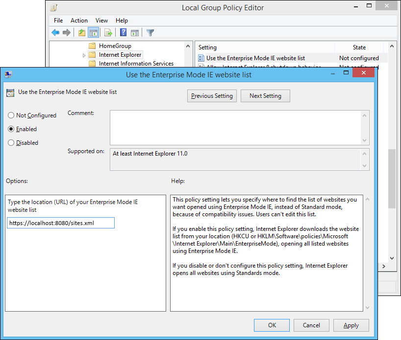
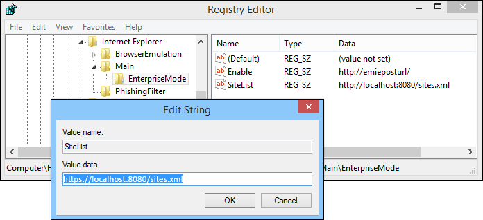

# Turn on Enterprise Mode and use a site list

**Applies to:**

-   Windows 10
-   Windows 8.1
-   Windows 7
-   Windows Server 2012 R2
-   Windows Server 2008 R2 with Service Pack 1 (SP1)

Before you can use a site list with Enterprise Mode, you need to turn the functionality on and set up the system for centralized control. By allowing centralized control, you can create one global list of websites that render using Enterprise Mode. Approximately 65 seconds after Internet Explorer 11 starts, it looks for a properly formatted site list. If a new site list if found, with a different version number than the active list, IE11 loads and uses the newer version. After the initial check, IE11 won’t look for an updated list again until you restart the browser.

>[!NOTE]
>We recommend that you store and download your website list from a secure web server (https://), to help protect against data tampering. After the list is downloaded, it's stored locally on your employees' computers so if the centralized file location is unavailable, they can still use Enterprise Mode.

 **To turn on Enterprise Mode using Group Policy**

1.  Open your Group Policy editor and go to the `Administrative Templates\Windows Components\Internet Explorer\Use the Enterprise Mode IE website list` setting.

Turning this setting on also requires you to create and store a site list. For more information about creating your site list, see the [Use the Enterprise Mode Site List Manager](use-the-enterprise-mode-site-list-manager.md) topics.

    

2.  Click **Enabled**, and then in the **Options** area, type the location to your site list.

 **To turn on Enterprise Mode using the registry**

1.  **For only the local user:** Open a registry editor, like regedit.exe and go to `HKEY_CURRENT_USER\Software\Policies\Microsoft\Internet Explorer\Main\EnterpriseMode`.

-OR-

**For all users on the device:** Open a registry editor, like regedit.exe and go to `HKEY_LOCAL_MACHINE\Software\Policies\Microsoft\Internet Explorer\Main\EnterpriseMode`.

2.  Edit the `SiteList` registry key to point to where you want to keep your Enterprise Mode site list file. For example:

    

    -   **HTTPS location**: `"SiteList"="https://localhost:8080/sites.xml"`

    -   **Local network:** `"SiteList"="\\network\shares\sites.xml"`

    -   **Local file:** `"SiteList"="file:///c:\\Users\\<user>\\Documents\\testList.xml"`
    
   All of your managed devices must have access to this location if you want them to be able to access and use Enterprise Mode and your site list. For information about how to create and use an Enterprise Mode site list, see [Use the Enterprise Mode Site List Manager](use-the-enterprise-mode-site-list-manager.md).

## Related topics
- [Download the Enterprise Mode Site List Manager (schema v.2)](https://go.microsoft.com/fwlink/p/?LinkId=716853)
- [Download the Enterprise Mode Site List Manager (schema v.1)](https://go.microsoft.com/fwlink/p/?LinkID=394378)
- [Add multiple sites to the Enterprise Mode site list using a file and the Enterprise Mode Site List Manager (schema v.1)](add-multiple-sites-to-enterprise-mode-site-list-using-the-version-1-schema-and-enterprise-mode-tool.md)
- [Add multiple sites to the Enterprise Mode site list using a file and the Enterprise Mode Site List Manager (schema v.2)](add-multiple-sites-to-enterprise-mode-site-list-using-the-version-2-schema-and-enterprise-mode-tool.md)
 

 

