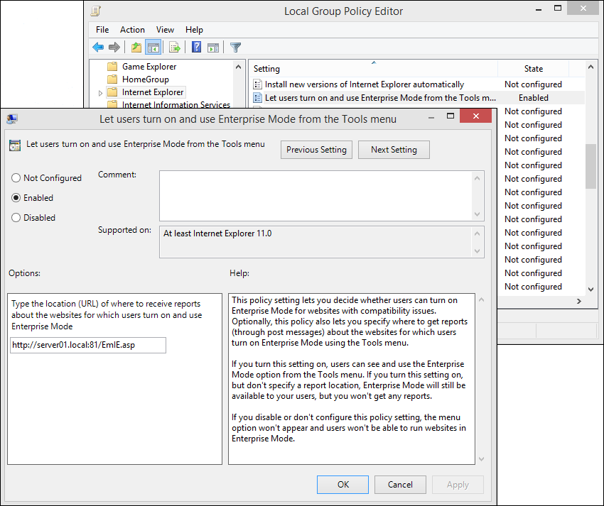
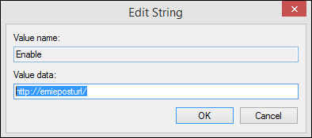

# Turn on local control and logging for Enterprise Mode

**Applies to:**

-   Windows 10
-   Windows 8.1
-   Windows 7
-   Windows Server 2012 R2
-   Windows Server 2008 R2 with Service Pack 1 (SP1)

You can turn on local control of Enterprise Mode so that your users can turn Enterprise Mode on from the **Tools** menu. Turning on this feature also adds the **Enterprise** browser profile to the **Emulation** tab of the F12 developer tools.

Besides turning on this feature, you also have the option to provide a URL for Enterprise Mode logging. If you turn logging on, Internet Explorer initiates a simple POST back to the supplied address, including the URL and a specification that **EnterpriseMode** was turned on or off through the **Tools** menu.

 **To turn on local control of Enterprise Mode using Group Policy**

1. Open your Group Policy editor and go to the **Administrative Templates\\Windows Components\\Internet Explorer\\Let users turn on and use Enterprise Mode from the Tools menu** setting.

   

2. Click **Enabled**, and then in the **Options** area, type the location for where to receive reports about when your employees use this functionality to turn Enterprise Mode on or off from the **Tools** menu.

   **To turn on local control of Enterprise Mode using the registry**

3. Open a registry editor, like regedit.exe and go to `HKEY_LOCAL_MACHINE\SOFTWARE\Policies\Microsoft\Internet Explorer\Main\EnterpriseMode`.

4. In the right pane, right-click and click **New**, click **String Value**, and then name the new value **Enable**.

5. Right-click the **Enable** key, click **Modify**, and then type a **Value data** to point to a server that you can listen to for updates.

   

Your **Value data** location can be any of the following types:

- **URL location (like, https://www.emieposturl.com/api/records or https://localhost:13000)**. IE sends a POST message to the URL every time a change is made to Enterprise Mode from the **Tools** menu.
**Important** 
  The `https://www.emieposturl.com/api/records` example will only work if you’ve downloaded the sample discussed in the [Set up Enterprise Mode logging and data collection](set-up-enterprise-mode-logging-and-data-collection.md) topic. If you don’t have the sample, you won’t have the web API.
- **Local network location (like, https://<em>emieposturl</em>/)**. IE sends a POST message to your specified local network location every time a change is made to Enterprise Mode from the **Tools** menu.
- **Empty string**. If you leave the **Value data** box blank; your employees will be able to turn Enterprise Mode on and off from the **Tools** menu, but you won’t collect any logging data.

For information about how to collect the data provided when your employees turn Enterprise Mode on or off from the **Tools** menu, see [Set up Enterprise Mode logging and data collection](set-up-enterprise-mode-logging-and-data-collection.md).

 

 

