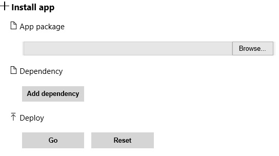
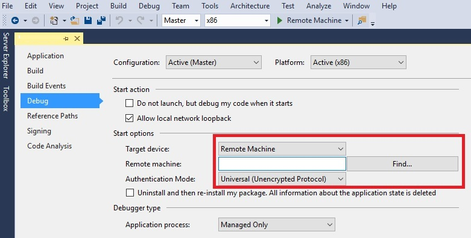

# Manage custom apps for HoloLens

HoloLens supports many existing applications from the Microsoft Store, as well as new apps built specifically for HoloLens. This article focuses on custom holographic applications.  

For more information about store apps, see [Manage apps with the store](holographic-store-apps.md).

## Install custom apps

You can install your own applications on HoloLens either by using the Device Portal or by deploying the apps from Visual Studio.

### Installing an application package with the Device Portal

1. Establish a connection from [Device Portal](https://docs.microsoft.com/windows/mixed-reality/using-the-windows-device-portal) to the target HoloLens.
1. In the left navigation, navigate to the **Apps** page .
1. Under **App Package** browse to the .appx file that is associated with your application.
   > [!IMPORTANT]
   > Make sure to reference any associated dependency and certificate files.

1. Select **Go**.
   

### Deploying from Microsoft Visual Studio 2015

1. Open your app's Visual Studio solution (.sln file).
1. Open the project's **Properties**.
1. Select the following build configuration: **Master/x86/Remote Machine**.
1. When you select **Remote Machine**:
   - Make sure the address points to the Wi-Fi IP address of your HoloLens.
   - Set authentication to **Universal (Unencrypted Protocol)**.
1. Build your solution.
1. To deploy the app from your development PC to your HoloLens, select **Remote Machine**. If you already have an existing build on the HoloLens, select **Yes** to install this newer version.  

     
1. The application will install and auto launch on your HoloLens.

After you've installed an app, you'll find it in the **All apps** list​ (**Start** > **All apps**).
