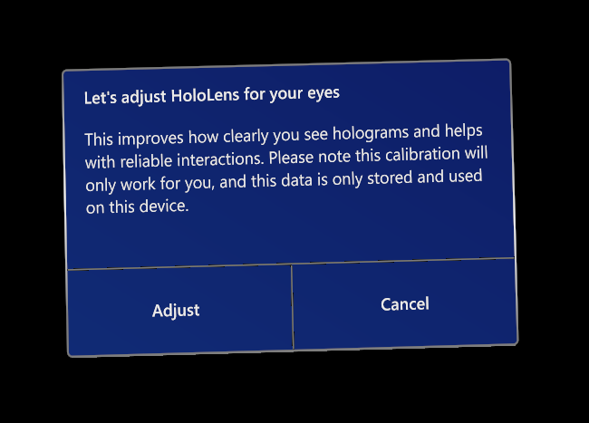

# Improve visual quality and comfort

HoloLens (1st Gen), HoloLens 2 and Windows Mixed Reality immersive headsets offer different ways to improve quality of your visual experience. During the setup process, both [HoloLens 2](#calibrating-your-hololens-2) and [HoloLens (1st Gen)](#calibrating-your-hololens-1st-gen) offer a calibration process that adapts the visuals to your eyes. Similarly, Windows Mixed Reality immersive headsets offer an [app]() that you can use to adapt the visuals to your eyes.

## Calibrating your HoloLens 2

HoloLens 2 is designed to provide the highest quality visual imagery and comfort. It uses eye-tracking technology improve your experience of seeing and interacting with the virtual environment. Calibrating the HoloLens 2 ensures that it can accurately track your eyes (and the eyes of anyone else who uses the device). 

When you set up your HoloLens 2 device, it prompts you to calibrate your visuals. 

During this process, it asks you to look at a set of fixation target images. 

HoloLens 2 prompts a user to calibrate the device under the following circumstances:

- The user is using the device for the first time
- The user previously opted out of the calibration process
- The calibration process did not succeed the last time the user used the device

### HoloLens 2 eye-tracking technology and data

The device uses its eye-tracking technology to improve display quality, and to ensure that all holograms are positioned accurately and comfortable to view in 3D. Because it uses the eyes as landmarks, the device can adjust itself for every user and tune its visuals as the headset shifts slightly throughout use.  All adjustments happen on the fly without a need for manual tuning. 

HoloLens applications use eye tracking to track where you are looking in real time. This is the main capability developers can leverage to enable a whole new level of context, human understanding and interactions within the Holographic experience. Developers don’t need to do anything to leverage this capability.

The eye-tracking data itself remains internal, and is not available to developers. The device stores the data locally. It does not associate the eye-tracking data with any account information. It does not record who has used the device without calibration. You cn always delete the data by selecting **Settings** > **Privacy** > **Eye tracker**.

### Troubleshooting HoloLens 2 calibration

Calibration should work for most users, but there are cases in which you may not be able to calibrate successfully. The following factors (and others like them) can interfere with the calibration process:

- Distraction during the calibration process (not following the calibration targets)
- The device visor is dirty, scratched, or not positioned properly
- Glasses are dirty or scratched
- Contact lenses or glasses of a certain type (such as colored contact lenses, some toric contact lenses, IR blocking glasses, some high prescription glasses, sunglasses, and so forth)
- Pronounced makeup, or certain eyelash extensions
- Something such as hair or some thick eyeglass frames that blocks the eyes and/or the device visor
- Eye physiology, certain eye conditions and/or eye surgery (some narrow eyes, long eyelashes, amblyopia, nystagmus, some cases of LASIK or other eye surgeries, and so forth)

If the device cannot calibrate, try one of these fixes:

- Clean your device visor
- Clean your glasses
- Push your device visor all the way in
- Make sure that nothing (such as hair) obstructs the sensors or your eyes
- Make sure that there is enough light in your room, but you are not under direct sunlight
- Make sure that you carefully follow the targets during the calibration process

If you follow all of these guidelines and calibration still fails, you can disable the calibration prompt by following these steps:

1. Select **Settings** > **System** > **Calibration**. 
1. Turn off **When a new person uses this HoloLens, automatically ask to run eye calibration**.

> [!IMPORTANT]
> Please understand that this setting may adversely affect hologram rendering quality and comfort.

### Launching the Calibration app from Settings

1. Use Start gesture to get to the [**Start** menu](holographic-home.md).
1. Select **All Apps** to view all apps if the Settings app isn't pinned to **Start**.
1. Launch Settings.
1. Navigate to **System** > **Calibration** > **Eye Calibration** and select **Run eye calibration**.

   

### Calibration when sharing a device or session

HoloLens 2 can be shared between people, without a need for each person to go through device setup. HoloLens 2 will prompt the user to calibrate visuals when the device is put on the head if the user is new to the device. If the user has previously calibrated visuals on the device, the display will be seamlessly adjusted for quality and a comfortable viewing experience when the user puts the device on the head.  

## HoloLens (Gen 1) calibration

Calibrating your IPD (interpupillary distance) can improve the quality of your visuals.

### During setup

*IPD finger-alignment screen at second step*

On HoloLens, you'll be prompted to calibrate your visuals during setup. This allows the device to adjust hologram display according to the user's [interpupillary distance](https://en.wikipedia.org/wiki/Interpupillary_distance) (IPD). With an incorrect IPD, holograms may appear unstable or at an incorrect distance.

After Cortana introduces herself, the first setup step is calibration. It's recommended that you complete the calibration step during this setup phase, but it can be skipped by waiting until Cortana prompts you to say "Skip" to move on.

Users are asked to align their finger with a series of six targets per eye. Through this process, HoloLens sets the correct IPD for the user. If the calibration needs to be updated or adjusted for a new user, it can be run outside of setup using the Calibration app.

### Calibration app

Calibration can be performed any time through the Calibration app. The Calibration app is installed by default and may be accessed from the **Start** menu, or through the Settings app. Calibration is recommended if you'd like to improve the quality of your visuals or calibrate visuals for a new user.

**Launching the app from Start**

1. Use [bloom](hololens1-basic-usage.md) to get to the **Start** menu.
1. Select **+** to view all apps.
1. Launch **Calibration**.

**Launching the app from Settings**

1. Use [bloom](hololens1-basic-usage.md) to get to the **Start** menu.
1. If **Settings** isn't pinned to **Start**, select **+** to view all apps.
1. Launch **Settings**.
1. Navigate to **System** > **Utilities** and select **Open Calibration**.

## Immersive headsets

To change IPD within your headset, open the Settings app and navigate to **Mixed reality** > **Headset display** and move the slider control. You’ll see the changes in real time in your headset. If you know your IPD, maybe from a visit to the optometrist, you can enter it directly as well.

You can also adjust this setting by going to **Settings** > **Mixed reality** > **Headset display** on your PC.

If your headset does not support IPD customization, this setting will be disabled.
