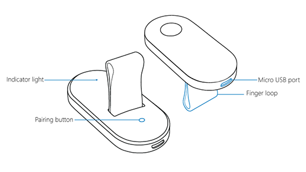

# Use the HoloLens Clicker

The clicker was designed specifically for HoloLens and gives you another way to interact with holograms. It comes with HoloLens, in a separate box. Use it in place of hand gestures to select, scroll, move, and resize.

## Hold the clicker

To put on the clicker, slide the loop over your ring or middle finger with the Micro USB port toward your wrist. Rest your thumb in the indentation.

## Clicker gestures

Clicker gestures are small wrist rotations, not the larger movements used for HoloLens hand gestures. And HoloLens will recognize your gestures and clicks even if the clicker is outside the [gesture frame](https://support.microsoft.com/help/12644), so you can hold the clicker in the position that's most comfortable for you​.

- **Select**. To select a hologram, button, or other element, gaze at it, then click.

- **Click and hold**. Click and hold your thumb down on the button to do some of the same things you would with tap and hold, like move or resize a hologram.

- **Scroll**. On the app bar, select **Scroll Tool**. Click and hold, then rotate the clicker up, down, left, or right. To scroll faster, move your hand farther from the center of the scroll tool.

- **Zoom**. On the app bar, select **Zoom Tool**. Click and hold, then rotate the clicker up to zoom in, or down to zoom out.

>[!TIP]
>In Microsoft Edge, gaze at a page and double-click to zoom in or out.

## Pair and charge the clicker

To pair the clicker with your HoloLens, see [Pair Bluetooth devices](https://support.microsoft.com/help/12636).

When the clicker battery is low, the battery indicator will blink amber. Plug the Micro USB cable into a USB power supply to charge the device.

## Indicator lights

Here's what the lights on the clicker mean.

- **Blinking white**. The clicker is in pairing mode.

- **Fast-blinking white**. Pairing was successful.

- **Solid white**. The clicker is charging.

- **Blinking amber**. The battery is low.

- **Solid amber**. The clicker ran into an error and you'll need to restart it. While pressing the pairing button, click and hold for 15 seconds.

>[!NOTE]
>If the clicker doesn't respond or won't start, see [Restart or recover the HoloLens clicker](https://support.microsoft.com/help/15555/hololens-restart-or-recover-the-hololens-clicker).
