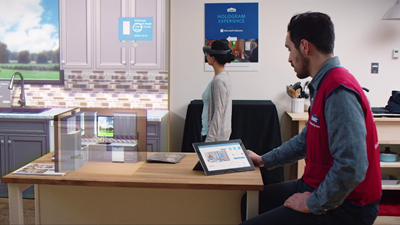
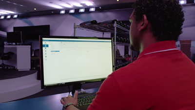

# Commercial features

HoloLens includes features that make it easier for businesses to manage HoloLens devices.

Every HoloLens 2 device has commercial features available.

HoloLens (Gen 1) came with two licensing options, the developer license and a commercial license. To unlock HoloLens's commercial capabilities, upgrade from the developer license to a commercial license. To purchase the Microsoft HoloLens Commercial Suite, contact your local Microsoft account manager.

>[!VIDEO https://www.youtube.com/embed/tNd0e2CiAkE]

## Key commercial features

- **Kiosk mode.** With HoloLens kiosk mode, you can limit which apps to run to enable demo or showcase experiences.

  

- **Mobile Device Management (MDM) for HoloLens.** Your IT department can manage multiple HoloLens devices simultaneously by using solutions such as Microsoft Intune. You can manage settings, select apps to install, and set security configurations that are tailored to your organization's needs.

  

- **Windows Update for Business.** Controlled operating system updates to devices and support for long term servicing branch.
- **Data security.** BitLocker data encryption is enabled on HoloLens to provide the same level of security protection as any other Windows device.
- **Work access.** Anyone in your organization can remotely connect to the corporate network through virtual private network on a HoloLens. HoloLens can also access Wi-Fi networks that require credentials.
- **Microsoft Store for Business.** Your IT department can also set up an enterprise private store, containing only your company’s apps for your specific HoloLens usage. Securely distribute your enterprise software to selected group of enterprise users.

## Development Edition vs. Commercial Suite

|Features |HoloLens Development Edition |HoloLens Commercial Suite |HoloLens 2 |
|---|:---:|:---:|:---:|
|Device Encryption (BitLocker) | |✔️ |✔️ |
|Virtual Private Network (VPN) | |✔️ |✔️ |
|[Kiosk mode](https://docs.microsoft.com/windows/mixed-reality/using-the-windows-device-portal#kiosk-mode) | |✔️ |✔️ |
|**Management and deployment** | | | |
|Mobile Device Management (MDM) | |✔️ |✔️ |
|Ability to block unenrollment | |✔️ |✔️ |
|Cert-based corporate Wi-Fi access | |✔️ |✔️ |
|Microsoft Store (Consumer) |Consumer |Filter by using MDM |Filter by using MDM |
[Business Store Portal](https://docs.microsoft.com/en-us/microsoft-store/working-with-line-of-business-apps) | |✔️ |✔️ |
|**Security and identity** | | | |
|Sign in by using Azure Active Directory (AAD) account |✔️ |✔️ |✔️ |
|Sign in by using Microsoft Account (MSA) |✔️ |✔️ |✔️ |
|Next Generation Credentials with PIN unlock |✔️ |✔️ |✔️ |
|[Secure boot](https://docs.microsoft.com/windows-hardware/design/device-experiences/oem-secure-boot) |✔️ |✔️ |✔️ |
|**Servicing and support** | | | |
|Automatic system updates as they arrive |✔️ |✔️ |✔️ |
|[Windows Update for Business](https://docs.microsoft.com/windows/deployment/update/waas-manage-updates-wufb) | |✔️ |✔️ |
|Long-Term Servicing Channel (LTSC) | |✔️ |✔️ |

## Enabling commercial features

Commercial features like Microsoft Store for Business, kiosk mode, and enterprise Wi-Fi access are set up by an organization's IT admin. The [Microsoft HoloLens](https://docs.microsoft.com/hololens) documentation provides step-by-step instructions for device enrollment and installing apps from Microsoft Store for Business.

## See also

- [Microsoft HoloLens](https://docs.microsoft.com/hololens)
- [Kiosk mode](/windows/mixed-reality/using-the-windows-device-portal.md#kiosk-mode)
- [CSPs supported in HoloLens devices](/windows/client-management/mdm/configuration-service-provider-reference#csps-supported-in-hololens-devices)
- [Microsoft Store For Business and line of business applications](https://blogs.technet.microsoft.com/sbucci/2016/04/13/windows-store-for-business-and-line-of-business-applications/)
- [Working with line-of-business apps](/microsoft-store/working-with-line-of-business-apps)
