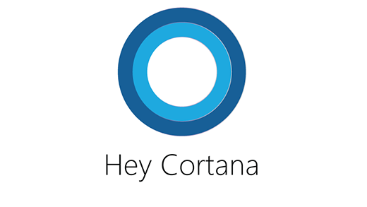

# Cortana on HoloLens

Cortana can help you do all kinds of things on your HoloLens, from searching the web to shutting down your device. To get her attention, select Cortana  on Start or say "Hey Cortana" anytime.

## What do I say to Cortana

Here are some things you can try saying (remember to say "Hey Cortana" first):

- What can I say?
- Increase the volume.
- Decrease the brightness.
- Shut down.
- Restart.
- Go to sleep.
- Mute.
- Launch <app name>.
- Move <app name> here (gaze at the spot you want the app to move to).
- Go to Start.
- Take a picture.
- Start recording. (Starts recording a video.)
- Stop recording. (Stops recording a video.)
- Call <contact>. (Requires Skype.)
- What time is it?
- Show me the latest NBA scores. 
- How much battery do I have left?
- Tell me a joke.

>[!NOTE]
>- Some Cortana features you're used to from Windows on your PC or phone (for example, reminders and notifications) aren't supported in Microsoft HoloLens Development Edition. Cortana on HoloLens is English only, and the Cortana experience may vary among regions.
>- Cortana is on the first time you use HoloLens. You can turn her off in Cortana's settings. In the All apps list, select Cortana > Settings. Then turn off Cortana can give you suggestions, ideas, reminders, alerts, and more.
>- If Cortana isn't responding to "Hey Cortana," go to Cortana's settings and check to make sure she's on.
>- If you turn Cortana off, "Hey Cortana" voice commands won't be available, but you'll still be able to use other commands (like "Select" and "Place").
