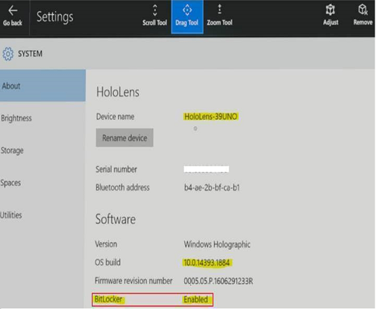

# Enable encryption for HoloLens

You can enable [BitLocker device encryption](https://docs.microsoft.com/windows/security/information-protection/bitlocker/bitlocker-device-encryption-overview-windows-10#bitlocker-device-encryption) to protect files and information stored on the HoloLens. Device encryption helps protect your data by encrypting it using AES-CBC 128 encryption method, which is equivalent to [EncryptionMethodByDriveType method 3](https://docs.microsoft.com/windows/client-management/mdm/bitlocker-csp#encryptionmethodbydrivetype) in the BitLocker configuration service provider (CSP). Only someone with the right encryption key (such as a password) can decrypt it or perform a data recovery.

## Enable device encryption using MDM

You can use your mobile device management (MDM) provider to apply a policy that requires device encryption. The policy used is the [Security/RequireDeviceEncryption setting](https://docs.microsoft.com/windows/client-management/mdm/policy-csp-security#security-requiredeviceencryption) in the Policy CSP.

[See instructions for enabling device encryption using Microsoft Intune.](https://docs.microsoft.com/intune/compliance-policy-create-windows#windows-holographic-for-business)

For other MDM tools, see your MDM provider's documentation for instructions. If your MDM provider requires custom URI for device encryption, use the following configuration:

- **Name**: a name of your choice
- **Description**: optional
- **OMA-URI**: `./Vendor/MSFT/Policy/Config/Security/RequireDeviceEncryption`
- **Data type**: integer
- **Value**: `1`

## Enable device encryption using a provisioning package

Provisioning packages are files created by the Windows Configuration Designer tool that apply a specified configuration to a device. 

### Create a provisioning package that upgrades the Windows Holographic edition and enables encryption

1.	[Create a provisioning package for HoloLens.](hololens-provisioning.md)

2.  Go to **Runtime settings** > **Policies** > **Security**, and select **RequireDeviceEncryption**.

    

2.	Browse to and select the XML license file that was provided when you purchased the Commercial Suite.

    >[!NOTE]
    >You can configure [additional settings in the provisioning package](hololens-provisioning.md).

3. On the **File** menu, click **Save**. 

4. Read the warning that project files may contain sensitive information, and click **OK**.

    >[!IMPORTANT]
    >When you build a provisioning package, you may include sensitive information in the project files and in the provisioning package (.ppkg) file. Although you have the option to encrypt the .ppkg file, project files are not encrypted. You should store the project files in a secure location and delete the project files when they are no longer needed.
    
3. On the **Export** menu, click **Provisioning package**.

4. Change **Owner** to **IT Admin**, which will set the precedence of this provisioning package higher than provisioning packages applied to this device from other sources, and then select **Next**.

5. Set a value for **Package Version**.

    >[!TIP]
    >You can make changes to existing packages and change the version number to update previously applied packages.

6. On the **Select security details for the provisioning package**, click **Next**.

7. Click **Next** to specify the output location where you want the provisioning package to go once it's built. By default, Windows ICD uses the project folder as the output location.

    Optionally, you can click Browse to change the default output location.

8. Click **Next**.

9. Click **Build** to start building the package. The project information is displayed in the build page and the progress bar indicates the build status.

10. When the build completes, click **Finish**. 

### Apply the provisioning package to HoloLens

1. Connect the device via USB to a PC and start the device, but do not continue past the **fit** page of the initial setup experience (the first page with the blue box).

2. Briefly press and release the **Volume Down** and **Power** buttons simultaneously.

3. HoloLens will show up as a device in File Explorer on the PC.

4. In File Explorer, drag and drop the provisioning package (.ppkg) onto the device storage.

5. Briefly press and release the **Volume Down** and **Power** buttons simultaneously again while on the **fit** page.

6. The device will ask you if you trust the package and would like to apply it. Confirm that you trust the package.

7. You will see whether the package was applied successfully or not. If it failed, you can fix your package and try again. If it succeeded, proceed with device setup.

>[!NOTE]
>If the device was purchased before August 2016, you will need to sign into the device with a Microsoft account, get the latest OS update, and then reset the OS in order to apply the provisioning package. 

## Verify device encryption

Encryption is silent on HoloLens. To verify the device encryption status:
 
-	On HoloLens, go to **Settings** > **System** > **About**. **BitLocker** is **enabled** if the device is encrypted. 

