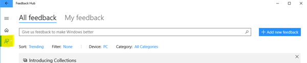
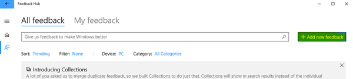
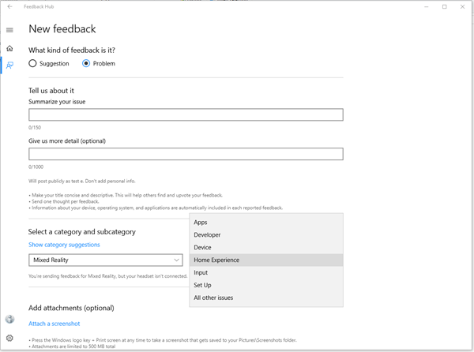
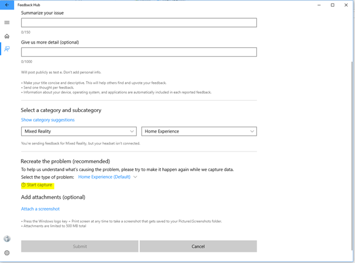
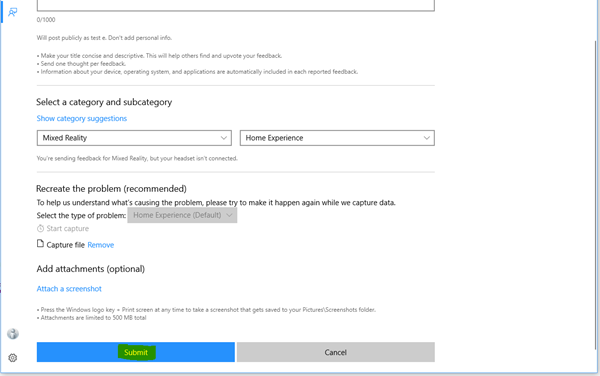
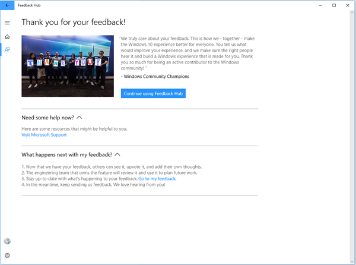
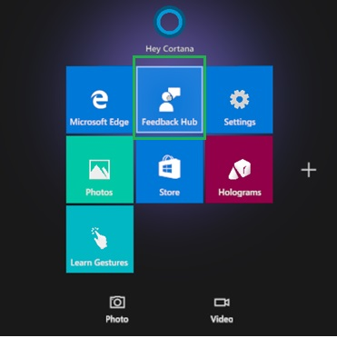
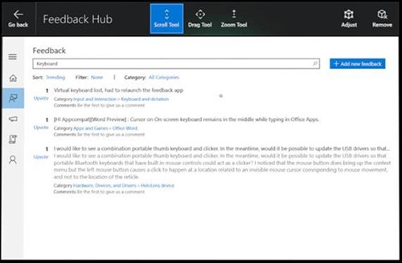
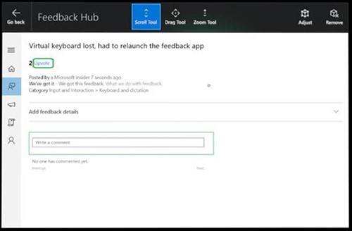

# Give us feedback

Use the Feedback Hub to tell us which features you love, which features you could do without, or when something could be better.

## Feedback for Windows Mixed Reality immersive headset on PC

> [!IMPORTANT]
> Before you report an issue, make sure that your environment meets the following requirements so that you can successfully upload logs and other information:
>
> - Have a minimum of 3GB free disk space available on the main drive of the device.
> - To upload cabs or other large files, connect to a non-metered network.

1. Make sure that you have the immersive headset connected to your PC, and then on the desktop, select **Feedback Hub**.
1. In the left pane, select **Feedback**.
    
1. To enter new feedback, select **Add new feedback**.
  
1. To make feedback actionable, in **What kind of feedback is this?** select **Problem**.
1. In **Summarize your issue**, enter a meaningful title for your feedback.
1. In **Give us more detail**, provide details and repro steps.
  

    As the top category, select **Mixed Reality**. Then select an applicable subcategory, as explained in the following table:
    
    |Subcategory  |Description |
    |----------|----------|
    |  Apps  |  Issues about a specific application. |
    |  Developer  |  Issues about authoring or running an app for Mixed Reality. |
    |  Device  |  Issues about the head-mounted device (HMD) itself. |
    |  Home experience  |  Issues about your VR environment and your interactions with the your mixed reality home. |
    |  Input  |  Issues about input methods, such as motion controllers, speech, gamepad, or mouse and keyboard. |
    |  Set up  |  Anything that is preventing you from setting up the device. |
    |  All other issues  |  Anything else. |
  
1. If possible, add traces or video to your feedback to help us identify and fix the issue more quickly. To do this, follow these steps:
   1. To start collecting traces, select **Start capture**. The app starts collecting traces and a video capture of your mixed reality scenario.
   
    
   1. Do not close the Feedback Hub app, but switch to the scenario that produces the issue. Run through the scenario to produce the circumstances that you have described.
   1. After you finish your scenario, go back to the Feedback Hub app and select **Stop capture**. The app stops collecting information, stores the information in a file, and attaches the file to your feedback.
1. Select **Submit**.
  
   The Thank You page indicates that your feedback has been successfully submitted.
  

To easily direct other people (such as co-workers, Microsoft staff, [forum](https://forums.hololens.com/) readers et al) to the issue, go to **Feedback** > **My Feedback**, select the issue, select **Share**. This action provides a shortened URL that you can give to others so that they can upvote or escalate your issue.

## Feedback for HoloLens

1. Use the **bloom** gesture to open the **Start** menu, and then select **Feedback Hub**.

   
1. Place the app in your environment and then select the app to launch it.
1. To see if someone else has given similar feedback, in the Feedback search box, enter a few keywords about the topic.

   
1. If you find similar feedback, select it, add any details, then select **Upvote**.

   
1. If you don’t find any similar feedback, select **Add new feedback**, select a topic from **Select a category**, and then select a subcategory from **Select a subcategory**.

   
1. Enter your feedback.
1. If you are reporting a reproducible issue, you can select **Reproduce**. Without closing Feedback Hub, reproduce the issue. After you finish, come back to Feedback Hub and select **I’m done**. The app adds a mixed reality capture of your repro and relevant diagnostic logs to your feedback.
1. Select **Post feedback**, and you’re done.
