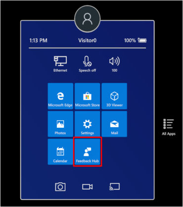
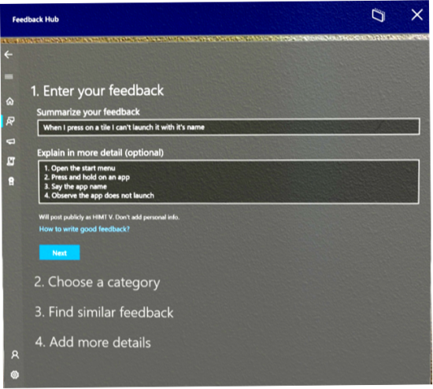

# Feedback for HoloLens

Use the Feedback Hub to tell us which features you love, which features you could do without, and how something could be better. The engineering team uses the same mechanism internally to track and fix bugs, so please use Feedback Hub to report any bugs that you see. We are listening!

Feedback Hub is an excellent way to alert the engineering team to bugs and to make sure that future updates are healthier and more consistently free of bugs. However, Feedback Hub does not provide a response. If you need immediate help, please file feedback, take note of the summary that you provided for your feedback, and then follow up with [HoloLens support](https://support.microsoft.com/supportforbusiness/productselection?sapid=e9391227-fa6d-927b-0fff-f96288631b8f).

> [!NOTE]  
>  
> - Make sure you that you have the current version of Feedback Hub. To do this, select **Start** > **Microsoft Store**, and then select the ellipses (**...**). Then, select **Downloads and updates** > **Get updates**.  
>  
> - To provide the best possible data for fixing issues, we highly recommended that you set your device telemetry to **Full**. You can set this value during the Out-of-Box-Experience (OOBE), or by using the Settings app. To do this by using Settings, select **Start** > **Settings** > **Privacy** > **App Diagnostics** > **On**.

## Use the Feedback Hub

1. Use the **Start** gesture to open the **Start** menu, and then select **Feedback Hub**. The app opens in your environment.

   
   > [!NOTE]  
   > If you don't see **Feedback Hub**, select **All Apps** to see the complete list of apps on the device.

1. To see whether someone else has given similar feedback, enter a few keywords about the topic in the **Feedback** search box.
1. If you find similar feedback, select it, add any additional information that you have in the **Write a comment** box, and then select **Upvote**.
1. If you don't find any similar feedback, select **Add new feedback**.

   

1. In **Summarize your feedback**, enter a short summary of your feedback. Then add details in the **Explain in more detail** box. The more details that you provide, such as how to reproduce this problem and the effect that it has, the more useful your feedback is. When you're finished, select **Next**.

1. Select a topic from **Choose a category**, and then select a subcategory from **Select a subcategory**. The following table describes the categories that are available in the Windows Holographic category.

   > [!NOTE]  
   > **Commercial customers**: To report a bug that is related to MDM, provisioning, or any other device management aspect, select the **Enterprise Management** category, and the **Device** subcategory.

   |Category |Description |
   | --- | --- |
   |Eye tracking |Feedback about eye tracking, iris sign-in, or calibration. |
   |Hologram accuracy, stability, and reliability |Feedback about how holograms appear in space. |
   |Launching, placing, adjusting, and exiting apps |Feedback about starting or stopping 2D or 3D apps. |
   |Miracast |Feedback about Miracast. |
   |Spaces and persistence |Feedback about how HoloLens recognizes spaces and retains holograms in space. |
   |Start menu and all apps list |Feedback about the **Start** menu and the all apps list. |
   |Surface mapping |Feedback about surface mapping. |
   |Taking pictures and videos |Feedback about mixed reality captures. |
   |Video hologram playback |Feedback about video hologram playback. |
   |All other issues |All other issues. |

1. You may be prompted to search for similar feedback. If your problem resembles feedback from other users, select that feedback. Otherwise, select **New feedback** and then select **Next**.

1. If you are prompted, select the best description of the problem.

1. Attach any relevant data to your feedback, or reproduce the problem. You can select any of the following options:

   - **Attach a screenshot**. Select this option to attach a screenshot that illustrates the situation that you're describing.
   - **Attach a file**. Select this option to attach data files. If you have files that are relevant to your problem or that could help us to reproduce your problem, attach them.
   - **Recreate my problem**. Select this option if you can reproduce the problem yourself. After you select **Recreate my problem**, follow these steps:  

     1. Select **Include data about** and make sure that the most relevant types of data are listed. In most cases, the default selections are based on the category and subcategory that you selected for your feedback.  
     1. Select **Start Recording**.

     1. Reproduce your problem. Don’t worry if this means that you have to enter an immersive app. You will return to the feedback page when you're done.
     1. Select **Stop recording**. After recording stops, you can see the data that is attached to your feedback for the engineering team.

1. Make sure that you have an active internet connection so that we can receive your feedback. Select **Submit**, and you’re done.
