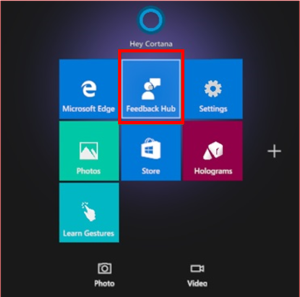

# Feedback for HoloLens

Use the Feedback Hub to tell us which features you love, which features you could do without, or when something could be better. The engineering team uses the same mechanism internally to track and fix bugs, so please use Feedback Hub to report any bugs that you see. We are listening!

Feedback Hub is an excellent way to alert the engineering team to bugs and to make sure that future updates are healthier and more consistently free of bugs. However, Feedback Hub does not provide a response back. If you need immediate help, please file feedback, take note of what you named your feedback, and then follow up with [HoloLens support](https://support.microsoft.com/supportforbusiness/productselection?sapid=e9391227-fa6d-927b-0fff-f96288631b8f).

> [!NOTE]  
>  
> - Make sure you have current version of Feedback Hub. To make sure you have the most current version, select **Start** > **Microsoft Store**, and then select **...***. Select **Downloads and updates** > **Get updates**.  
>  
> - In order to provide the best possible data for fixing issues, we highly recommended that you set your device telemetry to **Full**. You can set this value during the Out-of-box-experience (OOBE), or by using the Settings app. To do this by using Settings, select **Start** > **Settings** > **Privacy** > **App Diagnostics** > **On**.

## Use the Feedback Hub

1. Use the **Start** gesture to open the **Start** menu, and then select **Feedback Hub**. The app opens in your environment.

   

1. To see if someone else has given similar feedback, enter a few keywords about the topic in the **Feedback** search box.
1. If you find similar feedback, select it, add any additional information that you have in the **Write a comment** box, then select **Upvote**.
1. If you don't find any similar feedback, select **Add new feedback**.

   

1. Enter a title for your feedback, and then add details in the **Explain in more detail** section. The more details you provide, such as how to reproduce this issue and the impact it has, the more actionable your feedback is. When finished, select **Next**.

1. Select a topic from **Select a category**, and then select a subcategory from **Select a subcategory**. The following table describes the categories that are available.

   > [!NOTE]  
   > **Commercial customers**: To report a bug that is related to MDM, provisioning, or any other device management aspect, select the **Enterprise Management** category, and the **Device** subcategory.

   |Category |Description |
   | --- | --- |
   |Eye tracking |Feedback about eye tracking, iris sign-in, or calibration. |
   |Hologram accuracy, stability, and reliability |Feedback about how holograms appear in space. |
   |Launching, placing, adjusting, and exiting apps |Feedback about starting or stopping 2D or 3D apps. |
   |Miracast |Feedback about Miracast. |
   |Spaces and persistence |Feedback about how HoloLens recognizes spaces and retains holograms in space. |
   |Start menu and all apps list |Feedback about the **Start** menu and the all apps list. |
   |Surface mapping |Feedback about surface mapping. |
   |Taking pictures and videos |Feedback about mixed reality captures. |
   |Video hologram playback |Feedback about video hologram playback. |
   |All other issues |All other issues. |

1. You’ll be prompted to find similar feedback at this time, if your issue seems to be identical to other feedback, please select it. Otherwise choose New feedback and select Next.

1. 8.	You’ll be prompted to add more details. Please make a selection on which is the best description of the problem. 

9.	Next you’ll be asked to attach any relevant data or reproduce the issue. Here’s a 

•	Attach a screenshot: If you previously took a photo of the issue you can attach it with this option.
•	Attach a file: This can be used to attach other types of files relevant to your issue, if you have files that are useful for reproducing the issue please include them.
•	Recreate my problem: If you can continue to reproduce your issue again this is the best option. Once you select recreate my problem then make sure the “Include data about” drop down has what is most relevant. In most cases it will automatically select a category based on your category selected in step 2. 
Select Start Recording. You can now reproduce your issue. Don’t worry if this means entering an immersive app, when you return to the mixed reality home you’ll still be able to Stop recording. 

When you have finished you’ll be able to see the attached data that will be uploaded to the engineering team.

10.	Select Submit, and you’re done. Make sure that you have an active internet connection so we can receive your feedback.

1. If you are reporting a reproducible issue, you can select **Reproduce**. Without closing Feedback Hub, reproduce the issue. After you finish, come back to Feedback Hub and select **I'm done**. The app adds a mixed reality capture of your repro and relevant diagnostic logs to your feedback.
1. Select **Post feedback**, and you're done.
