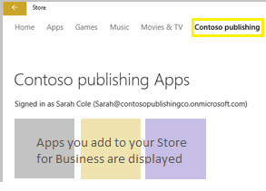
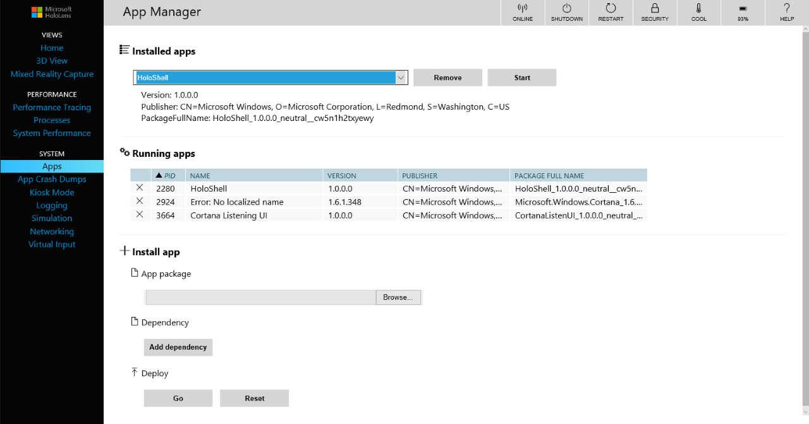

# Install apps on HoloLens

The recommended way to install Universal Windows Platform (UWP) apps on HoloLens is to use Microsoft Store for Business. You can make your own [line-of-business application](https://technet.microsoft.com/itpro/windows/manage/working-with-line-of-business-apps) available through Microsoft Store for Business.

You can also deploy apps using your mobile device management (MDM) provider or use the Windows Device Portal to install apps.

## Use Microsoft Store for Business to deploy apps to HoloLens

Microsoft Store for Business is a private Microsoft Store for your enterprise. People in your organization can open the Store app and select your private Store to install apps that you have made available to them. 

In your Microsoft Store for Business dashboard, you can also download apps to distribute to devices that aren't connected to the Internet, plus add line-of-business (LOB) apps for distribution. 

### Requirements

- You need to be a global administrator for your Azure Active Directory (Azure AD) tenant. 

    >[!TIP]
    >You can create an Azure AD account and tenant as part of the Store for Business sign-up process.
     
- End users need Azure AD accounts when they access Store for Business content from Windows-based devices.

### Microsoft Store for Business process

1. [Sign up for Microsoft Store for Business.](https://technet.microsoft.com/itpro/windows/manage/sign-up-windows-store-for-business)
2. [Assign roles and permissions for managing your Store for Business.](https://technet.microsoft.com/itpro/windows/manage/roles-and-permissions-windows-store-for-business)
3. (Optional) [Configure Microsoft Store for Business to work with your MDM provider.](https://technet.microsoft.com/itpro/windows/manage/configure-mdm-provider-windows-store-for-business)
3. [Get apps for your Store for Business.](https://technet.microsoft.com/itpro/windows/manage/acquire-apps-windows-store-for-business)
4. [Distribute apps to your employees.](https://technet.microsoft.com/itpro/windows/manage/distribute-apps-to-your-employees-windows-store-for-business)

### Install apps on HoloLens from Microsoft Store for Business

The method that you use to install an app from your Microsoft Store for Business on HoloLens depends on the distribution method that you choose.

| Distribution method | To install on HoloLens|
| --- | --- |
| [Using private store](https://docs.microsoft.com/microsoft-store/distribute-apps-from-your-private-store) | Open the Store app and select the tab for your organization to choose from available apps.  |
| Using MDM | [You can configure MDM to synchronize your Store for Business inventory.](https://technet.microsoft.com/itpro/windows/manage/distribute-apps-with-management-tool)   See the **Important** note in [Use MDM to deploy apps to HoloLens.](#use-mdm-to-deploy-apps-to-hololens) |

## Use MDM to deploy apps to HoloLens

>[!IMPORTANT]
>Online-licensed apps cannot be deployed with Microsoft Store for Business on HoloLens via an MDM provider. If attempted, apps will remain in “downloading” state. Instead, you can use your MDM provider to deploy MDM-hosted apps to HoloLens, or deploy offline-licensed apps to HoloLens via Store for Business

You can deploy UWP apps to HoloLens using your MDM provider. For Intune instructions, see [Deploy apps in Microsoft Intune](https://docs.microsoft.com/intune/deploy-use/add-apps).

Using Intune, you can also [monitor your app deployment](https://docs.microsoft.com/intune/deploy-use/monitor-apps-in-microsoft-intune).

## Use the Windows Device Portal to install apps on HoloLens

>[!IMPORTANT]
>When you set up HoloLens to use the Device Portal, you must enable **Developer Mode** on the device. **Developer Mode** on a device that has been upgraded to Windows Holographic for Business enables side-loading of apps, which risks the installation of apps that have not been certified by the Microsoft Store. Administrators can block the ability to enable **Developer Mode** using the **ApplicationManagement/AllowDeveloper Unlock** setting in the [Policy CSP](https://msdn.microsoft.com/library/windows/hardware/dn904962.aspx). [Learn more about Developer Mode.](https://msdn.microsoft.com/windows/uwp/get-started/enable-your-device-for-development#developer-mode)

1. [Set up the HoloLens to use the Windows Device Portal](https://developer.microsoft.com/windows/mixed-reality/using_the_windows_device_portal#setting_up_hololens_to_use_windows_device_portal). The Device Portal is a web server on your HoloLens that you can connect to from a web browser on your PC. 

2. On a PC, connect to the HoloLens using [Wi-Fi](https://developer.microsoft.com/windows/mixed-reality/Using_the_Windows_Device_Portal.html#connecting_over_wi-fi) or [USB](https://developer.microsoft.com/windows/mixed-reality/Using_the_Windows_Device_Portal.html#connecting_over_usb).

3. [Create a user name and password](https://developer.microsoft.com/windows/mixed-reality/Using_the_Windows_Device_Portal.html#creating_a_username_and_password) if this is the first time you connect to the Windows Device Portal, or enter the user name and password that you previously set up.

    >[!TIP]
    >If you see a certificate error in the browser, follow [these troubleshooting steps](https://developer.microsoft.com/windows/mixed-reality/Using_the_Windows_Device_Portal.html#security_certificate).

4. In the Windows Device Portal, click **Apps**.

    
    
5. In **Install app**, select an **app package** from a folder on your computer or network. If the app package requires additional software, such as dependency frameworks, select **I want to specify framework packages**.

6. In **Deploy**, click **Go** to deploy the app package and added dependencies to the connected HoloLens.

