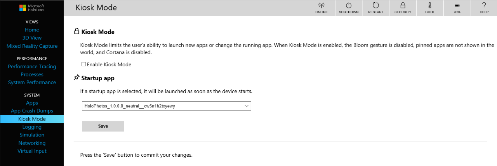

# Set up HoloLens in kiosk mode


In Windows 10, version 1803, you can configure your HoloLens devices to run as multi-app or single-app kiosks. You can also configure guest access for a HoloLens kiosk device by [designating a SpecialGroup account in your XML file.](#add-guest-access-to-the-kiosk-configuration-optional)

When HoloLens is configured as a multi-app kiosk, only the allowed apps are available to the user. The benefit of a multi-app kiosk, or fixed-purpose device, is to provide an easy-to-understand experience for individuals by putting in front of them only the things they need to use, and removing from their view the things they don’t need to access. 

Single-app kiosk mode starts the specified app when the user signs in, and restricts the user's ability to launch new apps or change the running app. When single-app kiosk mode is enabled for HoloLens, the bloom gesture and Cortana are disabled, and placed apps aren't shown in the user's surroundings. 

The following table lists the device capabilities in the different kiosk modes.

Kiosk mode | Voice and Bloom commands | Quick actions menu | Camera and video | Miracast
--- | --- | --- | --- | ---
Single-app kiosk |   |      |      |    
Multi-app kiosk |   |  with **Home** and **Volume** (default)<br><br>Photo and video buttons shown in Quick actions menu if the Camera app is enabled in the kiosk configuration.<br><br>Miracast is shown if the Camera app and device picker app are enabled in the kiosk configuration.    |  if the Camera app is enabled in the kiosk configuration.   |  if the Camera app and device picker app are enabled in the kiosk configuration.

>[!NOTE]
>Use the Application User Model ID (AUMID) to allow apps in your kiosk configuration. The Camera app AUMID is `HoloCamera_cw5n1h2txyewy!HoloCamera`. The device picker app AUMID is `HoloDevicesFlow_cw5n1h2txyewy!HoloDevicesFlow`.

The [AssignedAccess Configuration Service Provider (CSP)](https://docs.microsoft.com/windows/client-management/mdm/assignedaccess-csp) enables kiosk configuration. 

>[!WARNING]
>The assigned access feature which enables kiosk mode is intended for corporate-owned fixed-purpose devices. When the multi-app assigned access configuration is applied on the device, certain policies are enforced system-wide, and will impact other users on the device. Deleting the multi-app configuration will remove the assigned access lockdown profiles associated with the users, but it cannot revert all [the enforced policies](https://docs.microsoft.com/windows/configuration/lock-down-windows-10-to-specific-apps#policies-set-by-multi-app-kiosk-configuration). A factory reset is needed to clear all the policies enforced via assigned access.
>
>Be aware that voice commands are enabled for kiosk mode configured in Microsoft Intune or provisioning packages, even if the Cortana app is not selected as a kiosk app. 

For HoloLens devices running Windows 10, version 1803, there are three methods that you can use to configure the device as a kiosk:
- You can use [Microsoft Intune or other mobile device management (MDM) service](#set-up-kiosk-mode-using-microsoft-intune-or-mdm-windows-10-version-1803) to configure single-app and multi-app kiosks.
- You can [use a provisioning package](#setup-kiosk-mode-using-a-provisioning-package-windows-10-version-1803) to configure single-app and multi-app kiosks.
- You can [use the Windows Device Portal](#set-up-kiosk-mode-using-the-windows-device-portal-windows-10-version-1607-and-version-1803) to configure single-app kiosks. This method is recommended only for demonstrations, as it requires that developer mode be enabled on the device.

For HoloLens devices running Windows 10, version 1607, you can [use the Windows Device Portal](#set-up-kiosk-mode-using-the-windows-device-portal-windows-10-version-1607-and-version-1803) to configure single-app kiosks.

## Start layout for HoloLens

If you use [MDM, Microsoft Intune](#set-up-kiosk-mode-using-microsoft-intune-or-mdm-windows-10-version-1803), or a [provisioning package](#setup-kiosk-mode-using-a-provisioning-package-windows-10-version-1803) to configure a multi-app kiosk, the procedure requires a Start layout. Start layout customization isn't supported in Holographic for Business, so you'll need to use a placeholder Start layout. 

>[!NOTE]
>Because a single-app kiosk launches the kiosk app when a user signs in, there is no Start screen displayed.

### Start layout file for MDM (Intune and others)

Save the following sample as an XML file. You will select this file when you configure the kiosk in Microsoft Intune (or in another MDM service that provides a kiosk profile).

>[!NOTE]
>If you need to use a custom setting and full XML configuration to set up a kiosk in your MDM service, use the [Start layout instructions for a provisioning package](#start-layout-for-a-provisioning-package). 

```xml
<LayoutModificationTemplate
    xmlns="http://schemas.microsoft.com/Start/2014/LayoutModification"
    xmlns:defaultlayout="http://schemas.microsoft.com/Start/2014/FullDefaultLayout"
    xmlns:start="http://schemas.microsoft.com/Start/2014/StartLayout"
    Version="1">
  <RequiredStartGroupsCollection>
    <RequiredStartGroups>
      <AppendGroup Name="">
        <start:Tile Size="2x2" Column="0" Row="0" AppUserModelID="placeholderpackagename_kzf8qxf38zg5c!App" />
      </AppendGroup>      
    </RequiredStartGroups>
  </RequiredStartGroupsCollection> 
 </LayoutModificationTemplate>
```

### Start layout for a provisioning package

You will [create an XML file](#setup-kiosk-mode-using-a-provisioning-package-windows-10-version-1803) to define the kiosk configuration to be included in a provisioning package. Use the following sample in the `StartLayout` section of your XML file.

```xml
<!-- This section is required for parity with Desktop Assigned Access. It is not currently used on HoloLens -->
            <StartLayout>
                <![CDATA[<LayoutModificationTemplate xmlns:defaultlayout="http://schemas.microsoft.com/Start/2014/FullDefaultLayout" xmlns:start="http://schemas.microsoft.com/Start/2014/StartLayout" Version="1" xmlns="http://schemas.microsoft.com/Start/2014/LayoutModification">
                      <LayoutOptions StartTileGroupCellWidth="6" />
                      <DefaultLayoutOverride>
                        <StartLayoutCollection>
                          <defaultlayout:StartLayout GroupCellWidth="6">
                            <start:Group Name="">
                              <start:Tile Size="2x2" Column="0" Row="0" AppUserModelID="placeholderpackagename_kzf8qxf38zg5c!App" />
                            </start:Group>
                          </defaultlayout:StartLayout>
                        </StartLayoutCollection>
                      </DefaultLayoutOverride>
                    </LayoutModificationTemplate>
                ]]>
            </StartLayout>
            <!-- This section is required for parity with Desktop Assigned Access. It is not currently used on HoloLens -->
```

## Set up kiosk mode using Microsoft Intune or MDM (Windows 10, version 1803)

For HoloLens devices that are managed by Microsoft Intune, you [create a device profile](https://docs.microsoft.com/intune/device-profile-create) and configure the [Kiosk settings](https://docs.microsoft.com/intune/kiosk-settings).

For other MDM services, check your provider's documentation for instructions. If you need to use a custom setting and full XML configuration to set up a kiosk in your MDM service, [create an XML file that defines the kiosk configuration](#create-a-kiosk-configuration-xml-file), and make sure to include the [Start layout](#start-layout-for-a-provisioning-package) in the XML file.  

## Setup kiosk mode using a provisioning package (Windows 10, version 1803)

Process:
1. [Create an XML file that defines the kiosk configuration.](#create-a-kiosk-configuration-xml-file)
2. [Add the XML file to a provisioning package.](#add-the-kiosk-configuration-xml-file-to-a-provisioning-package)
3. [Apply the provisioning package to HoloLens.](#apply-the-provisioning-package-to-hololens)

### Create a kiosk configuration XML file

Follow [the instructions for creating a kiosk configuration XML file for desktop](https://docs.microsoft.com/windows/configuration/lock-down-windows-10-to-specific-apps#configure-a-kiosk-using-a-provisioning-package), with the following exceptions:

- Do not include Classic Windows applications (Win32) since they aren't supported on HoloLens.
- Use the [placeholder Start XML](#start-layout-for-hololens) for HoloLens.

#### Add guest access to the kiosk configuration (optional)

In the [Configs section of the XML file](https://docs.microsoft.com/windows/configuration/lock-down-windows-10-to-specific-apps#configs), you can configure a special group named **Visitor** to allow guests to use the kiosk. When the kiosk is configured with the **Visitor** special group, a "**Guest**" option is added to the sign-in page. The **Guest** account does not require a password, and any data associated with the account is deleted when the account signs out.

Use the following snippet in your kiosk configuration XML to enable the **Guest** account:

```xml
<Configs>
  <Config> 
    <SpecialGroup Name="Visitor" /> 
    <DefaultProfile Id="enter a profile ID"/> 
  </Config> 
</Configs> 
```

### Add the kiosk configuration XML file to a provisioning package

1. Open [Windows Configuration Designer](https://www.microsoft.com/store/apps/9nblggh4tx22).
2. Choose **Advanced provisioning**.
3. Name your project, and click **Next**.
4. Choose **Windows 10 Holographic** and click **Next**.
5. Select **Finish**. The workspace for your package opens.
6. Expand **Runtime settings** &gt; **AssignedAccess** &gt; **MultiAppAssignedAccessSettings**.
7. In the center pane, click **Browse** to locate and select the kiosk configuration XML file that you created.

   

8. (**Optional**: If you want to apply the provisioning package after device initial setup and there is an admin user already available on the kiosk device, skip this step.) Create an admin user account in **Runtime settings** &gt; **Accounts** &gt; **Users**. Provide a **UserName** and **Password**, and select **UserGroup** as **Administrators**. With this account, you can view the provisioning status and logs if needed.   
9. (**Optional**: If you already have a non-admin account on the kiosk device, skip this step.) Create a local standard user account in **Runtime settings** &gt; **Accounts** &gt; **Users**. Make sure the **UserName** is the same as the account that you specify in the configuration XML. Select **UserGroup** as **Standard Users**.
10. On the **File** menu, select **Save.**
11. On the **Export** menu, select **Provisioning package**.
12. Change **Owner** to **IT Admin**, which will set the precedence of this provisioning package higher than provisioning packages applied to this device from other sources, and then select **Next.**

13. On the **Provisioning package security** page, do not select **Enable package encryption** or provisioning will fail on HoloLens. You can choose to enable package signing.

      -   **Enable package signing** - If you select this option, you must select a valid certificate to use for signing the package. You can specify the certificate by clicking **Browse** and choosing the certificate you want to use to sign the package.

14. Click **Next** to specify the output location where you want the provisioning package to go when it's built. By default, Windows Configuration Designer uses the project folder as the output location. Optionally, you can click **Browse** to change the default output location.

15. Click **Next**.

16. Click **Build** to start building the package. The provisioning package doesn't take long to build. The project information is displayed in the build page and the progress bar indicates the build status.

    
### Apply the provisioning package to HoloLens

1. Connect HoloLens via USB to a PC and start the device, but do not continue past the **Fit** page of OOBE (the first page with the blue box).

3. HoloLens will show up as a device in File Explorer on the PC.

4. In File Explorer, drag and drop the provisioning package (.ppkg) onto the device storage.

5. Briefly press and release the **Volume Down** and **Power** buttons simultaneously again while on the **fit** page.

6. The device will ask you if you trust the package and would like to apply it. Confirm that you trust the package.

7. You will see whether the package was applied successfully or not. If it failed, you can fix your package and try again. If it succeeded, proceed with OOBE.


## Set up kiosk mode using the Windows Device Portal (Windows 10, version 1607 and version 1803) 

1. [Set up the HoloLens to use the Windows Device Portal](https://developer.microsoft.com/windows/mixed-reality/using_the_windows_device_portal#setting_up_hololens_to_use_windows_device_portal). The Device Portal is a web server on your HoloLens that you can connect to from a web browser on your PC. 

    >[!IMPORTANT]
    >When you set up HoloLens to use the Device Portal, you must enable **Developer Mode** on the device. **Developer Mode** on a device that has been upgraded to Windows Holographic for Business enables side-loading of apps, which risks the installation of apps that have not been certified by the Microsoft Store. Administrators can block the ability to enable **Developer Mode** using the **ApplicationManagement/AllowDeveloper Unlock** setting in the [Policy CSP](https://msdn.microsoft.com/library/windows/hardware/dn904962.aspx). [Learn more about Developer Mode.](https://msdn.microsoft.com/windows/uwp/get-started/enable-your-device-for-development#developer-mode)
    
2. On a PC, connect to the HoloLens using [Wi-Fi](https://developer.microsoft.com/windows/mixed-reality/Using_the_Windows_Device_Portal.html#connecting_over_wi-fi) or [USB](https://developer.microsoft.com/windows/mixed-reality/Using_the_Windows_Device_Portal.html#connecting_over_usb).

3. [Create a user name and password](https://developer.microsoft.com/windows/mixed-reality/Using_the_Windows_Device_Portal.html#creating_a_username_and_password) if this is the first time you connect to the Windows Device Portal, or enter the user name and password that you previously set up.

    >[!TIP]
    >If you see a certificate error in the browser, follow [these troubleshooting steps](https://developer.microsoft.com/windows/mixed-reality/Using_the_Windows_Device_Portal.html#security_certificate). 

4. In the Windows Device Portal, click **Kiosk Mode**.

    

    >[!NOTE]
    >The kiosk mode option will be available if the device is [enrolled in device management](hololens-enroll-mdm.md) and has a [license to upgrade to Windows Holographic for Business](hololens-upgrade-enterprise.md).

5. Select **Enable Kiosk Mode**, choose an app to run when the device starts, and click **Save**.


## Kiosk app recommendations

- You cannot select Microsoft Edge, Microsoft Store, or the Shell app as a kiosk app.
- We recommend that you do **not** select the Settings app and the File Explorer app as a kiosk app.
- You can select Cortana as a kiosk app. 
- To enable photo or video capture, the HoloCamera app must be enabled as a kiosk app.

## More information


Watch how to configure a kiosk in a provisioning package.
>[!VIDEO https://www.microsoft.com/videoplayer/embed/fa125d0f-77e4-4f64-b03e-d634a4926884?autoplay=false]
