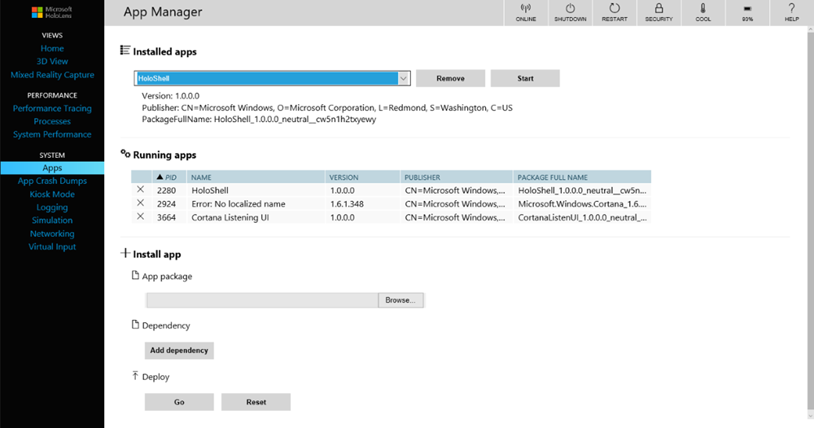

# Known issues for HoloLens

This is the current list of known issues for HoloLens devices. Check here first if you are seeing an odd behavior. This list will be kept updated as new issues are discovered or reported, or as issues are addressed in future HoloLens software updates.

>[!NOTE]
> - If you discover an issue that is not blocking you please report it on your HoloLens device via [Feedback Hub](hololens-feedback.md).
> - If the issue you are facing is blocking you, in addtion to filing feedback, please  [file a support request](https://aka.ms/hlsupport).

- [Known issues for all HoloLens generations](#known-issues-for-all-hololens-generations)
- [Known issues for HoloLens 2 devices](#known-issues-for-hololens-2-devices)
- [Known issues for HoloLens (1st Gen)](#known-issues-for-hololens-1st-gen)
- [Known issues for HoloLens emulator](#known-issues-for-hololens-emulator)

## Known issues for all HoloLens generations

### Unity

- See [Install the tools](https://docs.microsoft.com/windows/mixed-reality/install-the-tools) for the most up-to-date version of Unity recommended for HoloLens development.
- Known issues with the Unity HoloLens Technical Preview are documented in the [HoloLens Unity forums](https://forum.unity3d.com/threads/known-issues.394627/).

### Windows Device Portal

- The Live Preview feature in Mixed Reality capture may exhibit several seconds of latency.
- On the Virtual Input page, the Gesture and Scroll controls under the Virtual Gestures section are not functional. Using them will have no effect. The virtual keyboard on the same page works correctly.
- After enabling Developer Mode in Settings, it may take a few seconds before the switch to turn on the Device Portal is enabled.

## Known issues for HoloLens 2 devices

### Blue screen is shown after unenrolling from Insider preview builds on a device reflashed with a Insider build

This is an issue affecting that affects users who are were on an Insider preview build, reflashed their HoloLens 2 with a new insider preview build, and then unenrolled from the Insider program. 

This does not affect:
- Users who are not enrolled in Windows Insider 
- Insiders:
    - If a device has been enrolled since Insider builds were version 18362.x
    - If they flashed a Insider signed 19041.x build AND stay enrolled in the Insider program 

Work-around: 
- Avoid the issue 
    - Flash a non-insider build. One of the regular monthly updates. 
    - Stay on Insider Preview
- Reflash the device
    1. Put the [HoloLens 2 into flashing mode](https://review.docs.microsoft.com/hololens/hololens-recovery?branch=master#hololens-2) manually by fully powering down while not connect. Then while holding Volume up, tap the Power button.
    1. Connect to the PC and open Advanced Recovery Companion. 
    1. Flash the HoloLens 2 to the default build.   

## Known issues for HoloLens (1st Gen)

### Unable to connect and deploy to HoloLens through Visual Studio

> [!NOTE]
> Last Update: 8/8 @ 5:11PM - Visual Studio has released VS 2019 Version 16.2 which includes a fix to this issue. We recommend updating to this newest version to avoid experiencing this error.

Visual Studio has released VS 2019 Version 16.2 which includes a fix to this issue. We recommend updating to this newest version to avoid experiencing this error.

Issue root-cause: Users who used Visual Studio 2015 or early releases of Visual Studio 2017 to deploy and debug applications on their HoloLens and then subsequently used the latest versions of Visual Studio 2017 or Visual Studio 2019 with the same HoloLens will be affected. The newer releases of Visual Studio deploy a new version of a component, but files from the older version are left over on the device, causing the newer version to fail.  This causes the following error message: DEP0100: Please ensure that target device has developer mode enabled. Could not obtain a developer license on \<ip\> due to error 80004005.

#### Workaround

Our team is currently working on a fix. In the meantime, you can use the following steps to work around the issue and help unblock deployment and debugging:  

1. Open Visual Studio
1. Select **File** > **New** > **Project**.
1. Select **Visual C#** > **Windows Desktop** > **Console App (.NET Framework)**.
1. Give the project a name (such as "HoloLensDeploymentFix") and make sure the Framework is set to at least .NET Framework 4.5, then Select **OK**.
1. Right-click on the **References** node in Solution Explorer and add the following references (select to the **Browse** section and select **Browse**):

    ```CMD
    C:\Program Files (x86)\Windows Kits\10\bin\10.0.18362.0\x86\Microsoft.Tools.Deploy.dll
    C:\Program Files (x86)\Windows Kits\10\bin\10.0.18362.0\x86\Microsoft.Tools.Connectivity.dll
    C:\Program Files (x86)\Windows Kits\10\bin\10.0.18362.0\x86\SirepInterop.dll
    ```

    > [!NOTE]
    > If you don't have 10.0.18362.0 installed, use the most recent version that you have. 

1. Right-click on the project in Solution Explorer and select **Add** > **Existing Item**.
1. Browse to C:\Program Files (x86)\Windows Kits\10\bin\10.0.18362.0\x86 and change the filter to **All Files (\*.\*)**.
1. Select both SirepClient.dll and SshClient.dll, and Select **Add**.
1. Locate and select both files in Solution Explorer (they should be at the bottom of the list of files) and change **Copy to Output Directory** in the **Properties** window to **Copy always**.
1. At the top of the file, add the following to the existing list of `using` statements:

    ```CMD
    using Microsoft.Tools.Deploy;
    using System.Net;
    ```

1. Inside of `static void Main(...)`, add the following code:

    ```PowerShell
    RemoteDeployClient client = RemoteDeployClient.CreateRemoteDeployClient();
    client.Connect(new ConnectionOptions()
    {
        Credentials = new NetworkCredential("DevToolsUser", string.Empty),
        IPAddress = IPAddress.Parse(args[0])
    });
    client.RemoteDevice.DeleteFile(@"C:\Data\Users\DefaultAccount\AppData\Local\DevelopmentFiles\VSRemoteTools\x86\CoreCLR\mscorlib.ni.dll");
    ```

1. Select **Build** > **Build Solution**.
1. Open a Command Prompt Window and cd to the folder that contains the compiled .exe file (for example, C:\MyProjects\HoloLensDeploymentFix\bin\Debug)
1. Run the executable and provide the device's IP address as a command-line argument. (If connected using USB, you can use 127.0.0.1, otherwise use the device's Wi-Fi IP address.)  For example, "HoloLensDeploymentFix 127.0.0.1"

1. After the tool has exited without any messages (this should only take a few seconds), you will now be able to deploy and debug from Visual Studio 2017 or newer.  Continued use of the tool is not necessary.

We will provide further updates as they become available.

### Issues launching the Microsoft Store and apps on HoloLens

> [!NOTE]
> Last Update: 4/2 @ 10 AM - Issue resolved. 

You may experience issues when trying to launch the Microsoft Store and apps on HoloLens. We've determined that the issue occurs when background app updates deploy a newer version of framework packages in specific sequences while one or more of their dependent apps are still running. In this case,  an automatic app update delivered a new version of the .NET Native Framework (version 10.0.25531 to 10.0.27413) caused the apps that are running to not correctly update for all running apps consuming the prior version of the framework.  The flow for framework update is as follows: 

1. The new framework package is downloaded from the store and installed
1. All apps using the older framework are 'updated' to use the newer version

If step 2 is interrupted before completion then any apps for which the newer framework wasn't registered will fail to launch from the start menu.  We believe any app on HoloLens could be affected by this issue.

Some users have reported that closing hung apps and launching other apps such as Feedback Hub, 3D Viewer or Photos resolves the issue for them&mdash;however, this does not work 100% of the time.

We have root caused that this issue was not caused the update itself, but a bug in the OS that resulted in the .NET Native framework update being handled incorrectly. We are pleased to announce that we have identified a fix and have released an update (OS version 17763.380) containing the fix.  

To see if your device can take the update, please:

1. Go to the Settings app and open **Update & Security**.
1. Select **Check for Updates**.
1. If update to 17763.380 is available, please update to this build to receive the fix for the App Hang bug
1. Upon updating to this version of the OS, the Apps should work as expected.

Additionally, as we do with every HoloLens OS release, we have posted the FFU image to the [Microsoft Download Center](https://aka.ms/hololensdownload/10.0.17763.380).

If you would not like to take the update, we have released a new version of the Microsoft Store UWP app as of 3/29. After you have the updated version of the Store:

1. Open the Store and confirm that it loads.
1. Use the bloom gesture to open the menu.
1. Attempt to open previously broken apps.
1. If it still cannot be launched, tap and hold the icon of the broken app and select uninstall.
1. Resinstall these apps from the store.

If your device is still unable to load apps, you can sideload a version of the .NET Native Framework and Runtime through the download center by following these steps:

1. Please download [this zip file](https://download.microsoft.com/download/8/5/C/85C23745-794C-419D-B8D7-115FBCCD6DA7/netfx_1.7.zip) from the Microsoft Download Center. Unzipping will produce two files.  Microsoft.NET.Native.Runtime.1.7.appx and Microsoft.NET.Native.Framework.1.7.appx
1. Please verify that your device is dev unlocked.  If you haven't done that before the instructions to do that are [here](https://docs.microsoft.com/windows/mixed-reality/using-the-windows-device-portal).
1. You then want to get into the Windows Device Portal. Our recommendation is to do this over USB and you would do that by typing http://127.0.0.1:10080 into your browser.
1. After you have the Windows Device Portal up we need you to "side load" the two files that you downloaded. To do that you need to go down the left side bar until you get to the **Apps** section and select **Apps**.
1. You will then see a screen that is similar to the below.  You want to go to the section that says **Install App** and browse to where you unzipped those two APPX files. You can only do one at a time, so after you select the first one, then click on "Go" under the Deploy section. Then do this for the second APPX file.

   
1. At this point we believe your applications should start working again and that you can also get to the Store.
1. In some cases, it is necessary run the additional step of launching the 3D Viewer app before affected apps will launch. 

We appreciate your patience as we have gone through the process to get this issue resolved, and we look forward to continued working with our community to create successful Mixed Reality experiences.

### Device Update

- 30 seconds after a new update, the shell may disappear one time. Please perform the **bloom** gesture to resume your session.

### Visual Studio

- See [Install the tools](https://docs.microsoft.com/windows/mixed-reality/install-the-tools) for the most up-to-date version of Visual Studio that is recommended for HoloLens development.
- When deploying an app from Visual Studio to your HoloLens, you may see the error: **The requested operation cannot be performed on a file with a user-mapped section open. (Exception from HRESULT: 0x800704C8)**. If this happens, try again and your deployment will generally succeed.

### API

- If the application sets the [focus point](https://docs.microsoft.com/windows/mixed-reality/focus-point-in-unity) behind the user or the normal to camera.forward, holograms will not appear in Mixed Reality Capture photos or videos. Until this bug is fixed in Windows, if applications actively set the [focus point](https://docs.microsoft.com/windows/mixed-reality/focus-point-in-unity) they should ensure the plane normal is set opposite camera-forward (for example, normal = -camera.forward).

### Xbox Wireless Controller

- Xbox Wireless Controller S must be updated before it can be used with HoloLens. Ensure you are [up to date](https://support.xbox.com/xbox-one/accessories/update-controller-for-stereo-headset-adapter) before attempting to pair your controller with a HoloLens.
- If you reboot your HoloLens while the Xbox Wireless Controller is connected, the controller will not automatically reconnect to HoloLens. The Guide button light will flash slowly until the controller powers off after 3 minutes. To reconnect your controller immediately, power off the controller by holding the Guide button until the light turns off. When you power your controller on again, it will reconnect to HoloLens.
- If your HoloLens enters standby while the Xbox Wireless Controller is connected, any input on the controller will wake the HoloLens. You can prevent this by powering off your controller when you are done using it.

## Known issues for HoloLens emulator

- Not all apps in the Microsoft Store are compatible with the emulator. For example, Young Conker and Fragments are not playable on the emulator.
- You cannot use the PC webcam in the Emulator.
- The Live Preview feature of the Windows Device Portal does not work with the emulator. You can still capture Mixed Reality videos and images.
