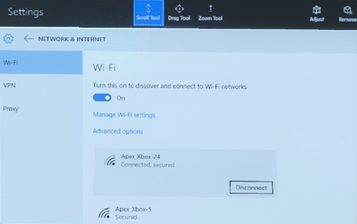
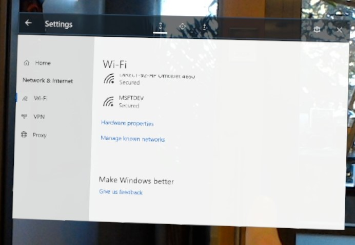

# Connect to a network

You'll need to be connected to a network to do most things on your HoloLens. [What can I do offline](hololens-offline.md)?

## Connecting for the first time

The first time you use your HoloLens, you'll be guided through connecting to a Wi-Fi network. If you have trouble connecting to Wi-Fi during setup, make sure your network is either open, password protected, or a captive portal network and doesn't require using certificates to connect. After setup, you can connect to other types of Wi-Fi networks.

## Connecting to Wi-Fi after setup

1. Go to **Start**, then select **Settings**.
1. _HoloLens (1st gen) only_ - Use your gaze to position the Settings app, then air tap to place it, or say "Place."
1. Select **Network & Internet** > **Wi-Fi**. If you don't see your network, scroll down the list.
1. Select a network > **Connect**.
1. Type the network password if asked for one, then select **Next**.

## Connecting to Wi-Fi on HoloLens (1st gen)

HoloLens contains a 802.11ac-capable, 2x2 Wi-Fi radio. Connecting HoloLens to a Wi-Fi network is similar to connecting a Windows 10 Desktop or Mobile device to a Wi-Fi network.

1. Open the **Start** menu.
1. Select the Settings app from **Start** or from the **All Apps** list on the right of the **Start** menu. The Settings app will be auto-placed in front of you.
1. Select **Network & Internet**.
1. Make sure Wi-Fi is turned on.
1. Select a Wi-Fi network from the list.
1. If needed, type in the Wi-Fi network password.

You can also confirm you are connected to a Wi-Fi network by checking the Wi-Fi status in the **Start** menu:

1. Open the **Start** menu.
2. Look at the top left of the **Start** menu for Wi-Fi status. The state of Wi-Fi and the SSID of the connected network will be shown.

## Disabling Wi-Fi on HoloLens (1st gen)

### Using the Settings app on HoloLens

1. Open the **Start** menu.
1. Select the **Settings** app from **Start** or from the **All Apps** list on the right of the **Start** menu. The **Settings** app will be auto-placed in front of you.
1. Select **Network & Internet**.
1. Select the Wi-Fi slider switch to move it to the **Off** position. This will turn off the RF components of the Wi-Fi radio and disable all Wi-Fi functionality on HoloLens.

    > [!WARNING]
    > When the Wi-Fi radio is disabled, HoloLens will not be able to automatically load your [spaces](hololens-spaces.md).

1. Move the slider switch to the **On** position to turn on the Wi-Fi radio and restore Wi-Fi functionality on Microsoft HoloLens. The selected Wi-Fi radio state (**On** or **Off**) will persist across reboots.

## Identifying the IP Address of your HoloLens on the Wi-Fi network

### Using the Settings app

1. Open the **Start** menu.
1. Select the **Settings** app from **Start** or from the **All Apps** list on the right of the **Start** menu. The **Settings** app will be auto-placed in front of you.
1. Select **Network & Internet**.
1. Scroll down to beneath the list of available Wi-Fi networks and select **Hardware properties**.

    

   The IP address will be shown next to **IPv4 address**.

### Using Cortana

Say "Hey Cortana, What's my IP address?" and Cortana will display and read out your IP address.

### Using Windows Device Portal

1. Open the [device portal](/windows/mixed-reality/using-the-windows-device-portal.md#networking) in a web browser on your PC.
1. Navigate to the **Networking** section.  
   Your IP address and other network information will be displayed there. This method allows for easy copy and paste of the IP address on your development PC.
