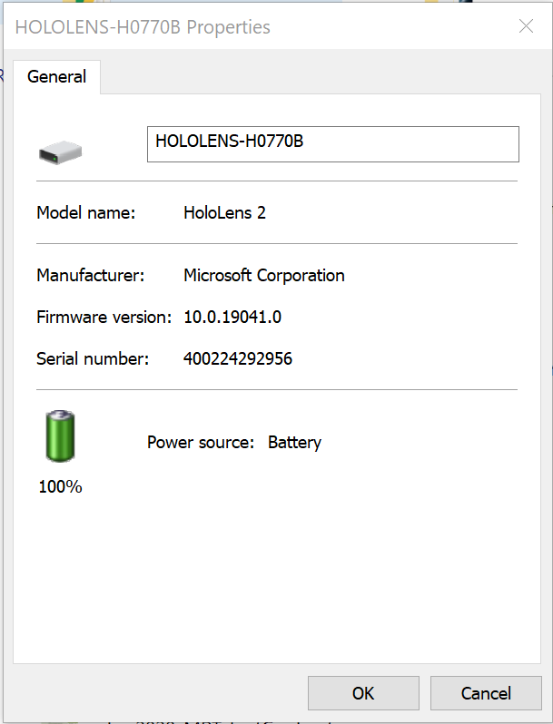
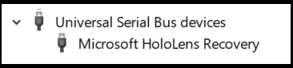
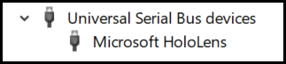
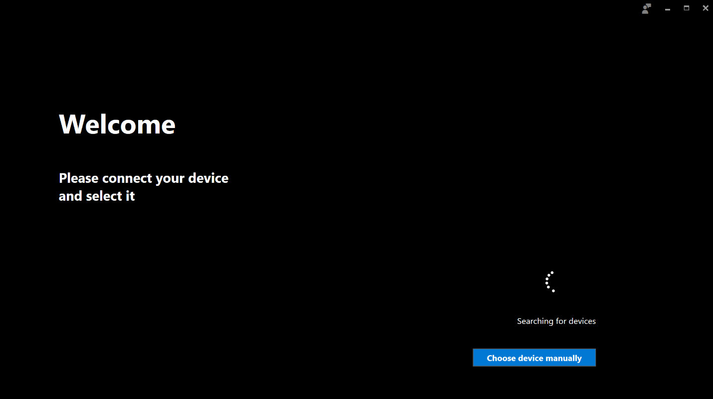
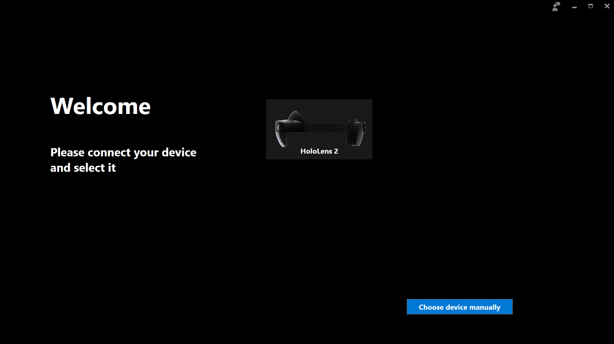

# Reset and Recovery for HoloLens 2

## Charging the device

Before starting any troubleshooting procedure, if possible, ensure that your device is charged at least between 20% and 40%.

Please ensure you are using the charger and the USB Type-C cables that come with the HoloLens2 device. In case they are not available ensure the charger available can support at least 15W of power.

> [!NOTE]
> If possible, do not use a PC to charge the device over USB as this will provide a very slow charge.

If the device is correctly booted and running there are three different ways of checking the charge of your battery.

1. From the main menu of the HoloLens Device UI.
2. Using the LED close to the power button (for 40% you should see at least two solid LEDS).
3. On your Host PC open File Explorer window and look for your HoloLens 2 device on left side under “This PC”.
    
      a. Right click on the name of the device and select properties. A dialog will appear showing the battery level for your device.



If the device cannot be booted to the Startup Menu, please take note of the LEDs and enumeration on the host PC and follow the troubleshooting guide (https://docs.microsoft.com/hololens/hololens-troubleshooting). In case the state of the device does not fall in any of the states listed in the troubleshooting guide, execute the **hard reset procedure** without reconnecting the device to your host PC, but connect it instead to the power supply. Wait for at least one hour for the device to charge.

## Reset the device

Under certain circumstances the customer may be required to manually reset the device without using the SW UI. 

### Standard procedure
1. Disconnect the device from the power supply or the host PC by unplugging the Type-C cable.

2. Press and hold the **power button** for 15 seconds. All LEDs should be off.

3. Wait 2-3 seconds and Short press the **power button**, the LEDs close to the power button will light up and the device will start to boot. 

4. Connect the device to the host PC, open Device Manager (for Windows 10 press the **“Windows” key** and then the **“x” key** and click on “Device Manager”) and make sure the device enumerates correctly as Microsoft HoloLens as shown in the pictures below:



### Hard-reset procedure

If the standard reset procedure does not work, you can use the hard-reset procedure.

1. Disconnect the device from the power supply or the host PC by unplugging the Type-C cable.

2. Hold **volume down + power button** for 15 seconds.

3. The device will automatically reboot. 

4. Connect the device to the host PC, open Device Manager (for Windows 10 press the **“Windows” key** and then the **“x” key** and click on “Device Manager”) and make sure the device enumerates correctly as Microsoft HoloLens as shown in the pictures below.



## Clean reflash the device

In extraordinary situations you may be required to clean flash the device. There are two ways to reflash a HoloLens2 device. For all reflashing procedures you will be required to [install the Advanced Recovery Companion app from the Windows Store](https://www.microsoft.com/store/productId/9P74Z35SFRS8). If you reset your device, all your personal data, apps, and settings will be erased, including TPM reset.

Advanced Recovery Companion is currently set to download the feature release build for [Windows Holographic 2004](hololens-release-notes.md#windows-holographic-version-2004), if you would like to download the latest HoloLens 2 FFU to flash your device via Advanced Recovery Companion then you may download it from [here](https://aka.ms/hololens2download). This is kept up-to-date and will match the latest generally available build. 

Before starting the flashing procedure make sure the app is installed and running on your Windows 10 PC and ready to detect the device.



### Normal procedure

1. While the HoloLens device is running, connect it to your Windows 10 PC where you previously launched the Advanced Recovery Companion App.

2. The device will automatically be detected and the Advanced Recovery Companion App UI will update as follows:



3. Select the HoloLens2 device in the Advanced Recovery Companion App UI and follow the instructions to complete the flashing.

### Manual procedure

If the device does not boot correctly you may need to put the HoloLens 2 device in Recovery mode.

1. Disconnect the device from the power supply or the host PC by unplugging the Type-C cable. 

2. Press and hold the **power button** for 15 seconds. All LEDs should turn off. 

3. While pressing the **volume up button**, press and release the **power button** to boot the device. Wait 15 seconds before releasing the volume up button. Out of the 5 LEDs on the device, only the middle LED will light up.

4. Connect the device to the host PC, open Device Manager (for Windows 10 press the **“Windows” key** and then the **“x” key** and click on “Device Manager”) and make sure the device enumerates correctly as Microsoft HoloLens as shown in the image below.


5. The device will be automatically detected, and the Advanced Recovery Companion app UI will update as follows:


6. Select the HoloLens 2 device in the Advanced Recovery Companion app UI and follow the instructions to complete the flashing.

## Downloading ARC without using the app store

If an IT environment prevents the use of the Windows Store app or limits access to the retail store, IT administrators can make this app available through other ‘offline’ deployment paths. 

- This process may also be used for other apps, as seen in step 2. This guide will focus on Advanced Recovery Companion, but my be modified for other offline apps.  

This deployment path can be enabled with the following steps:
1.	Go to the [Store For Business website](https://businessstore.microsoft.com) and sign-in with an Azure AD identity.
1.	Go to **Manage – Settings**, and turn on **Show offline apps** under **Shopping experience** as described at https://businessstore.microsoft.com/manage/settings/shop 
1.	Go to **shop for my group** and search for the [Advanced Recovery Companion](https://businessstore.microsoft.com/store/details/advanced-recovery-companion/9P74Z35SFRS8) app.
1.	Change the **License Type** box to offline and click **Manage**.
1.	Under Download the package for offline use click the second blue **“Download”** button . Ensure the file extension is .appxbundle.
1.	At this stage, if the Desktop PC has Internet access, simply double click and install. 
1.	The IT administrator can also distribute this app through System Center Configuration Manager (SCCM) or Intune.
1.	If the target PC has no Internet connectivity, some additional steps are needed: 
    1.	Select the unencoded license and click **“Generate license”** and under **“Required Frameworks”** click **“Download.”** 
    1.	PCs without internet access will need to use DISM to apply the package with the dependency and license. In an administrator command prompt, type:

      ```console
      C:\WINDOWS\system32>dism /online /Add-ProvisionedAppxPackage /PackagePath:"C:\ARCoffline\Microsoft.AdvancedRecoveryCompanion_1.19050.1301.0_neutral_~_8wekyb3d8bbwe.appxbundle" /DependencyPackagePath:"C:\ARCoffline\Microsoft.VCLibs.140.00.UWPDesktop_14.0.27629.0_x86__8wekyb3d8bbwe.appx" /LicensePath:"C:\ARCoffline\Microsoft.AdvancedRecoveryCompanion_8wekyb3d8bbwe_f72ce112-dd2e-d771-8827-9cbcbf89f8b5.xml" /Region:all
      ```
> [!NOTE]
> The version number in this code example may not match the currently avalible version. You may have also choosen a different download location than in the example given. Please make sure to make any changes as needed.

> [!TIP]
> When planning to use Advanced Recovery Companion to install an ffu offline it may be useful to download your flashing image to be availible, here is the [current image for HoloLens 2](https://aka.ms/hololens2download). 

Other resources:
- https://docs.microsoft.com/microsoft-store/distribute-offline-apps 
- https://docs.microsoft.com/windows-hardware/manufacture/desktop/dism-app-package--appx-or-appxbundle--servicing-command-line-options


