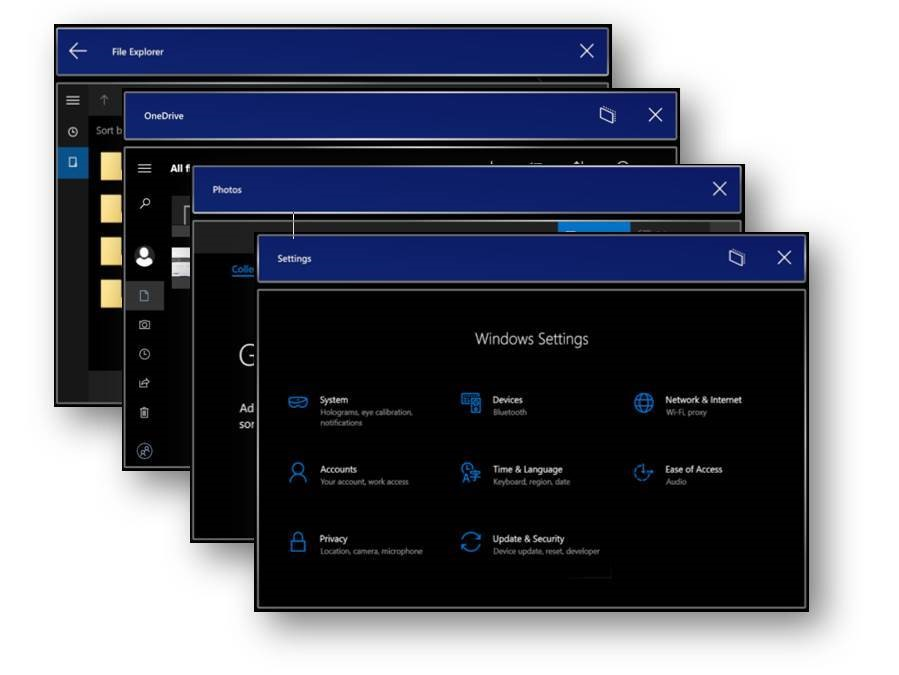

# HoloLens release notes

## HoloLens 2

> [!Note]
> HoloLens Emulator Release Notes can be found [here](https://docs.microsoft.com/windows/mixed-reality/hololens-emulator-archive).

### Windows Holographic May 2020 Update 
Build - 19041.1103

|             Feature                              |          Description                                                                                              |
|--------------------------------------------------|-------------------------------------------------------------------------------------------------------------------|
|       Windows Autopilot                          |          Pre-configure and seamlessly set up   new devices for production, with Windows AutoPilot                 |
|       FIDO 2 support                             |          Support for FIDO2 Security Keys to   enable fast and secure authentication for shared devices            |
|       Improved provisioning                      |          Seamlessly apply a provisioning   package from a USB drive to your HoloLens                              |
|       Application install status                 |          Check install status for apps have   been pushed to HoloLens 2 via MDM, in the Settings app              |
|       Configuration Service Providers   (CSPs)   |          Added new Configuration Service   Providers (CSPs) enhancing admin control capabilities.                 |
|       USB 5G/LTE tethering                       |          Expanded USB Ethernet capability   enables support for 5G/LTE dongles                                    |
|       Dark App Mode                              |          Dark App Mode for apps that support   both dark and light modes, improving the viewing experience        |
|       Voice Commands                             |          Support for additional system voice   commands to control HoloLens, hands-free                           |
|       Hand Tracking improvements                 |          Hand Tracking improvements make   buttons and 2D slate interactions more accurate                        |
|       Performance and reliability                |          Various system performance and   reliability improvements across the platform                            |

#### Support for Windows Autopilot 

Windows Autopilot for HoloLens 2 lets the device sales channel pre-enroll HoloLens into your Intune tenant.  When devices arrive, they’re ready to self-deploy as shared devices under your tenant. To take advantage of self-deployment, devices will need to connect to a network during the first screen in setup using either a USB-C to ethernet dongle or USB-C to LTE dongle. 

When a user starts the Autopilot self-deploying process, the process completes the following steps: 

1. Join the device to Azure Active Directory (Azure AD). 
1. Use Azure AD to enroll the device in Microsoft Intune (or another MDM service). 
1. Download the device-targeted policies, certificates, and networking profiles. 
1. Provision the device. 
1. Present the sign-in screen to the user. 

Learn more from the [Windows Autopilot for HoloLens 2 evaluation guide](https://docs.microsoft.com/hololens/hololens2-autopilot).

**Contact your Account Manager to join the AutoPilot preview now. Autopilot-ready devices will begin shipping around June.**

#### FIDO2 Security Key support 

Many of you share a HoloLens device with lots of people in a work or school environment. Whether devices are shared between students in a classroom or they're checked out from a device locker, it's important to be able to change users quickly and easily without typing long usernames and passwords. 

FIDO lets anyone in your organization (AAD tenant) seamlessly sign into HoloLens without entering a username or password. 

FIDO2 security keys are an unphishable standards-based passwordless authentication method that can come in any form factor. Fast Identity Online (FIDO) is an open standard for passwordless authentication. FIDO allows users and organizations to leverage the standard to sign-in to their resources without a username or password using an external security key or a platform key built into a device. 

Read the [passwordless security docs](https://docs.microsoft.com/azure/active-directory/authentication/howto-authentication-passwordless-security-key) to get started. 

#### Improved MDM enrollment via provisioning package 

Provisioning packages let you set HoloLens configuration through a config file rather than going through the HoloLens out of box experience. Previously, provisioning packages had to be copied onto HoloLens' internal memory, now they can be on a USB drive so they're easier to re-use on multiple HoloLens and so more people can provision HoloLens in parallel.  In addition, provisioning packages support a new field to enroll in device management so there is no manual set up post-provisioning. 

1. To try it out, download the latest version of the Windows Configuration Designer from the Windows store onto your PC. 
1. Select **Provision HoloLens Devices** > Select **Provision HoloLens 2 devices** 
1. Build your configuration profile and, when you're done, copy all files created to a USB-C storage device. 
1. Plug it into any freshly flashed HoloLens and press **Volume down + Power** to apply your provisioning package. 

#### MDM Policies 

MDM app deployment and management for Line of Business (LOB) apps is critical for our customers. Admins and users need to be able to view app install status, for auditing and diagnosis purposes. In this release we are adding more details in **Settings > Accounts > Access work or school > Click on your account > Info.**

#### Additional CSPs and Policies 

A [configuration service provider (CSP)](https://docs.microsoft.com/windows/client-management/mdm/configuration-service-provider-reference?redirectedfrom=MSDN) is an interface to read, set, modify, or delete configuration settings on a device. In this release, we are adding support for more policies, increasing the control administrators have over deployed HoloLens devices. For the list of CSPs supported by HoloLens, visit this [link](https://docs.microsoft.com/windows/client-management/mdm/networkqospolicy-csp). New in this release:

**Policy CSP** 

The Policy configuration service provider enables the enterprise to configure policies on Windows devices. In this release, we are adding new policies for HoloLens, listed below. You can learn more about supported policies [here](https://docs.microsoft.com/windows/client-management/mdm/policies-supported-by-hololens2).  

- LetAppsAccessCamera_ForceAllowTheseApps  
- LetAppsAccessCamera_ForceDenyTheseApps  
- LetAppsAccessCamera_UserInControlOfTheseApps 
- LetAppsAccessGazeInput 
- LetAppsAccessGazeInput_ForceAllowTheseApps 
- LetAppsAccessGazeInput_ForceDenyTheseApps 
- LetAppsAccessGazeInput_UserInControlOfTheseApps 
- LetAppsAccessMicrophone_ForceAllowTheseApps 
- LetAppsAccessMicrophone_ForceDenyTheseApps 
- LetAppsAccessMicrophone_UserInControlOfTheseApps 
- AllowWiFi 

**NetworkQoSPolicy CSP** 
The NetworkQoSPolicy configuration service provider creates network Quality of Service (QoS) policies. A QoS policy performs a set of actions on network traffic based on a set of matching conditions. You can learn more about this policy [here](https://docs.microsoft.com/windows/client-management/mdm/networkqospolicy-csp). 

##### Expanded USB Ethernet support for 5G/LTE tethered devices

Support has been added to enable certain mobile broadband devices, such as 5G/LTE phones and WiFi hotpots when tethered to the HoloLens 2 via USB. These devices will be displayed in network settings as another ethernet connection. Mobile broadband devices that require an external driver are not supported. This enables high bandwidth connections in scenarios where WiFi is not available, and WiFi tethering isn’t performant enough. You can learn more about supported USB devices [here](https://docs.microsoft.com/hololens/hololens-connect-devices).  

Hand Tracking Improvements

Hand tracking has received several improvements in this release. 

- **Pointing pose stability:** The system will now resist bending the index finger when it becomes occluded by the palm.  This improves accuracy when pushing buttons, typing, scrolling content, and more! 
- **Reduced accidental AirTaps:** We’ve improved detection of the AirTap gesture.  Now there are fewer accidental activations in several common cases, such as dropping your hands to your side. 
- **User switch reliability:** The system is now faster and more reliable at updating the hand size when sharing a device back and forth. 
- **Reduced hand stealing:** We’ve improved handling of cases where there are more than 2 hands in view of the sensors.  If multiple people are working close together, there is now a much lower chance that the tracked hand will jump from the user to the hand of someone else in the scene. 
- **System reliability:** Fixed an issue that would cause hand tracking to stop working for a period if the device is under high load. 

#### Dark mode

Many Windows apps now support both dark and light modes, and HoloLens 2 customers can choose the default mode for apps that support both. Once updated, the default app mode will be "dark," but can be changed easily. Navigate to Settings > System > Colors to find "Choose your default app mode." Here are some of the in-box apps that support Dark mode: 

- Settings 
- Microsoft Store 
- Mail 
- Calendar 
- File Explorer 
- Feedback Hub 
- OneDrive 
- Photos 
- 3D Viewer 
- Movies & TV 

#### System voice commands

You can now quickly access and use commands with your voice while using any app on the device. If you're running your system with a different language, please try the appropriate commands in that language. For more details on the commands and how to use them, see our documentation [here](https://docs.microsoft.com/hololens/hololens-cortana).  

#### Cortana updates 

The updated app integrates with Microsoft 365, currently in English (United States) only, to help you get more done across your devices. On HoloLens 2, Cortana will no longer support certain device-specific commands like adjusting the volume or restarting the device, which are now supported with the new system voice commands mentioned above. Learn more about the new Cortana app and its direction on our blog [here](https://blogs.windows.com/windowsexperience/2020/02/28/cortana-in-the-upcoming-windows-10-release-focused-on-your-productivity-with-enhanced-security-and-privacy/). 

> ![NOTE]
> Note: There's currently an issue we're investigating that requires you to launch the app after booting the device in order to use the "Hey Cortana" keyword activation, and if you updated from a 18362 build, you may see an app tile for the previous version of the Cortana app in Start that no longer works. 

#### Quality improvements & fixes 

Improvements and Fixes also in the update:  
- The update introduces an active display calibration system. This improves the stability and alignment of holograms, which helps them stay in place when moving your head side-to-side. 
- Fixed a bug where Wi-Fi streaming to HoloLens gets disrupted periodically. If an application indicates that it needs low latency streaming this fix is can be accomplished by calling [this function](https://docs.microsoft.com/windows/win32/api/socketapi/nf-socketapi-setsocketmediastreamingmode). 
- Fixed an issue where the device could hang during streaming in research mode. 
- Fixed bug where in some cases the right user would not be displayed on sign-in screen when resuming session. 
- Fixed an issue where users could not export MDM logs through settings. 
- Fixed an issue where the accuracy of eye tracking immediately following out-of-box-setup could be lower than specification. 
- Fixed an issue where eye tracking subsystem would fail to initialize and/or perform calibration under certain conditions. 
- Fixed an issue where eye calibration would be prompted for an already calibrated user. 
- Fixed an issue where a driver would crash during eye calibration. 
- Fixed an issue where repeated power button presses can cause a 60 second system time-out and shell crash. 
- Improved stability for depth buffers. 
- Added ‘Share’ button in Feedback Hub so users can more easily share feedback. 
- Fixed a bug where RoboRaid did not install correctly. 

### April Update - build 18362.1059

**Dark mode for supported apps** 

Many Windows apps support both dark and light modes, and soon HoloLens 2 customers can choose the default mode for apps that support both color schemes! Based on overwhelmingly positive customer feedback, with this update we are setting the default app mode to "dark," but you can easily change this setting at any time.
Navigate to **Settings > System > Colors** to find **"Choose your default app mode."**

Here are some of the in-box apps that support dark mode:
- Settings
- Microsoft Store
- Mail
- Calendar
- File Explorer
- Feedback Hub
- OneDrive
- Photos
- 3D Viewer
- Movies & TV

**Improvements and fixes also in the update:** 
- Ensure shell overlays are included in mixed reality captures.
- Unreal developers are now able to use the 3D View page in Device Portal to test and debug their applications.
- Improve hologram stability in mixed reality capture when the HolographicDepthReprojectionMethod DepthReprojection algorithm is used.
- Fixed WinRT IStreamSocketListener API Class Not Registered error on 32-bit ARM app.

### March Update - build 18362.1056

- Improve hologram stability in mixed reality capture when the HolographicDepthReprojectionMethod AutoPlanar algorithm is used.
- Ensures the coordinate system attached to a depth MF sample is consistent with public documentation.
- Developers productivity improvement by enabling customers to paste large amount of text through device portal.

### February Update - build 18362.1053

- Temporarily disabled the HolographicSpace.UserPresence API for Unity applications to avoid an issue which causes some apps to pause when the visor is flipped up, even if the setting to run in the background is enabled.
- Fixed a random HUP crash cased by hand tracking, in which user will notice an UI freeze then back to shell after several seconds.
- We made an improvement in hand tracking so that while poking using index finger, the upper part of that finger will be less likely to curl unexpectedly.
- Improved reliability of head tracking, spatial mapping, and other runtimes.

### January Update - build 18362.1043

- Stability improvements for exclusive apps when working with the HoloLens 2 emulator.

### December Update - build 18362.1042

- Introduces LSR (Last Stage Reproduction) fixes. Improves visual rendering of holograms to appear more stable and crisp by more accurately accounting for their depth. This will be more noticeable if apps do not set the depth of holograms correctly, after this update.
- Fixes stability of exclusive apps and navigation between exclusive apps.
- Resolves an issue where Mixed Reality Capture couldn't record video after device is left in standby state for multiple days.
- Improves hologram stability.

### November Update - build 18362.1039

- Fixes for **"Select"** voice commands during initial set-up for en-CA and en-AU.
- Improvements in visual quality of objects placed far away in latest Unity and MRTK versions.
- Fixes addressing issues with holographic applications being stuck in a paused state on launch until the pins panel is brought up and dismissed again.
- OpenXR runtime conformance fixes and improvements for HoloLens 2 and the emulator.

## HoloLens (1st gen)

### Windows 10 Holographic, version 1809

> **Applies to:** Hololens (1st gen)

| Feature | Details |
|---|---|
| **Quick actions menu** | When you're in an app, the Bloom gesture will now open a Quick actions menu to give you quick access to commonly used system features without having to leave the app.   See [Set up HoloLens in kiosk mode](hololens-kiosk.md) for information about the Quick actions menu in kiosk mode.   |
| **Stop video capture from the Start or quick actions menu** | If you start video capture from the Start menu or quick actions menu, you'll be able to stop recording from the same place. (Don't forget, you can always do this with voice commands too.) |
| **Project to a Miracast-enabled device** | Project your HoloLens content to a nearby Surface device or TV/Monitor if using Microsoft Display adapter.  On **Start**, select **Connect**, and then select the device you want to project to. **Note:** You can deploy HoloLens to use Miracast projection without enabling developer mode. |
| **New notifications** | View and respond to notification toasts on HoloLens, just like you do on a PC. Gaze to respond to or dismiss them (or if you're in an immersive experience, use the bloom gesture). |
| **HoloLens overlays** (file picker, keyboard, dialogs, etc.) | You'll now see overlays such as the keyboard, dialogs, file picker, etc. when using immersive apps. |
| **Visual feedback overlay UI for volume change** | When you use the volume up/down buttons on your HoloLens you'll see a visual display of the volume level. |
| **New UI for device boot** | A loading indicator was added during the boot process to provide visual feedback that the system is loading. Reboot your device to see the new loading indicator—it's between the "Hello" message and the Windows boot logo. |
| **Nearby sharing** | Addition of the Windows Nearby Sharing experience, allowing you to share a capture with a nearby Windows device. When you capture a photo or video on HoloLens (or use the share button from an app such as Microsoft Edge), select a nearby Windows device to share with. |
| **Share from Microsoft Edge** | Share button is now available on Microsoft Edge windows on HoloLens. In Microsoft Edge, select **Share**. Use the HoloLens share picker to share web content. |

#### For international customers

| Feature | Details |
| --- | --- |
| Localized Chinese and Japanese builds | Use HoloLens with localized user interface for Simplified Chinese or Japanese, including localized Pinyin keyboard, dictation, and voice commands. [Learn how to install the Chinese and Japanese versions of HoloLens.](hololens1-install-localized.md) |
| Speech Synthesis (TTS) | Speech synthesis feature now supports Chinese, Japanese, and English. |

#### For administrators

| Feature |  Details  |
|---|----|
| [Enable post-setup provisioning](hololens-provisioning.md) | You can now apply a runtime provisioning package at any time using **Settings**. |
| Assigned access with Azure AD groups | You can now use Azure AD groups for configuration of Windows assigned access to set up single or multi-app kiosk configuration. |
| PIN sign-in on profile switch from sign-in screen | PIN sign-in is now available for **Other User**. |
| Sign in with Web Credential Provider using password | You can now select the Globe sign-in option to launch web sign-in with your password. From the sign-in screen, select **Sign-In options** and select the Globe option to launch web sign-in. Enter your user name if needed, then your password.  **Note:** You can choose to bypass any PIN/Smartcard options when prompted during web sign-in. |
| Read device hardware info through MDM so devices can be tracked by serial number | IT administrators can see and track HoloLens by device serial number in their MDM console. Refer to your MDM documentation for feature availability and instructions. |
| Set HoloLens device name through MDM (rename) | IT administrators can see and rename HoloLens devices in their MDM console. Refer to your MDM documentation for feature availability and instructions. |

### Windows 10, version 1803 for Microsoft HoloLens

> **Applies to:** Hololens (1st gen)

Windows 10, version 1803, is the first feature update to Windows Holographic for Business since its release in Windows 10, version 1607. This update introduces the following changes:

- Previously, you could only verify that upgrade license for Commercial Suite had been applied to your HoloLens device by checking to see if VPN was an available option on the device. Now, **Settings** > **System** will display **Windows Holographic for Business** after the upgrade license is applied. [Learn how to unlock Windows Holographic for Business features](hololens1-upgrade-enterprise.md).

- You can view the operating system build number in device properties in the File Explorer app and in the [Windows Device Recovery Tool (WDRT)](https://support.microsoft.com/help/12379/windows-10-mobile-device-recovery-tool-faq).
- Provisioning a HoloLens device is now easier with the new **Provision HoloLens devices** wizard in the Windows Configuration Designer tool. In the wizard, you can configure the setup experience and network connections, set developer mode, and obtain bulk Azure AD tokens. [Learn how to use the simple provisioning wizard for HoloLens](hololens-provisioning.md#provisioning-package-hololens-wizard).

    

- When you create a local account in a provisioning package, the password no longer expires every 42 days.

- You can [configure HoloLens as a single-app or multi-app kiosk](hololens-kiosk.md). Multi-app kiosk mode lets you set up a HoloLens to only run the apps that you specify, and prevents users from making changes.

- Media Transfer Protocol (MTP) is enabled so that you can connect the HoloLens device to a PC by USB and transfer files between HoloLens and the PC. You can also use the File Explorer app to move and delete files from within HoloLens.

- Previously, after you signed in to the device with an Azure Active Directory (Azure AD) account, you then had to **Add work access** in **Settings** to get access to corporate resources. Now, you sign in with an Azure AD account and enrollment happens automatically.

- Before you sign in, you can choose the network icon below the password field to choose a different Wi-Fi network to connect to. You can also connect to a guest network, such as at a hotel, conference center, or business.

- You can now easily [share HoloLens with multiple people](hololens-multiple-users.md) using Azure AD accounts.

- When setup or  sign-in fails, choose the new **Collect info** option to get diagnostic logs for troubleshooting.

- Individual users can sync their corporate email without enrolling their device in mobile device management (MDM). You can use the device with a Microsoft Account, download and install the Mail app, and add an email account directly.

- You can check the MDM sync status for a device in **Settings** > **Accounts** > **Access Work or School** > **Info**. In the **Device sync status** section, you can start a sync, see areas managed by MDM, and create and export an advanced diagnostics report.
