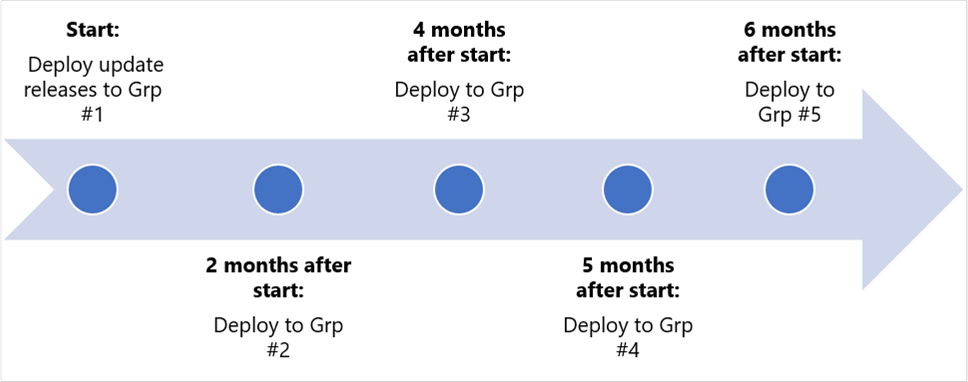

# Manage HoloLens updates

HoloLens uses Windows Update in the same manner as other Windows 10 devices. When an update is available, it is automatically downloaded and installed the next time that your device is plugged in and connected to the internet. This article describes how to manage updates in an enterprise or other managed environment. For information about managing updates to individual HoloLens devices, see [Update HoloLens](hololens-update-hololens.md).

## Manage updates automatically

Windows Holographic for Business can use [Windows Update for Business](https://docs.microsoft.com/windows/deployment/update/waas-manage-updates-wufb) to manage updates. All HoloLens 2 devices can use Windows Holographic for Business. Make sure that they use Windows Holographic for Business build 10.0.18362.1042 or a later build. If you have HoloLens (1st gen) devices, you have to [upgrade them to Windows Holographic for Business](hololens1-upgrade-enterprise.md) to manage their updates.

Windows Update for Business connects HoloLens devices directly to the Windows Update service. By using Windows Update for Business, you can control multiple aspects of the update process&mdash;that is, which devices get which updates at what time. For example, you can roll out updates to a subset of devices for testing, then roll out updates to the remaining devices at a later date. Or, you can define different update schedules for different types of updates.

> [!NOTE]  
> For HoloLens devices, you can automatically manage feature updates (released twice a year) and quality updates (released monthly or as required, including critical security updates). For more information about update types, see [Types of updates managed by Windows Update for Business](https://docs.microsoft.com/windows/deployment/update/waas-manage-updates-wufb#types-of-updates-managed-by-windows-update-for-business).

You can configure Windows Update for Business settings for HoloLens by using policies in a Mobile Device Management (MDM) solution such as Microsoft Intune.

For a detailed discussion about how to use Intune to configure Windows Update for Business, see [Manage Windows 10 software updates in Intune](https://docs.microsoft.com/intune/protect/windows-update-for-business-configure).

> [!IMPORTANT]  
> Intune provides two policy types for managing updates: *Windows 10 update ring* and *Windows 10 feature updates*. The Windows 10 feature update policy type is in public preview at this time and is not supported for HoloLens.
>  
> You can use Windows 10 update ring policies to manage HoloLens 2 updates.

### Configure update policies for HoloLens 2 or HoloLens (1st gen)

This section describes the policies that you can use to manage updates for either HoloLens 2 or HoloLens (1st gen). For information about additional functionality that is available for HoloLens 2, see [Plan and configure update rollouts for HoloLens 2](#plan-and-configure-update-rollouts-for-hololens-2).

The [Policy configuration service provider (CSP)](https://docs.microsoft.com/windows/client-management/mdm/policy-csp-update) defines the policies that configure Windows Update for Business.

> [!NOTE]  
> For details about specific policies that are supported by specific editions of HoloLens, see [Policies supported by HoloLens devices](https://docs.microsoft.com/windows/client-management/mdm/policy-configuration-service-provider#policies-supported-by-hololens-devices).

#### Configure automatic checks for updates

You can use the **Update/AllowAutoUpdate** policy to manage automatic update behavior, such as scanning, downloading, and installing updates.

This policy supports the following values:

- **0** - Notify the user when there is an update that is ready to download that applies to the device.
- **1** - Automatically install the update, and then notify the user to schedule a device restart.  
- **2** - Automatically install the update, and then restart the device. This is the recommended value, and it is the default value for this policy.  

- **3** - Automatically install the update, and then restart at a specified time. Specify the installation day and time. If no day and time are specified, the default is daily at 3 A.M.  

- **4** - Automatically install the update, and then restart the device. This option also sets the Settings page to read-only.

- **5** - Turn off automatic updates.

For more details about the available settings for this policy, see [Update/AllowAutoUpdate](https://docs.microsoft.com/windows/client-management/mdm/policy-csp-update#update-allowautoupdate).

> [!NOTE]  
> In Microsoft Intune, you can use **Automatic Update Behavior** to change this policy. For more information, see [Manage software updates in Microsoft Intune](https://docs.microsoft.com/intune/windows-update-for-business-configure).

#### Configure an update schedule

To configure how and when updates are applied, use the following policies:

- [Update/ScheduledInstallDay](https://docs.microsoft.com/windows/client-management/mdm/policy-csp-update#update-scheduledinstallday).  
   - Values: **0**–**7** (0 = every day, 1 = Sunday, 7 = Saturday)
   - Default value: **0** (every day)
- [Update/ScheduledInstallTime](https://docs.microsoft.com/windows/client-management/mdm/policy-csp-update#update-scheduledinstalltime).
   - Values: 0–23 (0 = midnight, 23 = 11 P.M.)
   - Default value: 3 P.M.

#### For devices that run Windows 10, version 1607 only

You can use the following update policies to configure devices to get updates from the Windows Server Update Service (WSUS), instead of Windows Update:

- [Update/AllowUpdateService](https://docs.microsoft.com/windows/client-management/mdm/policy-csp-update#update-allowupdateservice)
- [Update/RequireUpdateApproval](https://docs.microsoft.com/windows/client-management/mdm/policy-csp-update#update-requireupdateapproval)
- [Update/UpdateServiceUrl](https://docs.microsoft.com/windows/client-management/mdm/policy-csp-update#update-updateserviceurl)

### Plan and configure update rollouts for HoloLens 2

HoloLens 2 supports more update automation features than HoloLens (1st gen). this is especially true if you use Microsoft Intune to manage Windows Update for Business policy. These features make it easier for you to plan and implement update rollouts across your organization.

#### Plan the update strategy

Windows Updates for Business supports deferral policies. After Microsoft releases an update, you can use a deferral policy to define how long to wait before installing that update on devices. By associating subsets of your devices (referred to as *update rings*) with different deferral policies, you can coordinate an update rollout strategy for your organization.

For example, consider an organization that has 1,000 devices and has to update them in five ways. The organization can create five update rings, as shown in the following table.

|Group |Number of devices |Deferral (days) |
| ---| :---: | :---: |
|Grp 1 (IT staff) |5 |0 |
|Grp 2 (early adopters) |50 |60 |
|Grp 3 (main 1) |250 |120 |
|Grp 4 (main 2) |300 |150 |
|Grp 5 (main 3) |395 |180 |

Here's how the rollout progresses over time to the entire organization.

#### Configure an update deferral policy

A deferral policy specifies the number of days between the date that an update becomes available and the date that the update is offered to a device.

You can configure different deferrals for feature updates and quality updates. The following table lists the specific policies to use for each type, as well as the maximum deferral for each.

|Category |Policy |Maximum deferral |
| --- | --- | --- |
|Feature updates |DeferFeatureUpdatesPeriodInDays |365 days |
|Quality updates |DeferQualityUpdatesPeriodInDays |30 days |

####  Examples: Using Intune to manage updates

**Example 1: Create and assign an update ring**

For a more detailed version of this example, see [Create and assign update rings](https://docs.microsoft.com/mem/intune/protect/windows-update-for-business-configure#create-and-assign-update-rings).

1. Sign in to the [Microsoft Endpoint Manager Admin Center](https://go.microsoft.com/fwlink/?linkid=2109431), and navigate to your Intune profiles.
1. Select **Software Updates** > **Windows 10 update rings** > **Create**.
1. Under **Basics**, specify a name and a description (optional), and then select **Next**.
1. Under **Update ring settings**, for **Servicing channel**, select **Semi-Annual Channel**, and then change **Feature update deferral period** to **120**. Then, select **Next**.
1. Under **Assignments**, select **+ Select groups to include**, and then assign the update ring to one or more groups. Use **+ Select groups to exclude** to fine-tune the assignments. Then, select **Next**.
1. Under **Review + create**, review the settings. When you're ready to save the update ring configuration, select **Create**.

The list of update rings now includes the new Windows 10 update ring.

**Example 2: Pause an update ring**

If you encounter a problem when you deploy a feature or quality update, you can pause the update for 35 days (starting from a specified date). This pause prevents other devices from installing the update until you resolve or mitigate the issue. If you pause a feature update, quality updates are still offered to devices to make sure that they stay secure. After the specified time has passed, the pause automatically expires. At that point, the update process resumes.

To pause an update ring in Intune, follow these steps:

1. On the overview page for the update ring, select **Pause**.
1. Select the type of update (**Feature** or **Quality**) to pause, and then select **OK**.

When an update type is paused, the Overview pane for that ring displays how many days remain before that update type resumes.

While the update ring is paused, you can select either of the following options:

- To extend the pause period for an update type for 35 days, select **Extend**.
- To restore updates for that ring to active operation, select **Resume**. You can pause the update ring again if it is necessary.

> [!NOTE]  
> The **Uninstall** operation for update rings is not supported for HoloLens 2 devices.

## Manually check for updates

Although HoloLens periodically checks for system updates so that you don't have to, there may be circumstances in which you want to manually check.

To manually check for updates, go to **Settings** > **Update & Security** > **Check for updates**. If the Settings app indicates that your device is up to date, you have all the updates that are currently available.

## Manually revert an update

In some cases, you might want to go back to a previous version of the HoloLens software. The process for doing this depends on whether you are using HoloLens 2 or HoloLens (1st gen).

### Go back to a previous version (HoloLens 2)

You can roll back updates and return to a previous version of HoloLens 2 by using the Advanced Recovery Companion to reset your HoloLens to the earlier version.

> [!NOTE]
> Reverting to an earlier version deletes your personal files and settings.

To go back to a previous version of HoloLens 2, follow these steps:

1. Make sure that you don't have any phones or Windows devices plugged in to your computer.
1. On your computer, download the [Advanced Recovery Companion](https://www.microsoft.com/p/advanced-recovery-companion/9p74z35sfrs8?activetab=pivot:overviewtab) from the Microsoft Store.
1. Download the [most recent HoloLens 2 release](https://aka.ms/hololens2download).
1. When you have finished these downloads, open **File explorer** > **Downloads**, right-click the compressed (zipped) folder that you just downloaded, and then select **Extract all** > **Extract** to expand the file.
1. Use a USB-A to USB-C cable to connect your HoloLens device to your computer. Even if you've been using other cables to connect your HoloLens, this kind of cable works best.
1. The Advanced Recovery Companion automatically detects your HoloLens device. Select the **Microsoft HoloLens** tile.
1. On the next screen, select **Manual package selection**, and then open the folder that you previously expanded. 
1. Select the installation file (the file that has an .ffu extension).
1. Select **Install software**, and then follow the instructions.

### Go back to a previous version (HoloLens (1st gen))

You can roll back updates and return to a previous version of HoloLens (1st gen) by using the Windows Device Recovery Tool to reset your HoloLens to the earlier version.

> [!NOTE]
> Reverting to an earlier version deletes your personal files and settings.

To go back to a previous version of HoloLens (1st gen), follow these steps:

1. Make sure that you don't have any phones or Windows devices plugged in to your computer.
1. On your computer, download the [Windows Device Recovery Tool (WDRT)](https://support.microsoft.com/help/12379).
1. Download the [HoloLens Anniversary Update recovery package](https://aka.ms/hololensrecovery).
1. After the downloads finish, open **File explorer** > **Downloads**, right-click the compressed (zipped) folder that you just downloaded, and then select **Extract all** > **Extract** to expand the file.
1. Use the micro-USB cable that was provided together with your HoloLens device to connect your HoloLens device to your computer. Even if you've been using other cables to connect your HoloLens device, this one works best.
1. The WDRT automatically detects your HoloLens device. Select the **Microsoft HoloLens** tile.
1. On the next screen, select **Manual package selection**, and then open the folder that you previously expanded. 
1. Select the installation file (the file that has an .ffu extension).
1. Select **Install software**, and then follow the instructions.

> [!NOTE]
> If the WDRT doesn't detect your HoloLens device, try restarting your computer. If that doesn't work, select **My device was not detected**, select **Microsoft HoloLens**, and then follow the instructions.

## Related articles

- [Deploy updates using Windows Update for Business](https://docs.microsoft.com/windows/deployment/update/waas-manage-updates-wufb)
- [Assign devices to servicing channels for Windows 10 updates](https://docs.microsoft.com/windows/deployment/update/waas-servicing-channels-windows-10-updates)
- [Manage Windows 10 software updates in Intune](https://docs.microsoft.com/mem/intune/protect/windows-update-for-business-configure)
