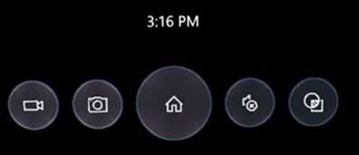
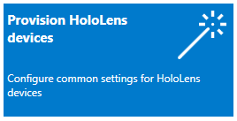

# What's new in Microsoft HoloLens

## Windows 10, version 1809 for Microsoft HoloLens

### For everyone 
 
Feature | Details   
--- | --- 
Quick actions menu | When you're in an app, the Bloom gesture will now open a Quick actions menu to give you quick access to commonly used system features without having to leave the app. See [Set up HoloLens in kiosk mode](hololens-kiosk.md) for information about the Quick actions menu in kiosk mode.  
Stop video capture from the Start or quick actions menu | If you start video capture from the Start menu or quick actions menu, you’ll be able to stop recording from the same place. (Don’t forget, you can always do this with voice commands too.) 
Project to a Miracast-enabled device | Project your HoloLens content to a nearby Surface device or TV/Monitor if using Microsoft Display adapter.  On **Start**, select **Connect**, and then select the device you want to project to. **Note:** You can deploy HoloLens to use Miracast projection without enabling developer mode.
New notifications | View and respond to notification toasts on HoloLens, just like you do on a PC. Gaze to respond to or dismiss them (or if you’re in an immersive experience, use the bloom gesture).  
HoloLens overlays (file picker, keyboard, dialogs, etc.) | You’ll now see overlays such as the keyboard, dialogs, file picker, etc. when using immersive apps.  
Visual feedback overlay UI for volume change | When you use the volume up/down buttons on your HoloLens you’ll see a visual display of the volume level. 
New UI for device boot | A loading indicator was added during the boot process to provide visual feedback that the system is loading. Reboot your device to see the new loading indicator—it’s between the "Hello" message and the Windows boot logo. 
Share UX: Nearby Sharing | Addition of the Windows Nearby Sharing experience, allowing you to share a capture with a nearby Windows device. When you capture a photo or video on HoloLens (or use the share button from an app such as Microsoft Edge), select a nearby Windows device to share with. 
Share from Microsoft Edge | Share button is now available on Microsoft Edge windows on HoloLens. In Microsoft Edge, select **Share**. Use the HoloLens share picker to share web content. 

### For administrators 

|                                   Feature                                   |                                                                                                                                                                       Details                                                                                                                                                                        |
|-----------------------------------------------------------------------------|------------------------------------------------------------------------------------------------------------------------------------------------------------------------------------------------------------------------------------------------------------------------------------------------------------------------------------------------------|
|         [Enable post-setup provisioning](hololens-provisioning.md)          |                                                                                                                                   You can now apply a runtime provisioning package at any time using **Settings**.                                                                                                                                   |
|                    Assigned access with Azure AD groups                     |                                                                                                           You can now use Azure AD groups for configuration of Windows assigned access to set up single or multi-app kiosk configuration.                                                                                                            |
|              PIN sign-in on profile switch from sign-in screen              |                                                                                                                                                  PIN sign-in is now available for **Other User**.                                                                                                                                                    |
|             Sign in with Web Credential Provider using password             | You can now select the Globe sign-in option to launch web sign-in with your password. From the sign-in screen, select **Sign-In options** and select the Globe option to launch web sign-in. Enter your user name if needed, then your password.  **Note:** You can choose to bypass any PIN/Smartcard options when prompted during web sign-in.  |
| Read device hardware info through MDM so devices can be tracked by serial # |                                                                                        IT administrators can see and track HoloLens by device serial number in their MDM console. Refer to your MDM documentation for feature availability and instructions.                                                                                         |
|                Set HoloLens device name through MDM (rename)                |                                                                                                IT administrators can see and rename HoloLens devices in their MDM console. Refer to your MDM documentation for feature availability and instructions.                                                                                                |

### For international customers 
 

Feature | Details  
--- | --- 
Localized Chinese and Japanese builds | Use HoloLens with localized user interface for Simplified Chinese or Japanese, including localized Pinyin keyboard, dictation, and voice commands.  
Speech Synthesis (TTS) | Speech synthesis feature now supports Chinese, Japanese, and English. 

[Learn how to install the Chinese and Japanese versions of HoloLens.](hololens-install-localized.md) 

    

## Windows 10, version 1803 for Microsoft HoloLens

Windows 10, version 1803, is the first feature update to Windows Holographic for Business since its release in Windows 10, version 1607. This update introduces the following changes:

- Previously, you could only verify that upgrade license for Commercial Suite had been applied to your HoloLens device by checking to see if VPN was an available option on the device. Now, **Settings** > **System** will display **Windows Holographic for Business** after the upgrade license is applied. [Learn how to unlock Windows Holographic for Business features](hololens-upgrade-enterprise.md). 

- You can view the operating system build number in device properties in the File Explorer app and in the [Windows Device Recovery Tool (WDRT)](https://support.microsoft.com/help/12379/windows-10-mobile-device-recovery-tool-faq).
    
- Provisioning a HoloLens device is now easier with the new **Provision HoloLens devices** wizard in the Windows Configuration Designer tool. In the wizard, you can configure the setup experience and network connections, set developer mode, and obtain bulk Azure AD tokens. [Learn how to use the simple provisioning wizard for HoloLens](hololens-provisioning.md#wizard).

    

- When you create a local account in a provisioning package, the password no longer expires every 42 days.

- You can [configure HoloLens as a single-app or multi-app kiosk](hololens-kiosk.md). Multi-app kiosk mode lets you set up a HoloLens to only run the apps that you specify, and prevents users from making changes.

- Media Transfer Protocol (MTP) is enabled so that you can connect the HoloLens device to a PC by USB and transfer files between HoloLens and the PC. You can also use the File Explorer app to move and delete files from within HoloLens.

- Previously, after you signed in to the device with an Azure Active Directory (Azure AD) account, you then had to **Add work access** in **Settings** to get access to corporate resources. Now, you sign in with an Azure AD account and enrollment happens automatically. 

- Before you sign in, you can choose the network icon below the password field to choose a different Wi-Fi network to connect to. You can also connect to a guest network, such as at a hotel, conference center, or business. 

- You can now easily [share HoloLens with multiple people](hololens-multiple-users.md) using Azure AD accounts.

- When setup or  sign-in fails, choose the new **Collect info** option to get diagnostic logs for troubleshooting.

- Individual users can sync their corporate email without enrolling their device in mobile device management (MDM). You can use the device with a Microsoft Account, download and install the Mail app, and add an email account directly.

- You can check the MDM sync status for a device in **Settings** > **Accounts** > **Access Work or School** > **Info**. In the **Device sync status** section, you can start a sync, see areas managed by MDM, and create and export an advanced diagnostics report.

## Additional resources

- [Reset or recover your HoloLens](https://developer.microsoft.com/windows/mixed-reality/reset_or_recover_your_hololens)
- [Restart, reset, or recover HoloLens](https://support.microsoft.com/help/13452/hololens-restart-reset-or-recover-hololens)
- [Manage devices running Windows Holographic with Microsoft Intune](https://docs.microsoft.com/intune/windows-holographic-for-business)

