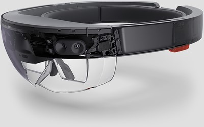
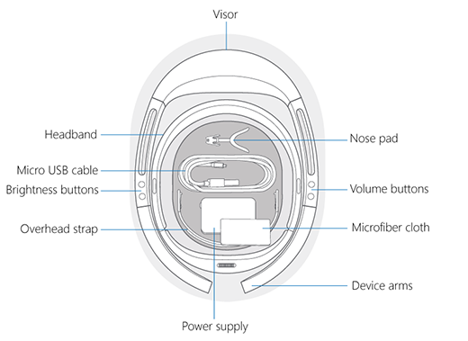
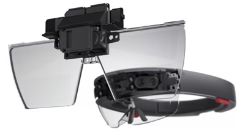
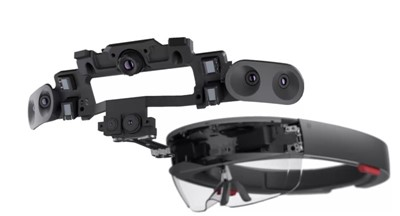
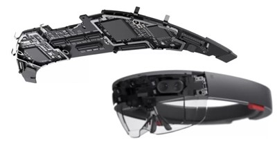
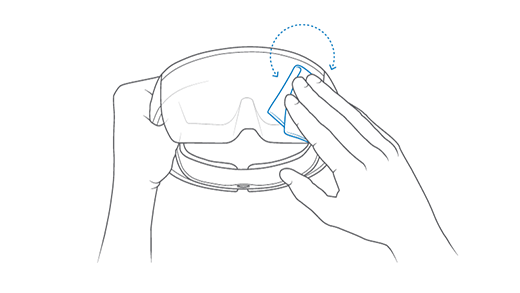

# HoloLens (1st Gen) hardware

Microsoft HoloLens (1st gen) is the world's first fully untethered holographic computer. HoloLens redefines personal computing through holographic experiences to empower you in new ways. HoloLens blends cutting-edge optics and sensors to deliver 3D holograms pinned to the real world around you.

## HoloLens components

Your HoloLens includes the following features:

- **Visor**. Contains the HoloLens sensors and displays. You can rotate the visor up while you are wearing the HoloLens.
- **Headband**. To put the HoloLens on, use the adjustment wheel to expand the headband. With the HoloLens in place, tighten the adjustment wheel until the headband is comfortable.
- **Brightness buttons**. When you're wearing the HoloLens, the brightness buttons are on the left side of the device.
- **Volume buttons**. When you're wearing the HoloLens, the volume buttons are on the right side of the device.- .
- **Device arms**. When you pick up, put on, or take off your HoloLens, always grasp or hold it by the device arms.

## In the box

> [!VIDEO https://www.microsoft.com/videoplayer/embed/c7ceb904-9d5f-4194-9e10-e8a949dbad7d]  

The HoloLens box contains the following items:

- **Nose pads**. Select a nose pad that fits the shape of your nose and accommodates your eyewear.
- **Overhead strap**. When you're wearing the HoloLens while you move around, use the overhead strap to help keep the device in place. Additionally, if you're wearing the HoloLens for extended periods, using the overhead strap may make the device more comfortable to wear.
- **Micro USB cable**. Use the micro-USB cable to connect your HoloLens to the power supply for charging, or use it to connect your HoloLens to your computer.
- **Power supply**. Plugs into a power outlet.
- **Microfiber cloth**. Use the cloth to clean your HoloLens visor.

>[!TIP]
>The [clicker](hololens1-clicker.md) ships with HoloLens (1st Gen), in a separate box.

## Device Specifications

### Display

|   |   |
| - | - |
| Optics | See-through holographic lenses (waveguides) |
| Holographic resolution | 2 HD 16:9 light engines producing 2.3M total light points |
| Holographic density | >2.5k radiants (light points per radian) |
| Eye-based rendering | Automatic pupillary distance calibration |

### Sensors

- 1 IMU
- 4 environment understanding cameras
- 1 depth camera
- 1 2MP photo / HD video camera
- Mixed reality capture
- 4 microphones
- 1 ambient light sensor

### Input / Output / Connectivity

- Built-in speakers
- Audio 3.5mm jack
- Volume up/down
- Brightness up/down
- Power button
- Battery status LEDs
- Wi-Fi 802.11ac
- Micro USB 2.0
- Bluetooth 4.1 LE

### Power

- Battery Life
- 2-3 hours of active use
- Up to 2 weeks of standby time
- Fully functional when charging
- Passively cooled (no fans)

### Processors

- Intel 32-bit architecture with TPM 2.0 support
- Custom-built Microsoft Holographic Processing Unit (HPU 1.0)

### Memory

- 64 GB Flash
- 2 GB RAM

### Fit

|   |   |
| - | - |
| Sizing | Single size with adjustable band.  Fits over glasses |
| Weight | 579 grams |

## Device capabilities

Human understanding using:

- Gaze tracking
- Gesture input
- Voice support

Environmental understanding via:

- Spatial sound

## Pre-installed software

- Windows 10
- Windows Store
- Holograms
- Microsoft Edge
- Photos
- Settings
- Windows Feedback
- Calibration
- Learn Gestures

## Device certifications

### Safety

HoloLens has been tested and found to conform to the basic impact protection requirements of ANSI Z87.1, CSA Z94.3 and EN 166

## Care and cleaning

Handle your HoloLens carefully. Use the device arms&mdash;not the overhead strap&mdash;to lift, carry, and adjust it. To keep the visor free of dust and fingerprints, avoid touching it. Repeated cleaning could damage the visor, so try to keep your device clean.

Don't use any cleaners or solvents on your HoloLens, and don't submerge it in water or apply water directly to it.

To clean the visor, remove any dust using a camel or goat hair lens brush or a bulb-style lens blower. Lightly moisten the microfiber cloth with a small amount of distilled water, then use it to wipe the visor gently in a circular motion.

Clean the rest of the device, including the headband and device arms, with a lint-free cloth moistened with mild soap and water. Let your HoloLens dry completely before using it again.

> [!div class="nextstepaction"]
> [Set up and start your HoloLens (1st gen)](hololens1-setup.md)
