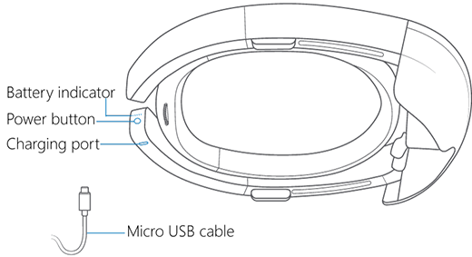
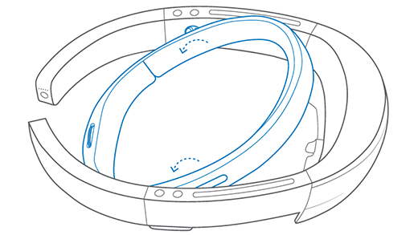
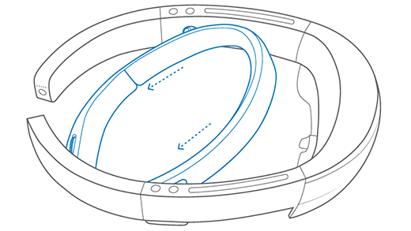
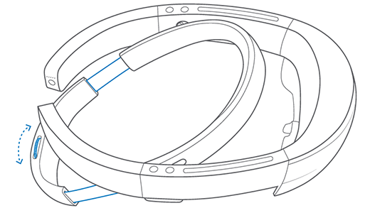
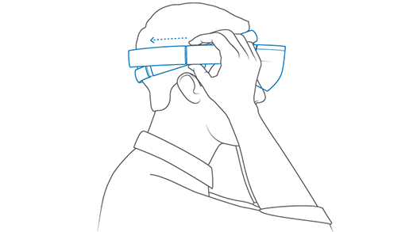
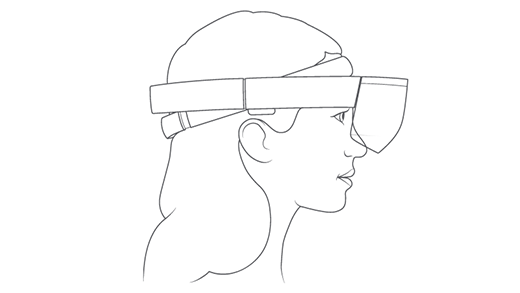
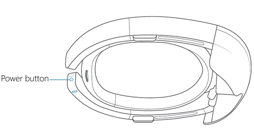
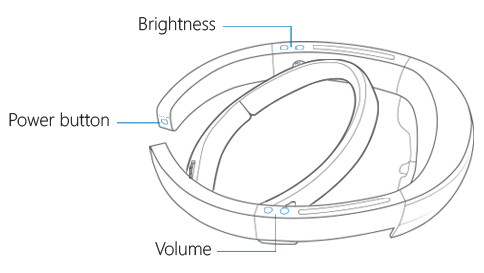
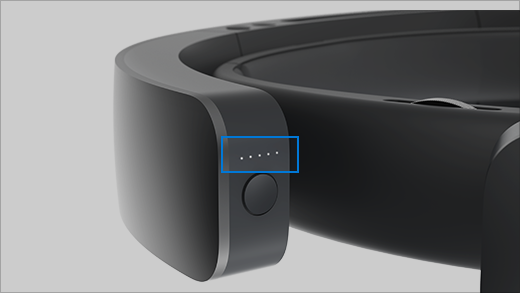

# Set up HoloLens (1st gen)

Follow along to set up a HoloLens (1st gen) for the first time.

## Charge your HoloLens (1st gen)

To charge your HoloLens, connect the power supply to the charging port using the included Micro USB cable. Then plug the power supply into a power outlet. When the device is charging, the battery indicator will light up in a wave pattern.

When your HoloLens is on, the battery indicator shows the battery level in increments. When only one of the five lights is on, the battery level is below 20 percent. If the battery level is critically low and you try to turn on the device, one light will blink briefly, then go out.

> [!TIP]
> To get an estimate of your current battery level, say "Hey Cortana, how much battery do I have left?"

## Adjust fit

> [!VIDEO https://www.microsoft.com/videoplayer/embed/be3cb527-f2f1-4f85-b4f7-a34fbaba980d]

|     |     |
|:--- |:--- |
|1. Rotate the headband up to about 20-30 degrees.||
|2. Push the headband back. Do not pull it back, or manipulate the band behind the hinge, as this can break the band over time.||
|3. Turn the adjustment wheel to extend the headband all the way out. Show the user where the band should rest on the forehead, and show them the adjustment wheel.||
|4. Hold the headband for the user, and have them grab the arms of the device and place in on their head. Make sure the band rests in the correct spot, and let them tighten the adjustment wheel. Slide the visor back.||
|5. The headband should sit at the top of the forehead, just below your hairline, with the speakers above the ears. By looking at them from the front, you should be able to tell that the lenses are centered over their eyes.||

## Turn on your HoloLens

Use the power button to turn HoloLens on and off or put it in standby mode.

If your device doesn't respond or won't start, see [Restart, reset, or recover HoloLens](hololens-restart-recover.md).

When your HoloLens is off or in standby, turn it on by pressing the power button for one second. If it doesn't turn on, plug it in and charge it for at least 30 minutes.

> [!TIP]
> To restart HoloLens, say "Hey Cortana, reboot the device."

### Put HoloLens in standby

To put your HoloLens in standby when it's turned on, press the power button once. The battery indicators blink off. To wake it from standby, press the power button again.

HoloLens automatically goes into standby after 3 minutes of inactivity. When it's in standby, it automatically shuts down after 4 hours, or after the battery level drops by 10 percent.

### Shut down HoloLens

To shut down (turn off) HoloLens, hold the power button down for four seconds. The battery indicators turn off one by one and the device will shut down.

HoloLens automatically shuts down when the battery level drops to one percent, even if it's plugged in. After you've recharged the battery to three percent, you'll be able to turn HoloLens on again.

## Adjust volume and brightness

The brightness and volume buttons are on top of the device arms - volume to your right and brightness to your left.

## HoloLens indicator lights

Not sure what the indicator lights on your HoloLens mean? Here's some help.

|When the lights do this |It means |
| - | - |
|Scroll from the center outward. |HoloLens is starting up. |
|Stay lit (all or some). |HoloLens is on and ready to use. Battery life is shown in 20 percent increments. |
|Scroll, then light up, then scroll. |HoloLens is on and charging. Battery life is shown in 20 percent increments. |
|Turn off one by one. |HoloLens is shutting down. |
|Turn off all at once. |HoloLens is going into standby. |
|All light up, then one blinks briefly, then all turn off. |Battery is critically low. HoloLens needs to charge. |
|All scroll, then one blinks, then all scroll. |Battery is critically low. HoloLens is charging. |

## Safety and Comfort

### Use in safe surroundings

Use your HoloLens in a safe space that’s free of obstructions and tripping hazards. Don’t use it when you need a clear field of view and your full attention, such as while you’re operating a vehicle or doing other potentially hazardous activities.

### Stay comfortable

Keep your first few sessions with HoloLens brief and be sure to take breaks. If you experience discomfort, stop and rest until you feel better. This might include temporary feelings of nausea, motion sickness, dizziness, disorientation, headache, fatigue, eye strain, or dry eyes.

> [!div class="nextstepaction"]
> [Start and configure your HoloLens (1st gen)](hololens1-start.md)
