# Windows Autopilot for HoloLens 2 evaluation guide

When you set up HoloLens 2 devices for the Windows Autopilot program, your users can follow a simple process to provision the devices from the cloud.

This Autopilot program supports Autopilot self-deploying mode to provision HoloLens 2 devices as shared devices under your tenant. Self-deploying mode leverages the device's preinstalled OEM image and drivers during the provisioning process. A user can provision the device without putting the device on and going through the Out-of-the-box Experience (OOBE).  

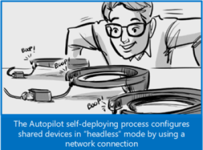

When a user starts the the Autopilot self-deploying process, the process completes the following steps:

1. Join the device to Azure Active Directory (AAD).
   > [!NOTE]  
   > Autopilot for HoloLens does not support Active Directory join or Hybrid Azure AD join.
1. Leverage AAD to enroll the device in Microsoft Intune (or another MDM service).
1. Download the device-targeted policies, certificates, and networking profiles.
1. Provision the device.
1. Present the user with the sign-in screen.

## Get started with Windows Autopilot for HoloLens 2

### 1. Enroll in the Windows Autopilot for HoloLens 2 program

In order to participate in the program, you have to use a tenant that is flighted for HoloLens. To do this, go to  [Windows Autopilot for HoloLens Private Preview request](https://aka.ms/APHoloLensTAP) or use the following QR code to submit a request.  
  

In this request, provide the following information:

- Tenant domain
- Tenant ID
- Number of HoloLens 2 devices that are participating in this evaluation
- Number of HoloLens 2 devices that you plan to deploy by using Autopilot self-deploying mode

### 2. Make sure that you meet the requirements for Windows Autopilot for HoloLens

For the latest information about participating in the program, review [Windows Insider Release Notes](hololens-insider.md#windows-insider-release-notes).

Review the following sections of the Windows Autopilot requirements article:

- [Network requirements](https://docs.microsoft.com/windows/deployment/windows-autopilot/windows-autopilot-requirements#networking-requirements)  
- [Licensing requirements](https://docs.microsoft.com/windows/deployment/windows-autopilot/windows-autopilot-requirements#licensing-requirements)  
- [Configuration requirements](https://docs.microsoft.com/windows/deployment/windows-autopilot/windows-autopilot-requirements#configuration-requirements)
   > [!IMPORTANT]  
   > For information about registering devices and configuring profiles, see [4. Register devices in Windows Autopilot](#4-register-devices-in-windows-autopilot) and [6. Create a deployment profile](#6-create-a-deployment-profile) in this article. These sections provide steps that are specific to HoloLens.

> [!IMPORTANT]  
> Unlike other Windows Autopilot programs, Windows Autopilot for HoloLens 2 has specific operating system requirements.

Review the [Requirements](https://docs.microsoft.com/windows/deployment/windows-autopilot/self-deploying#requirements) section of the Windows Autopilot Self-Deploying mode article. Your environment has to meet these requirements as well as the standard Windows Autopilot requirements.

> [!NOTE]  
> You do not have to review the Step by Step and Validation sections of the article. The procedures later in this article provide corresponding steps that are specific to HoloLens.

Make sure that the HoloLens devices meet the following requirements:

- The devices are not already members of AAD, and are not enrolled in Intune (or another MDM system). The Autopilot self-deploying process completes these steps. To make sure that all of the device-related information is cleaned up, check the **Devices** pages in both AAD and Intune.
- Make sure that each device can connect to the internet during the provisioning process. Typically, you would use a USB Ethernet cable for this connection.
- Each device can connect to a computer by using a USB-C cable, and that computer has the following available:
  - Advanced Recovery Companion (ARC)
  - The latest Windows update Windows 10, version 19041.1002.200107-0909 or a later version).

To configure and manage the Autopilot self-deploying mode profiles, make sure that you have access to [Microsoft Endpoint Manager admin center](https://endpoint.microsoft.com).

### 3. Verify that your tenant is flighted

To verify that your tenant is flighted for the Autopilot program after you submit your request, follow these steps:

1. Sign in to Microsoft Endpoint Manager admin center.
1. Select **Devices** > **Windows** > **Windows enrollment** > **Windows Autopilot deployment profiles** > **Create profile**.  
  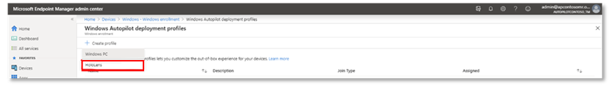
  You should see a drop-down list that includes **HoloLens**. If this option is not present, use one of the [Feedback](#feedback) options to contact us.

### 4. Register devices in Windows Autopilot

To register a Hololens device in the Windows Autopilot program, you have to obtain the hardware hash of the device (also known as the hardware ID). The device can record its hardware hash in a CSV file during the OOBE process, or later when a device owner starts the diagnostic log collection process (described in the following procedure). The device owner is typically the first user to sign in to the device.

**Retrieve a device hardware hash**:

1. Start the HoloLens 2 device, and make sure that you sign in by using an account that is the device owner. 
1. On the device, press the Power and Volume Down buttons at the same time and then release them. The device collects diagnostic logs and the hardware hash, and stores them in a set of ZIP files.
1. Use a USB-C cable to connect the device to a computer.
1. On the computer, open File Explorer. Open **This PC\\\<*HoloLens device name*>\\Internal Storage\\Documents**, and look for the AutopilotDiagnostics.zip file.

   > [!NOTE]  
   > The ZIP file may not immediately be available. If the file is not ready yet you may see a HololensDiagnostics.temp file in the Documents folder. To update the list of files, refresh the window.

1. Extract the contents of the AutopilotDiagnostics.zip file.
1. In the extracted files, locate the CSV file that has a file name prefix of "DeviceHash." Copy that file to a drive on the computer where you can access it later.
   > [!IMPORTANT]  
   > The data in the CSV file should use the following header and line format:
   > ```
   > Device Serial Number,Windows Product ID,Hardware Hash,Group Tag,Assigned User <serialNumber>,<ProductID>,<hardwareHash>,<optionalGroupTag>,<optionalAssignedUser>
   >```

**Register the device in Windows Autopilot**:

1. In Microsoft Endpoint Manager Admin Center, select **Devices** > **Windows** > **Windows enrollment**, and then under **Windows Autopilot Deployment Program**, select **Devices** > **Import**.

1. On the **Import** page, select the DeviceHash CSV file, select **Open**, and then select **Import**.  
  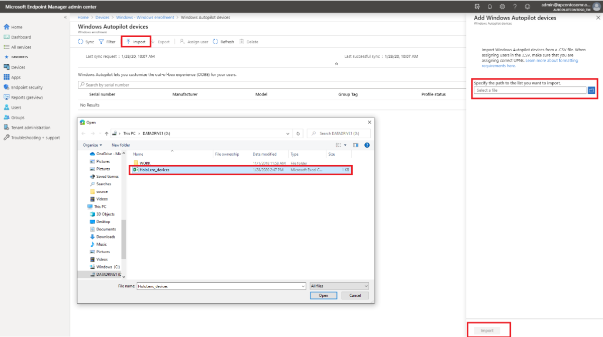
1. After the import finishes, select **Devices** > **Windows** > **Windows enrollment** > **Devices** > **Sync**. The process might take a few minutes to complete, depending on how many devices are being synchronized. To see the registered device, select **Refresh**.
  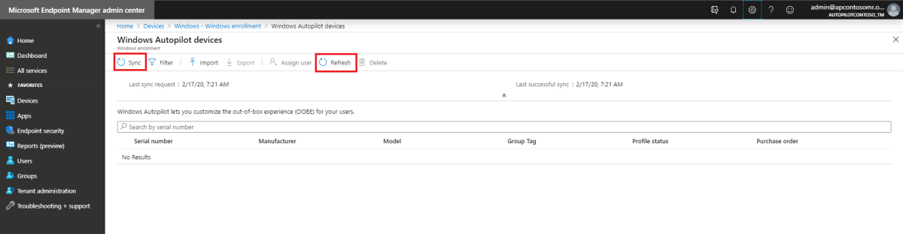  

### 5. Create a device group

1. In Microsoft Endpoint Manager admin center, select **Groups** > **New group**.
1. For **Group type**, select **Security**, and then enter a group name and description.
1. For **Membership type**, select either **Assigned** or **Dynamic Device**.
1. Do one of the following:  
   
   - If you selected **Assigned** for **Membership type** in the previous step, then select **Members** and then add Autopilot devices to the group. Autopilot devices that aren't yet enrolled are listed by using the device serial number as the device name.
   - If you selected **Dynamic Devices** for **Membership type** in the previous step, then select **Dynamic device members** and then in **Advanced rule**, enter code that resembles the following:
     - If you want to create a group that includes all of your Autopilot devices, type: `(device.devicePhysicalIDs -any _ -contains "[ZTDId]")`
     - Intune's group tag field maps to the OrderID attribute on Azure AD devices. If you want to create a group that includes all of your Autopilot devices with a specific group tag (the Azure AD device OrderID), you must type: `(device.devicePhysicalIds -any _ -eq "[OrderID]:179887111881")`
     - If you want to create a group that includes all of your Autopilot devices with a specific Purchase Order ID, type: `(device.devicePhysicalIds -any _ -eq "[PurchaseOrderId]:76222342342")`

     > [!NOTE]  
     > These rules target attributes that are unique to Autopilot devices.
1. Select **Save**, and then select **Create**.

### 6. Create a deployment profile

1. In Microsoft Endpoint Manager admin center, select **Devices** > **Windows** > **Windows enrollment** > **Windows Autopilot deployment profiles** > **Create profile** > **HoloLens**.
1. Enter a profile name and description, and then select **Next**.
  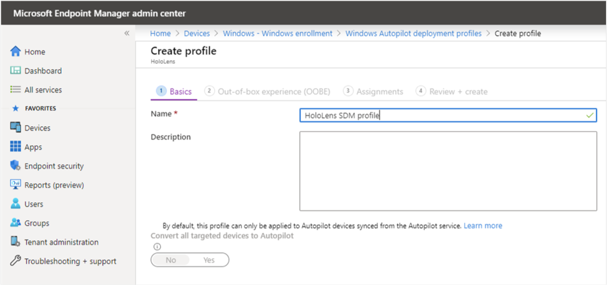
1. On the **Out-of-box experience (OOBE)** page, most of the settings are pre-configured to streamline OOBE for this evaluation. Optionally, you can configure the following settings:  

   - **Language (Region)**. Select the language for OOBE. We recommend that you select a language from the list of [supported languages for HoloLens 2](hololens2-language-support.md).
   - **Automatically configure keyboard**. To make sure that the keyboard matches the selected language, select **Yes**.
   - **Apply device name template**. To automatically set the device name during OOBE, select **Yes** and then in **Enter a name**, enter the template phrase and placeholders (for example, a prefix and `%RAND:4%`&mdash;a placeholder for a four-digit random number).
     > [!NOTE]  
     > If you use a device name template, the OOBE process restarts the device one extra time after it applies the device name and before it joins the device to AAD. This restart allows the new name to take effect.  

   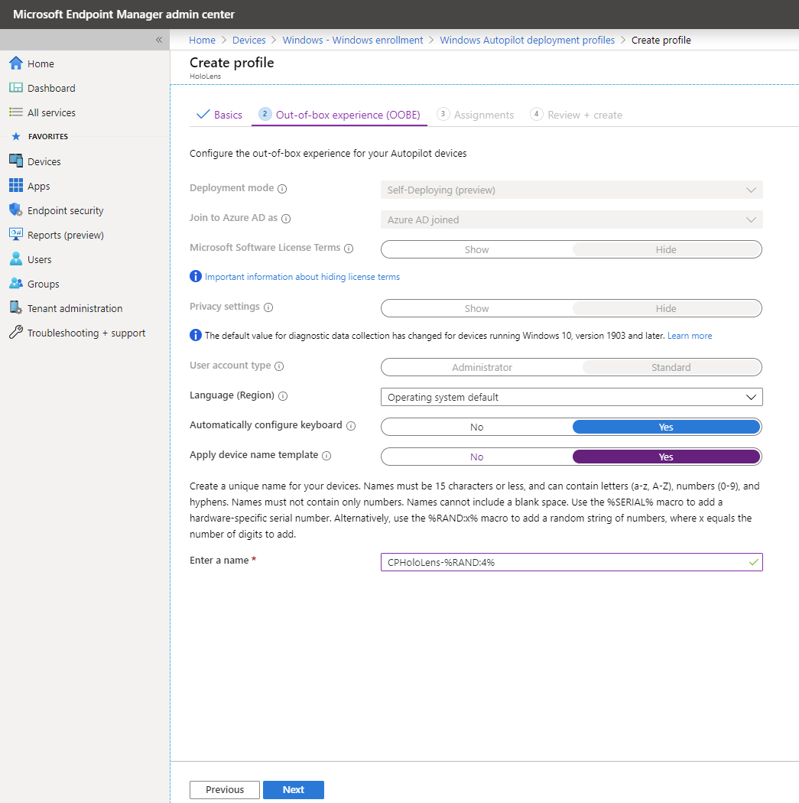
1. After you configure the settings, select **Next**.
1. On the **Scope tags** page, optionally add the scope tags that you want to apply to this profile. For more information about scope tags, see [Use role-based access control and scope tags for distributed IT](https://docs.microsoft.com/mem/intune//fundamentals/scope-tags.md). When finished, select **Next**.
1. On the **Assignments** page, for for **Assign to**, select **Selected groups**.
1. Under **SELECTED GROUPS**, select **+ Select groups to include**.
1. In the **Select groups to include** list, select the device group that you created for the Autopilot HoloLens devices, and then select **Next**.  
   
   If you want to exclude any groups, select **Select groups to exclude**, and select the groups that you want to exclude.
   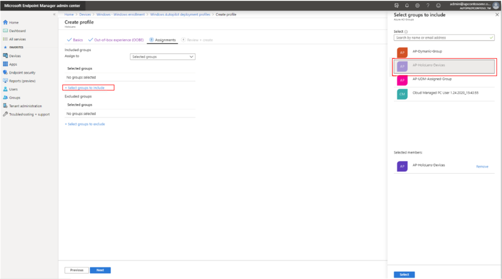
1. On the **Review + Create** page, review the settings and then select **Create** to create the profile.
  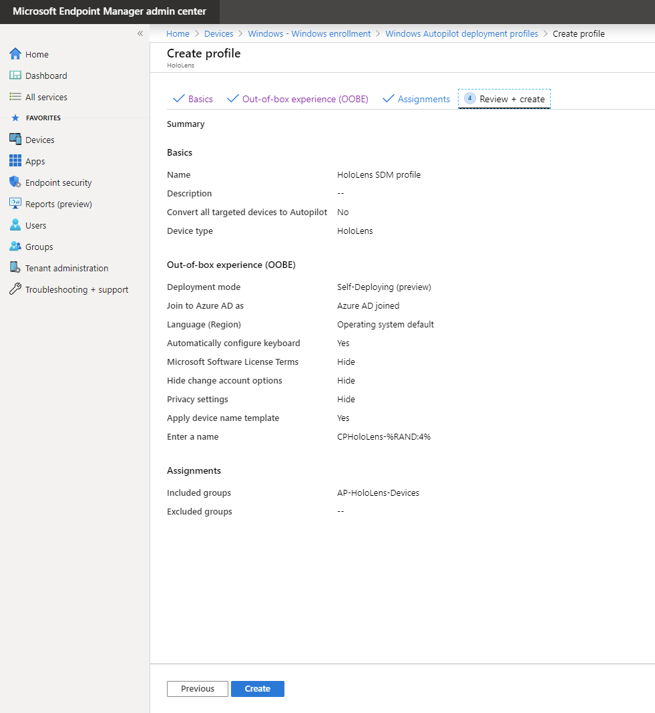

### 7. Verify the ESP configuration

The Enrollment Status Page (ESP) displays the status of the complete device configuration process when an MDM managed user signs into a device for the very first time. Make sure that your ESP configuration resembles the following, and verify that the assignments are correct.

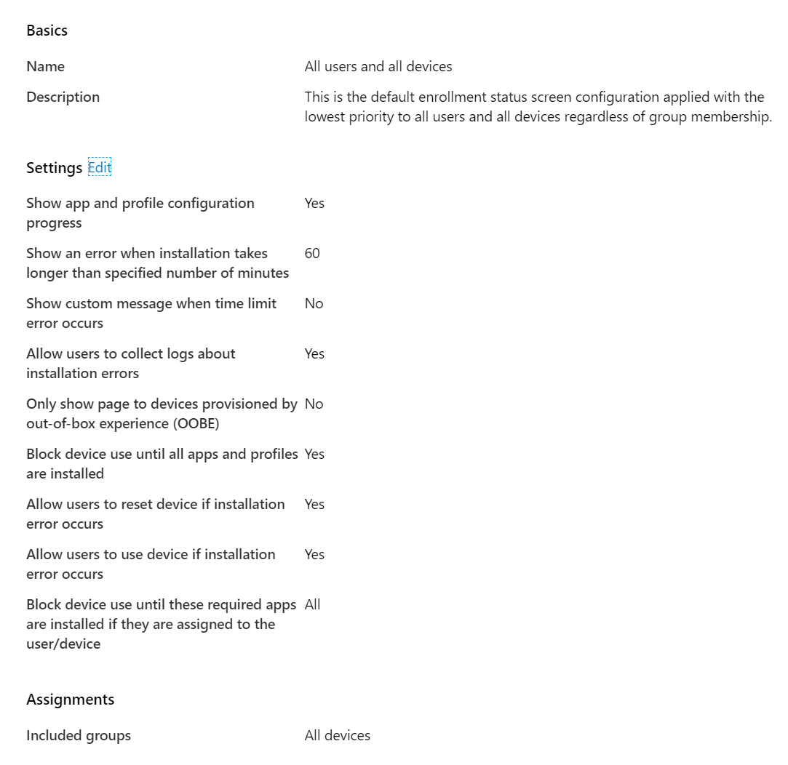

### 8. Configure a custom configuration profile for HoloLens devices (known issue)

1. In [Microsoft Endpoint Manager admin center]( https://endpoint.microsoft.com), select **Devices** > **Configuration profiles** > **Create profile**.
1. For **Platform**, specify **Windows 10 and later**, and for **Profile**, select **Custom**.
1. Select **Create**.
1. Enter a name for the profile, and then select **Settings** > **Configure**.
  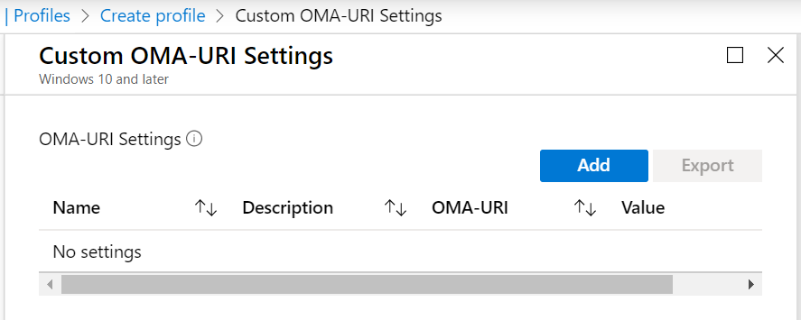
1. Select **Add**, and then enter the following information:  

   - **Name**: SidecarPath
   - **OMA-URI**: ./images/Device/Vendor/MSFT/EnrollmentStatusTracking/DevicePreparation/PolicyProviders/Sidecar/InstallationState
   - **Data type**: Integer
   - **Value**: 2
1. Select **OK** twice, and then select **Create** to create the profile.
1. After Intune creates the configuration profile, assign the configuration profile to the device group for the HoloLens devices.

### 9. Verify the profile status of the HoloLens devices

1. In Microsoft Endpoint Manager Admin Center, select **Devices** > **Windows** > **Windows enrollment** > **Devices**.
1. Verify that the HoloLens devices are listed, and that their profile status is **Assigned**.
   > [!NOTE]  
   > It may take a few minutes for the profile to be assigned to the device.

   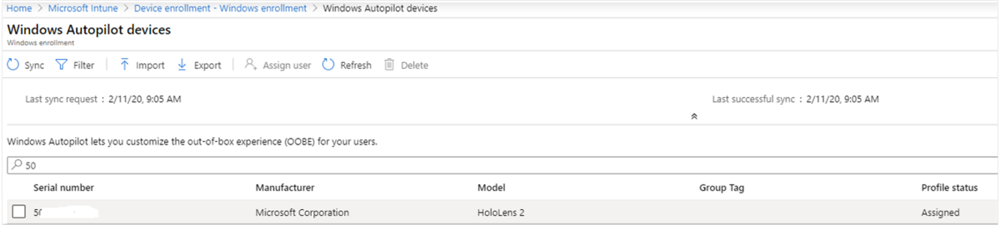

## Windows Autopilot for HoloLens 2 User Experience

Your HoloLens users can follow these steps to provision HoloLens devices.  

1. Use the USB-C cable to connect the HoloLens device to a computer that has Advanced Recovery Companion (ARC) installed and has the appropriate Windows update downloaded.
1. Use ARC to flash the appropriate version of Windows on to the device.
1. Connect the device to the network, and then restart the device.  
   
   The device should automatically start the Out-of-the-Box-Experience (OOBE). Do not interact with OOBE, instead sit back and relax! Let HoloLens 2 detect network connectivity and allow it complete OOBE automatically. The OOBE screens should resemble the following:
  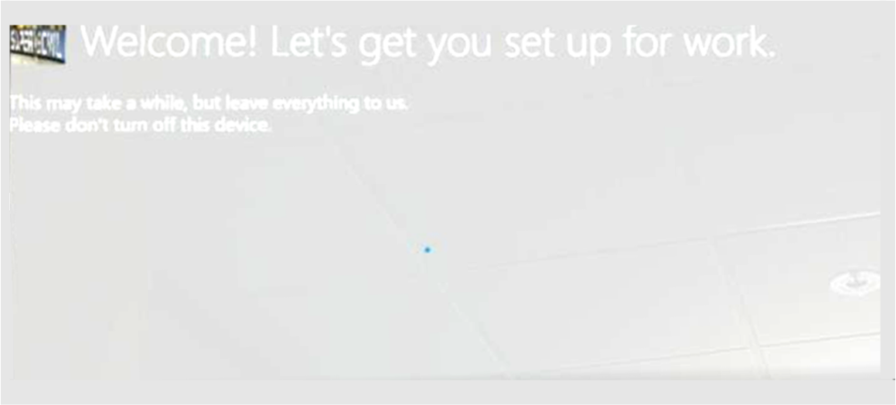
  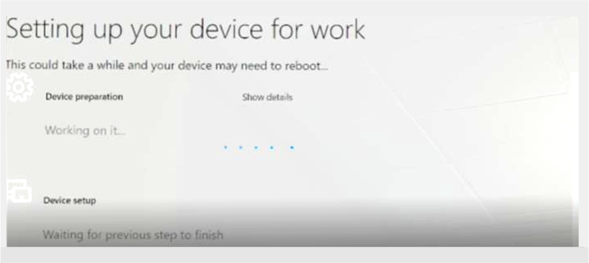
  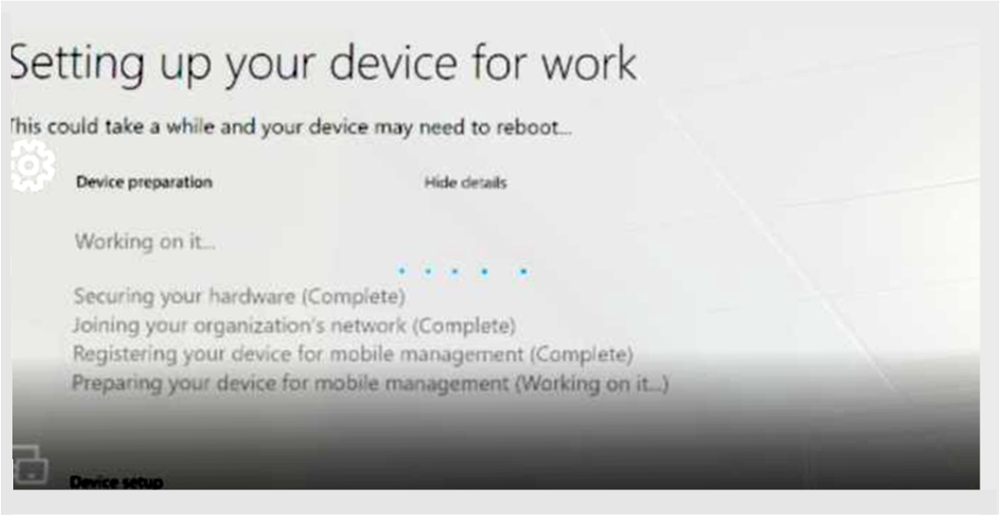
  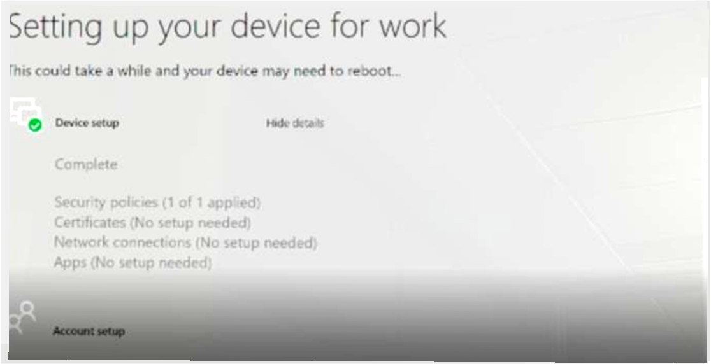

At the end of OOBE, you can sign in to the device by using your user name and password.

  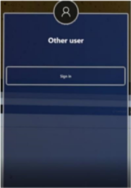

## Known Issues

- The list of supported languages for Autopilot deployment profiles includes languages that HoloLens does not support. Select a language that [HoloLens supports](hololens2-language-support.md).

## Feedback

To provide feedback or report issues, use one of the following methods:

- Use the Feedback Hub app. You can find this app on a HoloLens-connected computer. In Feedback Hub, select the **Enterprise Management** > **Device** category.  

  When you provide feedback or report an issue, provide a detailed description. When applicable, include screenshots and logs.
- Send an email to hlappreview@microsoft.com. For the email subject, enter **\<*Tenant*> Autopilot for HoloLens 2 evaluation feedback** (where \<*Tenant*> is the name of your Intune tenant).

  Provide a detailed description in your email. However, unless support personnel specifically request it, do not include data such as screenshots or logs. Such data may include private or personally identifiable information (PII).


