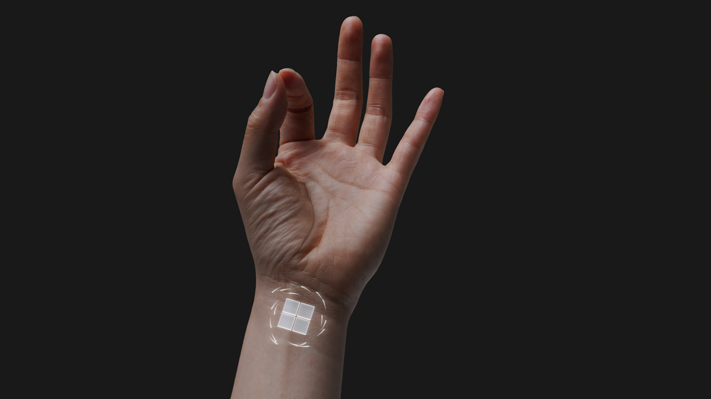

# Getting around HoloLens 2

Ready to explore the world of holograms?

This guide provides an intro to:

- Interacting with mixed reality
- Using your hands and voice for interacting with holograms on HoloLens 2
- Navigating Windows 10 on HoloLens (Windows Holographic)

## Discover mixed reality

On HoloLens, holograms blend the digital world with your physical environment to look and sound like they're part of your world. Even when holograms are all around you, you can always see your surroundings, move freely, and interact with people and objects. We call this experience "mixed reality".

The holographic frame positions your holograms where your eyes are most sensitive to detail and the see-through lenses leave your peripheral vision clear. With spatial sound, you can pinpoint a hologram by listening, even if it’s behind you. And, because HoloLens understands your physical environment, you can place holograms on and around real objects such as tables and walls.

Getting around HoloLens is a lot like using your smart phone. You can use your hands to touch and manipulate holographic windows, menus, and buttons.  

Once you know these basic interactions, getting around on HoloLens will be a snap.

> [!TIP]
> If you have a HoloLens near you right now, the **Tips** app provides literal hands-on tutorials for hand interactions on HoloLens.  
> Use the start gesture to go to **Start** or say "Go to Start" and select **Tips**.

## The hand-tracking frame

HoloLens has sensors that can see a few feet to either side of you. When you use your hands, you'll need to keep them inside that frame, or HoloLens won't see them. However, the frame moves with you as you move around.  

## Touch holograms near you

When a hologram is near you, bring your hand close to it and a white ring should appear on the tip of your index finger.  This is the **touch cursor** which helps you touch and interact with holograms with precision. To **select** something, simply **tap** it with the touch cursor. **Scroll** content by **swiping** on the surface of the content with your finger, just like you're using a touch screen.

To **grab** a hologram near you, pinch your **thumb** and **index finger** together on the hologram and hold. To let go, release your fingers. Use this **grab gesture** to move, resize, and rotate 3D objects and app windows in mixed reality home.

To bring up a **context menu**, like the ones you'll find on an app tile in the Start menu, **tap and hold** like you do on a touch screen.

## Use hand ray for holograms out of reach

> [!VIDEO https://www.microsoft.com/videoplayer/embed/RE3ZOum]

When there are no holograms near your hands, the **touch cursor** will hide automatically and **hand rays** will appear from the palm of your hands. Hand rays allow you to interact with holograms from a distance.

> [!TIP]
> If you find hand rays distracting, you can hide them by saying “Hide hand rays”. To make them reappear, say "Show hand rays."

### Select using air tap

To select something using **hand ray**, follow these steps:

1. Use a hand ray from your palm to target the item. You don't need to raise your entire arm, you can keep your elbow low and comfortable.
1. Point your index finger straight up toward the ceiling.
1. To perform the **air tap** gesture, pinch your thumb and index finger together and then quickly release them.

   

### Grab using air tap and hold

> [!VIDEO https://www.microsoft.com/videoplayer/embed/RE3Wxnh]

To grab a hologram or scroll app window content using **hand ray**, start with an **air tap**, but keep your fingers together instead of releasing them.

Use **air tap and hold** to perform the following actions with hand ray:

- **Scroll**. To scroll app window content, air tap and hold on the content and then move your hand ray up and down or side to side.
- **Grab**. To grab an app window or hologram, target the app title bar or hologram with your hand ray and then air tap and hold.
- **Open context menus**. To open context menus, air tap and hold with your hand ray.

## Start gesture

> [!VIDEO https://www.microsoft.com/videoplayer/embed/RE3Wxng]

The Start gesture opens the **Start menu**.  To perform the Start gesture, hold out your hand with your palm facing you. You’ll see a **Start icon** appear over your inner wrist. Tap this icon using your other hand.  The Start menu will open **where you’re looking**.

> [!TIP]
>
> - You can use the Start gesture as long as your hands are inside the hand-tracking frame.  You do not need to be looking down at the Start icon. Keep your elbow low and comfortable, and look in the direction where you want the Start menu to open.
> - If the Start menu didn't open at the position you want, simply move your head around to reposition it.
> - If you have trouble reading the smaller text on the Start menu, step closer to it after it opens.
> - If your hand is slightly off to the side of the frame, you may still be able to view the Start menu by tapping your inner wrist, even if you don't see the icon.

To **close** the Start menu, do the Start gesture when the Start menu is open.  You can also look at the Start menu and say "Close".

### One-handed Start gesture

> [!IMPORTANT]
> For the one-handed Start gesture to work:
>
> 1. You must update to the November 2019 update (build 18363.1039) or later.
> 1. Your eyes must be calibrated on the device so that eye tracking functions correctly. If you do not see orbiting dots around the Start icon when you look at it, your eyes are not [calibrated](https://docs.microsoft.com/hololens/hololens-calibration#calibrating-your-hololens-2) on the device.

You can also perform the Start gesture with only one hand. To do this, hold out your hand with your palm facing you and look at the **Start icon** on your inner wrist. **While keeping your eye on the icon**, pinch your thumb and index finger together.

## Start menu, mixed reality home, and apps

Ready to put all these hand interactions to the test?!

You'll find your installed apps in the [Start menu](holographic-home.md) and you can find additional apps for HoloLens in the [Microsoft Store](holographic-store-apps.md).

Just as Windows PC always starts its experience at the desktop, HoloLens always starts in **mixed reality home** when turned on.  Using the Start menu, you can open and place app windows, as well as app launchers and 3D content in mixed reality home. Their placements in your physical space will be remembered by HoloLens.

Open the **Start menu**, then select the **Settings** app tile. An app window will open in front of you.

Settings is an example of a HoloLens app that uses a 2D **app window**.  It's very similar to a Windows application on PC.

Now you can open the **Start menu** again and select the **Tips** app tile. A 3D **app launcher** for the app will appear in front of you. To open the app, you need to select the **play** button on the launcher.

Tips is an example of an **immersive app**. An immersive app takes you away from mixed reality home when it runs and becomes the only app you see.  To exit, you need to bring up the Start menu and select the **mixed reality home** button at the bottom.

[Go here to learn more](holographic-home.md) about Start menu and mixed reality home, including info on how to use and manage apps on HoloLens 2.

## Move, resize, and rotate holograms

In mixed reality home you can move, resize, and rotate app windows and 3D objects using your hands, hand ray and voice commands.

### Moving holograms

Move a hologram or app by following these steps:

1. Grab the hologram by pinching your index finger and thumb on the hologram or face your hand down and then close your fist over it.  Grab a 3D hologram anywhere inside its blue bounding box.  For an app window, grab its title bar.
1. Without letting go, move your hand to position the hologram. When moving an app window this way, the app window automatically turns to face you as it moves, making it easier to use at its new position.  
1. Release your fingers to place it.

### Resizing holograms

> [!VIDEO https://www.microsoft.com/videoplayer/embed/RE3ZYIb]

Grab and use the **resize handles** that appear on the corners of 3D holograms and app windows to resize them.

For an app window, when resized this way the window content correspondingly increases in size and becomes easier to read.

If you want to resize an app window so that **more content** appears in the window, use the resize handles located on the sides and bottom edges of the app window.

There are two ways to resize a hologram that's further away from you. You can either grab two corners of the hologram, or use the resize controls.

### Rotating holograms

For 3D holograms, grab and use the rotate handles that appear on the vertical edges of the bounding box.

For app windows, moving an app window will cause it to automatically rotate and face you.

You can also grab a 3D hologram or app window with **both hands** (or hand ray) at once and then:

- Move your hands closer together or further apart to resize the hologram.
- Move your hands closer and further away from your body to rotate the hologram.

### Follow me, stop following

Holograms and app windows stay where you placed them in the world.  That's not always convenient if you need to move around and you want an application to stay visible. To ask an app to start or stop following you, select **Follow me** in the top right corner of the app window (next to the **Close** button).  An app window that is following you will also follow you into, an out of, an immersive app.

## Use HoloLens with your voice

You can use your voice to do most of the same things you do with hands on HoloLens, like taking a quick photo or opening an app.

| To do this | Say this |
| - | - |
| Open the Start menu | "Go to Start" |
| Select | Say "select" to bring up the gaze cursor. Then, turn your head to position the cursor on the thing you want to select, and say “select” again. |
| See available speech commands | "What can I say?" |

 [See more voice commands and ways to use speech with HoloLens](hololens-cortana.md)

## Next steps

Congratulations! You're ready to use HoloLens 2!

Now you can configure your HoloLens 2 to meet your specific needs.  Other things you may want to try include:

- [Connecting bluetooth devices like a mouse and keyboard](hololens-connect-devices.md)
- [Installing apps from the store](holographic-store-apps.md)
- [Sharing your HoloLens with other people](hololens-multiple-users.md)
