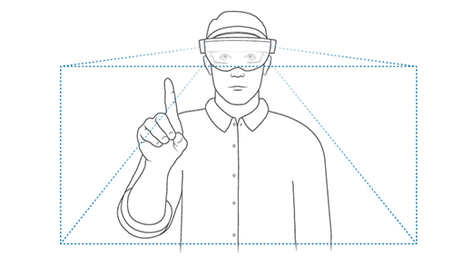
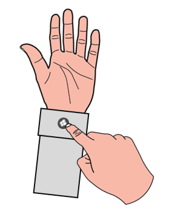
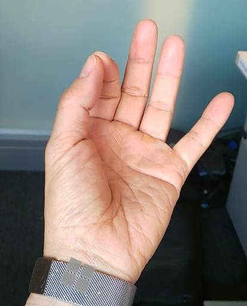

# Getting around HoloLens 2

Ready to step into the world of holograms?

This guide provides an intro to:

- mixed reality
- using your hands and voice for interacting with holograms on HoloLens 2
- navigating Windows 10 on HoloLens (Windows Holographic)

## Discover mixed reality

On HoloLens, holograms blend the digital world with your physical environment to look and sound like they're part of your world.  Even when holograms are all around you, you can always see your surroundings, move freely, and interact with people and objects. We call this experience "mixed reality".

The holographic frame positions your holograms where your eyes are most sensitive to detail and the see-through lenses leave your peripheral vision unobscured. With spatial sound, you can pinpoint a hologram even if it’s behind you using sound. And, because HoloLens understands your physical environment, you can place holograms on and around real objects like tables and walls.

## Use HoloLens with your hands

Getting around HoloLens is a lot like using your smart phone. You can use your hands to manipulate holographic windows, menus, and buttons.  

Once you know these basic interactions, getting around on HoloLens will be a snap.

> [!TIP]
> If you have a HoloLens near you right now, the **Tips** app gives you a hands-on tutorials for hand interactions on HoloLens.  
> Use the Start gesture to go to **Start** or say "Go to Start" and select **Tips**.

### The hand-tracking frame

HoloLens has sensors that can see a few feet to either side of you. When you use your hands, you'll need to keep them inside that frame, or HoloLens won't see them. As you move around, the frame moves with you.  

### Hand rays

Use hand rays to interact with holograms from a distance. When your hands are not in the vicinity of any holograms, hand rays automatically appear from your palms. Use hand rays while performing the air-tap and air-tap and hold gestures.

> [!TIP]
> If you find hand rays distracting, you can hide them by saying “Hide hand rays”. To make them reappear, say "Show hand rays."

### The Grab gesture

To perform the grab gesture, pinch your thumb and index finger together and hold. To let go, release your fingers. Use the grab gesture to move, resize, and rotate app windows and 3D objects.

### The Air-tap gesture

To select an app or other hologram, air tap it while using hand rays. To do this, follow these steps:

1. Use a had ray from your palm to target a hologram. You don't have to raise your whole arm—keep your elbow low and comfortable.
1. To perform the air-tap gesture, pinch your thumb and index finger together and then quickly release them.

   

### Tap-and-hold gesture

To tap and hold an app or other hologram, start with an air tap, but keep your fingers together instead of releasing them.

Use tap and hold to perform the following actions:

- **Scroll**. To scroll content, tap and hold on the content and then slowly move your hand up and down or side to side.
- **Grab**. To grab an app or hologram, target the app or hologram by using a hand ray and then tap and hold.
- **Open context menus**. To open context menus, tap and hold is the equivalent of press and hold on a touch screen.

## Voice commands

You can use your voice to do many of the same things you do with gestures on HoloLens, like taking a quick photo or opening an app.

| To do this | Say this |
| - | - |
| Open the Start menu | "Go to Start" |
| Select | Say "select" to bring up the gaze cursor. Then, turn your head to position the cursor on the thing you want to select, and say “select” again. |
| Leave an immersive app | Say "Go to Start" to bring up the quick actions menu, then say "Mixed reality home." |
| See available speech commands | "What can I say?" |

### See it, say it

Many buttons and other elements on HoloLens also respond to your voice—for example, **Adjust** and **Close** on the app bar. To find out if a button is voice-enabled, rest your gaze on it for a moment. If it is, you'll see a voice tip.

## Navigate Windows Holographic

Now that you can use air touch, grab, and hand-rays, let's try using these gestures to move through the holographic world and explore Windows Holographic.

You'll find your installed apps on the Start menu and there are more apps for HoloLens 2 in the Microsoft Store.  

Open the Start menu and select an app!

### Open the Start menu

The Start gesture opens the **Start** menu.  To perform the Start gesture, hold out your hand with your palm facing you. You’ll see a **Start** icon appear over your inner wrist. Tap this icon using your other hand.  The **Start** menu opens where you’re looking.

You can use the Start gesture as long as your hands are inside the hand-tracking frame.  You do not need to be looking down at the **Start** icon.

Alternatively, you can also perform the Start gesture with one hand. To do this, hold out your hand with your palm facing you and look at the **Start** icon on your inner wrist. While looking at the icon, pinch your thumb and index finger together. This action opens the **Start** menu.

> [!IMPORTANT]
> For the one-handed Start gesture to work, your device must be calibrated to your eyes so that eye-tracking functions correctly.

We'll talk more about voice commands later, but you can also open the **Start** menu by saying "Go to Start."

### Open apps

Now that the start menu is open, select an apps using touch.  We'll use the Tips app as an example.

1. bring your hand close to the **Start** menu and **Tips** app.
1. look for a white ring to appear on your index fingertip on the **Tips** icon.
1. move to touch the white ring/hologram.  **Tips** should open as a Hologram with a play button.

When you open an app, it will appear right in front of you.  Some apps use a 2D view and look like other Windows applications, other apps (holographic apps) use a 3D view and appear as a cube with a hologram icon.  

For example, **Tips** is a holographic app while **Settings** is a 2D app.

### Move and resize near-by holograms and apps by grabbing them

To perform the grab gesture, pinch your thumb and index finger together and hold. To let go, release your fingers. Use the grab gesture to move, resize, and rotate app windows and 3D objects.

Move a hologram or app by:

1. Grabbing the hologram - pinch your index finger and thumb on the hologram it or close your fist facing down.
1. Without letting go, move your hand to position the hologram.  When moving an app window this way, the app window will automatically turn to face you as it moves, making it easier to use at its new position.  
1. Release your fingers to place it

> [!TIP]
> If you're having trouble moving a 2D app, try grabbing the top tool bar.

Resize a hologram close to you by:

1. move one hand close to one edge of the hologram and your other hand to the other
1. Grab the edges of the hologram with both hands
1. Move your hands closer together to shrink the hologram and further apart ot make it bigger
1. release your fingers to keep the current size

### Move and resize further-away holograms and apps using hand rays

To move a hologram that's further away from you:

1. Target your hand ray on the hologram.
1. Pinch (air-tap) and hold to grab it.
1. Without letting go, move your hand to position the hologram.
1. Release your fingers to place it.

> [!TIP]
> If you're having trouble moving a 2D app, try grabbing the top tool bar.

There are two ways o resize a hologram that's further away from you.  You can either use the resize tool or grab two corners of the hologram.

Resize an app or hologram with two hands by grabbing the corners:

1. Point one hand ray at one corner of the hologram and the other hand ray at another corner
1. Grab the resize controls on the window corners with your hand rays.
1. Do air-tap and hold gesture, then as you move your hands closer together and apart the window will resize. You can also move your hands closer and further away from your body to rotate the window (on Y axis).

Resize an app or hologram with the resize control:

1. Move your hand close to the window.  You’ll see resize controls appear on the corners of the app window.
1. Grab the resize control by pinching your index finger and thumb on the control, move your hand to change the window size.
1. Release your fingers when you're done.

You can also move your hands closer and further away from your body to rotate the window (on Y axis).

### Follow me, stay there

Generally, holograms and apps stay where you placed them.  That's not always convenient if you need to move around and want an application to stay visible.  Select "follow me" in the top right corner of applications (next to the close button) to ask apps to follow or unfollow.

## Help! I can’t see or place holograms

If you’re using HoloLens and having trouble placing holograms, here are some things to try:

- Make sure you’re in a well-lit room without a lot of direct sunlight.
- Stand 1 to 3 meters from where you’re trying to place the hologram.
- Don’t place holograms on black or reflective surfaces.
- Look around so HoloLens can rescan your surroundings and incase a hologram was left behind somewhere.

## Next Steps

Congratulations! you're ready to use HoloLens 2.

Now you can configure your HoloLens 2 to meet your specific needs.

[Connect bluetooth devices](hololens-connect-devices.md)

[Learn more about Voice and Cortana](hololens-cortana.md)
