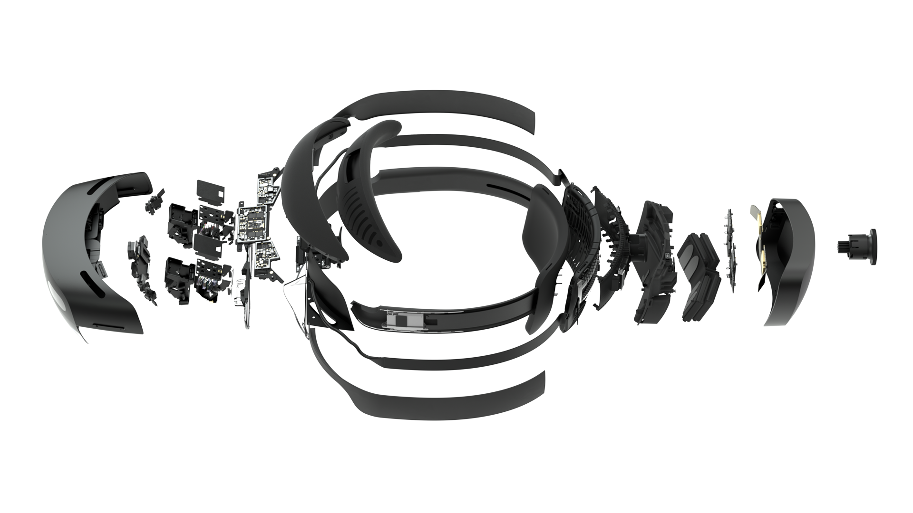
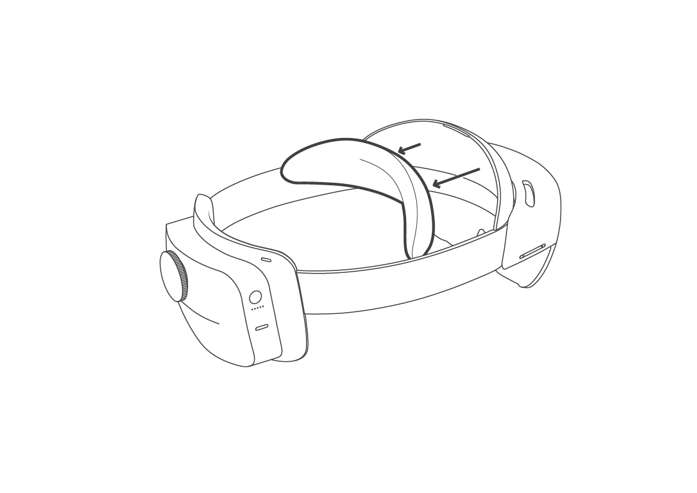

# HoloLens 2 hardware

Microsoft HoloLens 2 is an untethered holographic computer.  It refines the holographic computing journey started with HoloLens (1st gen) to provide a more comfortable and immersive experience paired with more options for collaborating in mixed reality.

## HoloLens components

- **Visor**. Contains the HoloLens sensors and displays. You can rotate the visor up while you are wearing the HoloLens.
- **Headband**. To put the HoloLens on, use the adjustment wheel to expand the headband. With the HoloLens in place, tighten the adjustment wheel until the headband is comfortable.
- **Brightness buttons**. When you're wearing the HoloLens, the brightness buttons are on the left side of the device.
- **Volume buttons**. When you're wearing the HoloLens, the volume buttons are on the right side of the device.

## In the box

- **Brow pad**. You can remove and replace the brow pad as needed.
- **Overhead strap**. When you're wearing the HoloLens while you move around, use the overhead strap to help keep the device in place. Additionally, if you're wearing the HoloLens for extended periods, using the overhead strap may make the device more comfortable to wear.
- **USB-C cable**. Use the USB-C cable to connect your HoloLens to the power supply for charging, or use it to connect your HoloLens to your computer.
- **Power supply**. Plugs into a power outlet.
- **Microfiber cloth**. Use the cloth to clean your HoloLens visor.

## Device specifications

### Display

|   |   |
| - | - |
| Optics | See-through holographic lenses (waveguides) |
| Holographic resolution | 2k 3:2 light engines |
| Holographic density | >2.5k radiants (light points per radian) |
| Eye-based rendering | Display optimization for 3D eye position |

### Sensors

|   |   |
| - | - |
| Head tracking | 4 visible light cameras |
| Eye tracking | 2 IR cameras |
| Depth | 1-MP Time-of-Flight depth sensor |
| IMU | Accelerometer, gyroscope, magnetometer |
| Camera | 8-MP stills, 1080p30 video |

### Audio and speech

|   |   |
| - | - |
| Microphone array | 5 channels |
| Speakers | Built-in spatial sound |

### Compute and connectivity

|   |   |
| - | - |
| System on chip | Qualcomm Snapdragon 850 Compute Platform [details](https://www.qualcomm.com/products/snapdragon-850-mobile-compute-platform) |
| Holographic processing unit | Second-generation custom-built holographic processing unit |
| Memory | 4-GB LPDDR4x system DRAM |
| Storage | 64-GB UFS 2.1 |
| WiFi | 802.11ac 2x2 |
| Bluetooth | 5.0 |
| USB | USB Type-C |

### Fit

|   |   |
| - | - |
| Sizing | Single size with adjustable band.  Fits over glasses |
| Weight | 566 grams |

## Device capabilities

### Human understanding

|   |   |
| - | - |
| Hand tracking | Two-handed fully articulated model, direct manipulation |
| Eye tracking | Real-time tracking |
| Voice | Command and control on-device; natural language with internet connectivity |

### Environment understanding

|   |   |
| - | - |
| Six Degree of Freedom (6DoF) tracking | World-scale positional tracking |
| Spatial Mapping | Real-time environment mesh |
| Mixed Reality Capture | Mixed hologram and physical environment photos and videos |

## Pre-installed software

- Windows Holographic Operating System
- Microsoft Edge
- Dynamics 365 Remote Assist
- Dynamics 365 Layout
- Dynamics 365 Guides
- 3D Viewer
- OneDrive for Business

## Device certifications

### Safety

HoloLens 2 has been tested and found to conform to the basic impact protection requirements of ANSI Z87.1, CSA Z94.3 and EN 166

## Care and cleaning

Handle your HoloLens carefully. Use the headband to lift and carry the HoloLens 2.

Like seeing glasses or protective eye-wear, try to keep the HoloLens visor free of dust and fingerprints.  Avoid touching the visor when possible.  Repeated cleaning could damage the visor, so try to keep your device clean.

Don't use any cleaners or solvents on your HoloLens, and don't submerge it in water or apply water directly to it.

To clean the visor, remove any dust using a camel or goat hair lens brush or a bulb-style lens blower. Lightly moisten the microfiber cloth with a small amount of distilled water, then use it to wipe the visor gently in a circular motion.

Clean the rest of the device, including the headband and device arms, with a lint-free cloth moistened with mild soap and water. Let your HoloLens dry completely before using it again.

### Replace the brow pad

The brow pad is magnetically attached to the device. To detach it, pull gently away. To replace it, snap it back into place.

> [!div class="nextstepaction"]
> [Set up and start your HoloLens 2](hololens2-setup.md)
