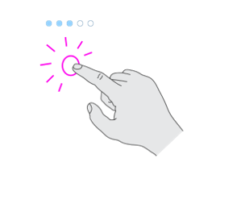
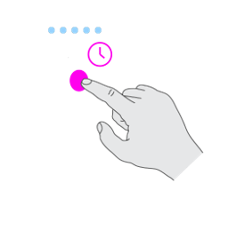

# Set up HoloLens 2

Follow along to set up a HoloLens 2 for the first time.

## Charge your HoloLens

[Charge your HoloLens](https://support.microsoft.com/en-us/help/12627)

## Adjust fit

Place the HoloLens 2 on your head. If you wear glasses, leave them on.  The brow pad should sit comfortably on your forehead and the back band should sit in the middle-back of your head.

If necessary, extend the headband by turning the adjustment wheel, and then loosen the overhead strap.

### Attach and detach the overhead strap

The overhead strap isn't required, but it can make wearing HoloLens 2 more comfortable over longer periods of time.

To detach the back of the overhead strap, press the button below each connection tab and pull gently.

To detach the front of the overhead strap, unhook the strap and slide it through the retractable loop on the brow pad. To replace it, pull out the loop and slide the strap back through.

To replace the strap, push the connection tabs back into the slots until they click.

## Turn on the HoloLens 2

To turn on your HoloLens 2, press the power button.  The LED lights below the power button show the battery level.

### Power button actions for different power transitions

|  Description | Action and Lights |
| - | - |
| **Single Click** to turn on |  |
| **Single Click** to sleep |  |
| **Single Click** to wake from sleep |  |
| **Press and hold 5s** to turn off |  |
| **Press and hold 10s** to force restart if the HoloLens 2 is unresponsive. |  |

## HoloLens indicator lights

Not sure what the indicator lights on your HoloLens mean? Here's some help.

### Lights to indicate device state

| When the lights do this | It means |
| - | - |
| LEDs fade on to battery level as soon as power button is pressed and device starts booting. A sound will play 4s after user pressed the power button to indicate device boot is in progress. | HoloLens is starting up. |
| Same LED pattern as device boot. A sound will play immediately after user pressed the power button to indicate device is awake. | HoloLens is on and ready to use. |
| When power button is pressed and held LEDs all come on and fade off one by one, at which point shutdown is committed (a sound will play and “Goodbye” text will be shown on screen). If user lets go of power button before 5s is up device goes to sleep state. | HoloLens is going to sleep or shutting down, depending on press length. |
| On attempt to power on LED flashes 5 times, then turns off. | Battery is critically low. HoloLens needs to charge. |
| Blink all 5 LEDs 5 times then turn off | Boot Error |

### Lights to indicate battery level

| Number of lights | Battery level |
| - | - |
| One light fading in and out | < Critical battery (5%)* to  20 Percent |
| One solid light, one light fading in and out | 21 to 40 Percent |
| Two solid lights, one light fading in and out | 41 to 60 Percent |
| Three solid light, one light fading in and out | 61 to 80 Percent |
| Four solid light, one light fading in and out | 81 to 100 Percent (fully charged) |

## Safety and Comfort

### Use in safe surroundings

Use your HoloLens in a safe space that’s free of obstructions and tripping hazards. Don’t use it when you need a clear field of view and your full attention, such as while you’re operating a vehicle or doing other potentially hazardous activities.

### Stay comfortable

Keep your first few sessions with HoloLens brief and be sure to take breaks. If you experience discomfort, stop and rest until you feel better. This might include temporary feelings of nausea, motion sickness, dizziness, disorientation, headache, fatigue, eye strain, or dry eyes.

> [!div class="nextstepaction"]
> [Start and configure your HoloLens 2](hololens2-start.md)
