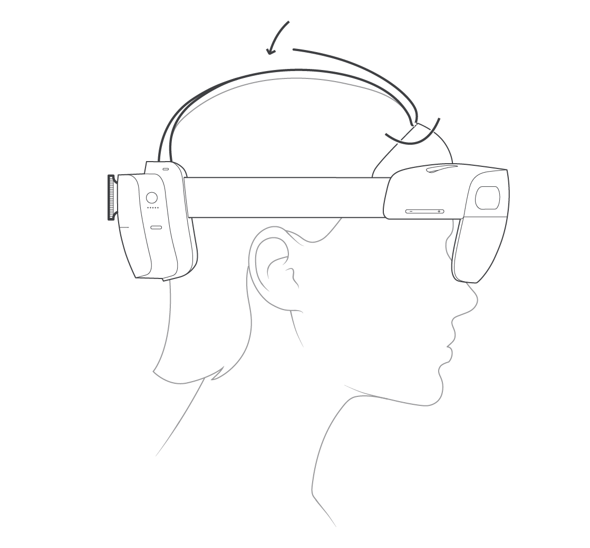
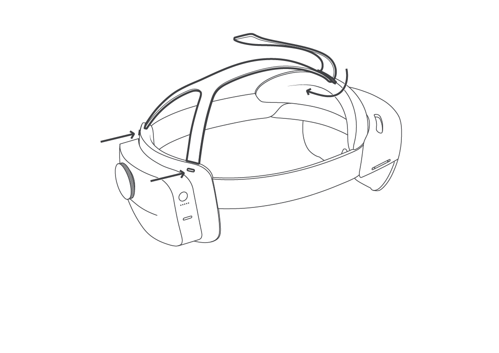

# Set up HoloLens 2

Follow along to set up a HoloLens 2 for the first time.

## Charge your HoloLens

[Charge your HoloLens](https://support.microsoft.com/en-us/help/12627)

## Adjust fit

Place the HoloLens 2 on your head. If you wear glasses, leave them on.  The brow pad should sit comfortably on your forehead and the back band should sit in the middle-back of your head.

If necessary, extend the headband by turning the adjustment wheel, and then loosen the overhead strap.

### Attach and detach the overhead strap

The overhead strap isn't required, but it can make wearing HoloLens 2 more comfortable over longer periods of time.

To detach the back of the overhead strap, press the button below each connection tab and pull gently.

To detach the front of the overhead strap, unhook the strap and slide it through the retractable loop on the brow pad. To replace it, pull out the loop and slide the strap back through.

To replace the strap, push the connection tabs back into the slots until they click.

## Turn on the HoloLens 2

To turn on your HoloLens 2, press the power button.  The LED lights below the power button show the battery level.

Putting to sleep: Briefly press the power button.  • Turning off: Press and hold the power button until the display and all of the LED lights turn off.  

## Safety and Comfort

### Use in safe surroundings

Use your HoloLens in a safe space that’s free of obstructions and tripping hazards. Don’t use it when you need a clear field of view and your full attention, such as while you’re operating a vehicle or doing other potentially hazardous activities.

### Stay comfortable

Keep your first few sessions with HoloLens brief and be sure to take breaks. If you experience discomfort, stop and rest until you feel better. This might include temporary feelings of nausea, motion sickness, dizziness, disorientation, headache, fatigue, eye strain, or dry eyes.

> [!div class="nextstepaction"]
> [Start and configure your HoloLens 2](hololens2-start.md)
