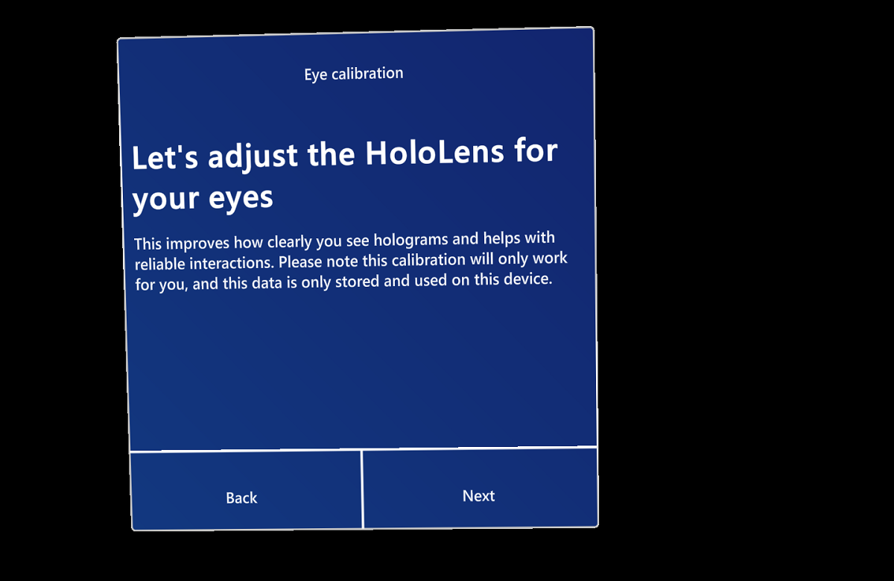

# Set up HoloLens 2 for the first time

The first time you turn on your HoloLens, you'll be guided through setting up your device, signing in with a user account, and calibrating HoloLens to your eyes and gaze.  This section walks through the HoloLens 2 first start experience.

In the next section, you'll learn how to work with HoloLens and interact with holograms.  Skip ahead to [Get started with HoloLens 2](hololens2-basic-usage.md).

## Before you start

Before you get started, make sure you have the following available:

**A network connection**. You'll need to connect your HoloLens to a network to set it up. With HoloLens 2, you can connect with Wi-Fi or using ethernet (you'll need a USB-C to ethernet adapter).  
The first time you connect, you'll need an open or password-protected network that doesn't require navigating to a website or using certificates to connect. Setup uses [the following websites](hololens-offline.md).

**A Microsoft account**. You'll also need to sign in to HoloLens with a Microsoft account (or with your work account, if your organization owns the device). If you don't have a Microsoft account, go to [account.microsoft.com](http://account.microsoft.com) and set one up for free.

**A safe, well-lit space with no tripping hazards**. [Health and safety info](http://go.microsoft.com/fwlink/p/?LinkId=746661).

**The optional comfort accessories** that came with your HoloLens, to help you get the most comfortable fit. [More on fit and comfort](https://support.microsoft.com/help/12632/hololens-fit-your-hololens).

## Set up Windows

Set up your Windows Holographic on your HoloLens 2.  This first start experience will let you pick your location, language, keyboard layout, and your user account.

1. Connect to the internet (select Wi-Fi or your ethernet connection).

1. Sign in to your user account.  You'll choose between **My work or school owns it** and **I own it**.
    - When you choose **My work or school owns it**, you sign in with an Azure AD account. If your organization uses Azure AD Premium and has configured automatic MDM enrollment, HoloLens will be enrolled in MDM. If your organization does not use Azure AD Premium, automatic MDM enrollment isn't available, so you will need to [enroll HoloLens in device management manually](hololens-enroll-mdm.md#enroll-through-settings-app).
        1. Enter your organizational account.
        2. Accept privacy statement.
        3. Sign in using your Azure AD credentials. This may redirect to your organization's sign-in page.
        4. Continue with device setup.
    - When you choose **I own it**, you sign in with a Microsoft account. After setup is complete, you can [enroll HoloLens in device management manually](hololens-enroll-mdm.md#enroll-through-settings-app).
        1. Enter your Microsoft account.
        2. Enter your password. If your Microsoft account requires [two-step verification (2FA)](https://blogs.technet.microsoft.com/microsoft_blog/2013/04/17/microsoft-account-gets-more-secure/), complete the verification process.

1. The device sets your time zone based on information obtained from the Wi-Fi network.

## Calibration

HoloLens 2 uses eye-tracking to make holograms clear and easy to interact with. You'll be prompted to calibrate during device setup and for every new HoloLens 2 user.  HoloLens 2 will work without calibration and, if you choose to skip calibration in setup, you can calibrate later.

To calibrate, you'll look at a set of targets (gems). It's fine if you blink or close your eyes during calibration but try not to stare at other objects in the room.  This allows HoloLens to learn about your eye position and build your holographic world around your specific eye position.  After calibration, holograms will appear correctly even when the visors position changes as the HoloLens shifts on your head.

### Calibration data and security

Calibration information is stored locally on the device and is not associated with any account information. There is no record of who has used the device without calibration. This mean new users will get prompted to calibrate visuals when they use the device for the first time, as well as users who opted out of calibration previously or if calibration was unsuccessful.

Calibration information can always be deleted from the device in **Settings** > **Privacy** > **Eye tracker**.  

### Calibration failures

Calibration should work for most people, but there are cases where calibration fails.
  
Here are some common reasons for calibration failure:

- User getting distracted and not following the calibration targets during calibration.
- Dirty or scratched device visor or device visor not positioned properly
- Dirty or scratched glasses
- Certain types of contact lenses and glasses (colored contact lenses, some toric contact lenses, IR blocking glasses, some high prescription glasses, sunglasses, and so forth)
- More-pronounced makeup, some eyelash extensions
- Occlusions of eye and/or device visor (hair, some thick eyeglass frames)
- Eye physiology, certain eye conditions and/or eye surgery (some narrow eyes, long eyelashes, amblyopia, nystagmus, some cases of LASIK or other eye surgeries, and so forth)

If calibration is unsuccessful try:

- Cleaning your device visor
- Cleaning your glasses
- Pushing your device visor all the way in
- Moving objects in your visor out of the way (such as hair).
- Turning on a light in your room or move out of direct sunlight

If you followed all guidelines and calibration is still failing, please file feedback in FeedbackHub.

Congratulations!  Setup is complete and you can begin using HoloLens.

## Next steps

> [!div class="nextstepaction"]
> [Get started with HoloLens 2](hololens2-basic-usage.md)
