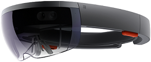

# Microsoft HoloLens

<table><tbody>
<tr><td style="border: 0px;width: 75%;valign= top">
Microsoft HoloLens is the first fully self-contained holographic computer running Windows 10.

 Microsoft HoloLens is available in the <strong>Development Edition</strong>, which runs Windows Holographic (an edition of Windows 10 designed for HoloLens), and in the <strong>Commercial Suite</strong>, which runs Windows Holographic for Business when you apply the Enterprise license file to the device.
</td><td align="left" style="border: 0px"></td></tr>
</tbody></table>

## In this section

| Topic | Description |
| --- | --- |
| [What's new in Microsoft HoloLens](hololens-whats-new.md) | Discover the new features in the latest update. |
| [HoloLens in the enterprise: requirements](hololens-requirements.md) | Lists requirements for general use, Wi-Fi, and device management |
| [Set up HoloLens](hololens-setup.md) | How to set up HoloLens for the first time  |
[Install localized version of HoloLens](hololens-install-localized.md) | Install the Chinese or Japanese version of HoloLens
| [Unlock Windows Holographic for Business features](hololens-upgrade-enterprise.md)  | How to upgrade your Development Edition HoloLens to Windows Holographic for Business |
| [Enroll HoloLens in MDM](hololens-enroll-mdm.md) | Manage multiple HoloLens devices simultaneously using solutions like Microsoft Intune |
| [Manage updates to HoloLens](hololens-updates.md) | Use mobile device management (MDM) policies to configure settings for updates. |
| [Set up HoloLens in kiosk mode](hololens-kiosk.md) | Enable kiosk mode for HoloLens, which limits the user's ability to launch new apps or change the running app  |
[Share HoloLens with multiple people](hololens-multiple-users.md) | Multiple users can shared a HoloLens device by using their Azure Active Directory accounts. |
| [Configure HoloLens using a provisioning package](hololens-provisioning.md) | Provisioning packages make it easy for IT administrators to configure HoloLens devices without imaging |
| [Install apps on HoloLens](hololens-install-apps.md) | Use Microsoft Store for Business, mobile device management (MDM), or the Windows Device Portal to install apps on HoloLens |
| [Enable Bitlocker device encryption for HoloLens](hololens-encryption.md) | Learn how to use Bitlocker device encryption to protect files and information stored on the HoloLens |
| [Change history for Microsoft HoloLens documentation](change-history-hololens.md) | See new and updated topics in the HoloLens documentation library. |

## Related resources

- [Help for using HoloLens](https://support.microsoft.com/products/hololens)

- [Documentation for Holographic app development](https://developer.microsoft.com/windows/mixed-reality/development)

- [HoloLens Commercial Suite](https://www.microsoft.com/microsoft-hololens/hololens-commercial)

- [HoloLens release notes](https://developer.microsoft.com/en-us/windows/mixed-reality/release_notes)
