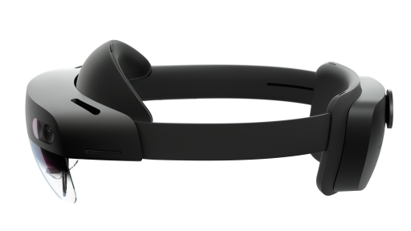

# Microsoft HoloLens

<table><tbody>
<tr><td style="border: 0px;width: 75%;valign= top">

Microsoft HoloLens is the first fully self-contained holographic computer running Windows 10.

Now, with the introduction of HoloLens 2, every device provides commercial ready management enhanced by the reliability, security, and scalability of cloud and AI services from Microsoft.

</td><td align="left" style="border: 0px"></td></tr>
</tbody></table>

## Guides in this section

| Guide | Description |
| --- | --- |
| [Get started with HoloLens](hololens-setup.md) | Set up HoloLens for the first time.  |
| [Deploy HoloLens in a commercial environment](hololens-requirements.md) | Configure HoloLens for scale enterprise deployment and ongoing device management.  |
| [Install and manage applications on HoloLens](hololens-install-apps.md) |Install and manage important applications on HoloLens at scale.  |
| [Recover and troubleshoot HoloLens issues](https://support.microsoft.com/products/hololens) |  Learn how to gather logs from HoloLens, recover a misbehaving device, or reset HoloLens when necessary.  |
| [Get support](https://support.microsoft.com/products/hololens) |Connect with Microsoft support resources for HoloLens in enterprise.  |

## Quick reference by topic

| Topic | Description |
| --- | --- |
| [What's new in Microsoft HoloLens](hololens-whats-new.md) | Discover new features in the latest updates. |
| [Configure HoloLens using a provisioning package](hololens-provisioning.md) | Provisioning packages make it easy for IT administrators to configure HoloLens devices without imaging |
| [HoloLens MDM support](hololens-enroll-mdm.md) | Manage multiple HoloLens devices simultaneously using Mobile Device Management (MDM) solutions like Microsoft Intune. |
| [HoloLens update management](hololens-updates.md) | Use mobile device management (MDM) policies to configure settings for updates. |
| [HoloLens user management](hololens-multiple-users.md) | Multiple users can shared a HoloLens device by using their Azure Active Directory accounts. |
| [HoloLens application access management](hololens-kiosk.md) | Manage application access for different user groups.  |
| [Enable Bitlocker device encryption for HoloLens](hololens-encryption.md) | Learn how to use Bitlocker device encryption to protect files and information stored on the HoloLens. |
| [Install localized version of HoloLens](hololens-install-localized.md) | Configure HoloLens for different locale.  |

## Related resources

* [Documentation for Holographic app development](https://developer.microsoft.com/windows/mixed-reality/development)
* [HoloLens Commercial Suite](https://www.microsoft.com/microsoft-hololens/hololens-commercial)
* [HoloLens release notes](https://developer.microsoft.com/en-us/windows/mixed-reality/release_notes)
