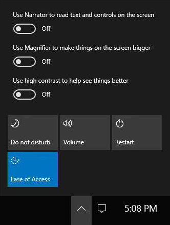

# Accessibility (Surface Hub)

Microsoft Surface Hub has the same accessibility options as Windows 10.

## Default accessibility settings

The full list of accessibility settings are available to IT admins in the **Settings** app. The default accessibility settings for Surface Hub include:

| Accessibility feature | Default settings  |
| --------------------- | ----------------- |
| Narrator              | Off               |
| Magnifier             | Off               |
| High contrast         | No theme selected |
| Closed captions       | Defaults selected for Font and Background and window |
| Keyboard              | **On-screen Keyboard**, **Sticky Keys**, **Toggle Keys**, and **Filter Keys** are all off. |
| Mouse                 | Defaults selected for **Pointer size**, **Pointer color** and **Mouse keys**. |
| Other options         | Defaults selected for **Visual options** and **Touch feedback**. |

Additionally, these accessibility features and apps are returned to default settings when users press [**I'm Done**](i-am-done-finishing-your-surface-hub-meeting.md):
- Narrator
- Magnifier
- High contrast
- Filter keys
- Sticky keys
- Toggle keys
- Mouse keys

## Change accessibility settings during a meeting

During a meeting, users can toggle accessibility features and apps in a couple ways:
- [Keyboard shortcuts](https://support.microsoft.com/en-us/help/13813/windows-10-microsoft-surface-hub-keyboard-shortcuts)
- **Quick Actions** > **Ease of Access** from the status bar

> 

## Related topics

[Manage Microsoft Surface Hub](manage-surface-hub.md)

[Microsoft Surface Hub administrator's guide](surface-hub-administrators-guide.md)
