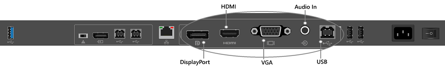
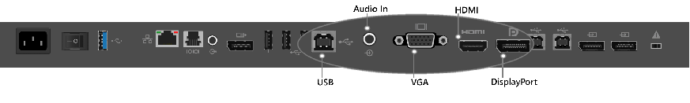
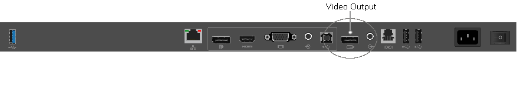
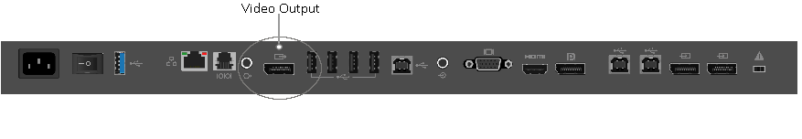

# Connect other devices and display with Surface Hub

You can connect other devices to your Microsoft Surface Hub to display content. This topic describes the Guest Mode, Replacement PC Mode, and Video Out functionality available through wired connections, and also lists accessories that you can connect to Surface Hub using [Bluetooth](#bluetooth-accessories).

>[!NOTE]
>Surface Hub will use the video input that you select until a new connection is made, the existing connection is disrupted, or the Connect App is closed.

## Which method should I choose?

When connecting external devices and displays to a Surface Hub, there are several available options. The method you use will depend upon your scenario and needs. 

| When you want to: | Use this method: |
| --- | --- |
| Mirror the Surface Hub's display on another device. | [Video Out](#video-out) |
| Present another device's display on the Surface Hub screen and interact with both the device's content and the built-in Surface Hub experience. | [Guest Mode](#guest-mode) |
| Power the Surface Hub from an external Windows 10 PC, turning off the embedded computer of the Surface Hub. Cameras, microphones, speakers, and other peripherals, are sent to the external PC, in addition to pen and touch. | [Replacement PC Mode](#replacement-pc-mode) |

## Guest Mode

Guest Mode uses a wired connection, so people can display content from their devices to the Surface Hub. If the source device is Windows-based, that device can also provide Touchback and Inkback. Surface Hub's internal PC takes video and audio from the connected device and presents them on the Surface Hub. If Surface Hub encounters a High-Bandwidth Digital Content Protection (HDCP) signal, the source will be displayed as a black image. To display your content without violating HDCP requirements, use the keypad on the right side of the Surface Hub to directly choose the external source.

>[!NOTE]
>When an HDCP source is connected, use the side  keypad to change source inputs.

### Ports

Use these ports on the Surface Hub for Guest Mode.

<table>
<colgroup>
<col width="25%" />
<col width="25%" />
<col width="25%" />
<col width="25%" />
</colgroup>
<thead>
<tr class="header">
<th>Interface</th>
<th>Type</th>
<th>Description</th>
<th>Capabilities</th>
</tr>
</thead>
<tbody>
<tr class="odd">
<td>
Display Port 1.1a
</td>
<td>
Video input
</td>
<td>
Guest input #1
</td>
<td><ul>
<li>
Support simultaneous guest input display with guest input #2 and guest input #3 (one full resolution, two thumbnail).
</li>
<li>
HDCP compliant in bypass mode
</li>
<li>
Touchback enabled
</li>
</ul></td>
</tr>
<tr class="even">
<td>
HDMI 1.4
</td>
<td>
Video input
</td>
<td>
Guest input #2
</td>
<td><ul>
<li>
Support simultaneous guest input display with guest input #1 and guest input #3 (one full resolution, two thumbnail).
</li>
<li>
HDCP compliant in bypass mode
</li>
<li>
Touchback enabled
</li>
</ul></td>
</tr>
<tr class="odd">
<td>
VGA
</td>
<td>
Video input
</td>
<td>
Guest input #3
</td>
<td><ul>
<li>
Support simultaneous guest input display with guest input #1 and guest input #2 (one full resolution, two thumbnail).
</li>
<li>
HDCP compliant in bypass mode
</li>
<li>
Touchback enabled
</li>
</ul></td>
</tr>
<tr class="even">
<td>
3.5 mm jack
</td>
<td>
Audio input
</td>
<td>
Analog audio input
</td>
<td><ul>
<li>
Ingest into Surface Hub PC, usually with the VGA video input.
</li>
</ul></td>
</tr>
<tr class="odd">
<td>
USB 2.0, type B
</td>
<td>
USB out
</td>
<td>
Touchback
</td>
<td><ul>
<li>
Provides access to the HID input devices mouse, touch, keyboard, and stylus back to the guest PC.
</li>
</ul></td>
</tr>
</tbody>
</table>

 

### Port locations

These are the port connections used for Guest Mode on the 55" and 84" Surface Hubs.

Wired port connections on 55" Surface Hub

Wired port connections on 84" Surface Hub

### Port enumeration

When a Surface hub is connected to a guest computer with the wired connect USB port, a number of USB devices are discovered and configured. These peripheral devices are created for Touchback and Inkback. The peripheral devices can be viewed in Device Manager. Device Manager will show duplicate names for some devices.

**Human interface devices**

-   HID-compliant consumer control device

-   HID-compliant pen

-   HID-compliant pen (duplicate item)

-   HID-compliant pen (duplicate item)

-   HID-compliant touch screen

-   USB Input Device

-   USB Input Device (duplicate item)

**Keyboards**

-   Standard PS/2 keyboard

**Mice and other pointing devices**

-   HID-compliant mouse

**Universal serial bus controllers**

-   Generic USB hub

-   USB composite device

### Guest Mode connectivity

Your choice of video cable will be determined by what is available from your source input. The Surface Hub has three choices of video input: DisplayPort, HDMI, and VGA. See the following chart for available resolutions.

<table style="width:100%;">
<colgroup>
<col width="16%" />
<col width="16%" />
<col width="16%" />
<col width="16%" />
<col width="16%" />
<col width="16%" />
</colgroup>
<thead>
<tr class="header">
<th>Signal Type</th>
<th>Resolution</th>
<th>Frame rate</th>
<th>HDMI - RGB</th>
<th>DisplayPort</th>
<th>VGA</th>
</tr>
</thead>
<tbody>
<tr class="odd">
<td>
PC
</td>
<td>
640 x 480
</td>
<td>
59.94/60
</td>
<td>
X
</td>
<td>
X
</td>
<td>
X
</td>
</tr>
<tr class="even">
<td>
PC
</td>
<td>
720 x 480
</td>
<td>
59.94/60
</td>
<td>
X
</td>
<td>
X
</td>
<td></td>
</tr>
<tr class="odd">
<td>
PC
</td>
<td>
1024 x 768
</td>
<td>
60
</td>
<td>
X
</td>
<td>
X
</td>
<td>
X
</td>
</tr>
<tr class="even">
<td>
HDTV
</td>
<td>
720p
</td>
<td>
59.94/60
</td>
<td>
X
</td>
<td>
X
</td>
<td>
X
</td>
</tr>
<tr class="odd">
<td>
HDTV
</td>
<td>
1080p
</td>
<td>
59.94/60
</td>
<td>
X
</td>
<td>
X
</td>
<td>
X
</td>
</tr>
</tbody>
</table>

 

Source audio is provided by DisplayPort and HDMI cables. If you must use VGA, Surface Hub has an audio input port that uses a 3.5 mm plug. Surface Hub also uses a USB cable that provides Touchback and Inkback from the Surface Hub to compatible Windows 10 devices. The USB cable can be used with any video input that is already connected with a cable.

Someone using Guest Mode to connect a PC would use one of these options:

**DisplayPort** -- DisplayPort cable and USB 2.0 cable

**HDMI** -- HDMI cable and USB 2.0 cable

**VGA** -- VGA cable, 3.5 mm audio cable, and USB 2.0 cable

If the computer you are using for Guest Mode is not compatible with Touchback and Inkback, then you won't need the USB cable.

## Replacement PC Mode

In Replacement PC Mode, the embedded computer of the Surface Hub is turned off and an external PC is connected to the Surface Hub. Connections to replacement PC ports give access to key peripherals on the Surface Hub, including the screen, pen, and touch features. This does mean that your Surface Hub won’t have the benefit of the Windows Team experience, but you will have the flexibility offered by providing and managing your own Windows computer.

### Software requirements

You can run Surface Hub in Replacement PC Mode with 64-bit versions of Windows 10 Home, Windows 10 Pro, and Windows 10 Enterprise. You can download the  [Surface Hub Replacement PC driver package](https://www.microsoft.com/download/details.aspx?id=52210) from the Microsoft Download Center. We recommend that you install these drivers on any computer you plan to use as a replacement PC.

### Hardware requirements

Surface Hub is compatible with a range of hardware. Choose the processor and memory confirmation for your replacement PC so that it supports the programs you'll be using. Your replacement PC hardware needs to support 64-bit versions of Windows 10.

### Graphics adapter

In Replacement PC Mode, Surface Hub supports any graphics adapter that can produce a DisplayPort signal. You'll improve your experience with a graphics adapter that can match Surface Hub's resolution and refresh rate. For example, the best and recommended replacement PC experience on the Surface Hub is with a 120Hz video signal.

**55" Surface Hubs** - For best experience, use a graphics card capable of 1080p resolution at 120Hz.

**84" Surface Hubs** - For best experience, use a graphics card capable of outputting four DisplayPort 1.2 streams to produce 2160p at 120Hz (3840 x 2160 at 120Hz vertical refresh). We've verified that this works with the NVIDIA Quadro K2200, NVIDIA Quadro K4200, NVIDIA Quadro M6000, AMD FirePro W5100, AMD FirePro W7100, and AMD FirePro W9100. These are not the only graphics cards - others are available from other vendors. 

Check directly with graphics card vendors for the latest drivers.

<table>
<colgroup>
<col width="50%" />
<col width="50%" />
</colgroup>
<thead>
<tr class="header">
<th>Graphics vendor</th>
<th>Driver download page</th>
</tr>
</thead>
<tbody>
<tr class="odd">
<td>
NVIDIA
</td>
<td>
<a href="http://nvidia.com/Download/index.aspx" data-raw-source="[http://nvidia.com/Download/index.aspx](http://nvidia.com/Download/index.aspx)">http://nvidia.com/Download/index.aspx</a>
</td>
</tr>
<tr class="even">
<td>
AMD
</td>
<td>
<a href="http://support.amd.com/en-us/download" data-raw-source="[http://support.amd.com/en-us/download](http://support.amd.com/en-us/download)">http://support.amd.com/en-us/download</a>
</td>
</tr>
<tr class="odd">
<td>
Intel
</td>
<td>
<a href="https://downloadcenter.intel.com/" data-raw-source="[https://downloadcenter.intel.com/](https://downloadcenter.intel.com/)">https://downloadcenter.intel.com/</a>
</td>
</tr>
</tbody>
</table>

 

### Ports

Replacement PC ports on 55" Surface Hub

<table>
<colgroup>
<col width="25%" />
<col width="25%" />
<col width="25%" />
<col width="25%" />
</colgroup>
<thead>
<tr class="header">
<th>Description</th>
<th>Type</th>
<th>Interface</th>
<th>Details</th>
</tr>
</thead>
<tbody>
<tr class="odd">
<td>
PC video
</td>
<td>
Video input
</td>
<td>
DP 1.2
</td>
<td><ul>
<li>
Full screen display of 1080p at 120 Hz, plus audio
</li>
<li>
HDCP compliant
</li>
</ul></td>
</tr>
<tr class="even">
<td>
Internal peripherals
</td>
<td>
USB output
</td>
<td>
USB 2.0 type B
</td>
<td><ul>
<li>
Touch
</li>
<li>
Pen
</li>
<li>
Speakers
</li>
<li>
Microphone
</li>
<li>
Cameras
</li>
<li>
NFC sensor
</li>
<li>
Ambient light sensor
</li>
<li>
Passive infrared sensor
</li>
</ul></td>
</tr>
<tr class="odd">
<td>
USB hub
</td>
<td>
USB output
</td>
<td>
USB 2.0 type B
</td>
<td><ul>
<li>
Underneath USB ports
</li>
</ul></td>
</tr>
</tbody>
</table>

 

Replacement PC ports on 84" Surface Hub

<table>
<colgroup>
<col width="25%" />
<col width="25%" />
<col width="25%" />
<col width="25%" />
</colgroup>
<thead>
<tr class="header">
<th>Description</th>
<th>Type</th>
<th>Interface</th>
<th>Details</th>
</tr>
</thead>
<tbody>
<tr class="odd">
<td>
PC video
</td>
<td>
Video input
</td>
<td>
DP 1.2 (2x)
</td>
<td><ul>
<li>
Full screen display of 2160p at 120 Hz, plus audio
</li>
<li>
HDCP compliant
</li>
</ul></td>
</tr>
<tr class="even">
<td>
Internal peripherals
</td>
<td>
USB output
</td>
<td>
USB 2.0 type B
</td>
<td><ul>
<li>
Touch
</li>
<li>
Pen
</li>
<li>
Speakers
</li>
<li>
Microphone
</li>
<li>
Cameras
</li>
<li>
NFC sensor
</li>
<li>
Ambient light sensor
</li>
<li>
Passive infrared sensor
</li>
</ul></td>
</tr>
<tr class="odd">
<td>
USB hub
</td>
<td>
USB output
</td>
<td>
USB 2.0 type B
</td>
<td><ul>
<li>
Underneath USB ports
</li>
</ul></td>
</tr>
</tbody>
</table>

 

### Replacement PC setup instructions

**To use Replacement PC Mode**

1.  Download and install the [Surface Hub Replacement PC driver package](https://www.microsoft.com/download/details.aspx?id=52210) on the replacement PC.

    >[!NOTE]
    >We recommend that you set sleep or hibernation on the replacement PC so the Surface Hub will turn off the display when it isn't being used.

2.  Turn off the Surface Hub using the power switch next to the power cable.

3.  Connect the cables from the Surface Hub's replacement PC ports to the replacement PC. These ports are usually covered by a removable plastic cover.

    55" Surface Hub -- connect one DisplayPort cable, and two USB cables.

    84" Surface Hub -- connect two DisplayPort cables, and two USB cables.

4.  Toggle the Mode switch to **Replacement PC**. The Mode switch is next to the Replacement PC ports.

5.  Turn on the Surface Hub using the power switch next to the power cable.

6.  Press the power button on the right side of the Surface Hub.

You can switch the Surface Hub to use the internal PC.

**To switch back to internal PC**

1.  Turn off the Surface Hub using the power switch next to the power cable.

2.  Toggle the Mode switch to Internal PC. The Mode switch is next to the Replacement PC ports.

3.  Turn on the Surface Hub using the power switch next to the power cable.

 
## Video Out
 
The Surface Hub includes a Video Out port for mirroring visual content from the Surface Hub to another display.

### Ports

Video Out port on the 55" Surface Hub

Video Out port on the 84" Surface Hub

<table>
<thead>
<tr class="header">
<th>Description</th>
<th>Type</th>
<th>Interface</th>
<th>Capabilities</th>
</tr>
</thead>
<tbody>
<tr class="odd">
<td>
Video Output Mirror
</td>
<td>
Video Output
</td>
<td>
Video Output
</td>
<td><ul>
<li>
Supports connection to a standard DisplayPort monitor (only supports an x4 Link displaying 1080p60 resolution at 24bpp)
</li>
<li>
Supports use with HDMI monitors (supporting 1080p60) by using a DisplayPort-to-HDMI adaptor
</li>
</ul></td>
</tr>
</tbody>
</table>

## Cables

Both the 55” and 84” Surface Hub devices have been tested to work with Certified DisplayPort and HDMI cables.  While vendors do sell longer cables that may work with the Surface Hub, only those cables that have been certified by testing labs are certain to work with the Hub. For example, DisplayPort cables are certified only up to 3 meters, however many vendors sell cables that are 3 times that length. If a long cable is necessary, we strongly suggest using HDMI.  HDMI has many cost-effective solutions for long-haul cables, including the use of repeaters. Nearly every DisplayPort source will automatically switch to HDMI signaling if a HDMI sink is detected.

## Bluetooth accessories

You can connect the following accessories to Surface Hub using Bluetooth:

- Mice
- Keyboards
- Headsets
- Speakers

>[!NOTE]
>After you connect a Bluetooth headset or speaker, you might need to change the [default microphone and speaker settings](local-management-surface-hub-settings.md).
