# Create a device account using UI (Surface Hub)


If you prefer to use a graphical user interface, you can create a device account for your Microsoft Surface Hub with either the [Office 365 UI](#create-device-acct-o365) or the [Exchange Admin Center](#create-device-acct-eac).

## <a href="" id="create-device-acct-o365"></a>Create a device account using Office 365


1.  [Create the account in the Microsoft 365 Admin Center](#create-device-acct-o365-admin-ctr).
2.  [Create a mobile device mailbox (ActiveSync) policy from the Microsoft Exchange Admin Center](#create-device-acct-o365-mbx-policy).
3.  [Use PowerShell to complete device account creation](#create-device-acct-o365-complete-acct).
4.  [Use PowerShell to configure Exchange properties of the account](#create-device-acct-o365-configure-exch-prop).
5.  [Enable the account with Skype for Business](#create-device-acct-o365-skype-for-business).

### <a href="" id="create-device-acct-o365-admin-ctr"></a>Create the account in the admin center

1.  Sign in to Office 365 by visiting http://portal.office.com
2.  Provide the admin credentials for your Office 365 tenant. This will take you to your Microsoft 365 Admin Center.

    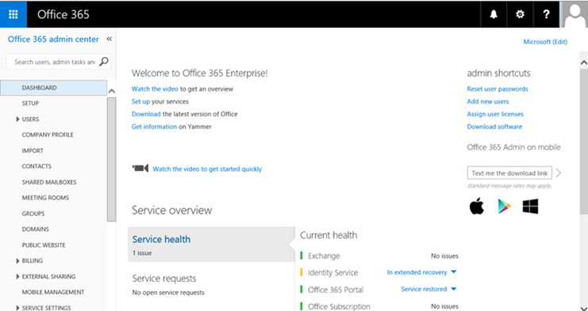

3. In the admin center, navigate to **Resources** in the left panel, and then click **Rooms & equipment**.

    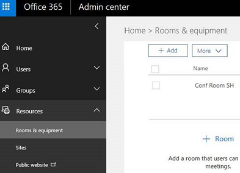

4. Click **Add** to create a new Room account. Enter a display name and email address for the account, and then click **Add**.

    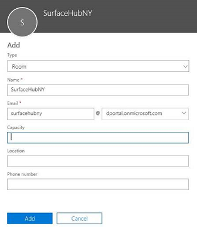

5. Select the Room account you just created in the Active Users list. In the right panel, you can see the account properties and several optional actions. Click **Reset password** to change the password, and unselect **Make this user change their password when they first sign in**, because it is not possible to change the password from the Surface Hub sign-in flow.

6. In the **Assigned license** section, click **Edit**, and then click the dropdown arrow next to the appropriate license to expand the details. Select a user location, and in the list of licenses, toggle on **Skype for Business Online (Plan 2)**, and then click **Save**. The license may vary depending on your organization (for example, you might have Plan 2 or Plan 3).

### <a href="" id="create-device-acct-o365-mbx-policy"></a>Create a mobile device mailbox (ActiveSync) policy from the Exchange Admin Center

1.  In the admin center’s left panel, click **ADMIN**, and then click **Exchange**.

    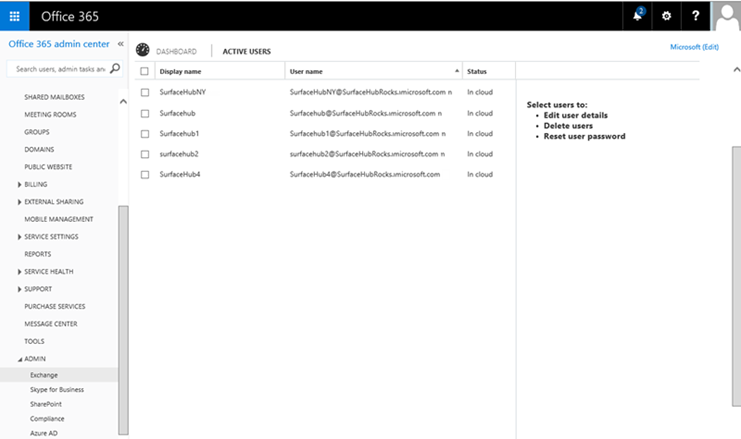

2.  This will open another tab on your browser to take you to the Exchange Admin Center, where you can create and set the Mailbox Setting for Surface Hub.

    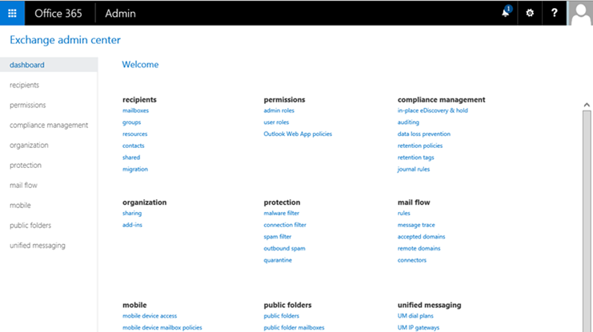

3.  To create a Mobile Device Mailbox Policy, click **Mobile** from the left panel and then click **Mobile device mailbox policies**. Surface Hubs require an account with a mobile device mailbox policy that does not require a password, so if you already have an existing policy that matches this requirement, you can apply that policy to the account. Otherwise use the following steps to create a new one to be used only for Surface Hub device accounts.

    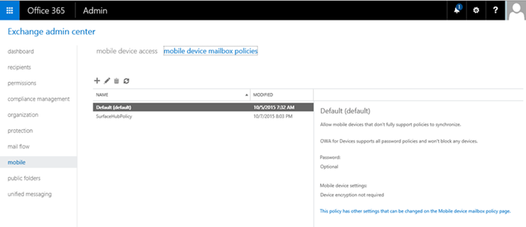

4.  To create a New Surface Hub mobile device mailbox policy, click the **+** button from the controls above the list of policies to add a new policy. For the name, provide a name that will help you distinguish this policy from other device accounts (for example, *SurfaceHubDeviceMobilePolicy*). Make sure the policy does not require a password for the devices assigned to, so make sure **Require a Password** remains unchecked, then click **Save**.

    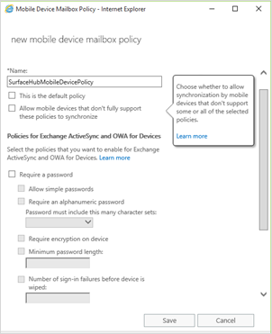

5.  After you have created the new mobile device mailbox policy, go back to the **Exchange Admin Center** and you will see the new policy listed.

    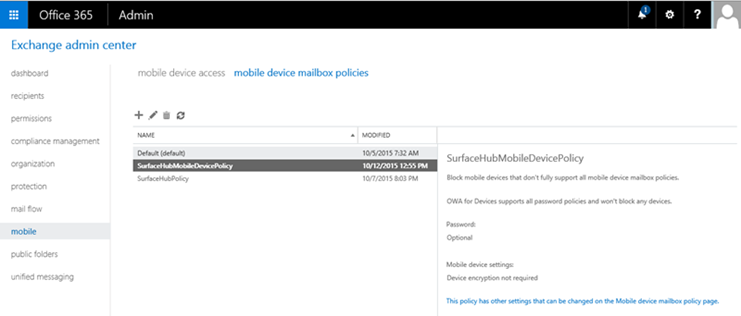


### <a href="" id="create-device-acct-o365-complete-acct"></a>Use PowerShell to complete device account creation

From here on, you'll need to finish the account creation process using PowerShell to set up some configuration.

In order to run cmdlets used by these PowerShell scripts, the following must be installed for the admin PowerShell console:

-   [Microsoft Online Services Sign-In Assistant for IT Professionals RTW](https://www.microsoft.com/download/details.aspx?id=41950)
-   [Windows Azure Active Directory Module for Windows PowerShell](https://www.microsoft.com/web/handlers/webpi.ashx/getinstaller/WindowsAzurePowershellGet.3f.3f.3fnew.appids)
-   [Skype for Business Online, Windows PowerShell Module](https://www.microsoft.com/download/details.aspx?id=39366)

Install the following module in Powershell
``` syntax
    install-module AzureAD
    Install-module MsOnline
```

### Connecting to online services

1.  Run Windows PowerShell as Administrator.

    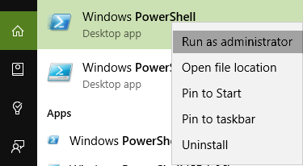

2.  Create a Credentials object, then create a new session that connects to Skype for Business Online, and provide the global tenant administrator account, then click **OK**.

    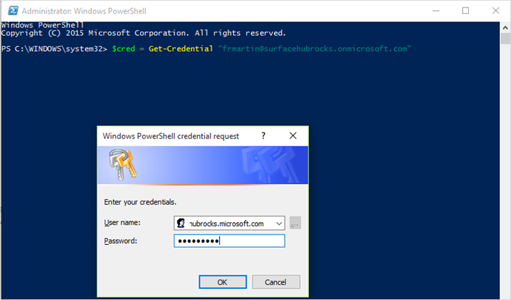

3.  To connect to Microsoft Online Services, run:

    ``` syntax
    Connect-MsolService -Credential $Cred
    ```

    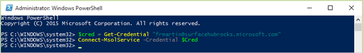

4.  Now to connect to Skype for Business Online Services, run:

    ``` syntax
    $sfbsession = New-CsOnlineSession -Credential $cred
    ```

    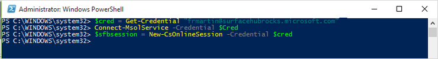

5.  Finally, to connect to Exchange Online Services, run:

    ``` syntax
    $exchangeSession = New-PSSession -ConfigurationName Microsoft.Exchange -ConnectionUri "https://outlook.office365.com/powershell-liveid/" -Credential $cred -Authentication "Basic" –AllowRedirection
    ```

    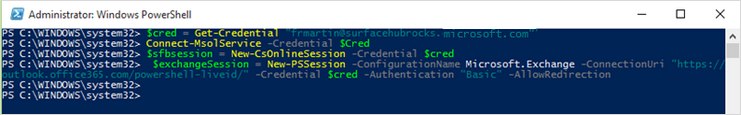

6.  Now you have to import the Skype for Business Online Session and the Exchange Online session you have just created, which will import the Exchange and Skype Commands so you can use them locally.

    ``` syntax
    Import-PSSession $exchangesession -AllowClobber -WarningAction SilentlyContinue
    Import-PSSession $sfbsession -AllowClobber -WarningAction SilentlyContinue
    ```

    Note that this could take a while to complete.

    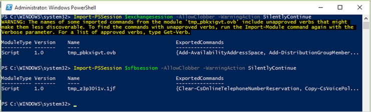

7.  Once you’re connected to the online services you need to run a few more cmdlets to configure this account as a Surface Hub device account.

### <a href="" id="create-device-acct-o365-configure-exch-prop"></a>Use PowerShell to configure Exchange properties of the account

Now that you're connected to the online services, you can finish setting up the device account. You'll use the device account email address to:

-   Change the mailbox type from regular to room.
-   Set the password and enable the room mailbox account
-   Change various Exchange properties
-   Set the user account password to never expire.

1.  You’ll need to enter the account’s mail address and create a variable with that value:

    ```powershell
    $mailbox = (Get-Mailbox <your device account’s alias>)
    ```

    To store the value get it from the mailbox:

    ```powershell
    $strEmail = $mailbox.WindowsEmailAddress
    ```

    Print the value:

    ```powershell
    $strEmail
    ```

    You will see the correct email address.

    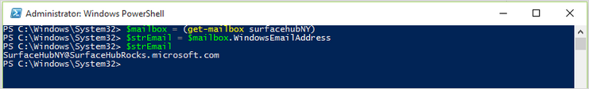

2. Run the following cmdlet:

    ```powershell
    Set-CASMailbox $strEmail  -ActiveSyncMailboxPolicy "SurfaceHubDeviceMobilePolicy"
    ```

4.  Various Exchange properties can be set on the device account to improve the meeting experience. You can see which properties need to be set in the [Exchange properties](exchange-properties-for-surface-hub-device-accounts.md) section.

    ``` syntax
    Set-CalendarProcessing -Identity $strEmail -AutomateProcessing AutoAccept -AddOrganizerToSubject $false –AllowConflicts   $false –DeleteComments $false -DeleteSubject $false -RemovePrivateProperty $false
    Set-CalendarProcessing -Identity $strEmail -AddAdditionalResponse $true -AdditionalResponse "This is a Surface Hub room!"
    ```

    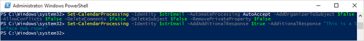

5.  If you decide to have the password not expire, you can set that with PowerShell cmdlets too. See [Password management](password-management-for-surface-hub-device-accounts.md) for more information.

    ``` syntax
    Set-MsolUser -UserPrincipalName $strEmail -PasswordNeverExpires $True
    ```

### <a href="" id="create-device-acct-o365-skype-for-business"></a>Enable the account with Skype for Business

Enable the device account with Skype for Business.

In order to enable Skype for Business, your environment will need to meet the following prerequisites:

-   You'll need to have Skype for Business Online Standalone Plan 2 or higher in your O365 plan. The plan needs to support conferencing capability.
-   If you need Enterprise Voice (PSTN telephony) using telephony service providers for the Surface Hub, you need Skype for Business Online Standalone Plan 3.
-   Your tenant users must have Exchange mailboxes.
-   Your Surface Hub account does require a Skype for Business Online Standalone Plan 2 or Skype for Business Online Standalone Plan 3 license, but it does not require an Exchange Online license.

1.  Start by creating a remote PowerShell session from a PC.

    ```PowerShell
    Import-Module SkypeOnlineConnector
    $cssess=New-CsOnlineSession -Credential $cred
    Import-PSSession $cssess -AllowClobber
    ```

2.  To enable your Surface Hub account for Skype for Business Server, run this cmdlet:

    ```PowerShell
    Enable-CsMeetingRoom -Identity $strEmail -RegistrarPool "sippoolbl20a04.infra.lync.com" -SipAddressType EmailAddress
    ```

    If you aren't sure what value to use for the `RegistrarPool` parameter in your environment, you can get the value from an existing Skype for Business user using this cmdlet:

    ```PowerShell
    Get-CsOnlineUser -Identity ‘alice@contoso.microsoft.com’| fl *registrarpool*
    ```

## <a href="" id="create-device-acct-eac"></a>Create a device account using the Exchange Admin Center

>[!NOTE]
>This method will only work if you are syncing from an on-premises Active Directory.

You can use the Exchange Admin Center to create a device account:

1.  [Create an account and mailbox with the Exchange Admin Center](#create-device-acct-exch-admin-ctr).
2.  [Create a mobile device mailbox policy from the Exchange Admin Center](#create-device-acct-exch-mbx-policy).
3.  [Use PowerShell to configure the account](#create-device-acct-exch-powershell-conf).
4.  [Enable the account with Skype for Business](#create-device-acct-exch-skype-for-business).

### <a href="" id="create-device-acct-exch-admin-ctr"></a>Create an account and mailbox with the Exchange Admin Center

1.  Sign in to your Exchange Admin Center using Exchange admin credentials.
2.  Once you are at the Exchange Admin Center (EAC), navigate to **Recipients** in the left panel.

    

3.  On the controls above the list of mailboxess, choose **+** to create a new one, and provide a **Display name**, **Name**, and **User logon name**, and then click **Save**.

    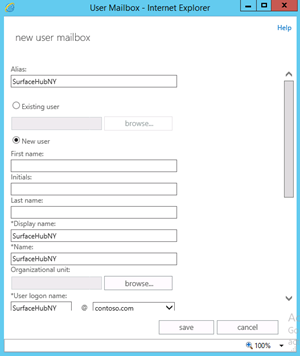

### <a href="" id="create-device-acct-exch-mbx-policy"></a>Create a mobile device mailbox policy from the Exchange Admin Center

>[!NOTE]
>If you want to create and assign a policy to the account you created, and are using Exchange 2010, look up the corresponding information regarding policy creation and policy assignment when using the EMC (Exchange management console).

 

1.  Go to the Exchange Admin Center.

    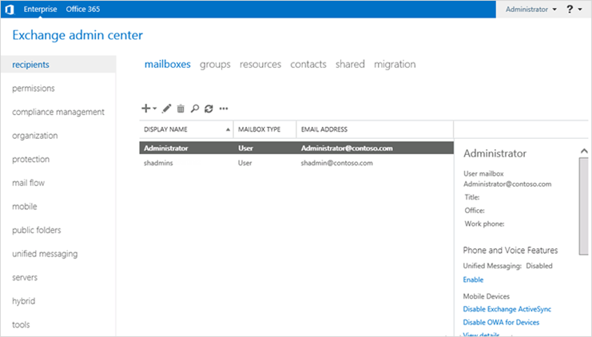

2.  To create a mobile device mailbox policy, click **Mobile** from the left panel, then **Mobile device mailbox policies**. Surface Hubs require an account with a mobile device mailbox policy that does not require a password, so if you already have an existing policy that matches this requirement, you can apply that policy to the account. Otherwise use the following steps to create a new one to be used only for Surface Hub device accounts.

    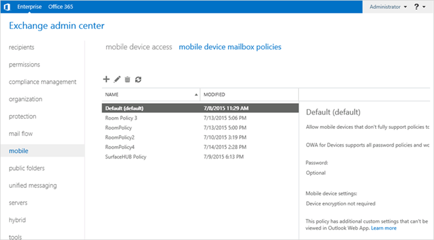

3.  To create a new mobile device account mailbox policy, click the **+** button from the controls above the list of policies to add a new policy. For the name provide a name that will help you distinguish this policy from other device accounts (for example, *SurfaceHubDeviceMobilePolicy*). The policy must not be password-protected, so make sure **Require a Password** remains unchecked, then click **Save**.

    

4.  After you have created the new mobile device mailbox policy, go back to the Exchange Admin Center and you will see the new policy listed.

    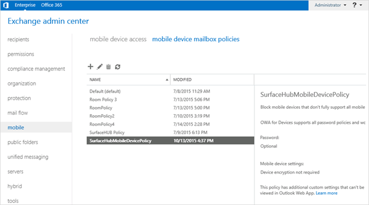

5.  To apply the ActiveSync policy without using PowerShell, you can do the following:

    -   In the EAC, click **Recipients** &gt; **Mailboxes** and select a mailbox.

        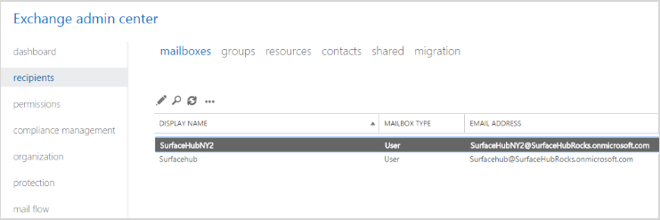

    -   In the **Details** pane, scroll to **Phone and Voice Features** and click **View details** to display the **Mobile Device Details** screen.

        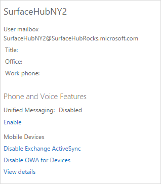

    -   The mobile device mailbox policy that’s currently assigned is displayed. To change the mobile device mailbox policy, click **Browse**.

        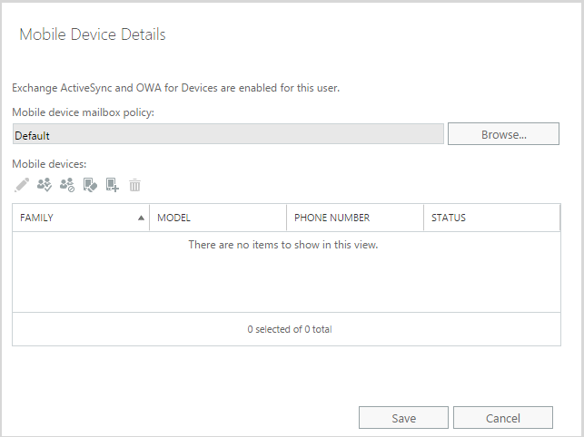

    -   Choose the appropriate mobile device mailbox policy from the list, click **OK** and then click **Save**.

        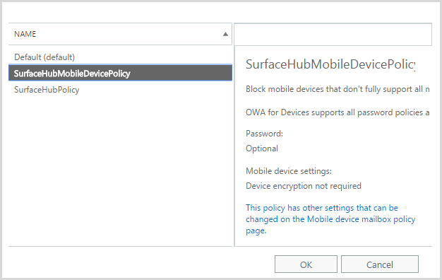

### <a href="" id="create-device-acct-exch-powershell-conf"></a>Use PowerShell to configure the account

Now that you're connected to the online services, you can finish setting up the device account. You'll use the device account email address to:

-   Change the mailbox type from regular to room.
-   Change various Exchange properties
-   Set the user account password to never expire.

1.  You’ll need to enter the account’s mail address and create a variable with that value:

    ``` syntax
    $mailbox = (Get-Mailbox <your device account’s alias>)
    ```

    To store the value got it from the mailbox:

    ``` syntax
    $strEmail = $mailbox.WindowsEmailAddress
    ```

    Print the value by running:

    ``` syntax
    $strEmail
    ```

    You will see the correct email address.

2.  You need to convert the account into a room mailbox, so run:

    ``` syntax
    Set-Mailbox $strEmail -Type Room
    ```

3.  In order for the device account to be authenticated on a Surface Hub, you need to enable the room mailbox account and set a password, so the account can be used by the device to get meeting information using ActiveSync and log in to Skype for Business.

    ``` syntax
    Set-Mailbox $strEmail -RoomMailboxPassword (ConvertTo-SecureString  -String "<your password>" -AsPlainText -Force) -EnableRoomMailboxAccount $true
    ```

4.  Various Exchange properties can be set on the device account to improve the meeting experience. You can see which properties need to be set in the [Exchange properties](exchange-properties-for-surface-hub-device-accounts.md) section.

    ``` syntax
    Set-CalendarProcessing -Identity $strEmail -AutomateProcessing AutoAccept -AddOrganizerToSubject $false –AllowConflicts   $false –DeleteComments $false -DeleteSubject $false -RemovePrivateProperty $false
    Set-CalendarProcessing -Identity $strEmail -AddAdditionalResponse $true -AdditionalResponse "This is a Surface Hub room!"
    ```

5.  Now we have to set some properties in AD. To do that, you need the alias of the account (this is the part of the UPN that becomes before the “@”).

    ``` syntax
    $strAlias = “<your device account’s alias>”
    ```

6.  The user needs to be enabled in AD before it can authenticate with a Surface Hub. Run:

    ``` syntax
    Set-ADUser $strAlias -Enabled $True
    ```

7.  If you decide to have the password not expire, you can set that with PowerShell cmdlets too. See [Password management](password-management-for-surface-hub-device-accounts.md) for more information.

    ``` syntax
    Set-ADUser $strAlias -PasswordNeverExpires $True
    ```

### <a href="" id="create-device-acct-exch-skype-for-business"></a>Enable the account with Skype for Business

Enable the device account with Skype for Business.

In order to enable Skype for Business, your environment will need to meet the following prerequisites:

-   You'll need to have Skype for Business Online Standalone Plan 2 or higher in your O365 plan. The plan needs to support conferencing capability.
-   If you need Enterprise Voice (PSTN telephony) using telephony service providers for the Surface Hub, you need Skype for Business Online Standalone Plan 3.
-   Your tenant users must have Exchange mailboxes.
-   Your Surface Hub account does require a Skype for Business Online Standalone Plan 2 or Skype for Business Online Standalone Plan 3 license, but it does not require an Exchange Online license.

1.  Start by creating a remote PowerShell session from a PC.

    ```PowerShell
    Import-Module SkypeOnlineConnector
    $cssess=New-CsOnlineSession -Credential $cred
    Import-PSSession $cssess -AllowClobber
    ```

2. Retrieve your Surface Hub account Registrar Pool

If you aren't sure what value to use for the `RegistrarPool` parameter in your environment, you can get the value from an existing Skype for Business user using this cmdlet:

    ```PowerShell
    Get-CsOnlineUser -Identity ‘alice@contoso.microsoft.com’| fl *registrarpool*
    ```
    
3. To enable your Surface Hub account for Skype for Business Server, run this cmdlet:

   ```PowerShell
   Enable-CsMeetingRoom -Identity $strEmail -RegistrarPool "sippoolbl20a04.infra.lync.com" -SipAddressType EmailAddress
   ```

    


