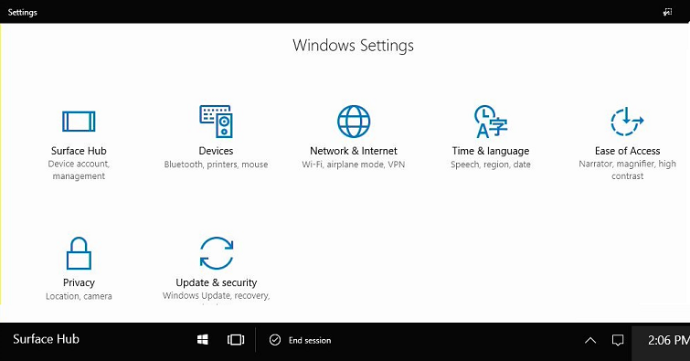
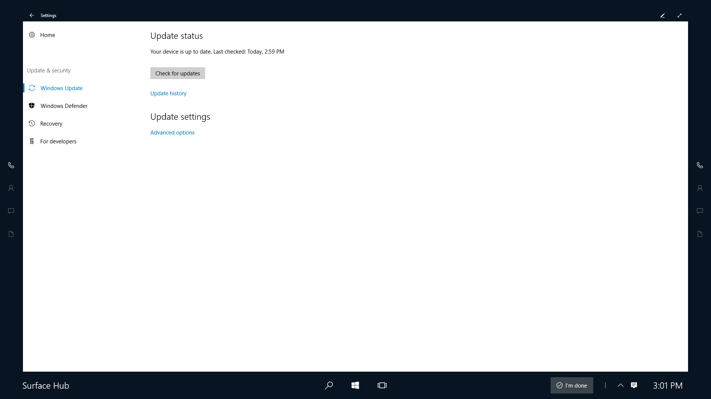
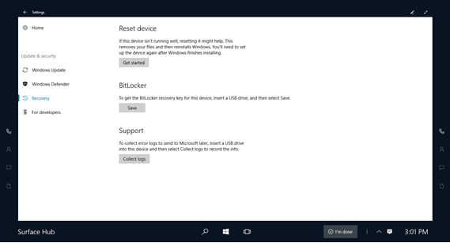
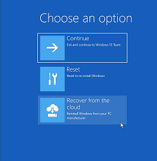
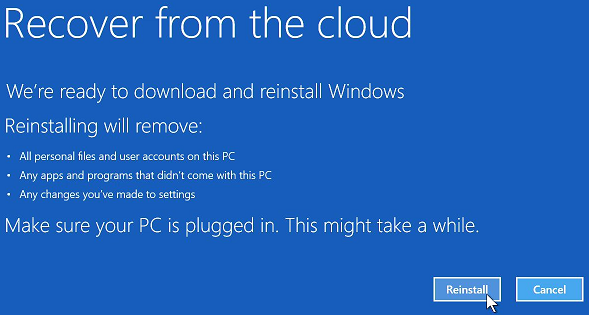
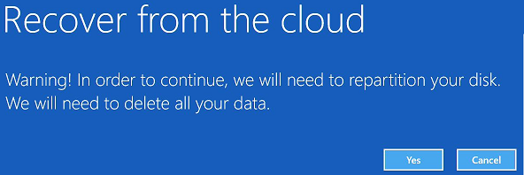
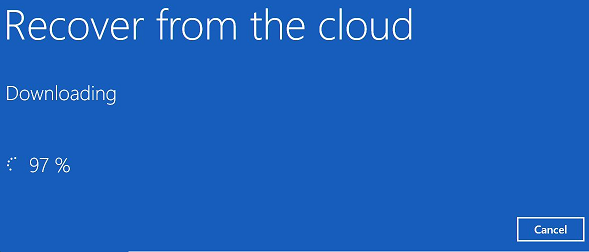

# Device reset (Surface Hub)

You may wish to reset your Microsoft Surface Hub.

Typical reasons for a reset include:

-   The device isn’t running well after installing an update.
-   You’re repurposing the device for a new meeting space and want to reconfigure it.
-   You want to change how you locally manage the device.

Initiating a reset will return the device to the last cumulative Windows update, and remove all local user files and configuration, including:

-   The device account
-   MDM enrollment
-   Domain join or Azure AD join information
-   Local admins on the device
-   Configurations from MDM or the Settings app

> [!IMPORTANT]
> Performing a device reset may take up to 6 hours. Do not turn off or unplug the Surface Hub until the process has completed. Interrupting the process will render the device inoperable, requiring warranty service to return to normal functionality.

After the reset, Surface Hub restarts the [first run program](first-run-program-surface-hub.md) again. If the Surface Hub displays a Welcome screen, that indicates that the reset encountered a problem and rolled back to the previously existing OS image.

If you see a blank screen for long periods of time during the **Reset device** process, please wait and do not take any action.

## Reset a Surface Hub from Settings

**To reset a Surface Hub**
1.	On your Surface Hub, open **Settings**.

    

2.	Click **Update & Security**.

    

3.	Click **Recovery**, and then, under **Reset device**, click **Get started**.

    

## Recover a Surface Hub from the cloud

In the Windows Recovery Environment (Windows RE), you can recover your device by downloading a factory build from the cloud and installing it on the Surface Hub. This allows devices in an unusable state to recover without requiring assistance from Microsoft Support.

>[!NOTE]
>The **Recover from the cloud** process requires an open internet connection (no proxy, or other authentications). An ethernet connection is recommended.

### Recover a Surface Hub in a bad state

If the device account gets into an unstable state or the Admin account is running into issues, you can use cloud recovery in **Settings**. You should only use cloud recovery when [reset](#reset-a-surface-hub-from-settings) doesn't fix the problem.

1. On your Surface Hub, go to **Settings** &gt; **Update & security** &gt; **Recovery**.

2. Under **Recover from the cloud**, click **Restart now**.

    

### Recover a locked Surface Hub

On rare occasions, a Surface Hub may encounter an error while cleaning up user and app data at the end of a session. When this happens, the device will automatically reboot and try again. But if this operation fails repeatedly, the device will be automatically locked to protect user data. To unlock it, you must reset or recover the device from [Windows RE](https://technet.microsoft.com/library/cc765966.aspx).

1.  From the welcome screen, toggle the Surface Hub's power switch 3 times. Wait a few seconds between each toggle. See the [Surface Hub Site Readiness Guide (PDF)](surface-hub-site-readiness-guide.md) for help with locating the power switch.
2. The device should automatically boot into Windows RE.
3. After the Surface Hub enters Windows RE, select **Recover from the cloud**. (Optionally, you can choose **Reset**, however **Recover from the cloud** is the recommended approach.)

    

4. Enter the Bitlocker key (if prompted).
5. When prompted, select **Reinstall**.

    

6. Select **Yes** to repartition the disk.

    

Reset will begin after the image is downloaded from the cloud. You will see progress indicators.

## Related topics

[Manage Microsoft Surface Hub](manage-surface-hub.md)

[Microsoft Surface Hub administrator's guide](surface-hub-administrators-guide.md)