# First-run program (Surface Hub)

The term "first run" refers to the series of steps you'll go through the first time you power up your Microsoft Surface Hub, and means the same thing as "out-of-box experience" (OOBE). This section will walk you through the process.

By now, you should have gone through all of the previous steps:

-   [Prepare your environment for Surface Hub](prepare-your-environment-for-surface-hub.md)
-   [Physically install your Surface Hub device](physically-install-your-surface-hub-device.md), and
-   [Setup worksheet](setup-worksheet-surface-hub.md)

Assuming that's the case, first run should be both simple and quick.
The normal procedure goes through six steps:

1.  [Hi there page](#first-page)
2.  [Set up for you page](#set-up-for-you)
3.  [Device account page](#device-account)
4.  [Name this device page](#name-this-device)
5.  [Set up admins for this device page](#setup-admins)
6.  [Update the Surface Hub](#update-surface-hub)

Each of these sections also contains information about paths you might take when something is different. For example, most Surface Hubs will use a wired network connection, but some of them will be set up with wireless instead. Details are described where appropriate.

>[!NOTE]
>You should have the separate keyboard that came with your Surface Hub set up and ready before beginning. See the Surface Hub Setup Guide for details.

 

## Hi there page

This is the first screen you'll see when you power up the Surface Hub for the first time. It's where you input localization information for your device.

>[!NOTE]
>This is also where you begin the optional process of deploying a provisioning package. See [Create provisioning packages](provisioning-packages-for-certificates-surface-hub.md) if that's what you're doing.

 Select a language and the initial setup options are displayed.

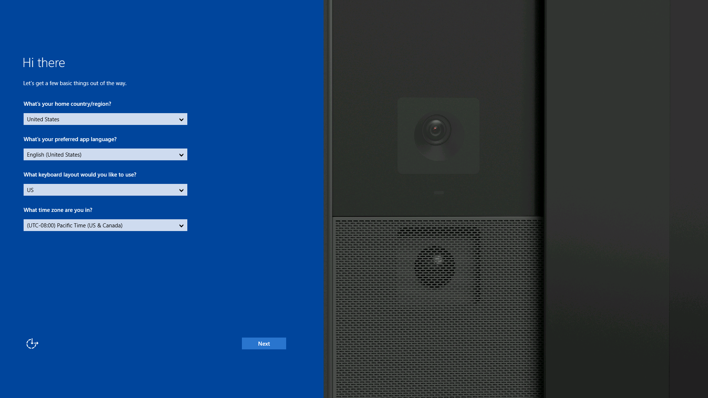

### Details

If the default values shown are correct, then you can click **Next** to go on. Otherwise, you'll need to enter data in the appropriate boxes.

-   **Country/region:** Select the country or region where the Surface Hub will be used.
-   **App language:** Apps and features will display in this language and language format.
-   **Keyboard layout:** Select the keyboard layout for the on-screen and physical keyboards that will be used with your device.
-   **Time zone:** Select the time zone where the Surface Hub will be used.

### What happens?

>[!NOTE]
> Once the settings on this page are entered, you can't come back to this screen unless you reset the device (see [Device reset](device-reset-surface-hub.md)). Make sure that the settings are properly configured before proceeding.

 

When the settings are accepted, the device will check for a wired network connection. If the connection is fine, it will display the [Set up for you page](#set-up-for-you). If there is a problem with the wired connection, the device will display the [Network setup page](#network-setup).

If no wired connection can be found, then the device will attempt to set up a wireless connection, and will display the [Network setup page](#network-setup).

## Network setup page

If your device does not detect a wired connection that it can use to connect to a network or the Internet, you will see this page. Here you can either connect to a wireless network, or skip making the network connection.

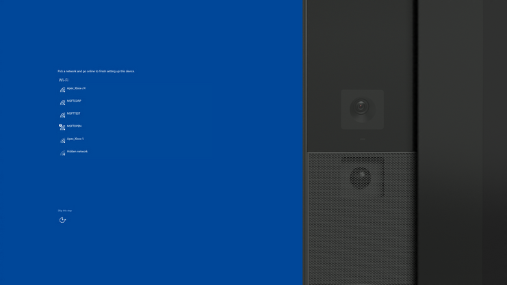

### Details

This screen is shown only if the device fails to detect a wired network. If you see this screen, you have three choices:

-   You can select one of the wireless networks shown. If the network is secured, you'll be taken to a login page. See [Wireless network setup](#wireless) for details.
-   Click **Skip this step** to skip connecting to a network. You'll be taken to the [Set up for you page](#set-up-for-you).
    >[!NOTE]
    >If you skip this, the device will not have a network connection, and nothing that requires a network connection will work on your Surface Hub, including system updates and email and calendar synchronization. You can connect to a wireless network later using Settings (see [Wireless network managment](wireless-network-management-for-surface-hub.md)).

     

-   You can plug in a network cable while this screen is visible. The device will detect it, and will add **Next** to the screen. Click **Next** to continue with making the wired connection.

### What happens?

If the device has a wired connection when it starts, and can establish a network or Internet connection, then this page will not be displayed. If you want to connect the device to a wireless connection, make sure no Ethernet cable is plugged in at first run, which will bring you to this screen. No matter what you choose to set up now, you can [use Settings](wireless-network-management-for-surface-hub.md) to set up different connections later.

If you want to connect to a secured wireless network from this page, click on the network of your choice, and then provide the necessary information (password or account credentials) to connect. See [Wireless network setup](#wireless).

## Wireless network setup

This page will be shown when you've selected a secured wireless network.

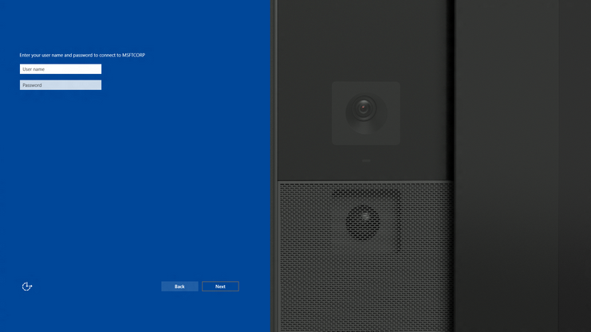

### Details

-   **User name:** Enter the user name for the selected wireless network.
-   **Password:** This is the password for the network.

### What happens?

The device will attempt to connect to the specified network. If it's successful, you'll be taken to the [Set up for you page](#set-up-for-you).

## Network proxy setup

This page will be shown when the device detects a wired connection with limited connectivity. You have three options:

-   You can select a wireless network to use instead of the limited wired connection.
-   You can skip connecting to a network by selecting **Skip this step**. You'll be taken to the [Set up for you page](#set-up-for-you).
    **Note**  If you skip this, the device will not have a network connection, and nothing that requires a network connection will work on your Surface Hub, including things like email and calendar synchronization. You can connect to a wireless network later using Settings (see [Wireless network managment](wireless-network-management-for-surface-hub.md)).

     

-   You can select **Enter proxy settings** which will allow you to specify how to use the network proxy. You'll be taken to the next screen.

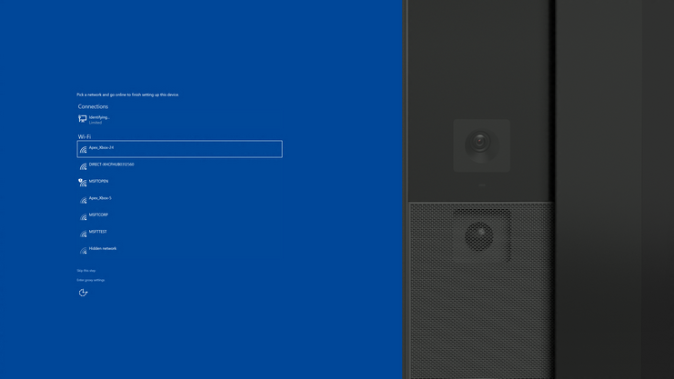

This is the screen you'll see if you clicked **Enter proxy settings** on the previous screen.

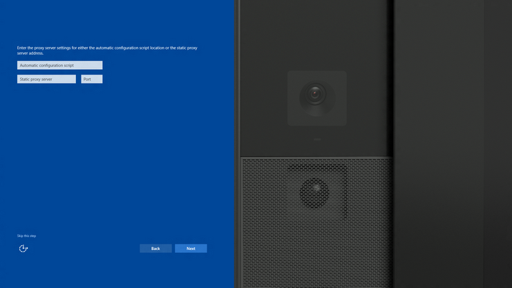

### Details

In order to make a network connection, you'll need to fill in either a script name, or the proxy server and port info.

-   **Proxy script:** Provide the address of a proxy script.
-   **Proxy server and port:** You can provide the proxy server address and port.

### What happens?

When you click **Next**, the device will attempt to connect to the proxy server. If successful, you'll be taken to the [Set up for you page](#set-up-for-you).

You can skip connecting to a network by selecting **Skip this step**. You'll be taken to the [Set up for you page](#set-up-for-you).

>[!NOTE]
>If you skip this, the device will not have a network connection, and nothing that requires a network connection will work on your Surface Hub, including things like email and calendar synchronization. You can connect to a wireless network later using Settings (see [Wireless network managment](wireless-network-management-for-surface-hub.md)).

 

## Set up for you page

This screen is purely informational, and shows which recommended settings have been enabled by default.

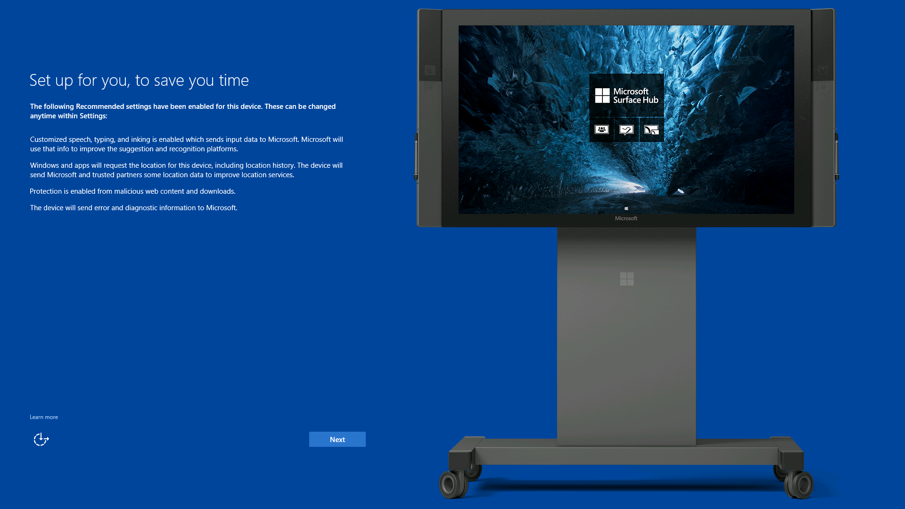

### Details

You should read this screen and note which services have been enabled by default. All of them can be changed using the Settings app if need be, but you should be careful about the effects of doing so. See [Intro to Surface Hub](intro-to-surface-hub.md) for details.

Once you're done reviewing the settings, click **Next** to go on.

### What happens?

The settings shown on the page have already been made, and can't be changed until after first run is completed.

## Device account page

On this page, the Surface Hub will ask for credentials for the device account that you previously configured. (See [Create and test a device account](create-and-test-a-device-account-surface-hub.md).) The Surface Hub will attempt to discover various properties of the account, and may ask for more information on another page if it does not succeed.

>[!NOTE]
>This section does not cover specific errors that can happen during first run. See [Troubleshoot Surface Hub](troubleshoot-surface-hub.md) for more information on errors.

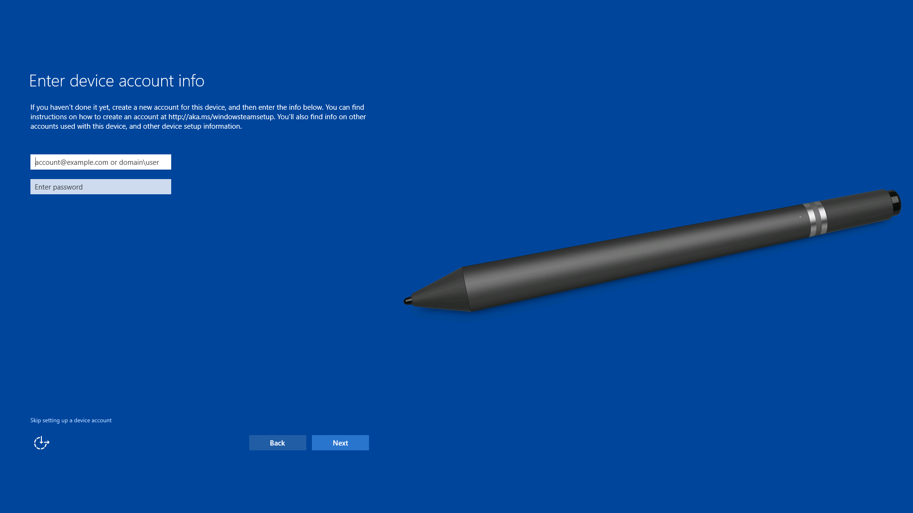

### Details

Use either a **user principal name (UPN)** or a **domain\\user name** as the account identifier in the first entry field. Use the format that matches your environment, and enter the password.

| Environment  | Required format for device account|
| ------------ | ----------------------------------|
| Device account is hosted only online.  | username@domain.com|
| Device account is hosted only on-prem.  | DOMAIN\username|
| Device account is hosted online and on-prem (hybrid).  |  DOMAIN\username|

Click **Skip setting up a device account** to skip setting up a device account. However, if you don't set up a device account, the device will not be fully integrated into your infrastructure. For example, people won't be able to:

-   See a meeting calendar on the Welcome screen
-   Start a meeting from the Welcome screen
-   Email whiteboards from OneNote
-   Use Skype for Business for meetings

If you skip setting it up now, you can add a device account later by using the Settings app.

If you click **Skip setting up a device account**, the device will display a dialog box showing what will happen if the device doesn't have a device account. If you choose **Yes, skip this**, you will be sent to the [Name this device page](#name-this-device).

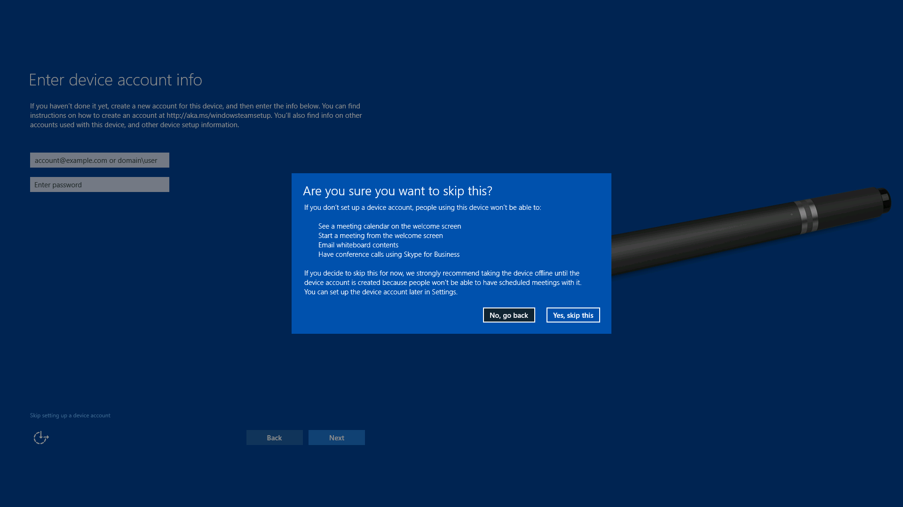

### What happens?

The device will use the UPN or DOMAIN\\User name and password for the device account to do the following:

-   Check if the account exists in Active Directory (AD) or Azure Active Directory (Azure AD):

    -   If a UPN was entered: the device will look for the account in Azure AD.
    -   If a DOMAIN\\User name was entered: the device will look for the account in AD.
-   Look up the Microsoft Exchange server for the account’s mailbox.
-   Look up the Session Initiation Protocol (SIP) address for the account.
-   Pull the account’s display name and alias attributes.

## Exchange server page

This page will only be shown if there's a problem. Typically, it means that the device account that you provided was found in Active Directory (AD) or Azure Active Directory (Azure AD), but the Exchange server for the account was not discovered.

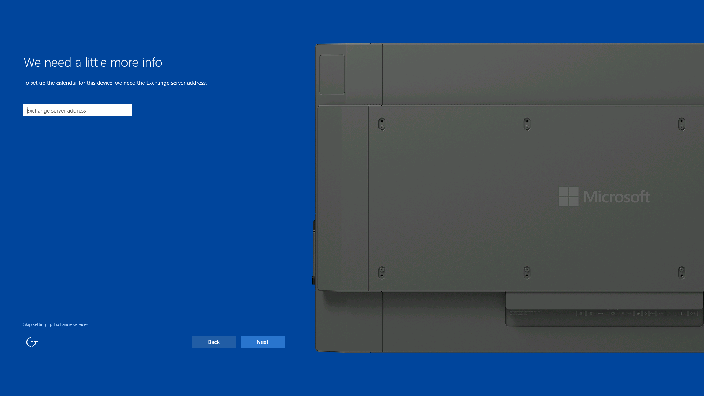

### Details

Enter the name of the Exchange server where the device account's mailbox is hosted.

Click **Skip setting up Exchange services** to skip this step. If you do, people will not be able to:

-   See a meeting calendar on the welcome screen.
-   Start a meeting from the welcome screen.
-   Email whiteboards from OneNote.

See [Intro to Surface Hub](intro-to-surface-hub.md) for details on setup dependencies.

You can enable Exchange services for a device account later by using the Settings app.

If you click **Skip setting up Exchange services**, the device will display a dialog showing what will happen. If you choose **Yes, skip this**, then Exchange services will not be set up.

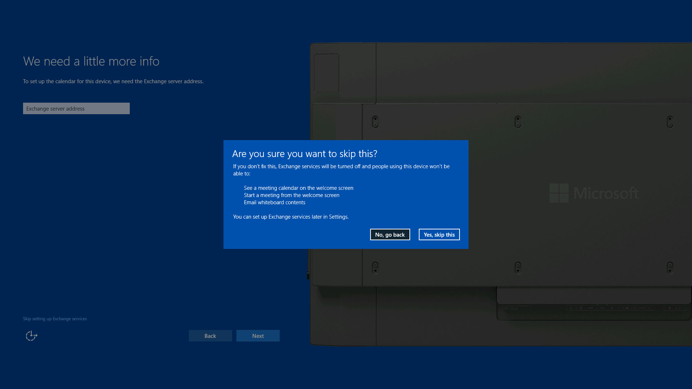

### What happens?

The Surface Hub will attempt to validate the device account on the Exchange server that you enter here. If the Exchange server can be reached and validates, then first run will proceed.

If you choose to skip setting up Exchange services, the Surface Hub will stop looking for the Exchange server, and no Exchange services (mail and calendar) will be enabled.

## Exchange policies page

This page will be shown when:

-   The device account is using an Exchange Active Sync (EAS) policy where the PasswordEnabled policy is set to 1.
-   There’s no connection to Exchange.
-   Exchange returns a status code indicating an error. (For example: The account has been provisioned to too many devices.)
-   Exchange supported protocols are not supported by the Surface Hub.
-   Exchange returns incorrect XML.

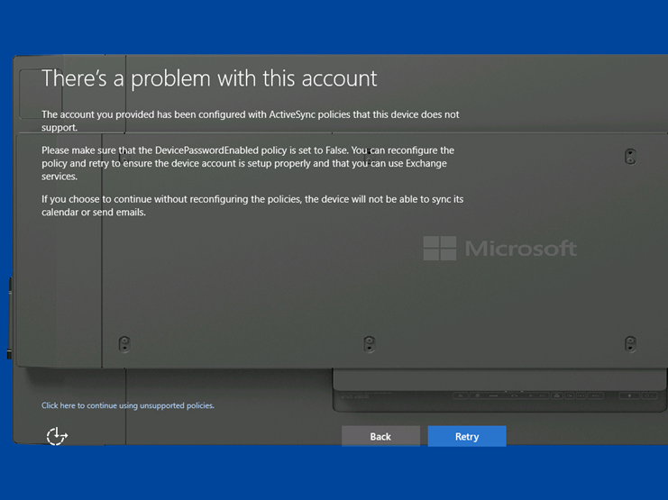

### Details

This page is purely informational, so no input is required. However, you have two options for proceeding: either skipping ahead or retrying the validation that caused the error. Before deciding which option is best, please read the following **What happens?** section. You may be able to fix the problem elsewhere before you click on one of the options.

-   **Click here to continue using unsupported policies**: click on this to continue first run. The Surface Hub will not be able to use Exchange services, or sync.
-   **Retry**: check the policy on the Exchange server again.

### What happens?

The Surface Hub checks whether the device account’s EAS policy has the PasswordEnabled policy set to 0 (False). If this is not the case, mail and calendar can't be synced and the Surface Hub can't use any Exchange services. You can use your Exchange management tools from a PC to check that the device account has the PasswordEnabled policy set to 0. If that's not the case, you can reconfigure the account and click **Retry** here.

If the policy has already been configured properly, check that your device is properly connected to the network or Internet, and can reach your Exchange server, because this page will also be shown if the Surface Hub can't reach the Exchange server.

Another possible reason for not being able to reach Exchange is because of certificate-based authentication. You may wind up on this page because of certificate issues. Note that if the device displays error codes 0x80072F0D or 0X800C0019, then a certificate is required. Because provisioning is done on the first page of the first run process, you must disable Exchange services by clicking **Click here to continue using unsupported policies**, and then install the correct certificates through the Settings app.

If you choose to skip this check, the Surface Hub will stop looking for the Exchange server and validating EAS policies, and no Exchange services will be enabled. See [Intro to Surface Hub](intro-to-surface-hub.md) for details on setup dependencies.

## Name this device page

This page asks you to provide two names that will be used for identifying the Surface Hub.

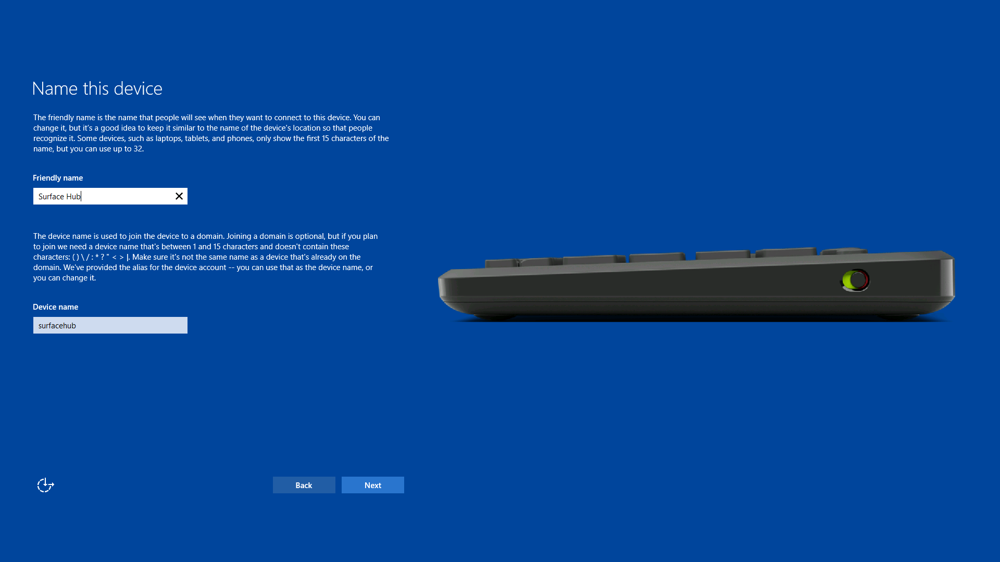

### Details

If the default values shown are correct, then you can click **Next** to go on. Otherwise, enter data in one or both of the text boxes.

-   **Friendly name:** This is the name that people will see when they want to wirelessly connect to the Surface Hub.
-   **Device name:** Can be set to any unique name as described on the screen.

As long as both names are within the length requirements and do not use restricted characters, clicking **Next** will take you to the next page, [Set up admins for this device](#setup-admins).

### What happens?

The Surface Hub requires two names for the device, which will default to:

-   **Friendly name:** Defaults to the Display Name of the device account
-   **Device name:** Defaults to the alias of the device account

While either of the names can be changed later, keep in mind that:

-   The friendly name should be recognizable and different so that people can distinguish one Surface Hub from another when trying to wirelessly connect.
-   If you decide to domain join the device, the device name must not be the same as any other device on the account’s Active Directory domain. The device can't join the domain if it is using the same name as another domain-joined device.

>[!NOTE]
>If you want to enable [Miracast over Infrastructure](miracast-over-infrastructure.md), the device name needs to be discoverable via DNS. You can achieve this by either allowing your Surface Hub to register automatically via Dynamic DNS, or by manually creating an A or AAAA record for the Surface Hub's device name.

## Set up admins for this device page

On this page, you will choose from several options for how you want to set up admin accounts to locally manage your device.

Because every Surface Hub can be used by any number of authenticated employees, settings are locked down so that they can't change from session to session. Only admins can configure the settings on the device, and on this page, you’ll choose which type of admins have that privilege.

>[!NOTE]
>The purpose of this page is primarily to determine who can configure the device from the device’s UI; that is, who can actually visit a device, log in, open up the Settings app, and make changes to the Settings.

 

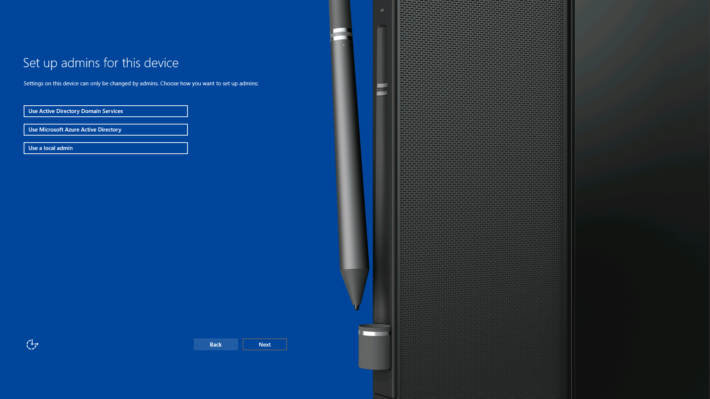

### Details

Choose one of the three available options:

-   **Use Microsoft Azure Active Directory**
-   **Use Active Directory Domain Services**
-   **Use a local admin**

### What happens?

This is what happens when you choose an option.

-   **Use Microsoft Azure Active Directory**

    Clicking this option allows you to join the device to Azure AD. Once you click **Next**, the device will restart to apply some settings, and then you’ll be taken to the [Use Microsoft Azure Active Directory](#use-microsoft-azure) page and asked to enter credentials that can allow you to join Azure AD. Members of the Azure Global Admins security group from the joined organization will be able to use the Settings app. The specific people that will be allowed depends on your Azure AD subscription and how you’ve configured the settings for your Azure AD organization.
    
    >[!IMPORTANT]
    >Administrators added to the Azure Global Admins group after you join the device to Azure AD will be unable to use the Settings app.
    >
    >If you join Surface Hub to Azure AD during first-run setup, single sign-on (SSO) for Office apps will not work properly. Users will have to sign in to each Office app individually.

-   **Use Active Directory Domain Services**

    Click this option to join the device to AD. Once you click **Next**, you’ll be taken to the [Use Active Directory Domain Services](#use-active-directory) page and asked to enter credentials that allow you to join the specified domain. After joining, you can pick a security group from the joined domain, and people from that security group will be able to use the Settings app.

-   **Use a local admin**

    Choosing this option will allow you to create a single local admin. This admin won’t be backed by any directory service, so we recommend you only choose this case if the device does not have access to Azure AD or AD. Once you create an admin’s user name and password on the [Use a local admin](#use-a-local-admin) page, you will need to re-enter those same credentials whenever you open the Settings app.

    Note that a local admin must have physical access to the Surface Hub to log in.

>[!NOTE]
>After you finish this process, you won't be able to change the device's admin option unless you reset the device.

 

### Use Microsoft Azure Active Directory

If you've decided to join your Surface Hub to Azure Active Directory (Azure AD), you'll see this **What happens next** page. Read it and click **Next** to go to the **Let's get you signed in page**.

Joining Azure AD has two primary benefits:

1.  Some employees from your organization will be able to access the device as admins, and will be able to start the Settings app and configure the device. People that have admin permissions will be defined in your Azure AD subscription.
2.  If your Azure AD is connected to a mobile device management (MDM) solution, the device will enroll with that MDM solution so you can apply policies and configuration.

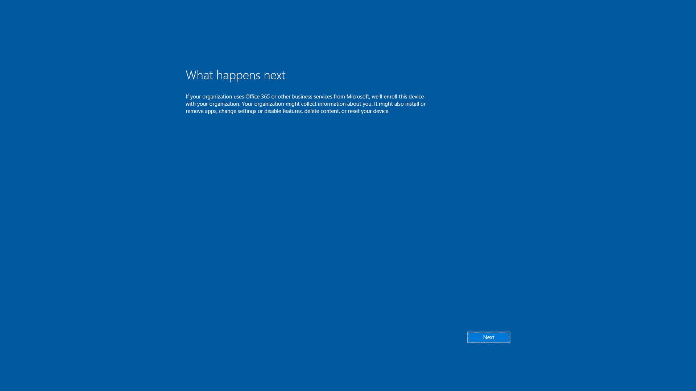

### Details

The following input is required:

-   **User's UPN:** The user principal name (UPN) of an account that can join Azure AD.
-   **Password:** The password of the account you’re using to join Azure AD.

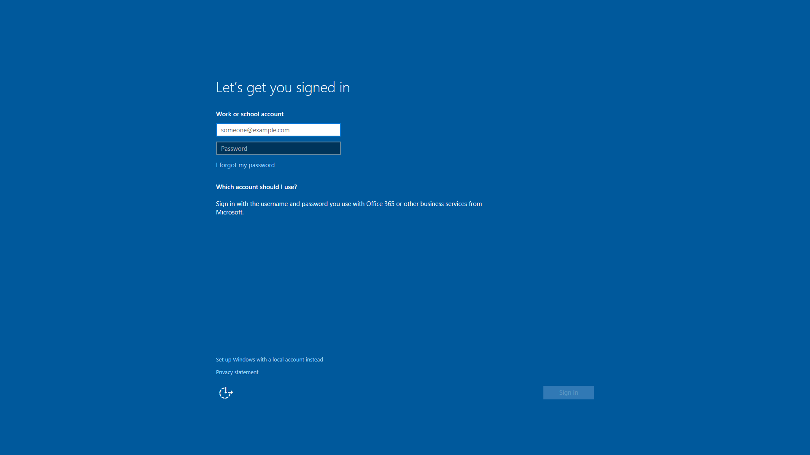

If you get to this point and don't have valid credentials for an Azure AD account, the device will allow you to continue by creating a local admin account. Click **Set up Windows with a local account instead**.

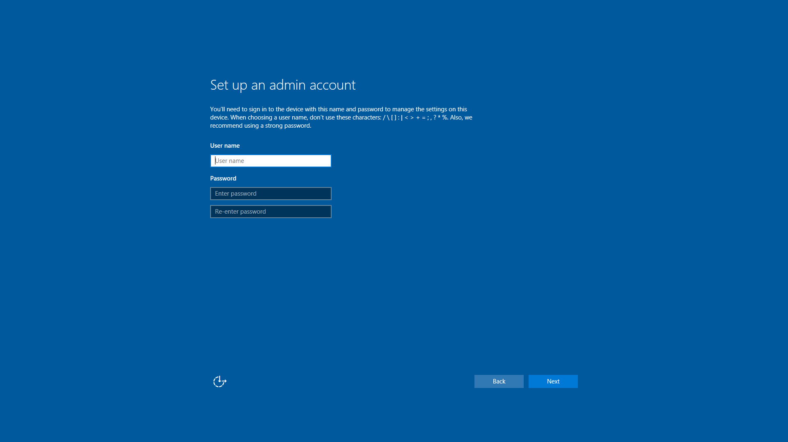

### What happens?

Once you enter valid Azure AD account credentials, the device will try to join the associated Azure AD organization. If this succeeds, then the device will provision employees in that organization to be local admins on the device. If your Azure AD tenant was configured for it, the device will also enroll into MDM.

### Use Active Directory Domain Services

This page will ask for credentials to join a domain so that the Surface Hub can provision a security group as administrators of the device.

Once the device has been domain joined, you must specify a security group from the domain you joined. This security group will be provisioned as administrators on the Surface Hub, and anyone from the security group can enter their domain credentials to access Settings.

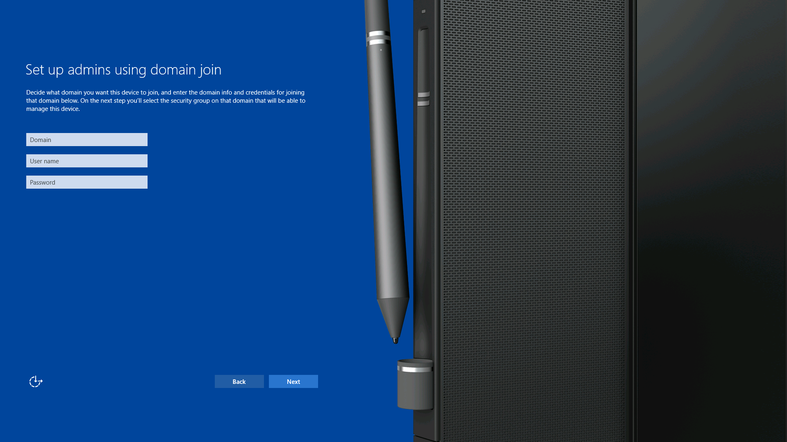

### Details

The following input is required:

-   **Domain:** This is the fully qualified domain name (FQDN) of the domain that you want to join. A security group from this domain can be used to manage the device.
-   **User name:** The user name of an account that has sufficient permission to join the specified domain. 
-   **Password:** The password for the account.

After the credentials are verified, you will be asked to type a security group name. This input is required.

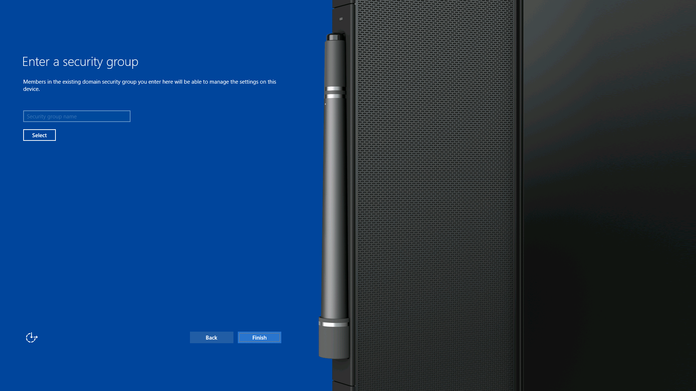

### What happens?

Using the provided domain, account credentials from the [Use Active Directory Domain Services page](#use-active-directory) and the device name from the [Name this device](#name-this-device) page, the Surface Hub will attempt to join the domain. If the join is successful, first run will continue, and will ask for a security group. If the join is not successful, first run will halt and ask you to change the information provided.

If the join is successful, you'll see the **Enter a security group** page. When you click the **Select** button on this page, the device will search for the specified security group on your domain. If found, the group will be verified. Click **Finish** to complete the first run process.

>[!NOTE]
>If you domain join the Surface Hub, you can't unjoin the device without resetting it.

 

### Use a local admin

If you decide not to use Azure Active Directory (Azure AD) or Active Directory (AD) to manage the Surface Hub, you'll need to create a local admin account.

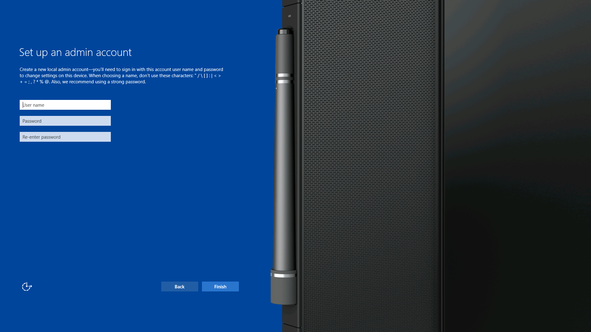

### Details

The following input is required:

-   **User name:** This is the user name of the local admin account that will be created for this Surface Hub.
-   **Password:** This is the password of the device account.
-   **Re-enter password:** Verifying the password as in the previous box.

### What happens?

This page will attempt to create a new admin account using the credentials that you enter here. If it's successful, then first run will end. If not, you'll be asked for different credentials.

## Update the Surface Hub

>[!IMPORTANT]
>Before you do the updates, make sure you read [Save your BitLocker key](save-bitlocker-key-surface-hub.md) in order to make sure you have a backup of the key.

 

In order to get the latest features and fixes, you should update your Surface Hub as soon as you finish all of the preceding first-run steps.

1.  Make sure the device has access to the Windows Update servers or to Windows Server Update Services (WSUS). To configure WSUS, see [Using WSUS](manage-windows-updates-for-surface-hub.md#use-windows-server-update-services).
2.  Open Settings, click **Update & security**, then **Windows Update**, and then click **Check for updates**.
3.  If updates are available, they will be downloaded. Once downloading is complete, click the **Update now** button to install the updates.
4.  Follow the onscreen prompts after the updates are installed. You may need to restart the device.

 

 

