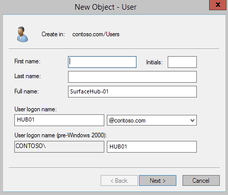
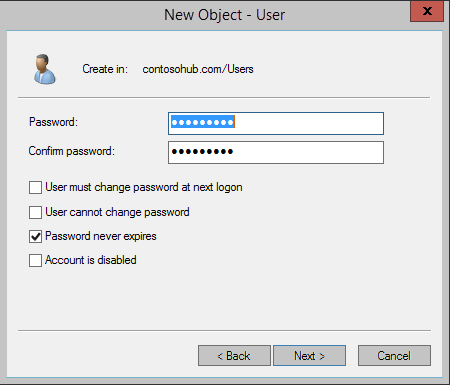
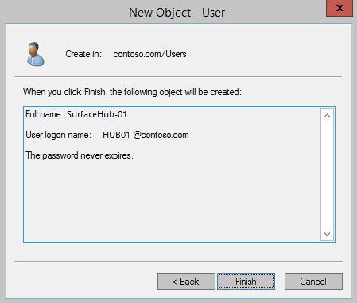

# Hybrid deployment (Surface Hub)
A hybrid deployment requires special processing to set up a device account for your Microsoft Surface Hub. If you’re using a hybrid deployment, in which your organization has a mix of services, with some hosted on-premises and some hosted online, then your configuration will depend on where each service is hosted. This topic covers hybrid deployments for [Exchange hosted on-premises](#exchange-on-prem), [Exchange hosted online](#exchange-online), Skype for Business on-premises, Skype for Business online, and Skype for Business hybrid. Because there are so many different variations in this type of deployment, it's not possible to provide detailed instructions for all of them. The following process will work for many configurations. If the process isn't right for your setup, we recommend that you use PowerShell (see [Appendix: PowerShell](appendix-a-powershell-scripts-for-surface-hub.md)) to achieve the same end result as documented here, and for other deployment options. You should then use the provided Powershell script to verify your Surface Hub setup. (See [Account Verification Script](appendix-a-powershell-scripts-for-surface-hub.md#acct-verification-ps-scripts).)

>[!NOTE]
>In an Exchange hybrid environment, follow the steps for [Exchange on-premises](#exchange-on-prem). To move Exchange objects to Office 365, use the [New-MoveRequest](https://docs.microsoft.com/powershell/module/exchange/move-and-migration/new-moverequest?view=exchange-ps) cmdlet.

<span id="exchange-on-prem" />
## Exchange on-premises
Use this procedure if you use Exchange on-premises.

1.  For this procedure, you'll be using AD admin tools to add an email address for your on-premises domain account. This account will be synced to Office 365.

    - In **Active Directory Users and Computers** AD tool, right-click on the folder or Organizational Unit that your Surface Hub accounts will be created in, click **New**, and **User**.
    - Type the display name from the previous cmdlet into the **Full name** box, and the alias into the **User logon name** box. Click **Next**.<p>
    
        

    - Type the password for this account. You'll need to retype it for verification. Make sure the **Password never expires** checkbox is the only option selected.

        >**Important** Selecting **Password never expires** is a requirement for Skype for Business on the Surface Hub. Your domain rules may prohibit passwords that don't expire. If so, you'll need to create an exception for each Surface Hub device account.

        
        
    -   Click **Finish** to create the account.

        


2.  Enable the remote mailbox.

    Open your on-premises Exchange Management Shell with administrator permissions, and run this cmdlet.

    ```PowerShell
    Enable-RemoteMailbox 'HUB01@contoso.com' -RemoteRoutingAddress 'HUB01@contoso.com' -Room
    ```
    >[!NOTE]
    >If you don't have an on-premises Exchange environment to run this cmdlet, you can make the same changes directly to the Active Directory object for the account.
    >
    >msExchRemoteRecipientType = 33
    >
    >msExchRecipientDisplayType = -2147481850
    >
    >msExchRecipientTypeDetails = 8589934592
    
3.  After you've created the account, run a directory synchronization. When it's complete, go to the users page in your Microsoft 365 admin center and verify that the account created in the previous steps has merged to online.
    
4.  Connect to Microsoft Exchange Online and set some properties for the account in Office 365.

    Start a remote PowerShell session on a PC and connect to Microsoft Exchange. Be sure you have the right permissions set to run the associated cmdlets.

    The next steps will be run on your Office 365 tenant.

    ```PowerShell
    Set-ExecutionPolicy RemoteSigned
    $cred=Get-Credential -Message "Please use your Office 365 admin credentials"
    $sess= New-PSSession -ConfigurationName Microsoft.Exchange -ConnectionUri 'https://ps.outlook.com/powershell' -Credential $cred -Authentication Basic -AllowRedirection
    Import-PSSession $sess
    ```

5.  Create a new Exchange ActiveSync policy, or use a compatible existing policy.

    After setting up the mailbox, you will need to either create a new Exchange ActiveSync policy or use a compatible existing policy.
    
    Surface Hubs are only compatible with device accounts that have an ActiveSync policy where the **PasswordEnabled** property is set to False. If this isn’t set properly, then Exchange services on the Surface Hub (mail, calendar, and joining meetings), will not be enabled.

    If you haven’t created a compatible policy yet, use the following cmdlet—-this one creates a policy called "Surface Hubs". Once it’s created, you can apply the same policy to other device accounts.

    ```PowerShell
    $easPolicy = New-MobileDeviceMailboxPolicy -Name “SurfaceHubs” -PasswordEnabled $false
    ```

    Once you have a compatible policy, then you will need to apply the policy to the device account. 

    ```PowerShell
    Set-CASMailbox 'HUB01@contoso.com' -ActiveSyncMailboxPolicy $easPolicy.id
    ```

6.  Set Exchange properties.

    Setting Exchange properties on the device account to improve the meeting experience. You can see which properties need to be set in the [Exchange properties](exchange-properties-for-surface-hub-device-accounts.md) section.

    ```PowerShell
    Set-CalendarProcessing -Identity 'HUB01@contoso.com' -AutomateProcessing AutoAccept -AddOrganizerToSubject $false –AllowConflicts $false –DeleteComments $false -DeleteSubject $false -RemovePrivateProperty $false
    Set-CalendarProcessing -Identity 'HUB01@contoso.com' -AddAdditionalResponse $true -AdditionalResponse 'This is a Surface Hub room!'
    ```

7.  Connect to Azure AD.

	You first need to install Azure AD module for PowerShell version 2. In an elevated powershell prompt run the following command :
    ```PowerShell
    Install-Module -Name AzureAD
    ```
	
    You need to connect to Azure AD to apply some account settings. You can run this cmdlet to connect.

    ```PowerShell
    Import-Module AzureAD
    Connect-AzureAD -Credential $cred
    ```
8.  Assign an Office 365 license.

    The device account needs to have a valid Office 365 (O365) license, or Exchange and Skype for Business will not work. If you have the license, you need to assign a usage location to your device account—this determines what license SKUs are available for your account.
 
    You can use `Get-AzureADSubscribedSku` to retrieve a list of available SKUs for your O365 tenant.

    Once you list out the SKUs, you'll need to assign the SkuId you want to the `$License.SkuId` variable.

    ```PowerShell
    Set-AzureADUser -ObjectId "HUB01@contoso.com" -UsageLocation "US"
	
	Get-AzureADSubscribedSku | Select Sku*,*Units
	$License = New-Object -TypeName Microsoft.Open.AzureAD.Model.AssignedLicense
    $License.SkuId = SkuId You selected 
	
	$AssignedLicenses = New-Object -TypeName Microsoft.Open.AzureAD.Model.AssignedLicenses
    $AssignedLicenses.AddLicenses = $License
    $AssignedLicenses.RemoveLicenses = @()
	
    Set-AzureADUserLicense -ObjectId "HUB01@contoso.com"  -AssignedLicenses $AssignedLicenses
    ```

Next, you enable the device account with [Skype for Business Online](#skype-for-business-online), [Skype for Business on-premises](#skype-for-business-on-premises), or [Skype for Business hybrid](#skype-for-business-hybrid).

<span id="sfb-online"/>
### Skype for Business Online

To enable Skype for Business online, your tenant users must have Exchange mailboxes (at least one Exchange mailbox in the tenant is required). The following table explains which plans or additional services you need.

| Skype room system scenario | If you have Office 365 Premium, Office 365 ProPlus, or Skype for Business Standalone Plan 2, you need: | If you have an Enterprise-based plan, you need: | If you have Skype for Business Server 2015 (on-premises or hybrid), you need: |
| --- | --- | --- | --- |
| Join a scheduled meeting | Skype for Business Standalone Plan 1 | E1, 3, 4, or 5 | Skype for Business Server Standard CAL |
| Initiate an ad-hoc meeting | Skype for Business Standalone Plan 2 | E 1, 3, 4, or 5 | Skype for Business Server Standard CAL or Enterprise CAL |
| Initiate an ad-hoc meeting and dial out from a meeting to phone numbers | Skype for Business Standalone Plan 2 with Audio Conferencing</br></br>**Note** PSTN consumption billing is optional | E1 or E3 with Audio Conferencing, or E5| Skype for Business Server Standard CAL or Enterprise CAL |
| Give the room a phone number and make or receive calls from the room or join a dial-in conference using a phone number | Skype for Business Standalone Plan 2 with Phone System and a PSTN Voice Calling plan | E1 or E3 with Phone System and a PSTN Voice Calling plan, or E5 | Skype for Business Server Standard CAL or Plus CAL |
    
The following table lists the Office 365 plans and Skype for Business options.

| O365 Plan | Skype for Business | Phone System | Audio Conferencing | Calling Plans |
| --- | --- | --- | --- | --- |
| O365 Business Essentials | Included |  |  |  |
| O365 Business Premium | Included |  |  |  |
| E1 | Included | Add-on | Add-on | Add-on (requires Phone System add-on) |
| E3 | Included | Add-on | Add-on | Add-on (requires Phone System add-on) |
| E5 | Included | Included | Included | Add-on  |

1. Start by creating a remote PowerShell session from a PC to the Skype for Business online environment.

        ```PowerShell
        Import-Module SkypeOnlineConnector  
        $cssess=New-CsOnlineSession -Credential $cred  
        Import-PSSession $cssess -AllowClobber
        ```
        
2. To enable your Surface Hub account for Skype for Business Server, run this cmdlet:

        ```PowerShell
        Enable-CsMeetingRoom -Identity 'HUB01@contoso.com' -RegistrarPool 'sippoolbl20a04.infra.lync.com' -SipAddressType UserPrincipalName
        ```
        
    If you aren't sure what value to use for the `RegistrarPool` parameter in your environment, you can get the value from an existing Skype for Business user using this cmdlet:

        ```PowerShell
        Get-CsOnlineUser -Identity ‘HUB01@contoso.com’| fl *registrarpool*
        ```

3. Assign Skype for Business license to your Surface Hub account.

    Once you've completed the preceding steps to enable your Surface Hub account in Skype for Business Online, you need to assign a license to the Surface Hub. Using the O365 administrative portal, assign either a Skype for Business Online (Plan 2) or a Skype for Business Online (Plan 3) to the device.
    
   - Login as a tenant administrator, open the O365 Administrative Portal, and click on the Admin app.
    
   - Click on **Users and Groups** and then **Add users, reset passwords, and more**.
    
   - Click the Surface Hub account, and then click the pen icon to edit the account information.
    
   - Click **Licenses**.
    
   - In **Assign licenses**, select Skype for Business (Plan 1) or Skype for Business (Plan 2), depending on your licensing and Enterprise Voice requirements. You'll have to use a Plan 2 license if you want to use Enterprise Voice on your Surface Hub.
    
   - Click **Save**.

     >[!NOTE]
     >You can also use the Windows Azure Active Directory Module for Windows Powershell to run the cmdlets needed to assign one of these licenses, but that's not covered here.

For validation, you should be able to use any Skype for Business client (PC, Android, etc.) to sign in to this account.

### Skype for Business on-premises

To run this cmdlet, you will need to connect to one of the Skype front-ends. Open the Skype PowerShell and run:

```
Enable-CsMeetingRoom -Identity 'HUB01@contoso.com' -RegistrarPool registrarpoolfqdn -SipAddressType UserPrincipalName 
```

### Skype for Business hybrid

If your organization has set up [hybrid connectivity between Skype for Business Server and Skype for Business Online](https://technet.microsoft.com/library/jj205403.aspx), the guidance for creating accounts differs from a standard Surface Hub deployment.

The Surface Hub requires a Skype account of the type `meetingroom`, while a normal user would use a user type account in Skype. If your Skype server is set up for hybrid where you might have users on the local Skype server as well as users hosted in Office 365, you might run into a few issues when trying to create a Surface Hub account.

In Skype for Business Server 2015 hybrid environment, any user that you want in Skype for Business Online must first be created in the on-premises deployment, so that the user account is created in Active Directory Domain Services. You can then move the user to Skype for Business Online. The move of a user account from on-premises to online is done via the [Move-CsUser](https://technet.microsoft.com/library/gg398528.aspx) cmdlet. To move a Csmeetingroom object, use the [Move-CsMeetingRoom](https://technet.microsoft.com/library/jj204889.aspx?f=255&mspperror=-2147217396) cmdlet.

>[!NOTE]
>To use the Move-CsMeetingRoom cmdlet, you must have installed [the May 2017 cumulative update 6.0.9319.281 for Skype for Business Server 2015](https://support.microsoft.com/help/4020991/enables-the-move-csmeetingroom-cmdlet-to-move-a-meeting-room-from-on-p) or [the July 2017 cumulative update 5.0.8308.992 for Lync Server 2013](https://support.microsoft.com/help/4034279/enables-the-move-csmeetingroom-cmdlet-to-move-a-meeting-room-from-on-p).


## Exchange online
Use this procedure if you use Exchange online.

1.  Create an email account in Office 365.

    Start a remote PowerShell session on a PC and connect to Exchange. Be sure you have the right permissions set to run the associated cmdlets.

    ```PowerShell
    Set-ExecutionPolicy RemoteSigned
    $cred=Get-Credential -Message "Please use your Office 365 admin credentials"
    $sess= New-PSSession -ConfigurationName Microsoft.Exchange -ConnectionUri https://outlook.office365.com/PowerShell-liveid/ -Credential $cred -Authentication Basic -AllowRedirection
    Import-PSSession $sess
    ```

2.  Set up mailbox.

    After establishing a session, you’ll either create a new mailbox and enable it as a RoomMailboxAccount, or change the settings for an existing room mailbox. This will allow the account to authenticate into the Surface Hub.

    If you're changing an existing resource mailbox:

    ```PowerShell
    Set-Mailbox -Identity 'HUB01' -EnableRoomMailboxAccount $true -RoomMailboxPassword (ConvertTo-SecureString -String <password> -AsPlainText -Force)
    ```

    If you’re creating a new resource mailbox:

    ```PowerShell
    New-Mailbox -MicrosoftOnlineServicesID 'HUB01@contoso.com' -Alias HUB01 -Name "Hub-01" -Room -EnableRoomMailboxAccount $true -RoomMailboxPassword (ConvertTo-SecureString -String <password> -AsPlainText -Force)
    ```

3.  Create Exchange ActiveSync policy.

    After setting up the mailbox, you will need to either create a new Exchange ActiveSync policy, or use a compatible existing policy.

    Surface Hubs are only compatible with device accounts that have an ActiveSync policy where the **PasswordEnabled** property is set to False. If this isn’t set properly, then Exchange services on the Surface Hub (mail, calendar, and joining meetings), will not be enabled.

    If you haven’t created a compatible policy yet, use the following cmdlet—this one creates a policy called "Surface Hubs". Once it’s created, you can apply the same policy to other device accounts.

    ```PowerShell
    $easPolicy = New-MobileDeviceMailboxPolicy -Name “SurfaceHubs” -PasswordEnabled $false
    ```

    Once you have a compatible policy, then you will need to apply the policy to the device account. However, policies can only be applied to user accounts and not resource mailboxes. You need to convert the mailbox into a user type, apply the policy, and then convert it back into a mailbox—you may need to re-enable it and set the password again too.

    ```PowerShell
    Set-Mailbox 'HUB01@contoso.com' -Type Regular
    Set-CASMailbox 'HUB01@contoso.com' -ActiveSyncMailboxPolicy $easPolicy.id
    Set-Mailbox 'HUB01@contoso.com' -Type Room
    $credNewAccount = Get-Credential -Message "Please provide the Surface Hub username and password"
    Set-Mailbox 'HUB01@contoso.com' -RoomMailboxPassword $credNewAccount.Password -EnableRoomMailboxAccount $true
    ```

4.  Set Exchange properties.

    Various Exchange properties must be set on the device account to improve the meeting experience. You can see which properties need to be set in the [Exchange properties](exchange-properties-for-surface-hub-device-accounts.md) section.

    ```PowerShell
    Set-CalendarProcessing -Identity 'HUB01@contoso.com' -AutomateProcessing AutoAccept -AddOrganizerToSubject $false –AllowConflicts $false –DeleteComments $false -DeleteSubject $false -RemovePrivateProperty $false
    Set-CalendarProcessing -Identity 'HUB01@contoso.com' -AddAdditionalResponse $true -AdditionalResponse "This is a Surface Hub room!"
    ```

5.  Add email address for your on-premises domain account.

    For this procedure, you'll be using AD admin tools to add an email address for your on-premises domain account.
    
    - In **Active Directory Users and Computers** AD tool, right-click on the folder or Organizational Unit that your Surface Hub accounts will be created in, click **New**, and **User**.
    - Type the display name from the previous cmdlet into the **Full name** box, and the alias into the **User logon name** box. Click **Next**.

        

    - Type the password for this account. You'll need to retype it for verification. Make sure the **Password never expires** checkbox is the only option selected.
    
        >[!IMPORTANT]
        >Selecting **Password never expires** is a requirement for Skype for Business on the Surface Hub. Your domain rules may prohibit passwords that don't expire. If so, you'll need to create an exception for each Surface Hub device account.
    
        
    
    - Click **Finish** to create the account.

        

6.  Run directory synchronization.

    After you've created the account, run a directory synchronization. When it's complete, go to the users page and verify that the two accounts created in the previous steps have merged.

7.  Connect to Azure AD.

    You first need to install Azure AD module for PowerShell version 2. In an elevated powershell prompt run the following command :
    
    ```PowerShell
    Install-Module -Name AzureAD
    ```
    You need to connect to Azure AD to apply some account settings. You can run this cmdlet to connect.

    ```PowerShell
    Import-Module AzureAD
    Connect-AzureAD -Credential $cred
    ```

8.  Assign an Office 365 license.

    The device account needs to have a valid Office 365 (O365) license, or Exchange and Skype for Business will not work. If you have the license, you need to assign a usage location to your device account—this determines what license SKUs are available for your account.

    Next, you can use `Get-AzureADSubscribedSku` to retrieve a list of available SKUs for your O365 tenant.

    Once you list out the SKUs, you'll need to assign the SkuId you want to the `$License.SkuId` variable.

    ```PowerShell
    Set-AzureADUser -ObjectId "HUB01@contoso.com" -UsageLocation "US"
	
	Get-AzureADSubscribedSku | Select Sku*,*Units
	$License = New-Object -TypeName Microsoft.Open.AzureAD.Model.AssignedLicense
    $License.SkuId = SkuId You selected 
	
	$AssignedLicenses = New-Object -TypeName Microsoft.Open.AzureAD.Model.AssignedLicenses
    $AssignedLicenses.AddLicenses = $License
    $AssignedLicenses.RemoveLicenses = @()
	
    Set-AzureADUserLicense -ObjectId "HUB01@contoso.com"  -AssignedLicenses $AssignedLicenses
    ```

Next, you enable the device account with [Skype for Business Online](#sfb-online), [Skype for Business on-premises](#sfb-onprem), or [Skype for Business hybrid](#sfb-hybrid).


### Skype for Business Online    
    
In order to enable Skype for Business, your environment will need to meet the [prerequisites for Skype for Business online](#sfb-online).

1. Start by creating a remote PowerShell session to the Skype for Business online environment from a PC.

   ```PowerShell
   Import-Module SkypeOnlineConnector  
   $cssess=New-CsOnlineSession -Credential $cred  
   Import-PSSession $cssess -AllowClobber
   ```

2. To enable your Surface Hub account for Skype for Business Server, run this cmdlet:

   ```PowerShell
   Enable-CsMeetingRoom -Identity 'HUB01@contoso.com' -RegistrarPool  
   'sippoolbl20a04.infra.lync.com' -SipAddressType UserPrincipalName
   ```

   If you aren't sure what value to use for the `RegistrarPool` parameter in your environment, you can get the value from an existing Skype for Business user using this cmdlet:

   ```PowerShell
   Get-CsOnlineUser -Identity 'HUB01@contoso.com'| fl *registrarpool*
   ```

10. Assign Skype for Business license to your Surface Hub account

    Once you've completed the preceding steps to enable your Surface Hub account in Skype for Business Online, you need to assign a license to the Surface Hub. Using the O365 administrative portal, assign either a Skype for Business Online (Plan 2) or a Skype for Business Online (Plan 3) to the device.

    - Sign in as a tenant administrator, open the O365 Administrative Portal, and click on the Admin app.
    
    - Click on **Users and Groups** and then **Add users, reset passwords, and more**.
    
    - Click the Surface Hub account, and then click the pen icon to edit the account information.
    
    - Click **Licenses**.
    
    - In **Assign licenses**, select Skype for Business (Plan 2) or Skype for Business (Plan 3), depending on your licensing and Enterprise Voice requirements. You'll have to use a Plan 3 license if you want to use Enterprise Voice on your Surface Hub.
    
    - Click **Save**.

        >[!NOTE]
        > You can also use the Windows Azure Active Directory Module for Windows PowerShell to run the cmdlets needed to assign one of these licenses, but that's not covered here.

For validation, you should be able to use any Skype for Business client (PC, Android, etc) to sign in to this account.

<span id="sfb-onprem"/>
### Skype for Business on-premises

To run this cmdlet, you will need to connect to one of the Skype front-ends. Open the Skype PowerShell and run:

```PowerShell
Enable-CsMeetingRoom -Identity 'HUB01@contoso.com' -RegistrarPool registrarpoolfqdn -SipAddressType UserPrincipalName 
```

<span id="sfb-hybrid"/>
### Skype for Business hybrid

If your organization has set up [hybrid connectivity between Skype for Business Server and Skype for Business Online](https://technet.microsoft.com/library/jj205403.aspx), the guidance for creating accounts differs from a standard Surface Hub deployment.

The Surface Hub requires a Skype account of the type *meetingroom*, while a normal user would use a *user* type account in Skype. If your Skype server is set up for hybrid where you might have users on the local Skype server as well as users hosted in Office 365, you might run into a few issues when trying to create a Surface Hub account.
 
In Skype for Business Server 2015 hybrid environment, any user that you want in Skype for Business Online must first be created in the on-premises deployment, so that the user account is created in Active Directory Domain Services. You can then move the user to Skype for Business Online. The move of a user account from on-premises to online is done via the [Move-CsUser](https://technet.microsoft.com/library/gg398528.aspx) cmdlet. To move a Csmeetingroom object, use the [Move-CsMeetingRoom](https://technet.microsoft.com/library/jj204889.aspx?f=255&mspperror=-2147217396) cmdlet.

>[!NOTE]
>To use the Move-CsMeetingRoom cmdlet, you must have installed [the May 2017 cumulative update 6.0.9319.281 for Skype for Business Server 2015](https://support.microsoft.com/help/4020991/enables-the-move-csmeetingroom-cmdlet-to-move-a-meeting-room-from-on-p) or [the July 2017 cumulative update 5.0.8308.992 for Lync Server 2013](https://support.microsoft.com/help/4034279/enables-the-move-csmeetingroom-cmdlet-to-move-a-meeting-room-from-on-p).

